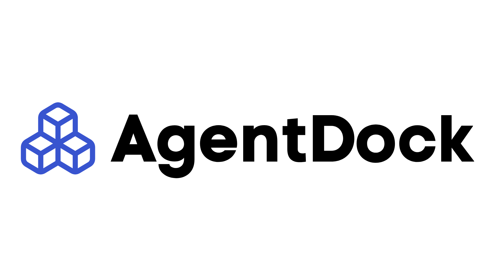
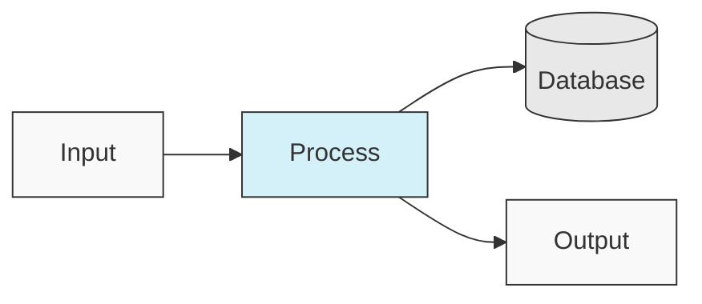
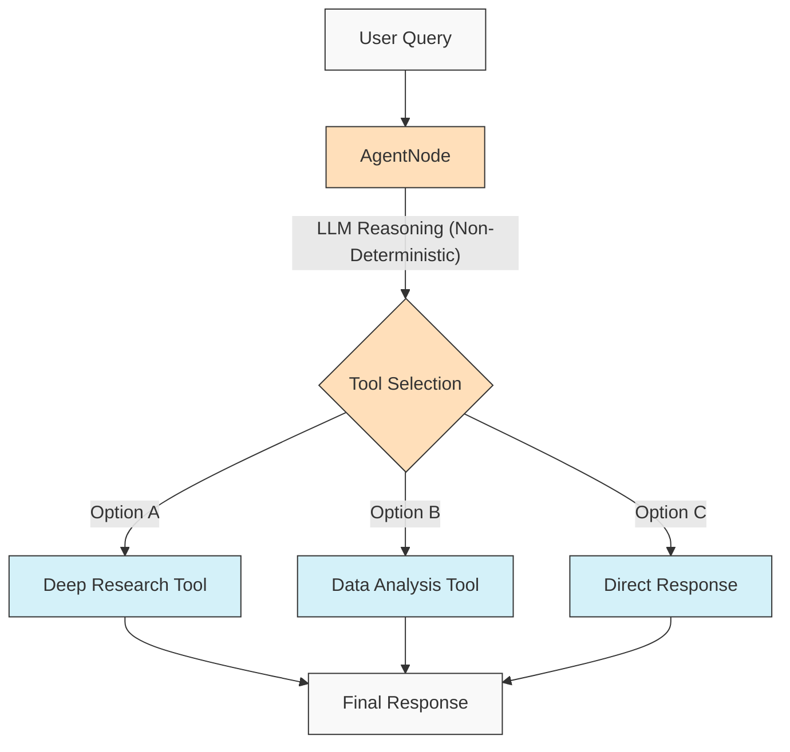
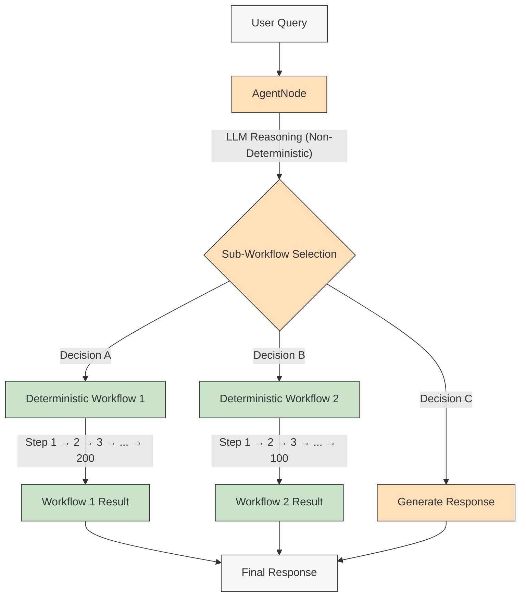

<p align="center">
  
</p>

<h1 align="left">Build Anything with AI Agents</h1>


[](https://github.com/agentdock/agentdock/stargazers)
[](https://github.com/AgentDock/AgentDock/blob/main/LICENSE)
[](https://github.com/AgentDock/AgentDock/releases)
[](https://hub.agentdock.ai/docs)
[](https://discord.gg/fDYFFmwuRA)
[](https://agentdock.ai)
[](https://x.com/agentdock)


AgentDock is a framework for building sophisticated AI agents that deliver complex tasks with **configurable determinism**. It consists of two main components:

1. **AgentDock Core**: An open-source, backend-first framework for building and deploying AI agents. It's designed to be *framework-agnostic* and *provider-independent*, giving you complete control over your agent's implementation.

2. **Open Source Client**: A complete Next.js application that serves as a reference implementation and consumer of the AgentDock Core framework. You can see it in action at [https://hub.agentdock.ai](https://hub.agentdock.ai)

Built with TypeScript, AgentDock emphasizes *simplicity*, *extensibility*, and ***configurable determinism*** - making it ideal for building reliable and predictable AI systems that can operate with minimal supervision.

## Demos

**[Dr. Gregory House](https://github.com/AgentDock/AgentDock/tree/main/agents/dr-house):** A diagnostic reasoning powerhouse that orchestrates **`search`**, **`deep_research`**, and **`pubmed`** tools in a multi-stage workflow to tackle complex medical cases using methodical investigation techniques that rival expert diagnosticians.

https://github.com/user-attachments/assets/50c766dc-fc65-481c-aad2-9a71169c7b28

</br>

**[Cognitive Reasoner](https://github.com/AgentDock/AgentDock/tree/main/agents/cognitive-reasoner):** Multi-stage reasoning engine that orchestrates seven specialized cognitive tools (**`search`**, **`think`**, **`reflect`**, **`compare`**, **`critique`**, **`brainstorm`**, **`debate`**) in configurable workflows to systematically deconstruct and solve complex problems with human-like reasoning patterns.

https://github.com/user-attachments/assets/279a4e48-a980-4f83-becb-5e039fe10c56

</br>

**[History Mentor](https://github.com/AgentDock/AgentDock/tree/main/agents/history-mentor):** Immersive educational agent combining vectorized historical knowledge with **`search`** capabilities and dynamic Mermaid diagram rendering to create authentic learning experiences that visualize complex historical relationships and timelines on demand.

https://github.com/user-attachments/assets/56e80a15-eac3-452b-aa8b-efe7b7f3360c

</br>

**[Calorie Vision](https://github.com/AgentDock/AgentDock/tree/main/agents/calorie-vision):** Vision-based nutritional analysis system that combines computer vision with structured data extraction to deliver precise macro and micronutrient breakdowns from food images, functioning like a nutritionist that can instantly quantify meal composition without relying on manual input.

https://github.com/user-attachments/assets/6b4e71cf-accc-4c18-bb42-7bc5ad2f37e4


## 🌐 README Translations

[Français](./docs/i18n/french/README.md) • [日本語](./docs/i18n/japanese/README.md) • [한국어](./docs/i18n/korean/README.md) • [中文](./docs/i18n/chinese/README.md) • [Español](./docs/i18n/spanish/README.md) • [Deutsch](./docs/i18n/deutsch/README.md) • [Italiano](./docs/i18n/italian/README.md) • [Nederlands](./docs/i18n/dutch/README.md) • [Polski](./docs/i18n/polish/README.md) • [Türkçe](./docs/i18n/turkish/README.md) • [Українська](./docs/i18n/ukrainian/README.md) • [Ελληνικά](./docs/i18n/greek/README.md) • [Русский](./docs/i18n/russian/README.md) • [العربية](./docs/i18n/arabic/README.md)

## 🧠 Design Principles

AgentDock is built on these core principles:

- **Simplicity First**: Minimal code required to create functional agents
- **Node-Based Architecture**: All capabilities implemented as nodes
- **Tools as Specialized Nodes**: Tools extend the node system for agent capabilities
- **Configurable Determinism**: Control the predictability of agent behavior
- **Type Safety**: Comprehensive TypeScript types throughout

### Configurable Determinism

***Configurable determinism*** is a cornerstone of AgentDock's design philosophy, enabling you to balance creative AI capabilities with predictable system behavior:

- AgentNodes are inherently non-deterministic as LLMs may generate different responses each time
- Workflows can be made more deterministic through *defined tool execution paths*
- Developers can **control the level of determinism** by configuring which parts of the system use LLM inference
- Even with LLM components, the overall system behavior remains **predictable** through structured tool interactions
- This balanced approach enables both *creativity* and **reliability** in your AI applications

#### Deterministic Workflows

AgentDock fully supports the deterministic workflows you're familiar with from typical workflow builders. All the predictable execution paths and reliable outcomes you expect are available, with or without LLM inference:



#### Non-Deterministic Agent Behavior

With AgentDock, you can also leverage AgentNodes with LLMs when you need more adaptability. The creative outputs may vary based on your needs, while maintaining structured interaction patterns:



#### Non-Deterministic Agents with Deterministic Sub-Workflows

AgentDock gives you the ***best of both worlds*** by combining non-deterministic agent intelligence with deterministic workflow execution:



This approach enables complex multi-step workflows (potentially involving hundreds of deterministic steps implemented within tools or as connected node sequences) to be invoked by intelligent agent decisions. Each workflow executes predictably despite being triggered by non-deterministic agent reasoning.

For more advanced AI agent workflows and multi-stage processing pipelines, we're building [AgentDock Pro](docs/agentdock-pro.md) - a powerful platform for creating, visualizing, and running complex agent systems.

#### TL;DR on Configurable Determinism 

Think of it like driving. Sometimes you need the AI's creativity (like navigating city streets - non-deterministic), and sometimes you need reliable, step-by-step processes (like following highway signs - deterministic). AgentDock lets you build systems that use *both*, choosing the right approach for each part of a task. You get the AI's smarts *and* predictable results where needed.


## 🏗️ Core Architecture

The framework is built around a powerful, modular node-based system, serving as the foundation for all agent functionality. This architecture uses distinct node types as building blocks:

-   **`BaseNode`**: The fundamental class establishing the core interface and capabilities for all nodes.
-   **`AgentNode`**: A specialized core node orchestrating LLM interactions, tool usage, and agent logic.
-   **Tools & Custom Nodes**: Developers implement agent capabilities and custom logic as nodes extending `BaseNode`.

These nodes interact through managed registries and can be connected (leveraging the core architecture's ports and potential message bus) to enable complex, configurable, and potentially deterministic agent behaviors and workflows.

For a detailed explanation of the node system's components and capabilities, please see the [Node System Documentation](docs/nodes/README.md).

## 🚀 Getting Started

For a comprehensive guide, see the [Getting Started Guide](docs/getting-started.md).

### Requirements

* Node.js ≥ 20.11.0 (LTS)
* pnpm ≥ 9.15.0 (Required)
* API keys for LLM providers (Anthropic, OpenAI, etc.)

### Installation

1. **Clone the Repository**:

   ```bash
   git clone https://github.com/AgentDock/AgentDock.git
   cd AgentDock
   ```

2. **Install pnpm**:

   ```bash
   corepack enable
   corepack prepare pnpm@latest --activate
   ```

3. **Install Dependencies**:

   ```bash
   pnpm install
   ```
   
   For a clean reinstallation (when you need to rebuild from scratch):
   ```bash
   pnpm run clean-install
   ```
   This script removes all node_modules, lock files, and reinstalls dependencies correctly.

4. **Configure Environment**:
   
   Create an environment file (`.env` or `.env.local`) based on `.env.example`:
   
   ```bash
   # Option 1: Create .env.local
   cp .env.example .env.local
   
   # Option 2: Create .env
   cp .env.example .env
   ```
   
   Then add your API keys to the environment file.

5. **Start Development Server**:

   ```bash
   pnpm dev
   ```

### Advanced Capabilities

| Capability | Description | Documentation |
|------------|-------------|---------------|
| **Session Management** | Isolated, performant state management for conversations | [Session Documentation](./docs/architecture/sessions/README.md) |
| **Orchestration Framework** | Control agent behavior and tool availability based on context | [Orchestration Documentation](./docs/architecture/orchestration/README.md) |
| **Storage Abstraction** | Flexible storage system with pluggable providers for KV, Vector, and Secure storage | [Storage Documentation](./docs/storage/README.md) |

The storage system is currently evolving with key-value storage (Memory, Redis, Vercel KV providers) and secure client-side storage, while vector storage and additional backends are in development.

## 📕 Documentation

Documentation for the AgentDock framework is available at [hub.agentdock.ai/docs](https://hub.agentdock.ai/docs) and in the `/docs/` folder of this repository. The documentation includes:

- Getting started guides
- API references
- Node creation tutorials
- Integration examples

## 📂 Repository Structure

This repository contains:

1.  **AgentDock Core**: The core framework located in `agentdock-core/`
2.  **Open Source Client**: A complete reference implementation built with Next.js, serving as a consumer of the AgentDock Core framework.
3.  **Example Agents**: Ready-to-use agent configurations in the `agents/` directory

You can use AgentDock Core independently in your own applications, or use this repository as a starting point for building your own agent-powered applications.

## 📝 Agent Templates

AgentDock includes several pre-configured agent templates. Explore them in the `agents/` directory or read the [Agent Templates Documentation](docs/agent-templates.md) for details on configuration.

## 🔧 Example Implementations

Example implementations showcase specialized use cases and advanced functionality:

| Implementation | Description | Status |
|----------------|-------------|--------|
| **Orchestrated Agent** | Example agent using orchestration to adapt behavior based on context | Available |
| **Cognitive Reasoner** | Tackles complex problems using structured reasoning & cognitive tools | Available |
| **Agent Planner** | Specialized agent for designing and implementing other AI agents | Available |
| [**Code Playground**](docs/roadmap/code-playground.md) | Sandboxed code generation and execution with rich visualization capabilities | Planned |
| [**Generalist AI Agent**](docs/roadmap/generalist-agent.md) | Manus-like agent that can use browser and execute complex tasks | Planned |


## 🔐 Environment Configuration Details

The AgentDock Open Source Client requires API keys for LLM providers to function. These are configured in an environment file (`.env` or `.env.local`) which you create based on the provided `.env.example` file.

### LLM Provider API Keys

Add your LLM provider API keys (at least one is required):

```bash
# LLM Provider API Keys - at least one is required
ANTHROPIC_API_KEY=sk-ant-xxxxxxx  # Anthropic API key
OPENAI_API_KEY=sk-xxxxxxx         # OpenAI API key
GEMINI_API_KEY=xxxxxxx            # Google Gemini API key
DEEPSEEK_API_KEY=xxxxxxx          # DeepSeek API key
GROQ_API_KEY=xxxxxxx              # Groq API key
```

### API Key Resolution

The AgentDock Open Source Client follows a priority order when resolving which API key to use:

1. **Per-agent custom API key** (set via agent settings in the UI)
2. **Global settings API key** (set via the settings page in the UI)
3. **Environment variable** (from .env.local or deployment platform)

### Tool-specific API Keys

Some tools also require their own API keys:

```bash
# Tool-specific API Keys
SERPER_API_KEY=                  # Required for search functionality
FIRECRAWL_API_KEY=               # Required for deeper web search
```

For more details about environment configuration, see the implementation in [`src/types/env.ts`](src/types/env.ts).

### Using Your Own API Keys (BYOK)

AgentDock follows a BYOK (Bring Your Own Key) model:

1. Add your API keys in the settings page of the application
2. Alternatively, provide keys via request headers for direct API usage
3. Keys are securely stored using the built-in encryption system
4. No API keys are shared or stored on our servers

## 📦 Package Manager

This project *requires* the use of `pnpm` for consistent dependency management. `npm` and `yarn` are not supported.

## 💡 What You Can Build

1. **AI-Powered Applications**
   - Custom chatbots with any frontend
   - Command-line AI assistants
   - Automated data processing pipelines
   - Backend service integrations

2. **Integration Capabilities**
   - Any AI provider (OpenAI, Anthropic, etc.)
   - Any frontend framework
   - Any backend service
   - Custom data sources and APIs

3. **Automation Systems**
   - Data processing workflows
   - Document analysis pipelines
   - Automated reporting systems
   - Task automation agents

## Key Features

| Feature                 | Description                                                               |
|-------------------------|---------------------------------------------------------------------------|
| 🔌 **Framework Agnostic (Node.js Backend)** | Core library integrates with Node.js backend stacks.                      |
| 🧩 **Modular Design**     | Build complex systems from simple nodes                                   |
| 🛠️ **Extensible**         | Create custom nodes for any functionality                                 |
| 🔒 **Secure**             | Built-in security features for API keys and data                          |
| 🔑 **BYOK**               | Use your *own API keys* for LLM providers                                 |
| 📦 **Self-Contained**     | Core framework has minimal dependencies                                   |
| ⚙️ **Multi-Step Tool Calls** | Support for *complex reasoning chains*                                    |
| 📊 **Structured Logging** | Detailed insights into agent execution                                    |
| 🛡️ **Robust Error Handling**| Predictable behavior and simplified debugging                            |
| 📝 **TypeScript First**   | Type safety and enhanced developer experience                             |
| 🌐 **Open Source Client** | Complete Next.js reference implementation included                       |
| 🔄 **Orchestration**      | *Dynamic control* of agent behavior based on context                      |
| 💾 **Session Management** | Isolated state for concurrent conversations                               |
| 🎮 **Configurable Determinism** | Balance AI creativity & predictability via node logic/workflows.        |

## 🧰 Components

AgentDock's modular architecture is built upon these key components:

*   **BaseNode**: The foundation for all nodes in the system
*   **AgentNode**: The primary abstraction for agent functionality
*   **Tools & Custom Nodes**: Callable capabilities and custom logic implemented as nodes.
*   **Node Registry**: Manages the registration and retrieval of all node types
*   **Tool Registry**: Manages tool availability for agents
*   **CoreLLM**: Unified interface for interacting with LLM providers
*   **Provider Registry**: Manages LLM provider configurations
*   **Error Handling**: System for handling errors and ensuring predictable behavior
*   **Logging**: Structured logging system for monitoring and debugging
*   **Orchestration**: Controls tool availability and behavior based on conversation context
*   **Sessions**: Manages state isolation between concurrent conversations

For detailed technical documentation on these components, see the [Architecture Overview](docs/architecture/README.md).


## 🗺️ Roadmap

Below is our development roadmap for AgentDock. Most improvements listed here relate to the core AgentDock framework (`agentdock-core`), which is currently developed locally and will be published as a versioned NPM package upon reaching a stable release. Some roadmap items may also involve enhancements to the open-source client implementation.

| Feature | Description | Category |
|---------|-------------|--------|
| [**Storage Abstraction Layer**](docs/roadmap/storage-abstraction.md) | Flexible storage system with pluggable providers | **In Progress** |
| [**Advanced Memory Systems**](docs/roadmap/advanced-memory.md) | Long-term context management | **In Progress** |
| [**Vector Storage Integration**](docs/roadmap/vector-storage.md) | Embedding-based retrieval for documents and memory | **In Progress** |
| [**Evaluation for AI Agents**](docs/roadmap/evaluation-framework.md) | Comprehensive testing and evaluation framework | **In Progress** |
| [**Platform Integration**](docs/roadmap/platform-integration.md) | Support for Telegram, WhatsApp, and other messaging platforms | **Planned** |
| [**Multi-Agent Collaboration**](docs/roadmap/multi-agent-collaboration.md) | Enable agents to work together | **Planned** |
| [**Model Context Protocol (MCP) Integration**](docs/roadmap/mcp-integration.md) | Support for discovering and using external tools via MCP | **Planned** |
| [**Voice AI Agents**](docs/roadmap/voice-agents.md) | AI agents using voice interfaces and phone numbers via AgentNode | **Planned** |
| [**Telemetry and Traceability**](docs/roadmap/telemetry.md) | Advanced logging and performance tracking | **Planned** |
| [**Workflow Runtime & Nodes**](docs/roadmap/workflow-nodes.md) | Core runtime, node types, and orchestration logic for complex automations | **Planned** |
| [**AgentDock Pro**](docs/agentdock-pro.md) | Comprehensive enterprise cloud platform for scaling AI agents & workflows | **Cloud** |
| [**Natural Language AI Agent Builder**](docs/roadmap/nl-agent-builder.md) | Visual builder + natural language agent and workflow construction | **Cloud** |
| [**Agent Marketplace**](docs/roadmap/agent-marketplace.md) | Monetizable agent templates | **Cloud** |

## 👥 Contributing

We welcome contributions to AgentDock! Please see the [CONTRIBUTING.md](CONTRIBUTING.md) for detailed contribution guidelines.

## 📜 License

AgentDock is released under the [MIT License](LICENSE).

## ✨ Build Anything!

AgentDock provides the foundation to build almost any AI-powered application or automation you can imagine. We encourage you to explore the framework, build innovative agents, and contribute back to the community. Let's build the future of AI interaction together!
