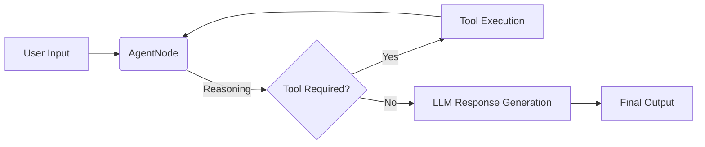
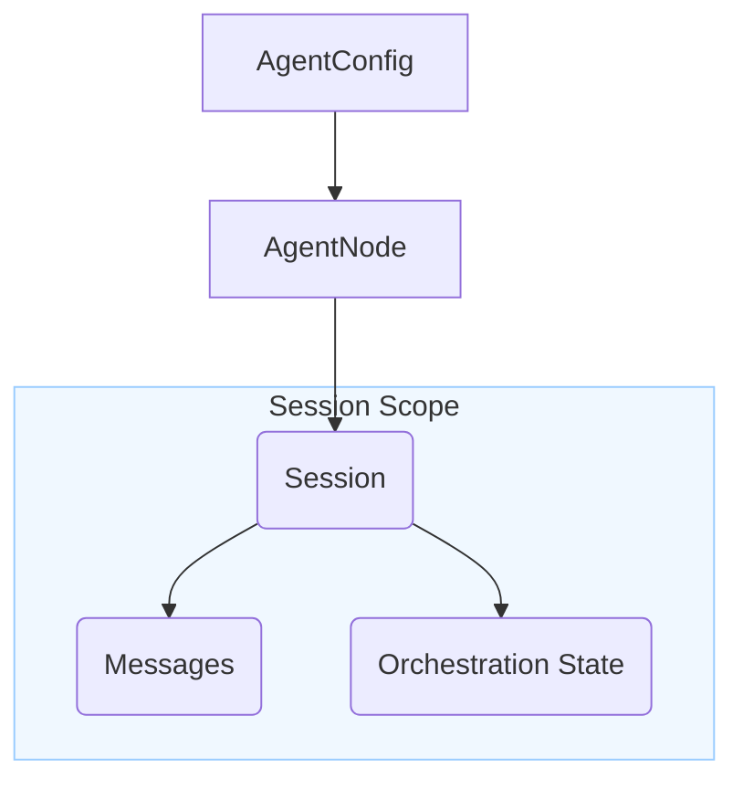

# AgentDock Core Framework

AgentDock Core is the foundational TypeScript **framework** that powers the AgentDock ecosystem. It provides the essential building blocks for creating sophisticated AI agents and integrating them into any application.

*Note: AgentDock Core is currently under active development (pre-release) and will be published as a versioned NPM package upon reaching a stable release.*

## Overview

This **framework** offers a modular, extensible, and type-safe foundation for:

-   Interacting with various Large Language Models (LLMs) through a unified interface.
-   Defining agent capabilities using a flexible node and tool system.
-   Managing conversational state and context with robust session management.
-   Orchestrating complex agent behaviors and tool usage.
-   Integrating pluggable storage solutions for persistence.

AgentDock Core is designed to be framework-agnostic and can be used standalone in Node.js, browser, or edge environments.

## Key Features (Core Framework)

-   **Unified LLM Interface (`CoreLLM`)**: Consistent interaction with providers like Anthropic, OpenAI, Gemini, Groq.
-   **Node System (`BaseNode`, `AgentNode`)**: Modular architecture for defining agent logic and capabilities.
-   **Tool Integration**: Define and register tools callable by agents.
-   **Session Management**: Isolated, stateful conversation handling with TTL support.
-   **Orchestration Framework**: Context-aware control over agent steps and tool availability.
-   **Storage Abstraction**: Pluggable Key-Value storage (Memory, Redis, Vercel KV) with plans for Vector/Relational.
-   **Secure Storage**: Client-side encrypted storage utility.
-   **Structured Logging**: Configurable logging for monitoring and debugging.
-   **Robust Error Handling**: Standardized error system.
-   **Type Safety**: Fully written in TypeScript.

### Basic Interaction Flow



## Core Architecture & Design

AgentDock Core emphasizes modularity and extensibility:

-   **Subsystems:** Key functionalities (LLM, Storage, Sessions, Orchestration, Nodes) are designed as distinct subsystems.
-   **Adapter Patterns:** Interfaces allow for easy extension and replacement of components (e.g., storage providers).
-   **Registries:** Centralized registries manage LLM providers and tools.

### Simplified Core Data Relationships



For a deeper dive into the architectural concepts, see the [Main Architecture Documentation](../docs/architecture/README.md).

## Directory Structure (`agentdock-core/src`)

```
/src
├── config/         # Configuration loading and validation (e.g., agent templates)
├── errors/         # Custom error types and factory
├── llm/            # CoreLLM abstraction, provider specifics, model utilities
├── logging/        # Logging utilities and configuration
├── messaging/      # Core message types and handling (if applicable standalone)
├── nodes/          # BaseNode, AgentNode, tool execution logic, registries
├── orchestration/  # State management, step sequencing, conditions
├── session/        # SessionManager implementation
├── storage/        # Storage abstraction, KV providers, SecureStorage
├── tools/          # (Currently integrated within nodes/llm) Base tool definitions 
├── types/          # Core TypeScript type definitions shared across the framework
└── utils/          # General utility functions
```

## Usage (as a Framework/Library)

Install AgentDock Core (once published) or use it locally:

```bash
# Using pnpm with local path (as in the main repo)
pnpm add file:./agentdock-core 

# Or install from NPM (when published)
# pnpm add agentdock-core 
```

Example server-side usage:

```typescript
import {
  AgentNode,
  loadAgentConfig, // Assuming you load template JSON
  getToolRegistry, // For managing tools
  // ... other necessary imports
} from 'agentdock-core';

// Example: Registering a simple tool (if not pre-registered)
// const registry = getToolRegistry();
// registry.registerTool('my-tool', { /* tool definition */ });

async function runAgent() {
  // 1. Load agent template configuration (replace with your loading logic)
  const agentTemplate = { 
      /* ... your template.json content ... */
      nodes: ["llm.anthropic", "search"], // Ensure nodes are listed
      nodeConfigurations: { 
          "llm.anthropic": { model: "claude-3-sonnet-20240229" }
      }
  };
  const apiKey = process.env.ANTHROPIC_API_KEY || '';

  // 2. Validate and prepare config (includes adding API key)
  const agentConfig = await loadAgentConfig(agentTemplate, apiKey);

  // 3. Create an AgentNode instance
  const agent = new AgentNode('my-agent-instance', {
    agentConfig: agentConfig,
    apiKey: apiKey, // Pass API key again (may be refined later)
    provider: 'anthropic' // Specify the provider
  });

  // 4. Handle a message (requires session management setup externally or basic usage)
  // Note: Full session/orchestration requires setting up SessionManager/OrchestrationManager
  const sessionId = `session-${Date.now()}`;
  const result = await agent.handleMessage({
    messages: [{ role: 'user', content: 'Hello, how can I help me?' }],
    sessionId: sessionId
    // api: '...' // This might be needed depending on external setup
  });

  // 5. Process the response stream or final text
  // Example: Reading the stream (if result is a stream object)
  if (result && typeof result.pipe === 'function') { // Basic check for stream
      // Process stream... 
  } else if (result && result.text) {
      console.log("Final Text:", result.text);
  } else {
      // Handle potential streaming or other result types
      console.log("Result:", result);
  }
}

runAgent().catch(console.error);
```

*Note: The example above is simplified. Full usage, especially with sessions and orchestration, requires integrating `SessionManager` and `OrchestrationManager` which depend on the chosen storage provider.*

## Evaluation Framework

`agentdock-core` includes a comprehensive **Evaluation Framework** designed for systematic assessment and improvement of AI agent performance. This framework provides the tools to:

*   **Define and Manage Criteria**: Specify `EvaluationCriteria` to measure various aspects of agent behavior and output quality.
*   **Utilize Diverse Evaluators**: Leverage a suite of built-in evaluators, including:
    *   `RuleBasedEvaluator`: For deterministic checks (regex, length, keywords, JSON parsing).
    *   `LLMJudgeEvaluator`: For nuanced, LLM-driven assessments with structured output.
    *   `NLPAccuracyEvaluator`: For semantic similarity using embeddings.
    *   `ToolUsageEvaluator`: For validating correct tool invocation and argument usage.
    *   Lexical Suite: A set of fast, practical evaluators for similarity, keyword coverage, sentiment, and toxicity.
*   **Orchestrate Evaluation Runs**: Use the `EvaluationRunner` to execute evaluations against defined inputs and configurations.
*   **Aggregate and Store Results**: Normalize scores, calculate weighted averages, and persist results using `EvaluationStorageProvider` implementations (e.g., `JsonFileStorageProvider`).
*   **Extend with Custom Logic**: Easily create and integrate custom evaluators and storage providers.

This framework is essential for building reliable, high-quality agents by enabling data-driven insights into their performance. Refer to the [full Evaluation Framework documentation](../../docs/evaluations/README.md) for detailed usage and API information.

## Contributing to AgentDock Core

We welcome contributions specifically to the core **framework**!

-   **Discuss First**: Open an issue in the main repository to discuss significant changes before implementing.
-   **Follow Standards**: Adhere to the project's coding standards and patterns found within this directory.
-   **Document Changes**: Update relevant JSDoc comments or documentation.
-   **Include Tests**: Add unit/integration tests for new functionality within the `agentdock-core` scope.
-   **Submit PR**: Create a pull request targeting the main repository with changes isolated to `agentdock-core`.

See the main [CONTRIBUTING.md](../CONTRIBUTING.md) for general guidelines.

## Status and Development

AgentDock Core is currently under active development (pre-release). APIs may change before the first official stable release (v1.0.0). We follow semantic versioning principles.

## License

AgentDock Core is released under the [MIT License](../LICENSE). 