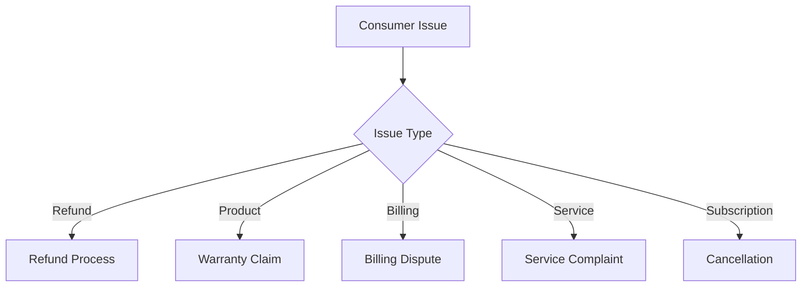
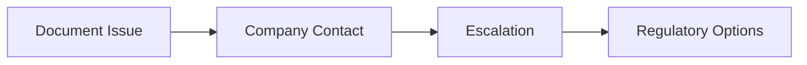
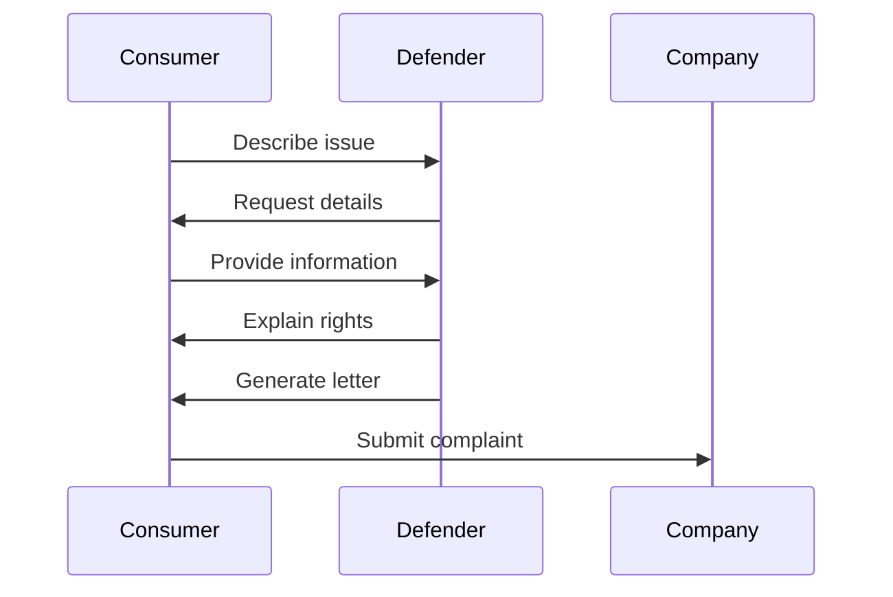

# Consumer Rights Defender

An agent that assists consumers with resolving disputes related to purchases, services, warranties, and billing issues.

## Issue Types

## Dispute Resolution

## Core Functions

- Analyze consumer rights in specific situations
- Generate effective complaint letters
- Guide through warranty claim processes
- Provide billing dispute resolution strategies
- Create documentation for consumer issues
- Outline escalation paths for unresolved problems

## Basic Workflow

## Consumer Protection Areas

- Return and refund policies
- Product warranty enforcement
- Billing error resolution
- Service quality standards
- Subscription cancellation rights
- Unfair business practice reporting
- Fraudulent charge disputes
- Deceptive advertising claims

## Benefits

- Understand your consumer rights
- Create effective documentation
- Communicate clearly with companies
- Follow structured escalation paths
- Know when regulatory help is needed 