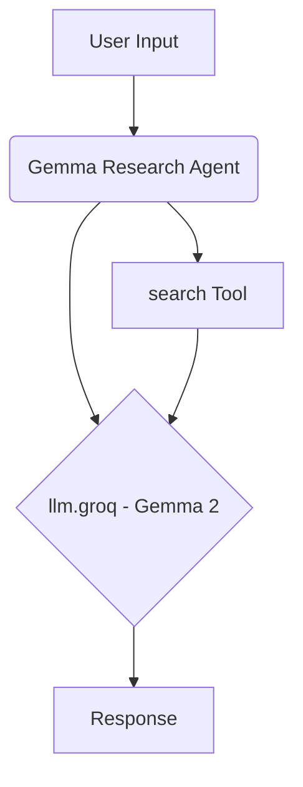

# Gemma Research Agent

## Overview

The Gemma Research agent leverages Google's Gemma 2 9B IT model via the Groq API for fast, focused research tasks. It is equipped with a search tool to find and synthesize information.

## Key Features

*   **Gemma 2 Model:** Utilizes the `gemma2-9b-it` model for generation.
*   **Groq Inference:** Powered by Groq for low-latency responses.
*   **Search Capability:** Uses a `search` tool to gather up-to-date information.
*   **Research Focus:** Designed for information gathering, summarization, and answering questions based on web data.

## Core Components

*   **LLM:** `llm.groq` (Utilizes `gemma2-9b-it` model via Groq API)
*   **Tools:** `search` (For finding information online)

## Basic Workflow Diagram

## Usage

Use this agent for research tasks requiring quick access to web information and synthesis powered by the Gemma 2 model. 