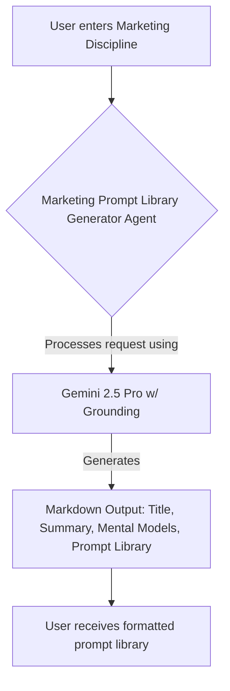

# Marketing Prompt Library Generator

This agent generates a comprehensive prompt library tailored to a specific marketing discipline (e.g., SEO, Paid Media, Content Marketing, Lifecycle Marketing). It follows the methodology outlined by Kieran Flanagan to reverse-engineer the strategies and tactics of elite marketers in the chosen field, leveraging the power of large language models with search grounding for up-to-date insights.

## How it Works

The agent takes a marketing discipline as input and acts as an expert prompt engineer and marketer. It analyzes the core principles, successful strategies, and scaling techniques used by top practitioners in that field. It then generates a structured output including:

1.  **Title:** Clearly identifying the target discipline.
2.  **Summary:** A concise overview of elite thinking and result drivers for the discipline.
3.  **Winning Mental Models:** Key strategies and operating principles with descriptions, lessons, and sources.
4.  **Prompt Library:** 10 actionable, operator-grade prompts tailored to the discipline, explaining *why* they fit cutting-edge practices and *how* a marketer would use them. The agent is instructed to ensure prompts use appropriate line breaks for readability.

## How to Use

1.  Start a chat with this agent.
2.  Enter the marketing discipline you want a prompt library for (e.g., `SEO`, `Content Marketing`, `Paid Media`) in the input field. Use the placeholder text or suggested prompts for examples.
3.  The agent will process your request and return the formatted prompt library in Markdown.

## Workflow

## Based On

This agent implements the framework described in this LinkedIn post by Kieran Flanagan:
[https://www.linkedin.com/posts/kieranjflanagan_heres-how-you-can-create-an-entire-prompt-activity-7321162842420793344-b62m](https://www.linkedin.com/posts/kieranjflanagan_heres-how-you-can-create-an-entire-prompt-activity-7321162842420793344-b62m)

## Configuration (`template.json`)

*   **Model:** `gemini-2.5-pro-exp-03-25`
    *   *(Note: The original author suggested GPT-4o ["o3"], but this open-source implementation uses the latest available Gemini Pro model to leverage its built-in search grounding capabilities.)*
*   **Nodes:** `llm.gemini`
*   **Key Settings:**
    *   Uses Gemini's built-in Search Grounding (`useSearchGrounding: true`) for up-to-date information.
    *   Uses standard safety settings.
    *   History policy: 'all'. 