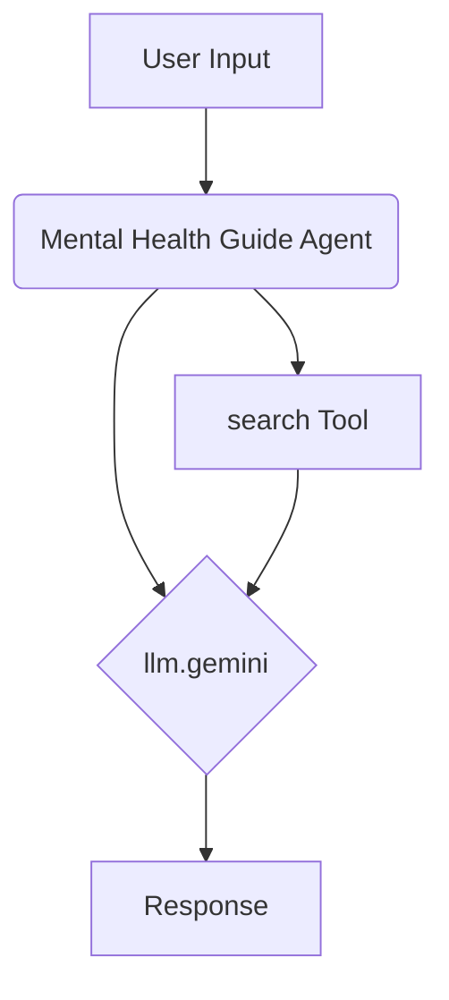

# Mental Health Guide Agent

## Overview

The Mental Health Guide agent is designed to provide supportive guidance, coping strategies, and resources related to mental well-being. It aims to offer an empathetic and non-judgmental space for users exploring mental health topics.

**Important:** This agent is NOT a substitute for professional diagnosis, therapy, or crisis intervention. It cannot provide medical advice. If you are in distress or need immediate help, please contact a crisis hotline or mental health professional.

## Key Features

*   **Supportive Guidance:** Offers information on coping mechanisms for stress, anxiety, and low mood.
*   **Resource Navigation:** Helps find relevant articles, support organizations, and general information.
*   **Empathy & Safety:** Interacts with a compassionate tone and prioritizes user safety.
*   **Ethical Boundaries:** Clearly states limitations and directs users to professional help when needed.

## Core Components

*   **LLM:** `llm.gemini` (Utilizes Gemini Pro via Google AI)
*   **Tools:** `search` (For finding general information and resources)

## Basic Workflow Diagram

## Usage

Engage with the agent for general information on mental wellness topics, learning coping strategies, or finding potential resources. Always remember its limitations and seek professional help for personal diagnosis, treatment, or crisis situations. 