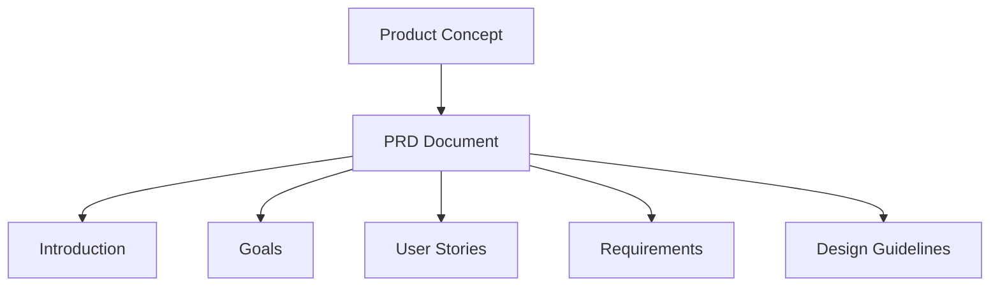
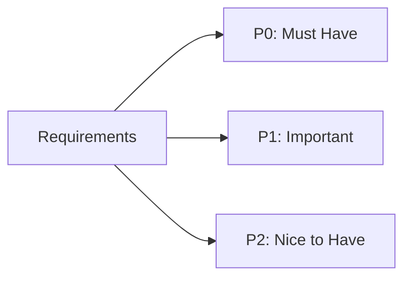
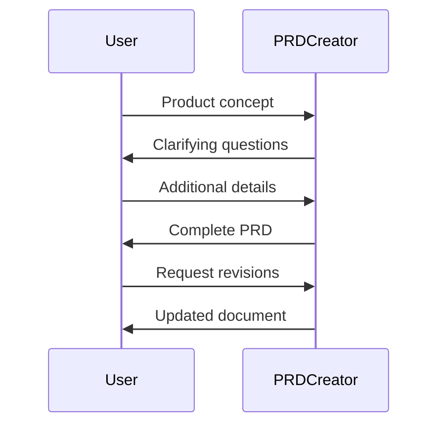

# PRD Creator

A specialized agent that creates structured Product Requirements Documents from basic concepts and requirements.

## Document Structure

## Requirements Priority

## Core Functions

- Convert product concepts into structured documentation
- Apply priority systems (P0/P1/P2) to development tasks
- Create user personas and user stories
- Generate comprehensive PRD structure
- Output markdown-formatted documents

## Use Cases

- New product/feature documentation
- MVP requirement definition
- Feature specifications
- Success criteria documentation
- Technical requirements documentation

## Basic Workflow

## PRD Components

- Introduction & Overview
- Goals & Non-Goals
- User Personas & Stories
- Functional Requirements (with priorities)
- Non-Functional Requirements
- Design Guidelines
- Release Criteria
- Open Questions

## Benefits

- Consistent documentation structure
- Complete requirements coverage
- Clear communication to development teams
- Efficient documentation generation
- Prioritized development guidance
