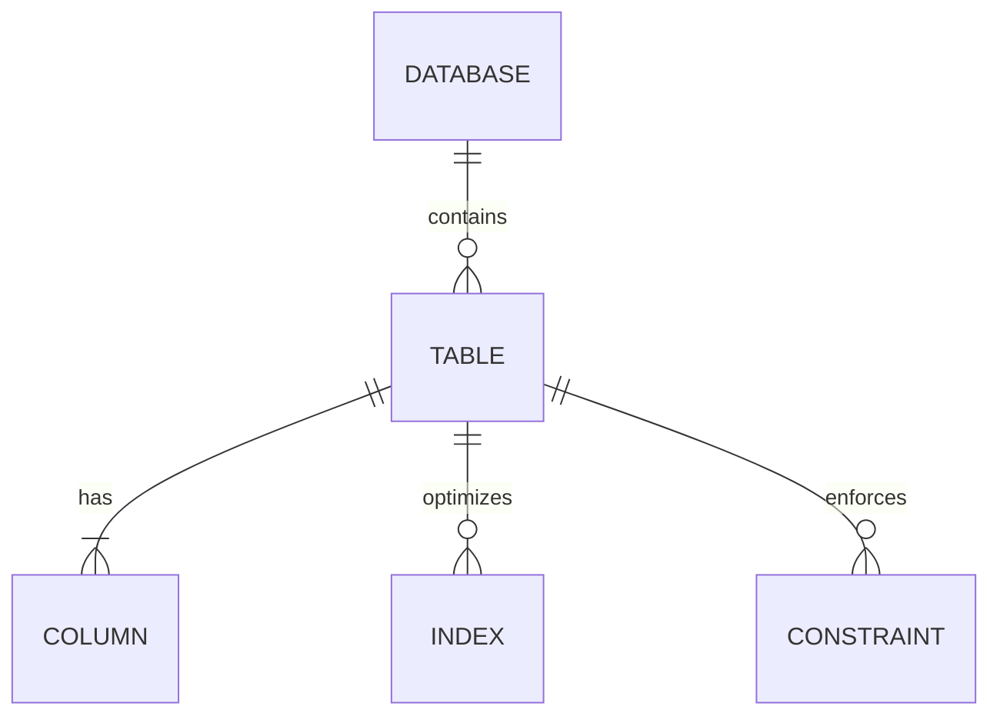
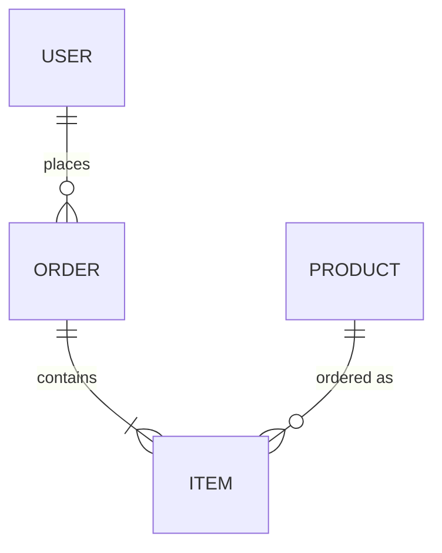
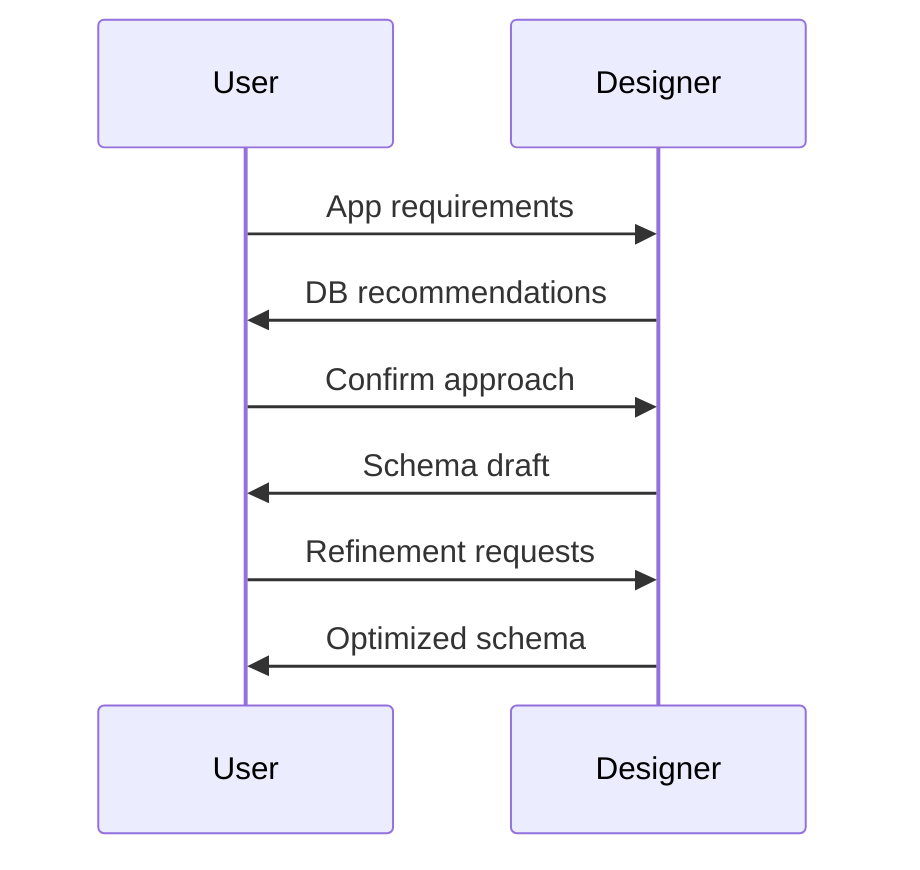

# Data Schema Designer

A schema generator that builds optimized database structures for applications of various sizes and requirements.

## Schema Components

## Relationship Types

## Core Functions

- Create normalized data models from requirements
- Design entity relationships with appropriate constraints
- Implement indexing strategies for query optimization
- Generate Mermaid diagrams for data visualization
- Support multiple database types (relational, document, graph)

## Use Cases

- New application database design
- Complex domain modeling
- Schema migration planning
- Analytics system optimization
- Query-optimized structure creation

## Basic Workflow

## Schema Components

- Entity definitions with field types
- Relationship mappings and cardinality
- Constraint definitions
- Index placement recommendations
- Ready-to-use DDL scripts
- Visual ER diagrams
- Performance notes

## Benefits

- Optimized schema design from start
- Clear visualization of data relationships
- Standards-compliant database structures
- Prevention of common data modeling errors
- Scalable foundation for applications 