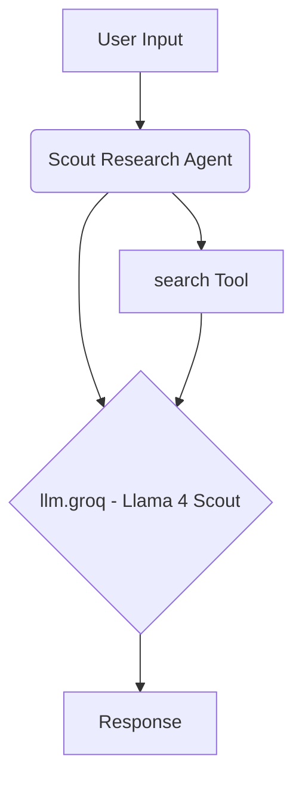

# Scout Research Agent

## Overview

The Scout Research agent utilizes Meta's Llama 4 Scout 17B model via the Groq API for efficient research tasks. It includes a search tool to gather current information from the web.

## Key Features

*   **Llama 4 Scout Model:** Employs the `meta-llama/llama-4-scout-17b-16e-instruct` model.
*   **Groq Inference:** Runs on Groq for fast response times.
*   **Search Capability:** Equipped with a `search` tool for online information retrieval.
*   **Research Focus:** Aimed at gathering, summarizing, and answering questions using web search results.

## Core Components

*   **LLM:** `llm.groq` (Utilizes Llama 4 Scout model via Groq API)
*   **Tools:** `search` (For accessing web information)

## Basic Workflow Diagram

## Usage

Leverage this agent for research tasks where speed and access to current web information via the Llama 4 Scout model are desired. 