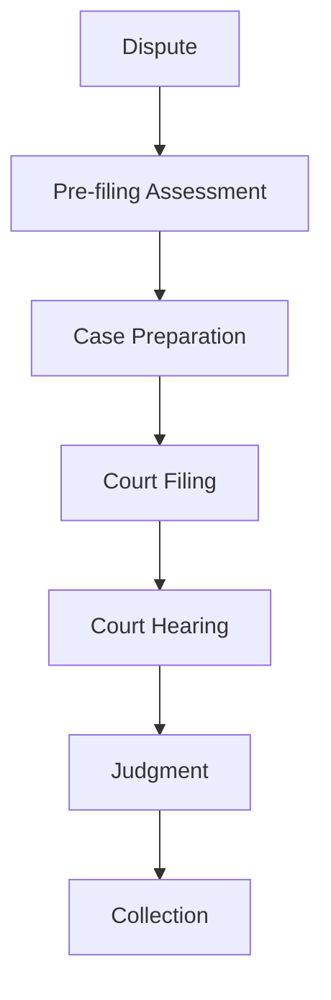
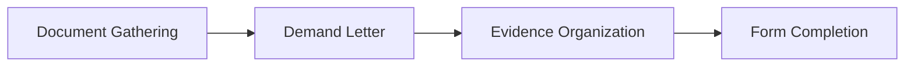
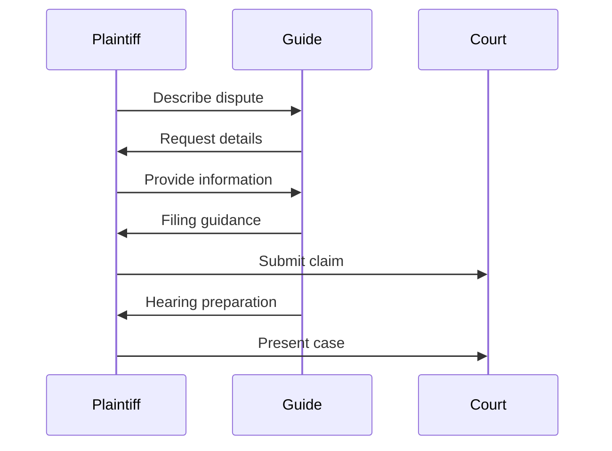

# Small Claims Court Guide

An agent that provides step-by-step guidance for navigating the small claims court process from filing to collection.

## Process Overview

## Case Preparation

## Core Functions

- Assess claim viability for small claims court
- Generate required court filing documents
- Prepare evidence presentation strategies
- Guide through service of process requirements
- Provide hearing preparation guidelines
- Explain judgment collection procedures

## Basic Workflow

## Court Navigation Areas

- Jurisdiction and venue determination
- Claim amount limitations
- Filing fee structures
- Service of process requirements
- Evidence rules and presentation
- Courtroom procedures and etiquette
- Judgment enforcement methods
- Appeal procedures (if applicable)

## Benefits

- Navigate court process with confidence
- Properly prepare and file documentation
- Present case effectively at hearing
- Understand judgment collection options
- Avoid common procedural mistakes 