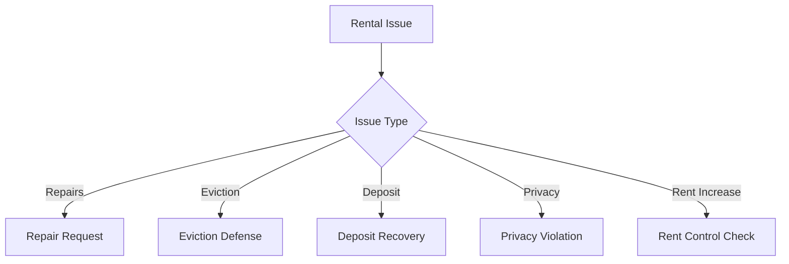
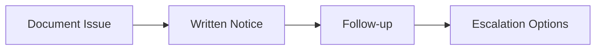
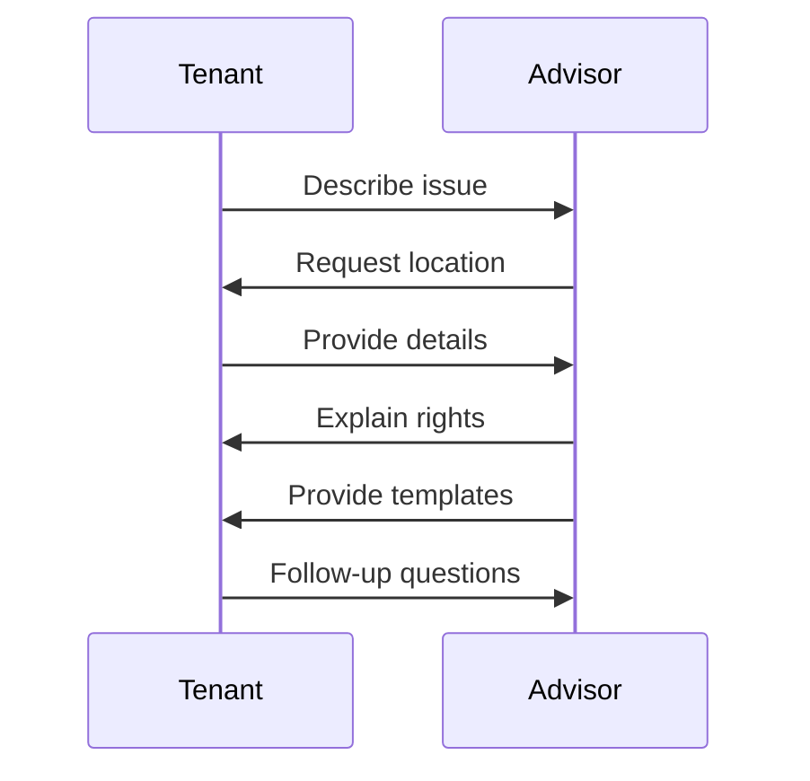

# Tenant Rights Advisor

An agent that helps renters navigate housing challenges, understand rights, and take appropriate actions for common rental issues.

## Issue Types

## Repair Process

## Core Functions

- Explain tenant rights in plain language
- Create documentation for rental issues
- Generate repair request templates
- Provide eviction response guidance
- Guide through deposit recovery process
- Document landlord-tenant communications

## Workflow

## Rights Categories

- Habitability and repairs
- Eviction protections
- Security deposit rights
- Privacy and entry regulations
- Rent increase limitations
- Discrimination protections
- Retaliation prohibitions

## Benefits

- Understand rights before taking action
- Create proper documentation trail
- Follow appropriate legal procedures
- Communicate effectively with landlords
- Know when to seek additional legal help 