# AgentDock: Build Anything with AI Agents

AgentDock is a framework for building sophisticated AI agents that deliver complex tasks with **configurable determinism**. It consists of two main components:

1. **AgentDock Core**: An open-source, backend-first framework for building and deploying AI agents. It's designed to be *framework-agnostic* and *provider-independent*, giving you complete control over your agent's implementation.

2. **Open Source Client**: A complete Next.js application that serves as a reference implementation and consumer of the AgentDock Core framework. You can see it in action at [https://hub.agentdock.ai](https://hub.agentdock.ai)

Built with TypeScript, AgentDock emphasizes *simplicity*, *extensibility*, and ***configurable determinism*** - making it ideal for building reliable and predictable AI systems that can operate with minimal supervision.

## Design Principles

AgentDock is built on these core principles:

- **Simplicity First**: Minimal code required to create functional agents
- **Node-Based Architecture**: All capabilities implemented as nodes
- **Tools as Specialized Nodes**: Tools extend the node system for agent capabilities
- ****Configurable Determinism****: Control the predictability of agent behavior
- **Type Safety**: Comprehensive TypeScript types throughout

### Configurable Determinism

***Configurable determinism*** is a cornerstone of AgentDock's design philosophy, enabling you to balance creative AI capabilities with predictable system behavior:

- AgentNodes are inherently non-deterministic as LLMs may generate different responses each time
- Workflows can be made more deterministic through *defined tool execution paths* or by connecting sequences of deterministic nodes.
- Developers can **control the level of determinism** by configuring which parts of the system use LLM inference versus defined logic.
- Even with LLM components, the overall system behavior remains **predictable** through structured interactions and deterministic node execution where specified.
- This balanced approach enables both *creativity* and **reliability** in your AI applications

#### Deterministic Workflows

AgentDock allows you to create fully deterministic processing flows where the execution path and outcomes are predictable. This can be achieved by implementing logic within individual tool nodes or by leveraging the core `BaseNode` architecture to connect multiple deterministic nodes (e.g., data processors, platform integrations):

#### Non-Deterministic Agent Behavior

When using AgentNodes with LLMs, the specific outputs may vary, but the overall interaction patterns can be structured:

#### Non-Deterministic Agents with Deterministic Sub-Workflows

AgentDock gives you the ***best of both worlds*** by combining non-deterministic agent intelligence with deterministic workflow execution:

```mermaid
flowchart TD
  Input[User Query] --> Agent[AgentNode]
  Agent -->|"LLM Reasoning (Non-Deterministic)"| FlowChoice{Sub-Workflow Selection}
  FlowChoice -->|"Decision A"| Flow1[Deterministic Workflow 1]
  FlowChoice -->|"Decision B"| Flow2[Deterministic Workflow 2]
  FlowChoice -->|"Decision C"| DirectResponse[Generate Response]
  
  Flow1 --> |"Step 1 → 2 → 3 → ... → 200"| Flow1Result[Workflow 1 Result]
  Flow2 --> |"Step 1 → 2 → 3 → ... → 100"| Flow2Result[Workflow 2 Result]
  
  Flow1Result --> Response[Final Response]
  Flow2Result --> Response
  DirectResponse --> Response
  
  style Input fill:#f9f9f9,stroke:#333,stroke-width:1px
  style Agent fill:#ffdfba,stroke:#333,stroke-width:1px
  style FlowChoice fill:#ffdfba,stroke:#333,stroke-width:1px
  style Flow1 fill:#c9e4ca,stroke:#333,stroke-width:1px
  style Flow2 fill:#c9e4ca,stroke:#333,stroke-width:1px
  style Flow1Result fill:#c9e4ca,stroke:#333,stroke-width:1px
  style Flow2Result fill:#c9e4ca,stroke:#333,stroke-width:1px
  style DirectResponse fill:#ffdfba,stroke:#333,stroke-width:1px
  style Response fill:#f9f9f9,stroke:#333,stroke-width:1px
```

This approach enables complex multi-step workflows (potentially involving hundreds of deterministic steps implemented within tools or as node sequences) to be invoked by intelligent agent decisions. While the open-source core provides the foundation for these workflows, [AgentDock Pro](agentdock-pro.md) aims to provide advanced tooling, such as visual builders, to simplify their creation and management.

#### TL;DR on Configurable Determinism 

Think of it like driving. Sometimes you need the AI's creativity (like navigating city streets - non-deterministic), and sometimes you need reliable, step-by-step processes (like following highway signs - deterministic). AgentDock lets you build systems that use *both*, choosing the right approach for each part of a task. You get the AI's smarts *and* predictable results where needed.

## Core Architecture

The framework is built around a powerful node-based system:

- **BaseNode**: Foundation for all nodes, providing core functionality
- **AgentNode**: Specialized node for LLM-powered agents
- **Tools as Nodes**: Custom capabilities implemented as specialized nodes
- **Node Registry**: Central system for managing and connecting nodes
- **Session Management**: State isolation between concurrent conversations
- **Orchestration Framework**: Context-aware control of agent behavior

---

## What You Can Build

### 1. AI-Powered Applications
   - Custom chatbots with any frontend
   - Command-line AI assistants
   - *Automated data processing* pipelines
   - Backend service integrations

### 2. Integration Capabilities
   - Any AI provider (OpenAI, Anthropic, etc.)
   - Any frontend framework
   - Any backend service
   - *Custom data sources* and APIs

### 3. Automation Systems
   - Data processing workflows
   - Document analysis pipelines
   - *Automated reporting* systems
   - Task automation agents

## Key Features

| Feature | Description |
|---------|-------------|
| 🔌 **Framework Agnostic** | AgentDock Core works with *any tech stack* |
| 🧩 **Modular Design** | Build complex systems from simple nodes |
| 🛠️ **Extensible** | Create custom nodes for any functionality |
| 🔒 **Secure** | Built-in security features for API keys and data |
| 🔑 **BYOK** | Use your *own API keys* for LLM providers |
| 📦 **Self-Contained** | Core framework has minimal dependencies |
| ⚙️ **Multi-Step Tool Calls** | Support for *complex reasoning chains* |
| 📊 **Structured Logging** | Detailed insights into agent execution |
| 🛡️ **Robust Error Handling** | Predictable behavior and simplified debugging |
| 📝 **TypeScript First** | Type safety and enhanced developer experience |
| 🌐 **Open Source Client** | Complete Next.js reference implementation included |
| 🔄 **Orchestration** | *Dynamic control* of agent behavior based on context |
| 💾 **Session Management** | Isolated state for concurrent conversations |
| 🎮 **Configurable Determinism** | Precise control over agent predictability |

## Getting Started

To start building with AgentDock, check out the [Getting Started](getting-started.md) guide, which will walk you through:

- Setting up your development environment
- Creating your first agent
- Implementing custom tools
- Deploying your agents

For detailed documentation on specific aspects of AgentDock, explore the sections available in the documentation.

---

## 🔒 Security

An initial security audit has been performed. See the [Initial Security Audit](./initial-security-audit.md) document for findings and recommendations.