# AgentDock Pro

AgentDock Pro extends our open-source framework with enterprise-grade features, simplified agent creation, and powerful workflow orchestration.

## What is AgentDock Pro?

AgentDock Pro is our cloud platform that enhances the open-source AgentDock framework with improved stability, scalability, and advanced capabilities. It's built for teams that need to deploy AI agents and sophisticated workflows at scale.

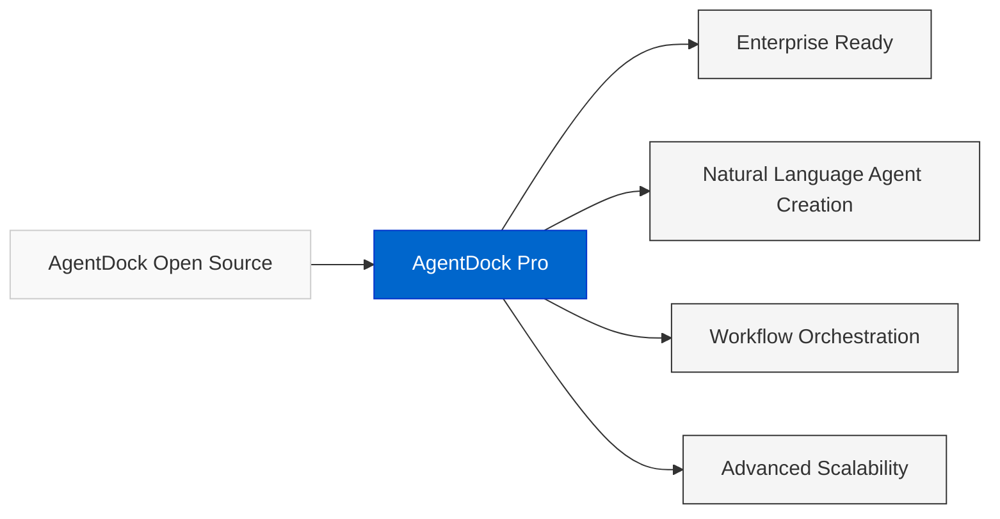

## Key Benefits

### Natural Language Agent Creation
Build AI agents by describing what you want them to do in plain language, without coding.

- **Describe your agent**: "I need an agent that monitors market data and executes trades"
- **Automatic tool selection**: The system configures the right tools based on your description
- **Instant prototyping**: Test your agent immediately after creating it

[Learn more about Natural Language AI Agent Builder →](/docs/roadmap/nl-agent-builder)

### Workflow Orchestration
Connect agents and tools into automated workflows for complex tasks.

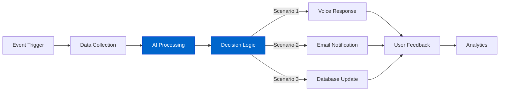

- **Visual workflow builder**: Drag-and-drop interface for complex workflows
- **Conditional branching**: Create decision paths based on data or agent outputs
- **Event triggers**: Start workflows from messages, schedules, or API calls
- **Third-party integrations**: Connect to popular services and APIs

### Persistent Memory & Knowledge
Agents maintain conversation history and knowledge across sessions.

- **Per-user memory**: Each end-user gets their own conversation history
- **Knowledge integration**: Connect external data sources and documents
- **Contextual awareness**: Agents understand and remember previous interactions

### Advanced Scalability
Deploy agents to handle large user loads while maintaining performance.

- **Horizontal scaling**: Handle high volume without performance degradation
- **Resource optimization**: Automatic scaling based on demand
- **Enterprise stability**: Consistent performance under load
- **Multi-region support**: Low-latency for global deployments

### Unified Cost Management
Simplify your AI budget with our credit-based system.

- **Save 80-90%** with our discounted API access compared to direct provider pricing
- **Consolidated billing** across LLM providers and third-party services
- **Predictable pricing** with transparent usage tracking
- **Lower barriers** to premium models and services

## Who Benefits from AgentDock Pro?

AgentDock Pro can transform virtually any industry where human expertise, routine tasks, or customer interactions are involved. If it can be described in natural language, it can likely be automated or augmented with our AI agents. Here are just some of the ways organizations and professionals are leveraging our platform:

### Enterprise Workforce Transformation
Replace repetitive jobs with AI agents for customer service, research, and administrative tasks.

**Example**: Automate 80% of your HR support tickets with a specialized agent that handles employee onboarding, benefits questions, and request processing, saving $150,000 annually in operational costs.

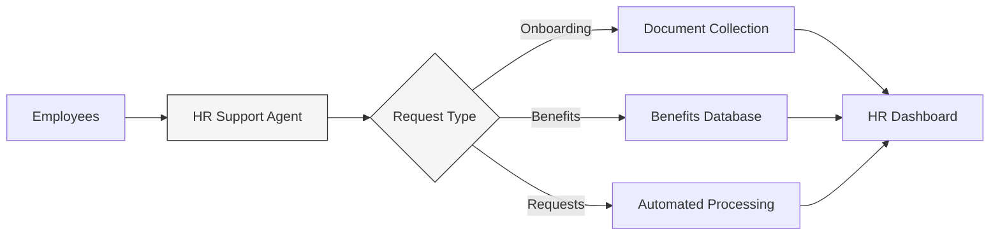

### AI Agents for Trading & Automation
Create sophisticated trading and monitoring agents that execute based on real-time conditions.

**Example**: "When S&P 500 opens positively, buy $500 of Bitcoin from my Coinbase account and notify me via Telegram"

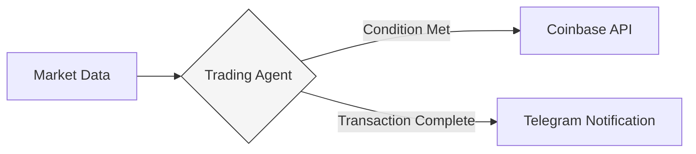

### Education & Tutoring
Develop personalized learning agents that adapt to each student's needs, providing 24/7 education support.

**Example**: Launch a subscription-based math tutoring service where your AI agent provides unlimited practice problems, step-by-step explanations, and personalized learning paths – scaling to thousands of students while maintaining individual progress tracking.

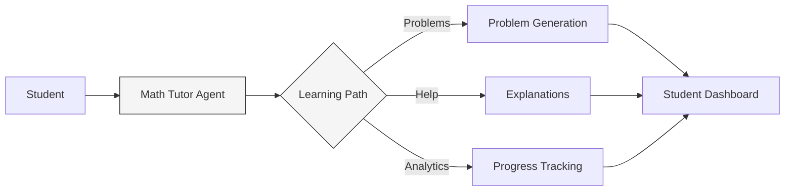

### Healthcare Services
Deploy compliant agents for patient intake, follow-up, and routine care management that integrate with existing systems.

**Example**: Create a HIPAA-compliant pre-appointment screening agent that collects patient information, verifies insurance coverage, and sends required forms – reducing administrative costs by 40% while improving patient satisfaction.

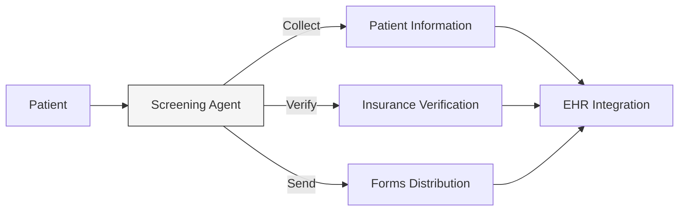

### Legal & Compliance
Automate document review, client intake, and routine legal processes while maintaining security and confidentiality.

**Example**: Build a GDPR-compliant contract review agent that analyzes agreements in seconds, highlights potential issues, and suggests revisions – turning a time-intensive process into a scalable, high-margin service.

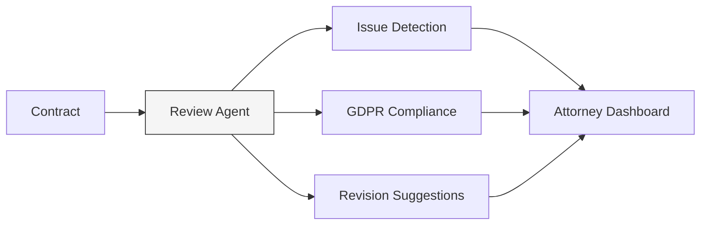

### Insurance & Financial Services
Streamline claims processing, policy recommendations, and customer service with automated workflows.

**Example**: Deploy an SOC 2 compliant insurance claims agent that processes routine claims 5x faster than human agents, validating documentation, calculating payouts, and updating customer records while maintaining full audit trails.

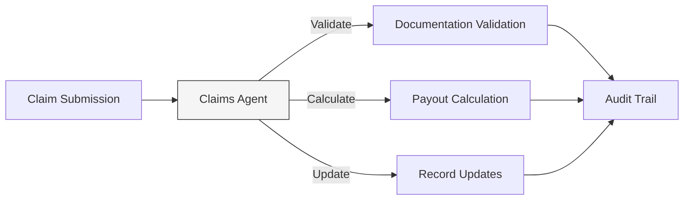

### Voice Agent Developers
Create voice assistants and conversational interfaces that handle concurrent conversations.

**Example**: Build a restaurant reservation system that handles 200+ concurrent calls during peak hours, confirming bookings, answering questions, and upselling premium options – all without hiring additional staff.

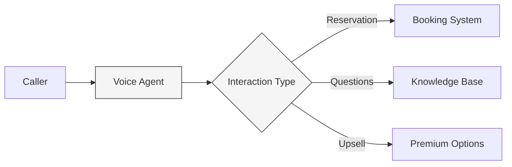

### AI Agencies & Consultancies
Build custom AI agents for clients with rapid deployment and minimal overhead.

**Example**: Create AI-powered assistants and automation solutions for your clients, generating recurring revenue while leveraging AgentDock Pro's infrastructure instead of building everything from scratch.

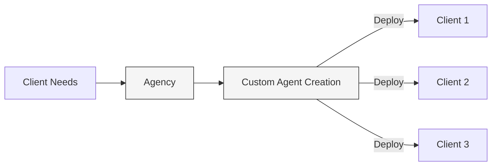

### Service Professionals
Scale your expertise - whether you're a coach, concierge, or consultant - to serve more clients simultaneously.

**Example**: Create a personal fitness coach agent that provides 24/7 guidance to hundreds of clients at once, delivering personalized workout plans, nutrition advice, and motivation – transforming your limited-scale service into a subscription business.

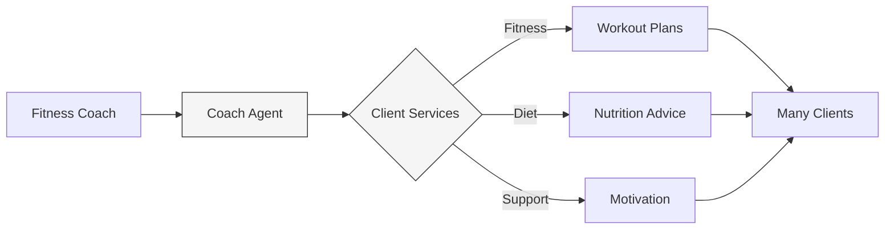

## Migration from Open Source

AgentDock Pro builds on our open-source framework, making it easy to upgrade when you're ready.

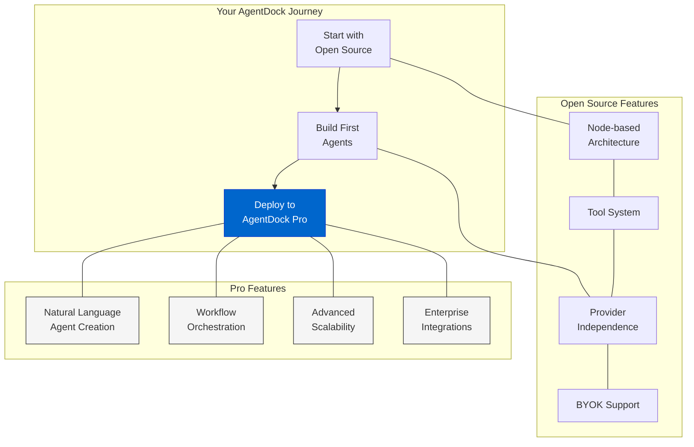

- **Simple migration**: Transfer your open source agents to Pro with minimal changes
- **Familiar concepts**: All core concepts from open source remain the same in Pro
- **Enhanced capabilities**: Add Pro features to your existing agents without rebuilding
- **Flexible deployment**: Use open source for development and Pro for production

## Join the Ecosystem

AgentDock Pro is transforming how businesses build and deploy AI.

**Receive $100 in free credits when you sign up.**

[Sign Up at agentdock.ai →](https://agentdock.ai) 