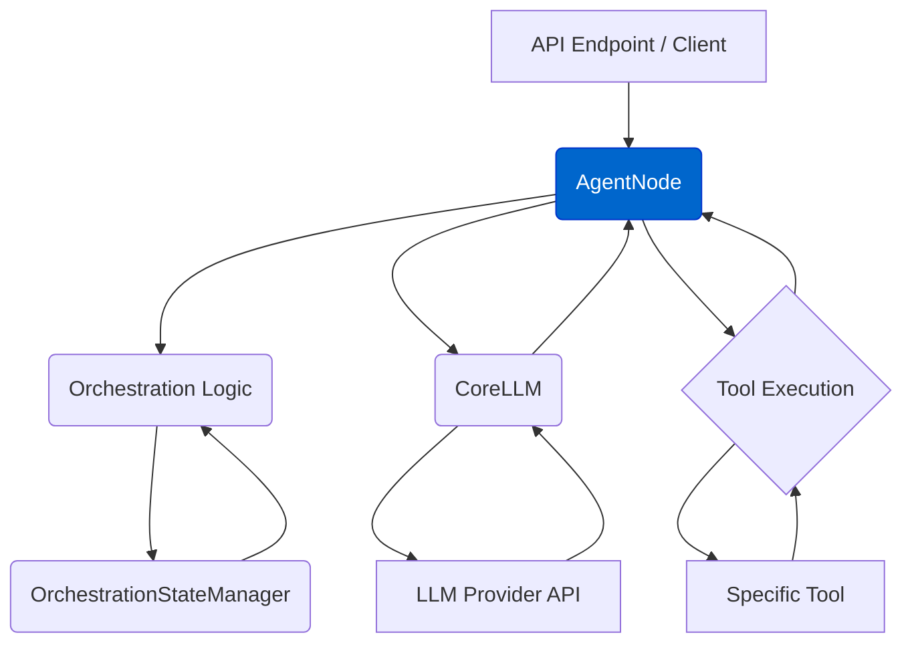

# Agent Node (`AgentNode`)

The `AgentNode` class (`agentdock-core/src/nodes/agent-node.ts`) is the primary orchestrator for conversational agent interactions within AgentDock Core. It leverages the Vercel AI SDK for efficient streaming and multi-step tool execution.

## Core Responsibilities

-   **Message Processing:** Handles incoming message arrays via its primary `handleMessage` method.
-   **LLM Interaction:** Manages communication with language models via `CoreLLM`, utilizing the Vercel AI SDK's `streamText` function for generation, streaming, and tool execution.
-   **Tool Integration:** Determines available tools based on the agent template and orchestration state, then prepares them for execution through the LLM.
-   **State Management:** Updates orchestration state (token usage, recently used tools) through callbacks.
-   **Configuration:** Reads agent behavior rules from the `AgentConfig` object and accepts runtime overrides.
-   **Context Injection:** Adds current time and other relevant context to the LLM prompt.
-   **Provider Fallbacks:** Supports fallback providers for enhanced reliability.

## Key Interactions



1.  Receives request with messages and session ID.
2.  Consults Orchestration logic to determine active step and load relevant state.
3.  Filters available tools based on active step and sequence rules.
4.  Constructs the prompt using message history, system prompt, and context.
5.  Calls `CoreLLM.streamText`, passing messages, prompt, and filtered tools.
6.  Handles tool calls by executing them and returning results to the LLM.
7.  Streams the final text response back to the caller.
8.  Updates token usage and state information after the interaction completes.

## Configuration

The `AgentNode`'s behavior is configured through the agent template (`template.json`), which specifies:

```typescript
// Example of AgentNode configuration
{
  "type": "AgentNode",
  "config": {
    "provider": "anthropic",
    "apiKey": "YOUR_API_KEY",
    "fallbackApiKey": "BACKUP_API_KEY", // Optional
    "fallbackProvider": "openai", // Optional
    "agentConfig": {
      "personality": "You are a helpful assistant.",
      "nodes": ["search", "deep_research"],
      "nodeConfigurations": {
        "anthropic": {
          "model": "claude-3-5-sonnet-20240620"
        }
      }
    }
  }
}
```

## Response Streaming

The `AgentNode` returns an `AgentDockStreamResult` from its `handleMessage` method, which provides:

- **State Tracking**: Automatically updates token usage and tool usage in session state
- **Error Handling**: Better error propagation from LLM providers
- **Tool Management**: Handles tool execution and tracking in session state

For detailed implementation, see [`agentdock-core/src/nodes/agent-node.ts`](../../agentdock-core/src/nodes/agent-node.ts).

For more about streaming capabilities, see [Response Streaming Documentation](./core/response-streaming.md). 