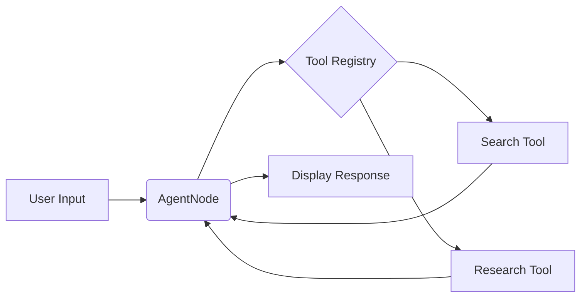

# Agent Node

The `AgentNode` provides a conversational interface within AgentDock. It serves as the primary abstraction for agent functionality, encapsulating LLM interaction and tool integration.

## 1. Overview

The `AgentNode` handles the core agent functionality:

* Receives user input (text messages)
* Processes the input using LLMs and tools
* Generates responses (text messages)
* Integrates with the tool registry to access tools
* Supports both OSS and Pro implementations with the same interface

## 2. Functionality

The `AgentNode` provides these key capabilities:

* **Integration with LLM Providers:** Uses the Vercel AI SDK for streaming responses from LLMs
* **Message Handling:** Manages the conversation history and processes messages
* **Tool Integration:** Retrieves tools from the tool registry and makes them available to the LLM
* **Configuration:**
  * `provider`: Specifies the LLM provider (e.g., "anthropic")
  * `model`: Specifies the LLM model (e.g., "claude-3-opus-20240229")
  * `systemPrompt`: (Optional) A system prompt to guide the LLM's behavior
  * `tools`: (Optional) Array of tool names to make available to the agent

```typescript
// Example of AgentNode configuration
{
  "type": "AgentNode",
  "config": {
    "provider": "anthropic",
    "model": "claude-3-opus-20240229",
    "systemPrompt": "You are a helpful assistant.",
    "tools": ["search", "deep_research"]
  }
}
```

## 3. Pro Implementation

In AgentDock Pro, the `AgentNode` will have additional features:

* **Visual Flow Builder:** The `AgentNode` will be a draggable component in the visual flow builder
* **Enhanced UI:** A richer interface within the visual builder
* **Advanced Connections:** Connect the `AgentNode` to other nodes in complex workflows
* **Customization Options:** More advanced configuration options

## 4. Implementation Details

The `AgentNode` extends the `BaseNode` class and implements:

* **Node Registration:** The `AgentNode` is registered in the Node Registry, allowing it to be instantiated and managed by the system
* **Tool Retrieval:** Gets tools from the tool registry based on configuration
* **Message Handling:** Processes messages and prepares them for the LLM
* **LLM Integration:** Uses the appropriate LLM provider to generate responses
* **Response Streaming:** Streams responses back to the client

### Registry Relationship

* **Node Registry:** Manages the registration and retrieval of node instances, including the `AgentNode`. It allows the system to create and manage nodes based on their type.
* **Tool Registry:** Specifically manages the tools that can be used by the `AgentNode`. The `AgentNode` retrieves tools from this registry based on its configuration.

### Tools as Specialized Nodes

In AgentDock, tools are implemented as specialized nodes:

* Tools are registered in the Node Registry with the `isTool` flag set to `true`
* The Node Registry provides metadata and versioning for tools
* The Tool Registry provides a focused interface for retrieving tools for specific agents
* This dual-registry approach supports both the current OSS implementation and the future Pro implementation

## 5. Example Usage



## 6. Future Considerations

* **Long-Term Memory:** Integration with vector databases for persistent conversation history
* **Advanced Tool Orchestration:** More sophisticated tool calling patterns and workflows
* **Multi-Agent Collaboration:** Enabling multiple agents to work together
* **Platform Integrations:** Seamless integration with platforms like Telegram, Discord, and WhatsApp 