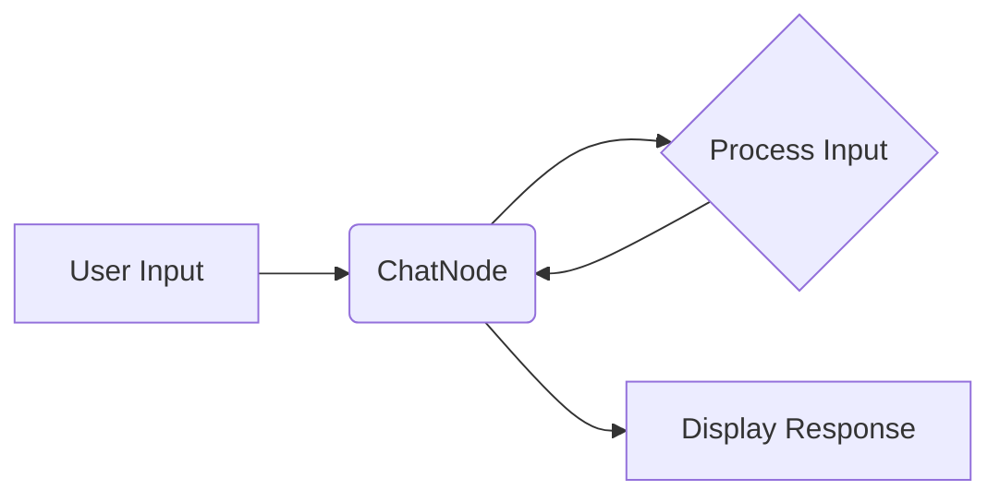

# Chat Node

The `ChatNode` provides a conversational interface within an AgentDock flow. It allows users to interact with the agent through text-based messages.

## 1. Overview

The `ChatNode` acts as both an input and output point in a flow. It can:

*   Receive user input (text messages).
*   Process the input (potentially using other nodes in the flow).
*   Generate responses (text messages).
*   Display the conversation history.

## 2. Functionality (Core)

In AgentDock Core, the `ChatNode` provides basic chat functionality:

*   **Integration with `AISDKAdapter`:**  Uses the Vercel AI SDK for streaming responses from LLMs.
*   **Message Handling:**  Manages the conversation history (short-term memory).
*   **Configuration:**
    *   `provider`:  Specifies the LLM provider (e.g., "openai", "anthropic").
    *   `model`:  Specifies the LLM model (e.g., "gpt-3.5-turbo", "claude-3-opus-20240229").
    *   `systemPrompt`: (Optional) A system prompt to guide the LLM's behavior.
    *   `inputPort`: (Default: "input") The ID of the input port.
    *   `outputPort`: (Default: "output") The ID of the output port.

```typescript
// Conceptual example of ChatNode configuration
{
  "type": "ChatNode",
  "config": {
    "provider": "openai",
    "model": "gpt-3.5-turbo",
    "systemPrompt": "You are a helpful assistant."
  }
}
```

## 3. Functionality (Pro)

In AgentDock Pro, the `ChatNode` may have additional features:

*   **Enhanced UI:**  A richer chat interface within the visual builder.
*   **Integration with other Pro features:**  Seamless integration with the Natural Language Flow Builder, template system, etc.
*   **Customization Options:**  More advanced configuration options (e.g., custom styling, branding).
* **Pro-only Enhancements:** (Conceptual)
    ```typescript:.agentdock/.ignore/pro/PRO.md
    startLine: 41
    endLine: 68
    ```

## 4. Integration with the Visual Flow Builder

The `ChatNode` is represented as a node within the React Flow-based visual builder.  It has:

*   An input port (typically for receiving messages or triggers).
*   An output port (typically for sending messages or data to other nodes).

## 5. Example Usage



## 6. Future Considerations

*   **Long-Term Memory:**  Integration with vector databases for persistent conversation history.
*   **Adding custom tool calling capabilities:**  Integration with agentic tool calling.