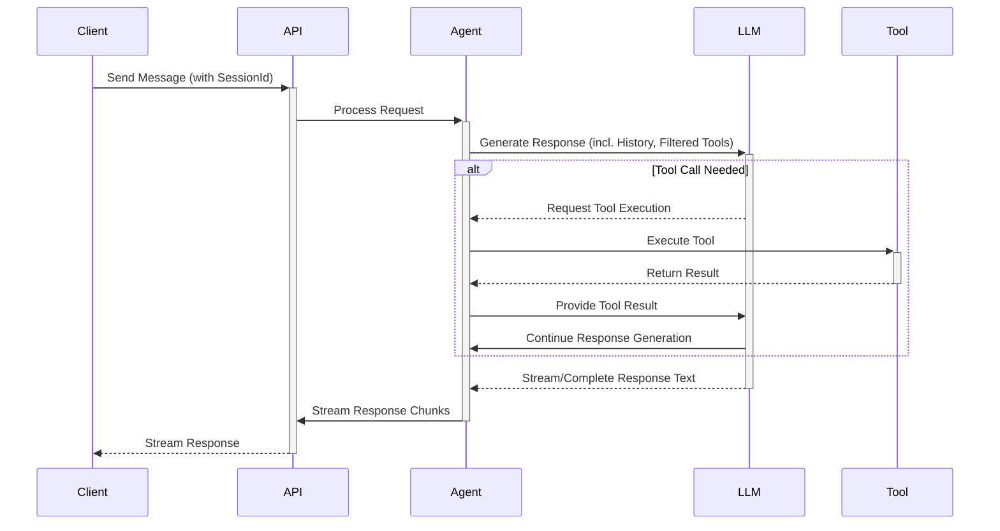
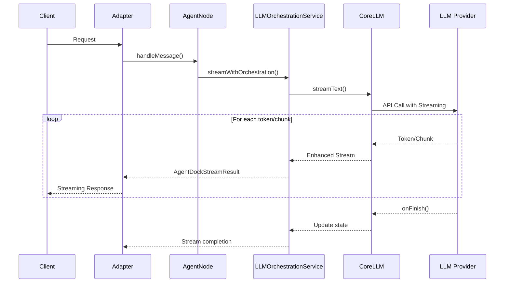

# Request Flow in AgentDock Core

This document outlines the typical sequence of events when a request is processed by AgentDock Core.

## Request Flow Diagram

## Detailed Steps

1.  **Request Initiation:** A client sends a request (e.g., a user message, potentially including a `sessionId`) to an API endpoint.
2.  **API Endpoint Handling:** Extracts the `sessionId` and message payload, determining the target `agentId`.
3.  **Agent Instantiation (`AgentNode`):** Creates an instance of `AgentNode`, passing the agent configuration, API keys, and core managers.
4.  **State Retrieval / Initialization:** Loads or creates orchestration state for the session.
5.  **Orchestration & Tool Filtering:** Evaluates conditions to determine the `activeStep` and filters available tools.
6.  **LLM Interaction (`CoreLLM.streamText`):** Prepares the prompt, sets callbacks, and calls the LLM with filtered tools.
7.  **Response Streaming & Tool Handling:** 
    - LLM streams response (text chunks or tool call requests)
    - Tool calls are executed and results returned to the LLM
    - Text chunks are streamed back to the client
8.  **State Updates:** Update token usage, tool history, sequence index, and timestamps.
9.  **Response Completion:** Stream ends and response is finalized.
10. **Cleanup:** `AgentNode` instance is discarded while session state persists.

For implementation details, see [`agentdock-core/src/nodes/agent-node.ts`](../../../agentdock-core/src/nodes/agent-node.ts).

## Enhanced Streaming Flow

AgentDock extends standard streaming with `AgentDockStreamResult`:

This enhanced flow provides:

1. **Automatic State Management**: Updates token usage and tracks tools used
2. **Error Handling**: Propagates errors from LLM providers with better context
3. **Tool Orchestration**: Manages tool execution and updates session state

For details on streaming implementation, see [Response Streaming](./response-streaming.md).