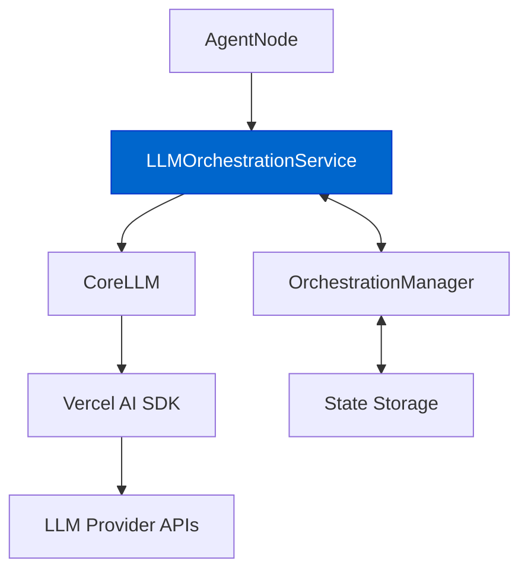

# LLM Orchestration Service

The `LLMOrchestrationService` serves as a bridge between the `AgentNode` and `CoreLLM`, adding orchestration-specific functionality to LLM interactions.

## Core Responsibilities

- **Stream Management**: Wraps CoreLLM's streaming capabilities with orchestration state
- **Token Usage Tracking**: Updates token usage in session state
- **Tool Tracking**: Monitors and records tools used during interactions
- **Callback Injection**: Provides orchestration-aware callbacks for stream events

## Architecture Position



## Key Methods

### streamWithOrchestration

The primary method that wraps `CoreLLM.streamText` with orchestration capabilities:

```typescript
async streamWithOrchestration(
  options: StreamWithOrchestrationOptions
): Promise<AgentDockStreamResult<Record<string, CoreTool>, any>>
```

This method:
1. Prepares orchestration-aware callbacks for `onFinish` and `onStepFinish`
2. Calls `CoreLLM.streamText` with these callbacks
3. Returns an enhanced stream result with orchestration state

### updateTokenUsage

A private method that updates the token usage in the session state:

```typescript
private async updateTokenUsage(usage?: TokenUsage): Promise<void>
```

This method:
1. Fetches the current state from the `OrchestrationManager`
2. Updates the cumulative token usage with the new usage information
3. Stores the updated state back in the session

## Integration with Tool Tracking

The service also tracks tools used during the conversation:
- Monitors tool calls in the `onStepFinish` callback
- Updates the `recentlyUsedTools` array in session state
- Provides this information to orchestration rules for conditional transitions

## Constructor

```typescript
constructor(
  private llm: CoreLLM,
  private orchestrationManager: OrchestrationManager,
  private sessionId: SessionId
)
```

The service requires:
- A `CoreLLM` instance for LLM interactions
- An `OrchestrationManager` for state management
- A `sessionId` to identify the session context

## Related Documentation

- [Orchestration Overview](./orchestration-overview.md) - General orchestration concepts
- [State Management](./state-management.md) - How state is managed in orchestration
- [Response Streaming](../core/response-streaming.md) - Details on streaming capabilities 

## Step Activation

-   **Step Activation:** Based on conditions met (e.g., a specific tool was used), the active step can change, altering the agent's behavior and available tools for the next turn.
    -   The system now re-evaluates conditions immediately after a tool is used, allowing for step transitions within the same turn a defining sequence is completed.

## Example Scenario: Cognitive Reasoner Agent

Let's illustrate with the [Cognitive Reasoner agent](https://github.com/AgentDock/AgentDock/tree/main/agents/cognitive-reasoner), specifically its `EvaluationMode`.

**Agent Configuration (`template.json` excerpt):**

```json
{
  "name": "EvaluationMode",
  "description": "Critical evaluation sequence",
  "sequence": [
    "critique",
    "debate",
    "reflect"
  ],
  "conditions": [
    { "type": "sequence_match" }
  ],
  "availableTools": {
    "allowed": ["critique", "debate", "reflect", "search"]
  }
}
```

**Flow:**

1.  **Initial State:** Session starts, `activeStep` is `DefaultMode`, `recentlyUsedTools` is `[]`.
2.  **User Request:** "Critique the argument that remote work improves productivity."
3.  **LLM Action (Turn 1 - Critique):** The agent, likely in `DefaultMode`, uses the `critique` tool. `processToolUsage` is called.
    -   `recentlyUsedTools` becomes `["critique"]`.
    -   `getActiveStep` runs immediately. No sequence matches yet. `activeStep` remains `DefaultMode`.
4.  **LLM Action (Turn 2 - Debate):** Following the critique, the agent uses the `debate` tool (perhaps prompted internally or by user). `processToolUsage` is called.
    -   `recentlyUsedTools` becomes `["critique", "debate"]`.
    -   `getActiveStep` runs. No sequence matches yet. `activeStep` remains `DefaultMode`.
5.  **LLM Action (Turn 3 - Reflect):** The agent uses the `reflect` tool. `processToolUsage` is called.
    -   `recentlyUsedTools` becomes `["critique", "debate", "reflect"]`.
    -   `getActiveStep` runs. It checks `EvaluationMode`:
        -   Condition `type: "sequence_match"` is evaluated.
        -   The end of `recentlyUsedTools` `["critique", "debate", "reflect"]` matches the step's `sequence` `["critique", "debate", "reflect"]`.
        -   The condition passes.
    -   `EvaluationMode` becomes the new `activeStep`. The `sequenceIndex` is reset to `0` for this newly activated step.
6.  **Next Turn:** When the next interaction begins, the agent is now in `EvaluationMode`. If the active step involved sequence enforcement via the `StepSequencer`, only the tool at `sequenceIndex: 0` (`critique`) would be initially allowed, although this specific example focuses on the *transition* via `sequence_match` rather than sequence *enforcement* during the step. 