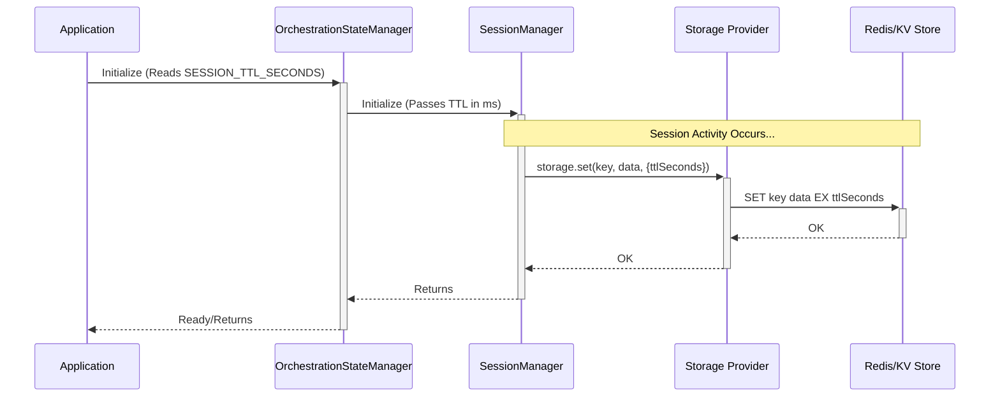

# Orchestration State Management

This document details the implementation of orchestration state management within AgentDock, focusing on how session-specific state is handled for controlling agent behavior and tool usage.

## Core Concepts

-   **Session-Scoped State:** All orchestration state (active step, tool sequence progress, recently used tools) is tied to a specific `SessionId` and managed separately for each conversation.
-   **State Interface (`OrchestrationState`):** Defined in `agentdock-core/src/orchestration/state.ts`, this interface extends the base `SessionState` and includes:
    -   `activeStep?: string`: The name of the currently active orchestration step.
    -   `recentlyUsedTools: string[]`: A list of tool names used within the session.
    -   `sequenceIndex?: number`: The current index within a defined tool sequence for the `activeStep`.
    -   `cumulativeTokenUsage?`: Tracks token counts for the session.
    -   `lastAccessed: number`: Timestamp for TTL calculation.
    -   `ttl: number`: Time-to-live for the state.

## Implementation (`OrchestrationStateManager`)

The `OrchestrationStateManager` class (`agentdock-core/src/orchestration/state.ts`) is the central component for managing `OrchestrationState`.

### Key Features:

-   **Uses `SessionManager`:** Internally, it leverages the core `SessionManager` specifically configured to handle `OrchestrationState`. It passes a `createDefaultState` function to initialize new orchestration states.
-   **Storage Integration:** Inherits storage capabilities from `SessionManager`, allowing `OrchestrationState` to be persisted using the configured storage provider (Memory, Redis, Vercel KV, etc.) under a specific namespace (default: `orchestration-state`).
-   **Factory Function:** The recommended way to get an instance is via the factory function `createOrchestrationStateManager(options)`, allowing configuration of storage and cleanup.
-   **State Accessors/Mutators:** Provides methods to interact with the state:
    -   `getState(sessionId)`: Retrieves the full `OrchestrationState`.
    -   `getOrCreateState(sessionId, config?)`: Retrieves existing state or creates a new default state if needed (and if orchestration is configured).
    -   `updateState(sessionId, updates)`: Performs a partial, immutable update to the state.
    -   `setActiveStep(sessionId, stepName)`: Updates the `activeStep` field.
    -   `addUsedTool(sessionId, toolName)`: Appends a tool name to `recentlyUsedTools`.
    -   `advanceSequence(sessionId)`: Increments the `sequenceIndex`.
    -   `resetState(sessionId)`: Resets the state back to its default values.
-   **Conditional Creation:** The `getOrCreateState` method checks if an agent configuration includes orchestration steps before creating state, optimizing for agents without orchestration.
-   **TTL & Cleanup:** The Time-To-Live for orchestration state (and thus the underlying session key in storage) is configurable. 
       - **Default:** If not explicitly configured, the default TTL is 24 hours of inactivity (defined in `agentdock-core`).
       - **Configuration:** The TTL can be overridden by setting the `SESSION_TTL_SECONDS` environment variable in the main application (e.g., `agentdock_cursor_starter`). This value (in seconds) is passed down during initialization.
       - **Mechanism:** The underlying `SessionManager` uses this configured TTL to set the expiration time on the storage key (e.g., via Redis `EXPIRE`). The state is automatically removed from storage after the TTL expires since the last access.

### Relationship with `StepSequencer`

The `StepSequencer` relies heavily on the `OrchestrationStateManager` to:
-   Get the current `sequenceIndex` for a session (`getState`).
-   Update the `sequenceIndex` when a sequence step is completed (`advanceSequence`).
-   Track which tools have been used (`addUsedTool`).

## State Lifecycle

1.  **Initialization:** State is typically created lazily via `getOrCreateState` when the orchestration system first needs to access or modify state for a session, provided the agent has orchestration configured.
2.  **Updates:** State fields (`activeStep`, `recentlyUsedTools`, `sequenceIndex`, `lastAccessed`) are updated throughout the agent's interaction via specific `OrchestrationStateManager` methods.
3.  **Retrieval:** Components needing orchestration context (like the `StepSequencer` or condition checkers) use `getState`.
4.  **Cleanup:** Expired state is automatically removed based on the `ttl` and `lastAccessed` timestamps by the underlying `SessionManager`'s cleanup process.

## Session Persistence & Long-Lived Agents

The TTL mechanism is designed for typical web session expiry. For agents intended to persist indefinitely (like a personal assistant):

1.  **Set a Very Long TTL:** Configure `SESSION_TTL_SECONDS` to a very large value (e.g., years in seconds).
2.  **Regular Interaction:** Ensure the agent's session is accessed periodically (e.g., through a scheduled task or user interaction). Each access updates the `lastAccessed` timestamp, effectively resetting the TTL countdown.
3.  **Disable TTL (Use with Caution):** While possible to modify the core code to disable TTL (`ttlSeconds = undefined` in `SessionManager`), this is generally discouraged as it can lead to orphaned state accumulating in the storage provider if sessions are never explicitly deleted.

## Configuration

The `OrchestrationStateManager` can be configured during instantiation using `createOrchestrationStateManager(options)`:

-   `storageProvider`: Provide a specific storage instance (e.g., a configured `RedisStorageProvider`).
-   `storageNamespace`: Change the namespace used in the storage backend.
-   `cleanup`: Configure the cleanup *check* interval and enable/disable the automatic cleanup timer. Note: The actual session **TTL** is primarily controlled by `SESSION_TTL_SECONDS` passed during initialization.

## Best Practices

-   Use the factory `createOrchestrationStateManager(options)` for proper configuration.
-   Leverage conditional state creation logic where applicable.
-   Ensure the underlying storage provider is configured correctly for the deployment environment. 