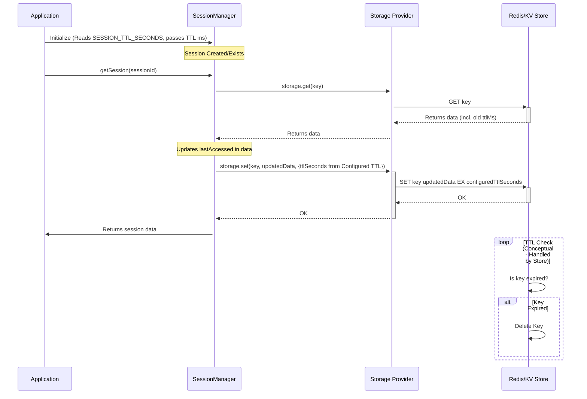

# Session Management

Sessions in AgentDock provide the foundation for stateful, continuous interactions between users and AI agents. This document covers the core concepts, architecture, implementation details, and optimization strategies for the session management system.

## Core Concepts

-   **Session:** Represents a single conversation, identified by a unique `SessionId`. It maintains state across multiple interactions (messages, tool calls) to preserve context.
-   **Session Isolation:** Ensures that concurrent conversations do not interfere with each other. Critical for multi-user environments.
-   **Single Source of Truth:** Session IDs are generated centrally (typically by the entry point, like an API route handler), and state is managed through a single `SessionManager` instance for a given state type, ensuring consistency.

## Architecture & Implementation

The session system revolves around the generic `SessionManager` class found in `agentdock-core/src/session/index.ts`.

### `SessionManager<T extends SessionState>`

-   **Generic:** Can manage different types of session state (e.g., base state, orchestration state, tool state) by extending the base `SessionState` interface.
-   **Storage-Backed:** Uses the [Storage Abstraction Layer](./storage-abstraction.md) for persistence. It defaults to an in-memory provider but can be configured (via constructor options) to use Redis, Vercel KV, or other providers.
-   **Namespace:** Uses a storage namespace (e.g., `sessions`, `orchestration-state`) to keep different types of session data separate in the storage backend.
-   **State Factory:** Requires a `defaultStateGenerator` function during instantiation to define how the initial state (`T`) for a new session should be created.

### Key Operations

-   `createSession(options)`: Creates a new session (if one doesn't exist for the given or generated `SessionId`) using the `defaultStateGenerator` and stores it. Returns a `SessionResult<T>`.
-   `getSession(sessionId)`: Retrieves the current state for a session ID from storage. Returns `SessionResult<T>`.
-   `updateSession(sessionId, updateFn)`: Updates session state immutably. It retrieves the current state, applies the `updateFn` to generate a new state object, and stores the new state atomically. Returns `SessionResult<T>`.
-   `deleteSession(sessionId)`: Removes a session from storage.

### Session ID Generation

Session IDs are typically generated by the application entry point (e.g., API route handler) to maintain the single source of truth. While the core library can generate a UUID (`generateSessionId`), passing a predetermined ID is preferred. Format often includes prefixes for traceability.

### Session Lifecycle & Cleanup

1.  **Creation:** Handled by `createSession`, often triggered by the first interaction if no `SessionId` is provided.
2.  **Access & Update:** `getSession` and `updateSession` are used throughout the agent's processing logic.
3.  **Expiration (TTL):** Each session state includes `lastAccessed` (timestamp) and `ttl` (milliseconds) properties. The TTL is configurable (default: 30 minutes).
    - **Default:** The default TTL is **24 hours** of inactivity, defined in `agentdock-core`.
    - **Configuration:** This default can be overridden globally for the application by setting the `SESSION_TTL_SECONDS` environment variable (value in seconds). This configured TTL is used when creating or updating session keys in the storage provider.
4.  **Automatic Cleanup:** The `SessionManager` includes an optional, periodic cleanup mechanism (`setupCleanupInterval`, `cleanupExpiredSessions`) that checks `lastAccessed + ttl` against the current time and automatically calls `deleteSession` for expired entries. This timer uses `unref()` in Node.js to avoid blocking process exit.

### Persistence & Long-Lived Sessions

For sessions needing longer persistence than typical web interactions (e.g., persistent personal assistants):

1.  **Configure Long TTL:** Set `SESSION_TTL_SECONDS` in the application's environment to a large value (e.g., `31536000` for one year).
2.  **Ensure Activity:** As long as the session is accessed (via `getSession` or `updateSession`), the `lastAccessed` timestamp is updated, resetting the TTL timer for the storage key.
3.  **No TTL:** Setting `SESSION_TTL_SECONDS` to `0` or a negative value will likely result in the storage provider *not* setting an expiration time, making the session persist indefinitely until explicitly deleted. Use this cautiously to avoid accumulating orphaned data.

## Optimization Techniques

-   **Conditional State Creation:** Components or managers (like `OrchestrationStateManager`) should check if session state is truly needed before calling `createSession` or `getSession`. For example, an agent without orchestration configured doesn't need orchestration state.
-   **Minimalist State Design:** Session state interfaces (`T extends SessionState`) should only include essential data, avoiding large objects or duplication.
-   **Lazy Loading:** Components retrieve session state only when required for an operation.
-   **Efficient Updates:** The immutable update pattern (`updateSession`) with partial updates (`{ ...state, ...updates }`) is efficient and prevents race conditions.
-   **Last Accessed Tracking:** Updating `lastAccessed` on `getSession` or `updateSession` keeps active sessions alive while allowing inactive ones to expire naturally via TTL.
-   **Storage Provider Choice:** Selecting an appropriate storage provider (Memory for development, Redis/Vercel KV for production) significantly impacts performance and scalability.
-   **Leverage Configurable TTL:** Set `SESSION_TTL_SECONDS` appropriately for your application's needs (e.g., shorter for web sessions, longer for persistent agents) for automatic cleanup.

## Integration

-   **LLM:** Session state (especially message history) provides context for LLM calls.
-   **Tools:** Tools can access session state (via specific managers if needed) to maintain context or share data across invocations.
-   **Orchestration:** The `OrchestrationStateManager` uses the `SessionManager` to store its specific `OrchestrationState` per session, enabling step tracking, sequence management, etc.
-   **Next.js:** See [Next.js Integration](./nextjs-integration.md) for details on managing session IDs in API routes and client components.

## Best Practices

1.  **Single Source of Truth:** Generate/manage session IDs at the entry point (API route).
2.  **Pass, Don't Create:** Components receive session IDs; they don't generate them.
3.  **Configure Storage:** Choose the appropriate storage provider for your environment.
4.  **Minimize State:** Only store necessary data in session state objects.
5.  **Leverage TTL:** Use TTL effectively for automatic cleanup.
6.  **Handle Errors:** Check `SessionResult.success` and handle potential errors (e.g., session not found). 