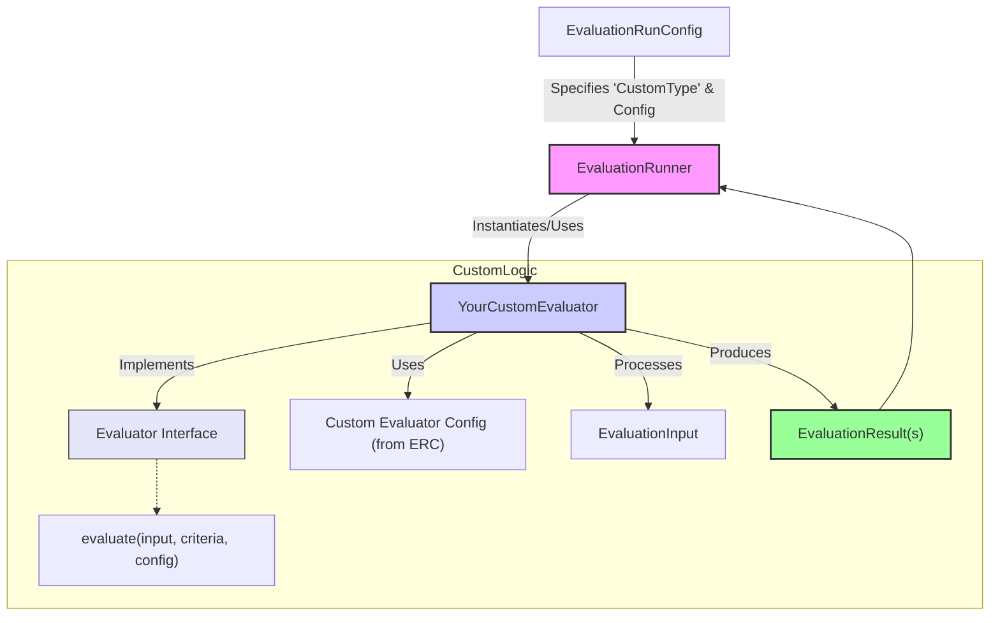

# Creating Custom Evaluators

The AgentDock Evaluation Framework is designed for extensibility. While the built-in evaluators cover many common use cases, you will inevitably encounter scenarios requiring bespoke evaluation logic specific to your agent's tasks, data, or business rules. A core design philosophy is that a framework's true power lies in its adaptability.

The core of this extensibility is the `Evaluator` interface. By implementing this interface, you can seamlessly integrate your custom evaluation logic into the `EvaluationRunner` and leverage the broader framework features.

## The `Evaluator` Interface

To create a custom evaluator, you need to define a class that implements the `Evaluator<ConfigType, ResultType>` interface. This interface is defined as follows (conceptually):

```typescript
// Conceptual representation (refer to actual types in agentdock-core)
interface Evaluator<ConfigType = any, InputType = any, ResultType = any> {
  /** 
   * A unique string identifier for this evaluator type. 
   * This is used in EvaluationRunConfig to specify which evaluator to use.
   */
  type: string;

  /**
   * The core evaluation logic.
   * @param input The full EvaluationInput for the current run.
   * @param criteria The specific EvaluationCriteria this evaluator should assess.
   * @param config The specific configuration for this instance of the evaluator, taken from EvaluationRunConfig.
   * @returns A Promise resolving to an array of EvaluationResult objects.
   */
  evaluate(
    input: EvaluationInput<InputType>, 
    criteria: EvaluationCriteria[], 
    config: ConfigType
  ): Promise<EvaluationResult<ResultType>[]>;
}
```

Key aspects:

*   **`type` (string):** This is a crucial static or instance property. It must be a unique string that identifies your custom evaluator. This `type` string is what users will specify in the `EvaluationRunConfig` to select your evaluator.
*   **`evaluate(input, criteria, config)` (method):** This asynchronous method contains your core evaluation logic. It receives:
    *   `input: EvaluationInput`: The complete input data for the evaluation (agent response, prompt, history, context, etc.).
    *   `criteria: EvaluationCriteria[]`: An array of criteria that this evaluator instance is responsible for assessing. Your evaluator should iterate through these and produce a result for each one it's configured to handle.
    *   `config: ConfigType`: The specific configuration object for this evaluator, as provided in the `evaluatorConfigs` array in `EvaluationRunConfig`. This allows you to parameterize your evaluator.
    *   It must return a `Promise` that resolves to an array of `EvaluationResult` objects.

## Core Workflow of a Custom Evaluator

The following diagram illustrates the general workflow when a custom evaluator is invoked by the `EvaluationRunner`:



## Example: A Simple Custom Length Checker

Let's imagine a custom evaluator that checks if a response length is *exactly* a specific value, different from the min/max range check of the built-in `RuleBasedEvaluator`.

```typescript
// my-custom-evaluators.ts
import type { 
  Evaluator, 
  EvaluationInput, 
  EvaluationCriteria, 
  EvaluationResult 
} from 'agentdock-core'; // Adjust path as necessary
// Assuming getInputText is exported from agentdock-core or a known utils path
// For example: import { getInputText } from 'agentdock-core/evaluation/utils'; 
// Or if getInputText becomes part of the main agentdock-core exports:
// import { getInputText } from 'agentdock-core';

// Import the utility function from the framework
import { getInputText } from 'agentdock-core/evaluation/utils';

// Configuration type for our custom evaluator
interface ExactLengthConfig {
  expectedLength: number;
  sourceField?: string; // e.g., 'response', 'context.someField'
}

class ExactLengthEvaluator implements Evaluator<ExactLengthConfig> {
  public readonly type = 'ExactLengthCheck'; // Unique type identifier

  async evaluate(
    input: EvaluationInput,
    criteria: EvaluationCriteria[],
    config: ExactLengthConfig
  ): Promise<EvaluationResult[]> {
    const results: EvaluationResult[] = [];
    // Use the utility function to extract text
    const textToEvaluate = getInputText(input, config.sourceField);

    // Original logic for iterating criteria and checking length follows
    for (const criterion of criteria) {
      if (textToEvaluate === undefined) {
        results.push({
          criterionName: criterion.name,
          score: false,
          reasoning: `Source field '${config.sourceField || 'response'}' not found, not a string, or not extractable.`,
          evaluatorType: this.type,
        });
        continue;
      }

      const actualLength = textToEvaluate.length;
      const passed = actualLength === config.expectedLength;

      results.push({
        criterionName: criterion.name,
        score: passed,
        reasoning: passed 
          ? `Response length is exactly ${config.expectedLength}.` 
          : `Expected length ${config.expectedLength}, got ${actualLength}.`,
        evaluatorType: this.type,
      });
    }
    return results;
  }
}

// To make it available, you might export it or register it with a central registry if your app has one.
export { ExactLengthEvaluator };

// Testing custom evaluators
// --------------------------
// It's important to thoroughly test your custom evaluators. Here's a basic example of how you might
// write tests for the `ExactLengthEvaluator` using a testing framework like Jest.

/*
import { ExactLengthEvaluator } from './my-custom-evaluators';
import type { EvaluationInput, EvaluationCriteria, ExactLengthConfig } from './my-custom-evaluators'; // Assuming types are also exported or defined locally for test

describe('ExactLengthEvaluator', () => {
  let evaluator: ExactLengthEvaluator;
  const mockCriteria: EvaluationCriteria[] = [{ name: 'ExactLength', description: 'Test', scale: 'binary' }];
  const mockConfig: ExactLengthConfig = { expectedLength: 10 };

  beforeEach(() => {
    evaluator = new ExactLengthEvaluator(); // Assuming constructor takes no args, or adjust as needed
  });

  it('should pass when text length matches expected length', async () => {
    const input: EvaluationInput = { 
      response: '1234567890', // exactly 10 characters
      criteria: mockCriteria 
    };
    const results = await evaluator.evaluate(input, mockCriteria, mockConfig);
    expect(results.length).toBe(1);
    expect(results[0].score).toBe(true);
    expect(results[0].reasoning).toContain('Response length is exactly 10.');
  });

  it('should fail when text length differs from expected length', async () => {
    const input: EvaluationInput = { 
      response: '12345', // only 5 characters
      criteria: mockCriteria 
    };
    const results = await evaluator.evaluate(input, mockCriteria, mockConfig);
    expect(results.length).toBe(1);
    expect(results[0].score).toBe(false);
    expect(results[0].reasoning).toContain('Expected length 10, got 5.');
  });

  it('should handle undefined textToEvaluate gracefully', async () => {
    const input: EvaluationInput = { 
      response: { complex: 'object' }, // Not a string, and getInputText might return undefined
      criteria: mockCriteria 
    };
    // Assuming config.sourceField is not set, so getInputText defaults to 'response'
    const results = await evaluator.evaluate(input, mockCriteria, mockConfig);
    expect(results.length).toBe(1);
    expect(results[0].score).toBe(false);
    expect(results[0].reasoning).toContain('Source field \'response\' not found, not a string, or not extractable.');
  });
});
*/

## Using Your Custom Evaluator

Once defined, you would use your custom evaluator in an `EvaluationRunConfig` by providing its `type` and any necessary configuration:

```typescript
// in your evaluation script
// import { ExactLengthEvaluator } from './my-custom-evaluators'; // Assuming local file
// import { EvaluationRunner, type EvaluationRunConfig ... } from 'agentdock-core';

// If your custom evaluator isn't automatically discoverable by EvaluationRunner via its type,
// you might need to pass an instance directly if the runner supports it, 
// or ensure your bundler includes it if type-based instantiation is used.
// The current EvaluationRunner instantiates evaluators based on their 'type' string matching
// a known set of built-in evaluators. For true custom external evaluators, the runner
// would need a mechanism to register or receive instantiated custom evaluators.
// For now, let's assume it can be configured if EvaluationRunner is adapted or if it's used within the same project scope.

const runConfig: EvaluationRunConfig = {
  evaluatorConfigs: [
    // ... other built-in evaluator configs
    {
      type: 'ExactLengthCheck', // The unique type string of your custom evaluator
      // criteriaNames: ['MustBeSpecificLength'], // Link to specific criteria names
      config: { // The ExactLengthConfig for this instance
        expectedLength: 50,
        sourceField: 'response'
      }
    }
  ],
  // ... other run config properties
};

// const results = await runEvaluation(myInput, runConfig);
```

Building custom evaluators empowers you to tailor the AgentDock Evaluation Framework precisely to your needs, ensuring that your agent's quality is measured against the metrics that matter most for your application. 