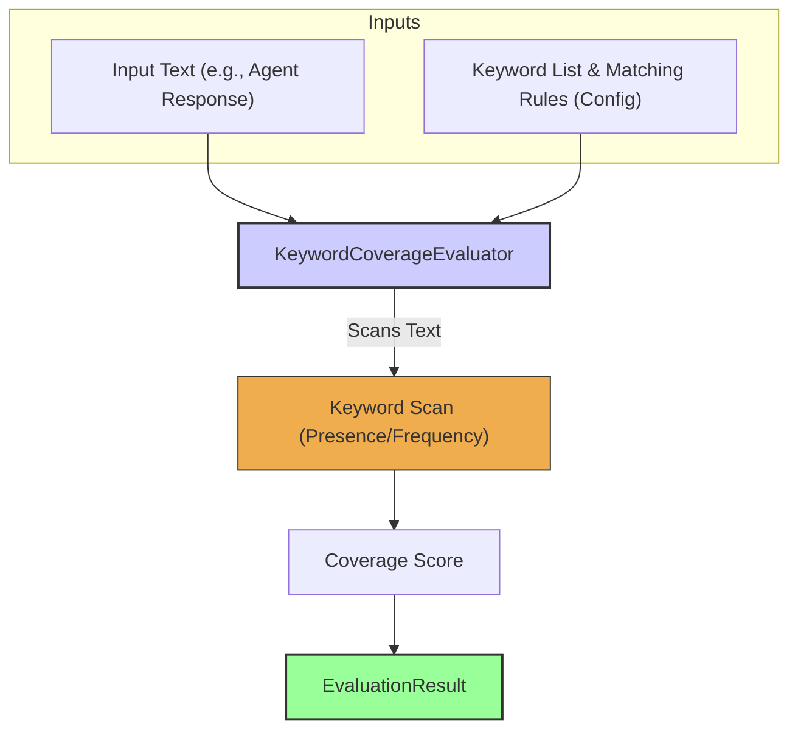

# Keyword Coverage Evaluator

The `KeywordCoverageEvaluator` checks for the presence, frequency, or coverage of specified keywords or phrases within a given text. This is a straightforward but highly effective way to ensure that essential information is included in an agent's response, or conversely, that undesirable terms are absent. Experience finds this useful for quick checks on information inclusion or policy adherence.

## Core Workflow

The `KeywordCoverageEvaluator` takes an input text (typically the agent's response) and a configuration specifying a list of keywords and matching rules (e.g., case sensitivity, expected outcome). It then scans the input text to determine the presence, frequency, or coverage of these keywords, producing a score that reflects this, which is included in the `EvaluationResult`.



## Use Cases

The `KeywordCoverageEvaluator` is valuable for:

*   Ensuring product names, disclaimers, or specific instructions are mentioned.
*   Verifying that all topics from a checklist are addressed.
*   Basic checking for forbidden words (though `ToxicityEvaluator` might be more specialized).
*   Counting occurrences of specific terms for analytical purposes.

## Configuration

Configuration involves defining the keywords and the matching logic:

*   `keywords`: An array of strings or patterns to search for.
*   `caseSensitive`: Boolean, defaults to `false`.
*   `expectedOutcome`: Defines what constitutes a pass (e.g., 'any' keyword found, 'all' keywords found, 'none' found, or a specific count/frequency).
*   `sourceField`: Specifies which field from `EvaluationInput` to check (defaults to 'response').

```typescript
// Example configuration structure (to be detailed)
// {
//   type: 'KeywordCoverage',
//   keywords: ['important disclaimer', 'AgentDock Core'],
//   caseSensitive: false,
//   expectedOutcome: 'all', // e.g., requires both to be present
//   sourceField: 'response.textBlock'
// }
```

## Output (`EvaluationResult`)

The `KeywordCoverageEvaluator` produces an `EvaluationResult`:

*   **`criterionName`**: Reflects the keyword check being performed (e.g., "IncludesMandatoryTerms").
*   **`score`**: Typically boolean (`true`/`false`) or a numeric score (e.g., percentage of keywords found, count of occurrences).
*   **`reasoning`**: Details about which keywords were found/missing, or counts.
*   **`evaluatorType`**: `'KeywordCoverage'`.
*   **`error`**: For configuration errors or issues accessing the text.

This evaluator offers a simple way to enforce content requirements based on keyword presence. 