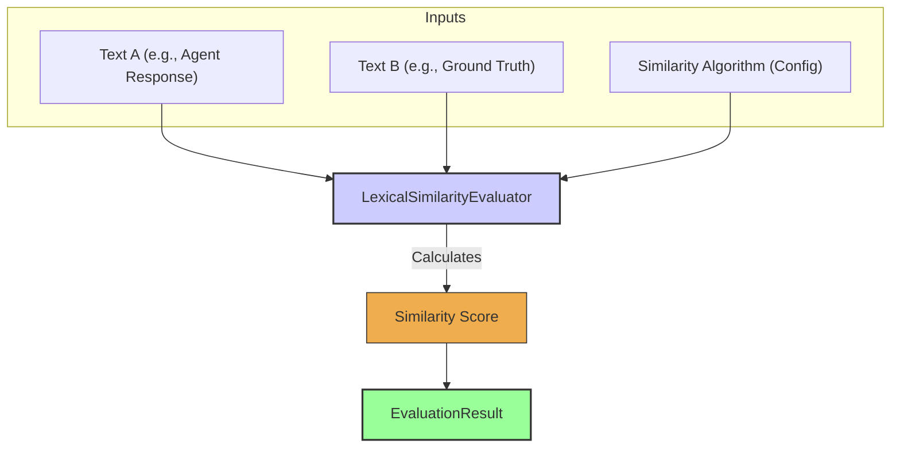

# Lexical Similarity Evaluator

The `LexicalSimilarityEvaluator` compares two strings and calculates a score representing their textual similarity. This is distinct from semantic similarity (handled by `NLPAccuracyEvaluator`) as it focuses on the character-level or token-level makeup of the strings. Experience suggests this is useful for cases where specific phrasing or structure is expected, but minor variations are tolerable, or for comparing against known textual patterns.

It typically employs various string comparison algorithms like Levenshtein distance, Jaro-Winkler, or others available through libraries.

## Core Workflow

The `LexicalSimilarityEvaluator` takes two text inputs (e.g., an agent's response and a ground truth reference) and a selected similarity algorithm (specified in its configuration). It applies the algorithm to compare the two texts and calculates a numerical similarity score, which is then reported in the `EvaluationResult`.



## Use Cases

The `LexicalSimilarityEvaluator` is useful for:

*   Checking how closely an agent's response matches an expected template or a known answer, allowing for some flexibility.
*   Assessing adherence to specific phrasing guidelines.
*   Identifying minor typos or variations in user input when comparing against a knowledge base.
*   Measuring the difference between two versions of a text.

## Configuration

Configuration primarily involves selecting the algorithm and specifying the source of the texts to compare from the `EvaluationInput`:

*   `sourceField`: A string (e.g., 'response', 'context.someData') indicating which field from `EvaluationInput` provides the primary text.
*   `referenceField`: A string (e.g., 'groundTruth', 'context.expectedAnswer') indicating which field from `EvaluationInput` provides the reference text.
*   `algorithm`: The string similarity algorithm to use (e.g., 'levenshtein', 'jaroWinkler', 'sorensenDice').
*   Potentially, algorithm-specific parameters like `caseSensitive` or `normalizeWhitespace`.

```typescript
// Example configuration structure (to be detailed)
// {
//   type: 'LexicalSimilarity',
//   algorithm: 'jaroWinkler', // Or other supported algorithm
//   sourceField: 'response', 
//   referenceField: 'groundTruth.answer', // Example path to a nested field
//   caseSensitive: false
// }
```

## Output (`EvaluationResult`)

The `LexicalSimilarityEvaluator` produces an `EvaluationResult`:

*   **`criterionName`**: A name reflecting the comparison being made (e.g., "ResponseTemplateSimilarity").
*   **`score`**: A numeric value representing the similarity, often normalized (e.g., 0 to 1, where 1 is a perfect match).
*   **`reasoning`**: May include the raw score from the algorithm if different from the normalized score, or the algorithm used.
*   **`evaluatorType`**: `'LexicalSimilarity'`.
*   **`error`**: For issues like an unsupported algorithm or problems accessing the source/target texts.

This evaluator provides a quantitative measure of textual closeness, useful when exact matches are too strict but semantic understanding is not required.