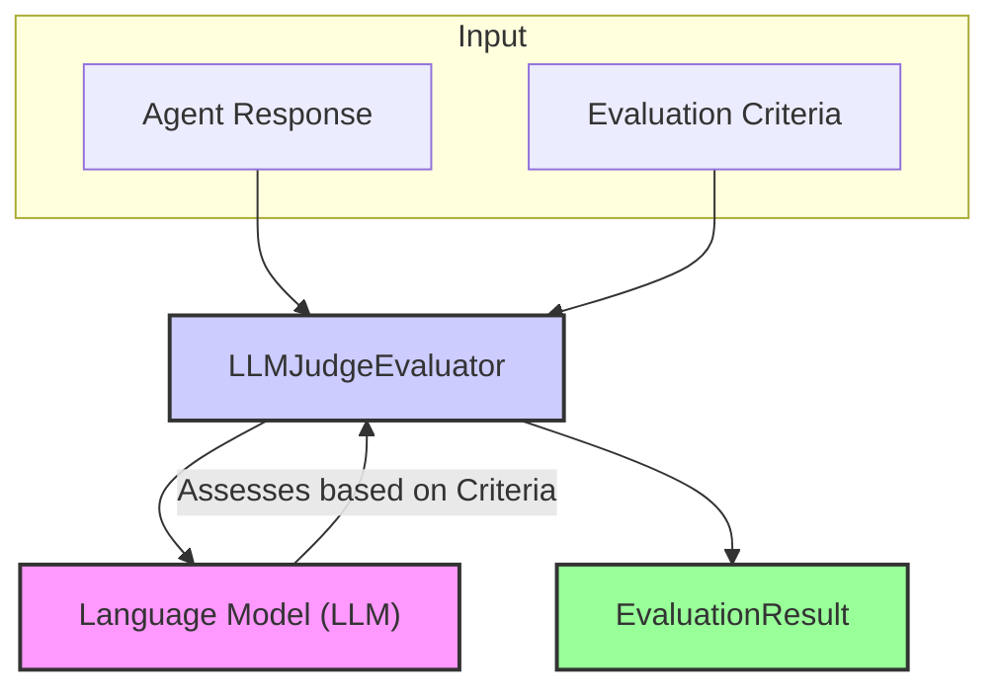

# LLM-as-Judge Evaluator

The `LLMJudgeEvaluator` leverages the power of a large language model (LLM) to perform nuanced, qualitative assessments of agent outputs. Unlike rule-based systems that check for specific, deterministic patterns, an LLM judge can evaluate responses based on broader criteria like coherence, relevance, helpfulness, safety, or adherence to complex instructions. Practical experience shows that for many sophisticated agent behaviors, an LLM judge is an indispensable tool for capturing the subtleties of quality.

## Core Workflow

The `LLMJudgeEvaluator` takes the agent's response and the evaluation criteria as input. It then typically formats these into a prompt for a specified Language Model (LLM), instructing the LLM to assess the response against each criterion and provide a score and reasoning. The evaluator parses the LLM's structured output to generate the final `EvaluationResult` objects.



## Use Cases

The `LLMJudgeEvaluator` is particularly well-suited for:

*   Assessing the overall quality of free-form text responses.
*   Evaluating adherence to complex or nuanced instructions.
*   Checking for specific stylistic elements (e.g., tone, formality).
*   Identifying potential safety issues or harmful content that might be missed by simpler checks.
*   Comparing agent responses against a gold standard or ground truth in a semantic way.

## Configuration

Details on how to configure the `LLMJudgeEvaluator` will go here. This typically involves specifying:

*   The LLM to use (e.g., model name, provider).
*   The system prompt or template to guide the LLM's judgment.
*   How criteria are presented to the LLM.

```typescript
// Example configuration structure (to be detailed)
// {
//   type: 'LLMJudge',
//   llmConfig: { /* ... CoreLLM configuration ... */ },
//   judgePromptTemplate?: string, // Optional: Custom prompt template
//   // ... other LLM judge specific settings
// }
```

## Output (`EvaluationResult`)

The `LLMJudgeEvaluator` produces an `EvaluationResult` for each criterion it assesses.

*   **`criterionName`**: The name of the criterion being evaluated.
*   **`score`**: The score assigned by the LLM, often on a predefined scale (e.g., numeric, Likert).
*   **`reasoning`**: The justification provided by the LLM for its score. This is often the most valuable part of the output.
*   **`evaluatorType`**: `'LLMJudge'`.
*   **`error`**: Populated if there was an issue with the LLM call or processing its response.

This evaluator allows for a much richer and more human-like assessment of agent performance, complementing more deterministic methods. 