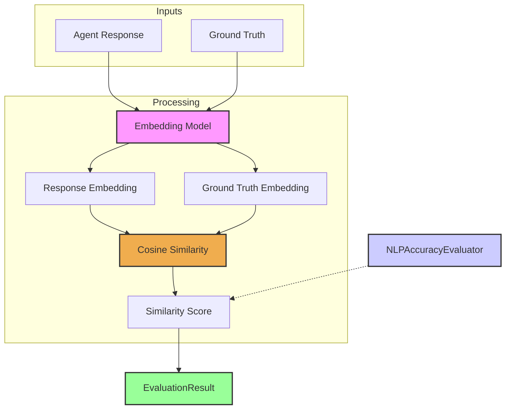

# NLP Accuracy Evaluator

The `NLPAccuracyEvaluator` measures the semantic similarity between an agent's response and a provided ground truth. This is crucial for tasks where the exact wording isn't as important as the meaning or intent conveyed. Experience indicates that for question answering, summarization, or any task requiring semantic understanding, this kind of evaluation is far more insightful than simple lexical matches.

It typically works by generating embeddings (vector representations) for both the agent's response and the ground truth, and then calculating the cosine similarity between these embeddings. A higher cosine similarity indicates greater semantic closeness.

## Core Workflow

The `NLPAccuracyEvaluator` takes an agent's response and a ground truth text as input. Both texts are then processed by a specified embedding model to generate their respective vector embeddings. The cosine similarity between these two embeddings is calculated, yielding a score that quantifies their semantic closeness. This score forms the core of the `EvaluationResult`.



## Use Cases

The `NLPAccuracyEvaluator` is ideal for:

*   Evaluating the relevance and accuracy of answers in question-answering systems.
*   Assessing the quality of summaries against reference summaries.
*   Measuring how well an agent's response captures the meaning of a target text.
*   Comparing different phrasings of a concept for semantic equivalence.

## Configuration

Configuring this evaluator primarily involves specifying how embeddings are generated:

*   The embedding model to use (via `CoreLLM` or a dedicated embedding service configuration).
*   Potentially, parameters for the embedding generation.

```typescript
// Example configuration
// NOTE: The `embeddingAdapter` needs to be an instance of a class
// that implements the `EmbeddingAdapter` interface.
// The instantiation below is conceptual.
// You would typically import and configure a specific adapter (e.g., for OpenAI, Google, etc.).

// Conceptual: const myOpenAIAdapter = new OpenAIEmbeddingAdapter({ apiKey: 'YOUR_API_KEY', model: 'text-embedding-ada-002' });
// Conceptual: const myGoogleAdapter = new GoogleEmbeddingAdapter({ apiKey: 'YOUR_API_KEY', model: 'embedding-001' });

// Example using a conceptual adapter instance:
{
  type: 'NLPAccuracy',
  criterionName: 'SemanticClosenessToAnswer',
  // embeddingAdapter: myOpenAIAdapter, // Pass the instantiated adapter
  embeddingAdapter: {} as any, // Placeholder for a real adapter instance in a real setup
  sourceTextField: 'response',       // Text to evaluate (e.g., agent's answer)
  referenceTextField: 'groundTruth', // Text to compare against (e.g., ideal answer)
  similarityThreshold: 0.75          // Optional: score >= this is considered a pass
}
```

## Output (`EvaluationResult`)

The `NLPAccuracyEvaluator` produces an `EvaluationResult`:

*   **`criterionName`**: Typically a name like "SemanticSimilarity" or "NLPAccuracy".
*   **`score`**: A numeric value (usually between 0 and 1, or -1 and 1 for cosine similarity) representing the semantic similarity. Higher is generally better.
*   **`reasoning`**: May include details like the actual cosine similarity score if the scaled score is different, or notes about the embedding process.
*   **`evaluatorType`**: `'NLPAccuracy'`.
*   **`error`**: Populated if there were issues generating embeddings or calculating similarity.

This evaluator helps quantify how well an agent understands and reproduces meaning, a key aspect of advanced agent performance. 