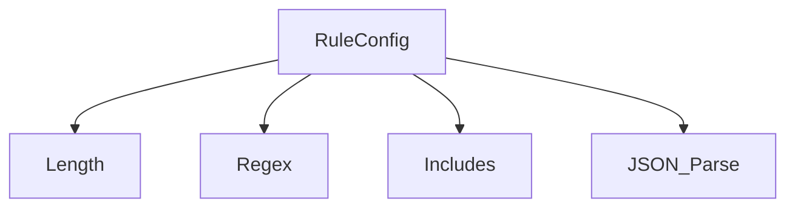

# Rule-Based Evaluator

The `RuleBasedEvaluator` provides essential, low-cost checks for agent outputs. Its purpose is straightforward: enforce deterministic constraints and basic validations without incurring the latency or cost of LLM calls. Experience shows that establishing these kinds of guardrails early is fundamental for building any semblance of predictable agent behavior.

Think of it as the first line of defense: Does the response meet minimum length? Does it contain required keywords? Is the generated structure valid? These aren't complex semantic judgments, but they are critical for filtering out basic failures quickly.

## Use Cases

This evaluator excels at checks like:

*   **Format Validation:** Ensuring output is valid JSON, respects length constraints (min/max characters), or matches a specific regular expression.
*   **Keyword Enforcement:** Verifying the presence (or absence) of specific required terms, product names, or identifiers.
*   **Basic Safety/Compliance:** Flagging responses containing blacklisted terms (though the dedicated `ToxicityEvaluator` is often better suited for more nuanced checks).
*   **Instruction Adherence (Simple):** Checking if simple instructions, like including a specific phrase, were followed.

It's fast, cheap, and deterministic—essential characteristics for checks you might run frequently, perhaps even in CI/CD pipelines.

## Configuration

To use the `RuleBasedEvaluator`, you include its configuration in the `evaluatorConfigs` array within your `EvaluationRunConfig`.

```typescript
// In your EvaluationRunConfig
{
  // ... other evaluator configs
  {
    type: 'RuleBased';
    rules: EvaluationRule[]; // Array of rules to apply
  },
  // ... other evaluator configs
}
```

The core of the configuration lies in the `rules` array, which contains `EvaluationRule` objects.

### `EvaluationRule` Interface

Each rule links a specific check to a defined evaluation criterion:

```typescript
interface EvaluationRule {
  /** The name of the criterion this rule evaluates (must match a name in EvaluationInput.criteria). */
  criterionName: string;
  /** The specific configuration defining the check to perform. */
  config: RuleConfig;
}
```

### `RuleConfig` Union Type

The `config` field within an `EvaluationRule` specifies the actual check. It's a discriminated union based on the `type` property.



**Common Optional Property:**

*   `sourceField?: 'response' | 'prompt' | 'groundTruth' | string;`
    *   Specifies which field from the `EvaluationInput` the rule should check.
    *   Defaults to `'response'`. 
    *   Use dot notation for nested context fields, e.g., `'context.extractedData'`. If the field doesn't exist or isn't a string when one is expected, the rule will typically fail.

**Supported Rule Types:**

1.  **`length`**: Checks the string length of the `sourceField`.
    ```typescript
    type LengthRuleConfig = {
      type: 'length';
      min?: number; // Minimum allowed length (inclusive)
      max?: number; // Maximum allowed length (inclusive)
      sourceField?: string; 
    };
    ```
    *Example:* `{ type: 'length', min: 10, max: 150, sourceField: 'response' }`

2.  **`regex`**: Checks if the `sourceField` matches a given regular expression.
    ```typescript
    type RegexRuleConfig = {
      type: 'regex';
      pattern: string; // The regex pattern (as a string)
      flags?: string; // Optional regex flags (e.g., 'i' for case-insensitive)
      sourceField?: string;
    };
    ```
    *Example:* `{ type: 'regex', pattern: '^\{.*\}$', flags: 's', sourceField: 'response' }` (Checks if response is a JSON object)

3.  **`includes`**: Checks for the presence of keywords in the `sourceField`.
    ```typescript
    type IncludesRuleConfig = {
      type: 'includes';
      keywords: string[]; // Array of keywords to check for
      caseSensitive?: boolean; // Defaults to false
      expectedOutcome: 'any' | 'all' | 'none'; // 'any': at least one keyword present, 'all': all keywords present, 'none': no keywords present
      sourceField?: string;
    };
    ```
    *Example:* `{ type: 'includes', keywords: ['AgentDock', 'API key'], caseSensitive: true, expectedOutcome: 'all', sourceField: 'response' }`

4.  **`json_parse`**: Checks if the `sourceField` contains a valid JSON string.
    ```typescript
    type JsonParseRuleConfig = {
      type: 'json_parse';
      sourceField?: string;
    };
    ```
    *Example:* `{ type: 'json_parse', sourceField: 'response' }`

### Configuration Example

Here's how you might configure the `RuleBasedEvaluator` for two criteria: `IsConcise` and `MentionsProductName`.

```typescript
import type { EvaluationRunConfig, EvaluationRule, RuleConfig } from 'agentdock-core';

// Assume EvaluationInput.criteria includes criteria named 'IsConcise' and 'MentionsProductName'

const ruleBasedRules: EvaluationRule[] = [
  {
    criterionName: 'IsConcise',
    config: {
      type: 'length',
      max: 200,
      // sourceField defaults to 'response'
    } as RuleConfig, // Type assertion sometimes helpful
  },
  {
    criterionName: 'MentionsProductName',
    config: {
      type: 'includes',
      keywords: ['AgentDock Framework'],
      caseSensitive: false,
      expectedOutcome: 'any'
    } as RuleConfig,
  },
];

const runConfig: EvaluationRunConfig = {
  evaluatorConfigs: [
    // ... other evaluators
    {
      type: 'RuleBased',
      rules: ruleBasedRules,
    },
  ],
  // ... other config properties
};
```

## Output (`EvaluationResult`)

The `RuleBasedEvaluator` produces an `EvaluationResult` for each `EvaluationRule` whose `criterionName` matches a criterion defined in the `EvaluationInput`.

*   **`criterionName`**: Matches the name from the `EvaluationRule`.
*   **`score`**: `true` if the rule check passed, `false` otherwise.
*   **`reasoning`**: A simple string indicating which rule type passed or failed (e.g., "Rule length passed", "Rule regex failed").
*   **`evaluatorType`**: `'RuleBased'`.
*   **`error`**: Populated only if there was an unexpected issue processing the rule itself (e.g., invalid regex pattern provided in config), not for simple rule failures.

This evaluator is foundational. While it doesn't assess semantic meaning or complex reasoning, it provides essential, cost-effective guardrails that are indispensable for operational stability. 