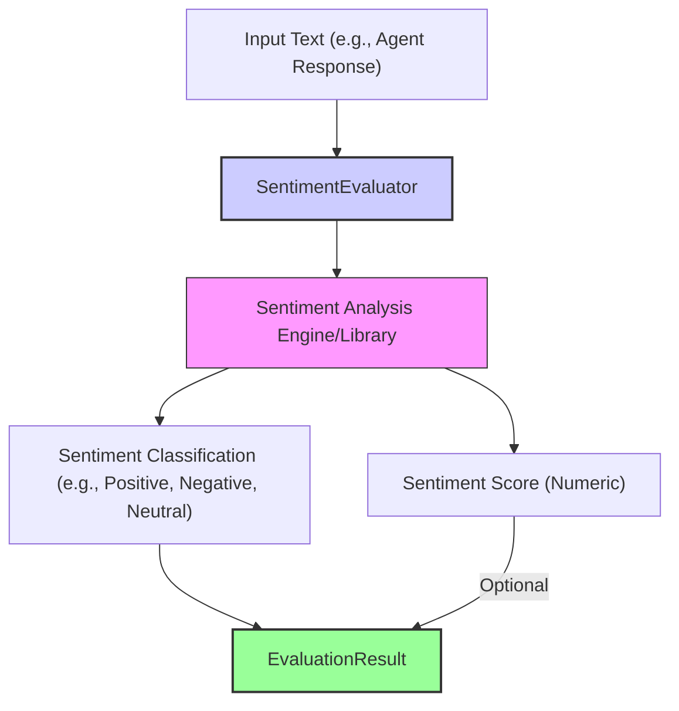

# Sentiment Evaluator

The `SentimentEvaluator` analyzes the emotional tone of a given text, typically classifying it as positive, negative, or neutral. It can also provide a numerical score indicating the intensity of the sentiment. This is useful for ensuring agents maintain an appropriate tone or for flagging overly negative or positive responses. Experience shows this is a good first-pass check for agent demeanor.

It usually relies on pre-trained sentiment analysis models or libraries (like VADER, AFINN, or others).

## Core Workflow

The `SentimentEvaluator` processes an input text (e.g., an agent's response) using an underlying sentiment analysis engine or library. This analysis typically yields a categorical classification (like positive, negative, or neutral) and/or a numerical sentiment score. These findings are then reported in the `EvaluationResult`.



## Use Cases

The `SentimentEvaluator` is helpful for:

*   Monitoring the overall tone of agent responses (e.g., ensuring helpfulness, avoiding aggression).
*   Flagging customer interactions that may require human review due to strong negative sentiment.
*   Analyzing user feedback for emotional content.
*   Ensuring marketing copy or agent personas align with desired sentiment profiles.

## Configuration

Configuration might involve:

*   `sourceField`: Specifies which field from `EvaluationInput` to analyze (defaults to 'response').
*   Potentially, selecting a specific sentiment analysis model or library if multiple are supported, or passing parameters to the underlying library.

```typescript
// Example configuration structure (to be detailed)
// {
//   type: 'Sentiment',
//   sourceField: 'response.text',
//   // modelConfig: { /* optional: specify model or library params */ }
// }
```

## Output (`EvaluationResult`)

The `SentimentEvaluator` produces an `EvaluationResult`:

*   **`criterionName`**: Reflects the sentiment check (e.g., "ResponseSentiment").
*   **`score`**: Can be a categorical label (e.g., "positive", "negative", "neutral") or a numeric score (e.g., a value from -1 to 1).
*   **`reasoning`**: Might include the raw numeric score if the main score is categorical, or a list of words that most influenced the sentiment.
*   **`evaluatorType`**: `'Sentiment'`.
*   **`error`**: For issues accessing the text or problems with the sentiment analysis engine.

This evaluator provides a quick way to gauge the emotional tone of text, an important factor in human-agent interaction. 