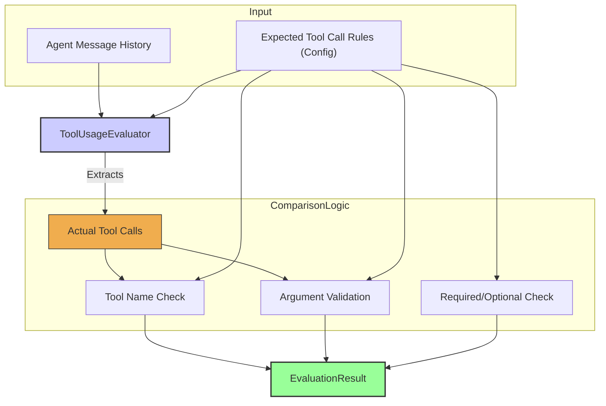

# Tool Usage Evaluator

The `ToolUsageEvaluator` is designed to assess the correctness of an agent's tool invocations. In modern agent systems, the ability to reliably and accurately use tools is paramount. This evaluator checks if the agent called the right tools, with the right arguments, and in the expected manner. Deploying agents has shown that tool use is a frequent point of failure, making robust evaluation in this area critical.

It typically examines the `messageHistory` within the `EvaluationInput` to find tool call messages and compares them against predefined expectations.

## Core Workflow

The `ToolUsageEvaluator` processes the agent's message history (from `EvaluationInput`) to identify any tool calls made by the agent. These actual tool calls are then compared against a set of predefined 'Expected Tool Call Rules' provided in the evaluator's configuration. This comparison typically involves validating the tool name, checking the arguments passed to the tool, and ensuring adherence to rules about whether a tool call was required or optional. The outcomes of these checks form the `EvaluationResult` objects.



## Use Cases

The `ToolUsageEvaluator` is essential for:

*   Verifying that an agent calls a specific required tool.
*   Ensuring that all arguments passed to a tool call are valid (e.g., correct type, within expected ranges, matching a pattern).
*   Checking if a tool was called when it shouldn't have been.
*   Validating the sequence or number of tool calls.
*   Confirming that data returned by a tool is processed correctly by the agent in subsequent steps (though this might sometimes require a more complex evaluator).

## Configuration

Configuration involves defining the expectations for tool usage:

*   A list of expected tool calls, including the tool `name`.
*   For each expected tool call, validation rules for its `arguments`.
*   Rules for whether a tool call is `required` or `optional`.
*   Potentially, checks for the `order` or `frequency` of calls.

```typescript
// Example configuration
{
  type: 'ToolUsage',
  criterionName: 'CorrectToolUse',
  expectedToolCalls: [
    {
      toolName: 'search_knowledge_base',
      required: true,
      argumentChecks: {
        'query': (value: any) => typeof value === 'string' && value.length > 0,
        'max_results': (value: any) => typeof value === 'number' && value > 0 && value <= 10
      }
    },
    {
      toolName: 'send_email',
      required: false,
      argumentChecks: {
        'recipient': (value: any) => typeof value === 'string' && /^[^\s@]+@[^\s@]+\.[^\s@]+$/.test(value),
        'subject': (value: any) => typeof value === 'string' && value.length > 0
      }
    }
  ]
}
```

## Output (`EvaluationResult`)

The `ToolUsageEvaluator` produces `EvaluationResult` objects for criteria related to tool usage:

*   **`criterionName`**: Could be specific to a tool (e.g., "CorrectlyCalled_example_tool") or more general ("ValidToolArguments").
*   **`score`**: Typically boolean (`true` if the check passes, `false` otherwise) or a numeric score representing the degree of correctness.
*   **`reasoning`**: Details about why a tool usage check passed or failed (e.g., "Tool 'example_tool' not called", "Argument 'arg2' for tool 'example_tool' was not positive").
*   **`evaluatorType`**: `'ToolUsage'`.
*   **`error`**: For unexpected issues during evaluation, not for failed tool usage checks themselves.

Correct tool usage is a cornerstone of effective agent behavior, and this evaluator provides the means to systematically verify it. 