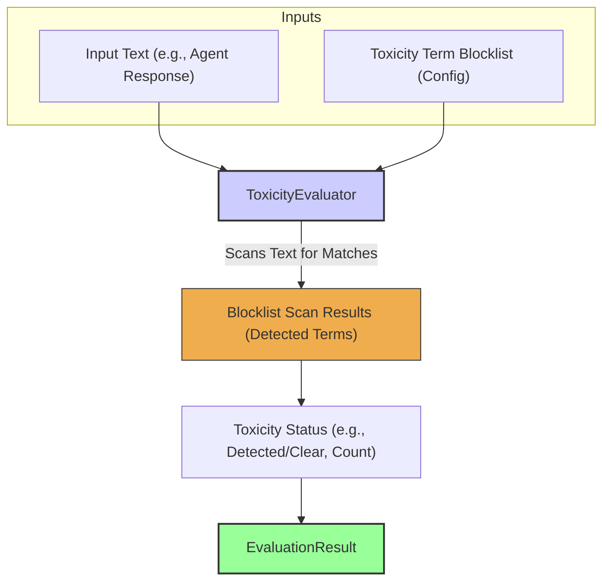

# Toxicity Evaluator

The `ToxicityEvaluator` scans text for the presence of predefined toxic terms, offensive language, or other undesirable content based on a blocklist. This is a fundamental safety check to help ensure agents do not produce harmful or inappropriate responses. Experience underscores that even basic blocklist checks are a necessary first line of defense for responsible agent deployment.

## Core Workflow

The `ToxicityEvaluator` compares an input text (e.g., an agent's response) against a configured blocklist of toxic terms or patterns. It scans the text for any matches, and based on these findings, determines a toxicity status (e.g., whether toxic terms were detected, or a count of detected terms). This status forms the basis of the `EvaluationResult`.



## Use Cases

The `ToxicityEvaluator` is primarily used for:

*   Flagging agent responses that contain offensive or inappropriate language.
*   Ensuring compliance with content policies that forbid certain terms.
*   Basic safety screening of user inputs if the agent is designed to process them in sensitive ways (though this is less common for the evaluator's direct use).

## Configuration

Configuration typically involves defining the list of toxic terms and matching behavior:

*   `blockList`: An array of strings or regular expressions representing toxic terms/patterns.
*   `caseSensitive`: Boolean, defaults to `false`.
*   `matchWholeWord`: Boolean, to avoid flagging substrings within non-toxic words.
*   `sourceField`: Specifies which field from `EvaluationInput` to check (defaults to 'response').

```typescript
// Example configuration structure (to be detailed)
// {
//   type: 'Toxicity',
//   blockList: ['offensive_word1', 'another_bad_phrase', '^regex_pattern_for_toxicity$'],
//   caseSensitive: false,
//   matchWholeWord: true,
//   sourceField: 'response'
// }
```

## Output (`EvaluationResult`)

The `ToxicityEvaluator` produces an `EvaluationResult`:

*   **`criterionName`**: Reflects the toxicity check (e.g., "IsNonToxic").
*   **`score`**: Typically boolean (`true` if no toxic terms found, `false` if toxic terms are present) or a count of toxic terms found.
*   **`reasoning`**: Details about which toxic terms were found, if any.
*   **`evaluatorType`**: `'Toxicity'`.
*   **`error`**: For configuration errors or issues accessing the text.

This provides a direct mechanism for identifying and flagging potentially harmful content based on a defined set of rules. 