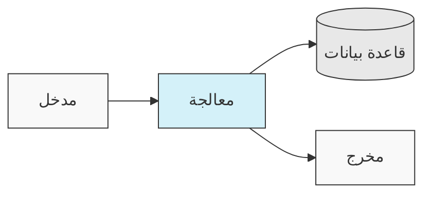
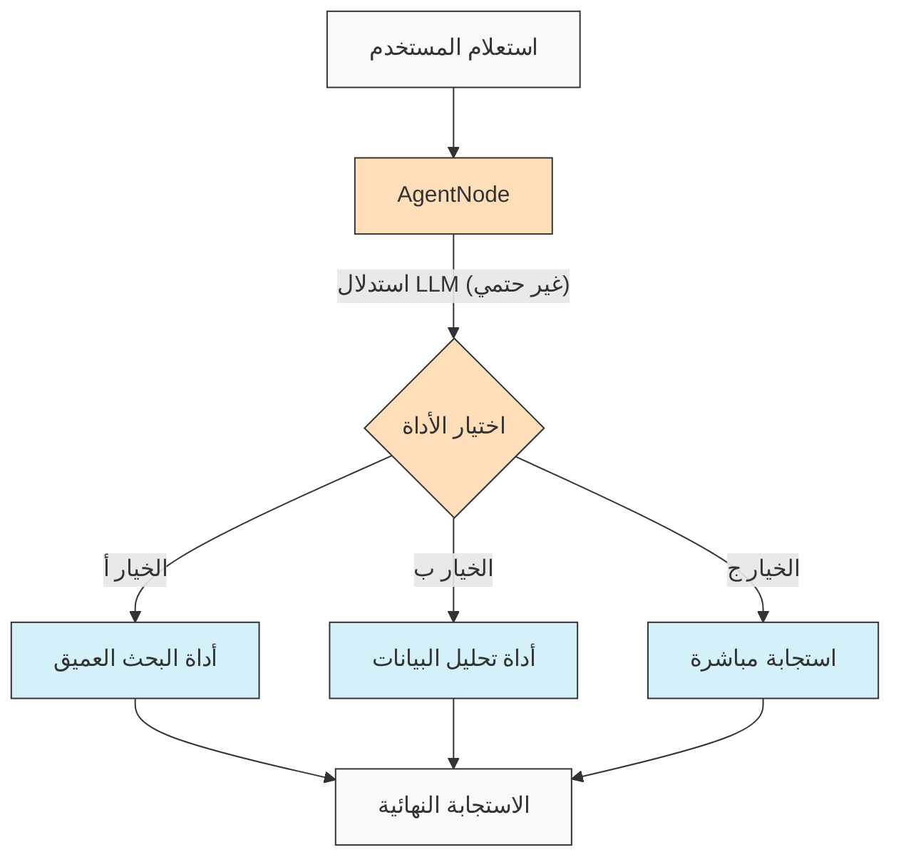
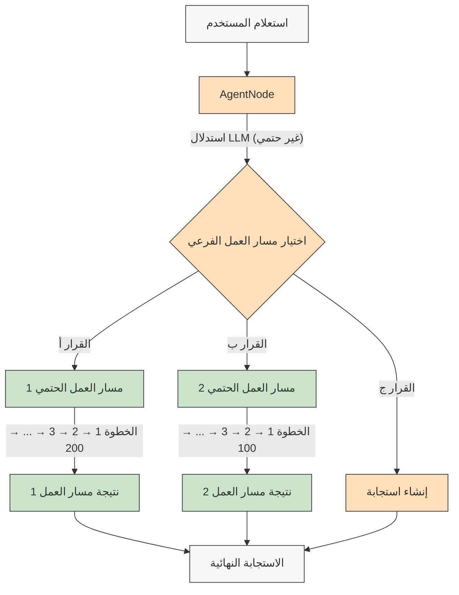

<p align="center">
  
</p>

# AgentDock: ابنِ أي مشروع باستخدام وكلاء الذكاء الاصطناعي

[](https://github.com/agentdock/agentdock/stargazers)
[](https://opensource.org/licenses/MIT)
[](https://github.com/AgentDock/AgentDock/releases)
[](https://hub.agentdock.ai/docs)
[](https://discord.gg/fDYFFmwuRA)
[](https://agentdock.ai)
[](https://x.com/agentdock)

## 🌐 ترجمات README

[Français](../french/README.md) • [日本語](../japanese/README.md) • [한국어](../korean/README.md) • [中文](../chinese/README.md) • [Español](../spanish/README.md) • [Italiano](../italian/README.md) • [Nederlands](../dutch/README.md) • [Deutsch](../deutsch/README.md) • [Polski](../polish/README.md) • [Türkçe](../turkish/README.md) • [Українська](../ukrainian/README.md) • [Ελληνικά](../greek/README.md) • [Русский](../russian/README.md) • [العربية](./README.md)

---

AgentDock هو إطار عمل لبناء وكلاء ذكاء اصطناعي متطورين يقومون بمهام معقدة مع **حتمية قابلة للتكوين**. يتكون من مكونين رئيسيين:

1.  **AgentDock Core**: إطار عمل مفتوح المصدر، يركز على الواجهة الخلفية، لبناء ونشر وكلاء الذكاء الاصطناعي. تم تصميمه ليكون *غير مرتبط بإطار عمل محدد* و*غير مرتبط بمزود محدد*، مما يمنحك تحكمًا كاملاً في تنفيذ وكيلك.

2.  **Open Source Client**: تطبيق Next.js كامل الميزات يعمل كتطبيق مرجعي ومستهلك لإطار عمل AgentDock Core. يمكنك رؤيته قيد التشغيل على [https://hub.agentdock.ai](https://hub.agentdock.ai)

تم بناء AgentDock باستخدام TypeScript، وهو يركز على *البساطة*، *قابلية التوسع*، و***الحتمية القابلة للتكوين***، مما يجعله مثاليًا لبناء أنظمة ذكاء اصطناعي موثوقة ويمكن التنبؤ بها يمكنها العمل بأقل قدر من الإشراف.

## 🧠 مبادئ التصميم

يعتمد AgentDock على هذه المبادئ الأساسية:

-   **البساطة أولاً**: الحد الأدنى من التعليمات البرمجية المطلوبة لإنشاء وكلاء وظيفيين
-   **بنية قائمة على العقد (Nodes)**: يتم تنفيذ جميع القدرات كعقد
-   **الأدوات كعقد متخصصة**: توسع الأدوات نظام العقد لقدرات الوكيل
-   **الحتمية القابلة للتكوين**: التحكم في قابلية التنبؤ بسلوك الوكيل
-   **سلامة الأنواع (Type Safety)**: أنواع TypeScript كاملة في جميع الأنحاء

### الحتمية القابلة للتكوين

***الحتمية القابلة للتكوين*** هي حجر الزاوية في فلسفة تصميم AgentDock، مما يتيح لك الموازنة بين القدرات الإبداعية للذكاء الاصطناعي وسلوك النظام المتوقع:

-   `AgentNode` غير حتمية بطبيعتها حيث يمكن لنماذج اللغة الكبيرة (LLMs) إنشاء استجابات مختلفة في كل مرة
-   يمكن جعل مسارات العمل (Workflows) أكثر حتمية من خلال *مسارات تنفيذ أدوات محددة*
-   يمكن للمطورين **التحكم في مستوى الحتمية** عن طريق تكوين أجزاء النظام التي تستخدم استدلال LLM
-   حتى مع مكونات LLM، يظل سلوك النظام العام **متوقعًا** من خلال تفاعلات الأدوات المهيكلة
-   يتيح هذا النهج المتوازن كلاً من *الإبداع* و**الموثوقية** في تطبيقات الذكاء الاصطناعي الخاصة بك

#### مسارات العمل الحتمية

يدعم AgentDock بشكل كامل مسارات العمل الحتمية التي تعرفها من بناة مسارات العمل النموذجية. تتوفر جميع مسارات التنفيذ المتوقعة والنتائج الموثوقة التي تتوقعها، مع أو بدون استدلال LLM:



#### سلوك الوكيل غير الحتمي

مع AgentDock، يمكنك أيضًا الاستفادة من `AgentNode` مع LLMs عندما تحتاج إلى مزيد من القدرة على التكيف. يمكن أن تختلف المخرجات الإبداعية بناءً على احتياجاتك، مع الحفاظ على أنماط التفاعل المهيكلة:



#### وكلاء غير حتميين مع مسارات عمل فرعية حتمية

يقدم لك AgentDock ***أفضل ما في العالمين*** من خلال الجمع بين ذكاء الوكيل غير الحتمي وتنفيذ مسار العمل الحتمي:



يتيح هذا النهج استدعاء مسارات عمل معقدة متعددة الخطوات (قد تتضمن مئات الخطوات الحتمية المنفذة داخل الأدوات أو كتسلسلات من العقد المتصلة) بواسطة قرارات وكيل ذكية. يتم تنفيذ كل مسار عمل بشكل متوقع على الرغم من تشغيله بواسطة استدلال وكيل غير حتمي.

لمسارات عمل وكلاء الذكاء الاصطناعي الأكثر تقدمًا وخطوط أنابيب المعالجة متعددة المراحل، نقوم ببناء [AgentDock Pro](../../agentdock-pro.md) - منصة قوية لإنشاء وتصور وتنفيذ أنظمة وكلاء معقدة.

#### باختصار: الحتمية القابلة للتكوين

فكر في الأمر مثل القيادة. أحيانًا تحتاج إلى إبداع الذكاء الاصطناعي (مثل التنقل في شوارع المدينة - غير حتمي)، وأحيانًا تحتاج إلى عمليات موثوقة خطوة بخطوة (مثل اتباع لافتات الطرق السريعة - حتمي). يتيح لك AgentDock بناء أنظمة تستخدم *كليهما*، واختيار النهج الصحيح لكل جزء من المهمة. تحصل على ذكاء الذكاء الاصطناعي *و* نتائج متوقعة عند الحاجة.

## 🏗️ البنية المعمارية الأساسية

يعتمد إطار العمل على نظام قوي ونمطي قائم على العقد (Nodes)، والذي يعمل كأساس لجميع وظائف الوكيل. تستخدم هذه البنية أنواعًا مميزة من العقد كوحدات بناء:

-   **`BaseNode`**: الفئة الأساسية التي تحدد الواجهة والقدرات الأساسية لجميع العقد.
-   **`AgentNode`**: عقدة أساسية متخصصة تنسق تفاعلات LLM واستخدام الأدوات ومنطق الوكيل.
-   **الأدوات والعقد المخصصة**: ينفذ المطورون قدرات الوكيل والمنطق المخصص كعقد توسع `BaseNode`.

تتفاعل هذه العقد من خلال سجلات مُدارة ويمكن توصيلها (الاستفادة من منافذ البنية الأساسية وحافلة رسائل محتملة) لتمكين سلوكيات ومسارات عمل وكلاء معقدة وقابلة للتكوين وربما حتمية.

للحصول على شرح مفصل لمكونات وقدرات نظام العقد، راجع [وثائق نظام العقد](../../nodes/README.md).

## 🚀 البدء

للحصول على دليل شامل، راجع [دليل البدء](../../getting-started.md).

### المتطلبات

*   Node.js ≥ 20.11.0 (LTS)
*   pnpm ≥ 9.15.0 (مطلوب)
*   مفاتيح API لموفري LLM (Anthropic، OpenAI، إلخ)

### التثبيت

1.  **استنساخ المستودع**:

    ```bash
    git clone https://github.com/AgentDock/AgentDock.git
    cd AgentDock
    ```

2.  **تثبيت pnpm**:

    ```bash
    corepack enable
    corepack prepare pnpm@latest --activate
    ```

3.  **تثبيت التبعيات**:

    ```bash
    pnpm install
    ```

    لإعادة تثبيت نظيفة (عندما تحتاج إلى إعادة البناء من البداية):

    ```bash
    pnpm run clean-install
    ```

    يزيل هذا البرنامج النصي جميع `node_modules` وملفات القفل ويعيد تثبيت التبعيات بشكل صحيح.

4.  **تكوين البيئة**:

    قم بإنشاء ملف بيئة (`.env` أو `.env.local`) بناءً على ملف `.env.example` المقدم:

    ```bash
    # الخيار 1: إنشاء .env.local
    cp .env.example .env.local

    # الخيار 2: إنشاء .env
    cp .env.example .env
    ```

    ثم أضف مفاتيح API الخاصة بك إلى ملف البيئة.

5.  **بدء خادم التطوير**:

    ```bash
    pnpm dev
    ```

### القدرات المتقدمة

| القدرة                 | الوصف                                                                                       | الوثائق                                                                           |
| :---------------------- | :------------------------------------------------------------------------------------------ | :---------------------------------------------------------------------------------- |
| **إدارة الجلسات**      | إدارة حالة معزولة وعالية الأداء للمحادثات                                                 | [وثائق الجلسات](../../architecture/sessions/README.md)                      |
| **إطار عمل التنسيق**   | التحكم في سلوك الوكيل وتوافر الأدوات بناءً على السياق                                      | [وثائق التنسيق](../../architecture/orchestration/README.md)                 |
| **تجريد التخزين**     | نظام تخزين مرن مع موفرين قابلين للتوصيل لـ KV و Vector والتخزين الآمن                    | [وثائق التخزين](../../storage/README.md)                                    |

يتطور نظام التخزين حاليًا مع تخزين المفتاح والقيمة (موفرو Memory، Redis، Vercel KV) والتخزين الآمن من جانب العميل، بينما يتم تطوير تخزين المتجهات والواجهات الخلفية الإضافية.

## 📕 الوثائق

تتوفر وثائق إطار عمل AgentDock على [hub.agentdock.ai/docs](https://hub.agentdock.ai/docs) وفي مجلد `/docs/` في هذا المستودع. تتضمن الوثائق:

-   أدلة البدء
-   مراجع API
-   دروس إنشاء العقد
-   أمثلة التكامل

## 📂 بنية المستودع

يحتوي هذا المستودع على:

1.  **AgentDock Core**: إطار العمل الأساسي الموجود في `agentdock-core/`
2.  **Open Source Client**: تطبيق مرجعي كامل الميزات مبني باستخدام Next.js، يعمل كمستهلك لإطار عمل AgentDock Core.
3.  **وكلاء مثال**: تكوينات وكلاء جاهزة للاستخدام في دليل `agents/`

يمكنك استخدام AgentDock Core بشكل مستقل في تطبيقاتك الخاصة، أو استخدام هذا المستودع كنقطة انطلاق لبناء تطبيقاتك الخاصة التي تعمل بالوكلاء.

## 📝 قوالب الوكلاء

يتضمن AgentDock العديد من قوالب الوكلاء المعدة مسبقًا. استكشفها في دليل `agents/` أو اقرأ [وثائق قوالب الوكلاء](../../agent-templates.md) للحصول على تفاصيل التكوين.

## 🔧 تطبيقات مثال

توضح تطبيقات المثال حالات استخدام متخصصة ووظائف متقدمة:

| التطبيق                       | الوصف                                                                                             | الحالة       |
| :----------------------------- | :------------------------------------------------------------------------------------------------- | :----------- |
| **الوكيل المنسق**            | وكيل مثال يستخدم التنسيق لتكييف السلوك بناءً على السياق                                           | متوفر       |
| **المفكر المعرفي**           | يعالج المشكلات المعقدة باستخدام التفكير المنظم والأدوات المعرفية                                | متوفر       |
| **مخطط الوكلاء**             | وكيل متخصص لتصميم وتنفيذ وكلاء ذكاء اصطناعي آخرين                                                | متوفر       |
| [**Code Playground**](../../roadmap/code-playground.md) | إنشاء وتنفيذ تعليمات برمجية في بيئة معزولة مع قدرات تصور غنية                               | مخطط له     |
| [**وكيل الذكاء الاصطناعي العام**](../../roadmap/generalist-agent.md) | وكيل يشبه Manus يمكنه استخدام المتصفح وتنفيذ المهام المعقدة                                  | مخطط له     |

## 🔐 تفاصيل تكوين البيئة

يتطلب AgentDock Open Source Client مفاتيح API لموفري LLM ليعمل. يتم تكوينها في ملف بيئة (`.env` أو `.env.local`) تقوم بإنشائه بناءً على ملف `.env.example` المقدم.

### مفاتيح API لموفري LLM

أضف مفاتيح API لموفري LLM (مطلوب واحد على الأقل):

```bash
# مفاتيح API لموفري LLM - مطلوب واحد على الأقل
ANTHROPIC_API_KEY=sk-ant-xxxxxxx  # مفتاح API Anthropic
OPENAI_API_KEY=sk-xxxxxxx         # مفتاح API OpenAI
GEMINI_API_KEY=xxxxxxx            # مفتاح API Google Gemini
DEEPSEEK_API_KEY=xxxxxxx          # مفتاح API DeepSeek
GROQ_API_KEY=xxxxxxx              # مفتاح API Groq
```

### تحديد مفتاح API

يتبع AgentDock Open Source Client ترتيب أولوية عند تحديد مفتاح API الذي يجب استخدامه:

1.  **مفتاح API مخصص لكل وكيل** (يتم تعيينه من خلال إعدادات الوكيل في واجهة المستخدم)
2.  **مفتاح API للإعدادات العامة** (يتم تعيينه من خلال صفحة الإعدادات في واجهة المستخدم)
3.  **متغير البيئة** (من `.env.local` أو منصة النشر)

### مفاتيح API خاصة بالأدوات

تتطلب بعض الأدوات أيضًا مفاتيح API الخاصة بها:

```bash
# مفاتيح API خاصة بالأدوات
SERPER_API_KEY=                  # مطلوب لوظيفة البحث
FIRECRAWL_API_KEY=               # مطلوب لتصفح الويب بشكل أعمق
```

لمزيد من التفاصيل حول تكوين البيئة، راجع التنفيذ في [`src/types/env.ts`](../../../../src/types/env.ts).

### استخدام مفاتيح API الخاصة بك (BYOK)

يتبع AgentDock نموذج BYOK (أحضر مفتاحك الخاص):

1.  أضف مفاتيح API الخاصة بك في صفحة إعدادات التطبيق
2.  بدلاً من ذلك، قم بتوفير المفاتيح عبر رؤوس الطلب للاستخدام المباشر لواجهة برمجة التطبيقات
3.  يتم تخزين المفاتيح بشكل آمن باستخدام نظام التشفير المدمج
4.  لا تتم مشاركة أو تخزين أي مفاتيح API على خوادمنا

## 📦 مدير الحزم

يتطلب هذا المشروع استخدام `pnpm` لإدارة التبعيات بشكل متسق. `npm` و `yarn` غير مدعومين.

## 💡 ما يمكنك بناؤه

1.  **التطبيقات التي تعمل بالذكاء الاصطناعي**
    -   روبوتات محادثة مخصصة مع أي واجهة أمامية
    -   مساعدو الذكاء الاصطناعي لسطر الأوامر
    -   خطوط أنابيب معالجة البيانات الآلية
    -   تكاملات خدمات الواجهة الخلفية

2.  **قدرات التكامل**
    -   أي مزود ذكاء اصطناعي (OpenAI، Anthropic، إلخ)
    -   أي إطار عمل للواجهة الأمامية
    -   أي خدمة واجهة خلفية
    -   مصادر بيانات وواجهات برمجة تطبيقات مخصصة

3.  **أنظمة الأتمتة**
    -   مسارات عمل معالجة البيانات
    -   خطوط أنابيب تحليل المستندات
    -   أنظمة التقارير الآلية
    -   وكلاء أتمتة المهام

## الميزات الرئيسية

| الميزة                         | الوصف                                                                                              |
| :----------------------------- | :------------------------------------------------------------------------------------------------- |
| 🔌 **غير مرتبط بإطار عمل (Node.js Backend)** | تتكامل المكتبة الأساسية مع مكدسات الواجهة الخلفية لـ Node.js.                                 |
| 🧩 **تصميم نمطي**              | بناء أنظمة معقدة من عقد بسيطة                                                                     |
| 🛠️ **قابل للتوسيع**            | إنشاء عقد مخصصة لأي وظيفة                                                                        |
| 🔒 **آمن**                     | ميزات أمان مدمجة لمفاتيح API والبيانات                                                            |
| 🔑 **BYOK**                    | استخدم *مفاتيح API الخاصة بك* لموفري LLM                                                          |
| 📦 **مكتفي ذاتيًا**             | يحتوي إطار العمل الأساسي على الحد الأدنى من التبعيات                                              |
| ⚙️ **استدعاءات أدوات متسلسلة متعددة الخطوات** | دعم *لسلاسل التفكير المعقدة*                                                                  |
| 📊 **Structured Logging** | رؤى مفصلة حول تنفيذ الوكيل                                                                        |
| 🛡️ **Robust Error Handling**| سلوك متوقع وتصحيح أخطاء مبسط                                                                       |
| 📝 **TypeScript أولاً**        | سلامة الأنواع وتجربة مطور محسنة                                                                    |
| 🌐 **Open Source Client**      | يتضمن تطبيق مرجعي كامل الميزات لـ Next.js                                                       |
| 🔄 **التنسيق**                 | *تحكم ديناميكي* في سلوك الوكيل بناءً على السياق                                                 |
| 💾 **إدارة الجلسات**           | حالة معزولة للمحادثات المتزامنة                                                                    |
| 🎮 **الحتمية القابلة للتكوين** | وازن بين إبداع الذكاء الاصطناعي والقدرة على التنبؤ من خلال منطق العقدة/مسار العمل.                  |

## 🧰 المكونات

تعتمد البنية النمطية لـ AgentDock على هذه المكونات الرئيسية:

*   **BaseNode**: الأساس لجميع العقد في النظام
*   **AgentNode**: التجريد الرئيسي لوظائف الوكيل
*   **الأدوات والعقد المخصصة**: قدرات قابلة للاستدعاء ومنطق مخصص يتم تنفيذه كعقد.
*   **سجل العقد**: يدير تسجيل واسترجاع جميع أنواع العقد
*   **سجل الأدوات**: يدير توافر الأدوات للوكلاء
*   **CoreLLM**: واجهة موحدة للتفاعل مع موفري LLM
*   **سجل الموفرين**: يدير تكوينات موفري LLM
*   **معالجة الأخطاء**: نظام لإدارة الأخطاء وضمان سلوك متوقع
*   **التسجيل (Logging)**: نظام تسجيل منظم للمراقبة وتصحيح الأخطاء
*   **التنسيق**: يتحكم في توافر الأدوات والسلوك بناءً على سياق المحادثة
*   **الجلسات**: تدير عزل الحالة بين المحادثات المتزامنة

للحصول على وثائق فنية مفصلة حول هذه المكونات، راجع [نظرة عامة على البنية](../../architecture/README.md).

## 🗺️ خارطة الطريق

فيما يلي خارطة طريق التطوير الخاصة بنا لـ AgentDock. ترتبط معظم التحسينات المدرجة هنا بإطار عمل AgentDock الأساسي (`agentdock-core`)، والذي يتم تطويره حاليًا محليًا وسيتم إصداره كحزمة NPM ذات إصدار عند الوصول إلى إصدار مستقر. قد تتضمن بعض عناصر خارطة الطريق أيضًا تحسينات على تطبيق العميل مفتوح المصدر.

| الميزة                                                                      | الوصف                                                                                               | الفئة           |
| :-------------------------------------------------------------------------- | :-------------------------------------------------------------------------------------------------- | :-------------- |
| [**طبقة تجريد التخزين**](../../roadmap/storage-abstraction.md)             | نظام تخزين مرن مع موفرين قابلين للتوصيل                                                              | **قيد التقدم**  |
| [**أنظمة الذاكرة المتقدمة**](../../roadmap/advanced-memory.md)              | إدارة السياق طويلة الأجل                                                                             | **قيد التقدم**  |
| [**تكامل تخزين المتجهات**](../../roadmap/vector-storage.md)               | استرجاع قائم على التضمين للمستندات والذاكرة                                                          | **قيد التقدم**  |
| [**إطار تقييم وكلاء الذكاء الاصطناعي**](../../roadmap/evaluation-framework.md) | إطار عمل اختبار وتقييم شامل                                                                         | **قيد التقدم**  |
| [**تكامل المنصات**](../../roadmap/platform-integration.md)             | دعم Telegram و WhatsApp ومنصات المراسلة الأخرى                                                     | **مخطط له**     |
| [**تعاون متعدد الوكلاء**](../../roadmap/multi-agent-collaboration.md)      | السماح للوكلاء بالعمل معًا                                                                          | **مخطط له**     |
| [**تكامل بروتوكول سياق النموذج (MCP)**](../../roadmap/mcp-integration.md) | دعم اكتشاف واستخدام الأدوات الخارجية عبر MCP                                                       | **مخطط له**     |
| [**وكلاء الذكاء الاصطناعي الصوتيون**](../../roadmap/voice-agents.md)          | وكلاء ذكاء اصطناعي يستخدمون واجهات صوتية وأرقام هواتف عبر AgentNode                              | **مخطط له**     |
| [**القياس عن بعد والتتبع**](../../roadmap/telemetry.md)                   | تسجيل متقدم وتتبع الأداء                                                                          | **مخطط له**     |
| [**AgentDock Pro**](../../agentdock-pro.md)                           | منصة سحابية كاملة للمؤسسات لتوسيع نطاق وكلاء الذكاء الاصطناعي ومسارات العمل                          | **سحابي**       |
| [**منشئ وكلاء الذكاء الاصطناعي باللغة الطبيعية**](../../roadmap/nl-agent-builder.md) | منشئ مرئي + بناء وكلاء ومسارات عمل باللغة الطبيعية                                                  | **سحابي**       |
| [**سوق الوكلاء**](../../roadmap/agent-marketplace.md)                 | قوالب وكلاء قابلة للتسييل                                                                          | **سحابي**       |

## 👥 المساهمة

نرحب بالمساهمات في AgentDock! راجع [CONTRIBUTING.md](../../../CONTRIBUTING.md) للحصول على إرشادات مفصلة للمساهمة.

## 📜 الترخيص

تم إصدار AgentDock بموجب [ترخيص MIT](../../../LICENSE).

## ✨ ابنِ أي شيء!

يوفر AgentDock الأساس لبناء أي تطبيق أو أتمتة تعمل بالذكاء الاصطناعي يمكنك تخيلها تقريبًا. نشجعك على استكشاف إطار العمل، وبناء وكلاء مبتكرين، والمساهمة مرة أخرى في المجتمع. لنبني مستقبل تفاعل الذكاء الاصطناعي معًا!

---
[العودة إلى فهرس الترجمات](../README.md) 