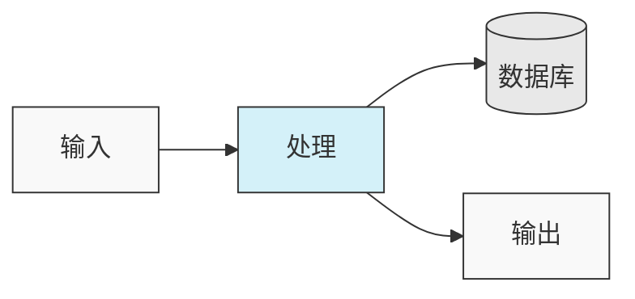
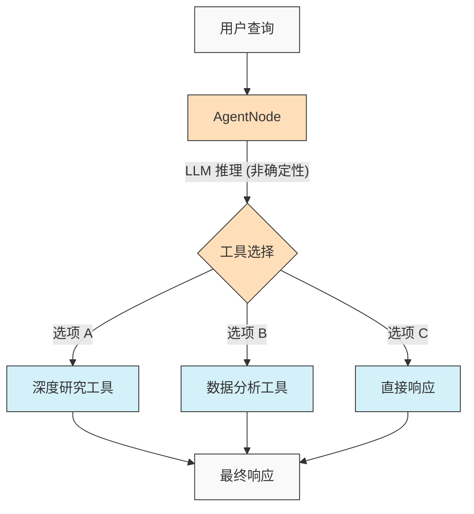
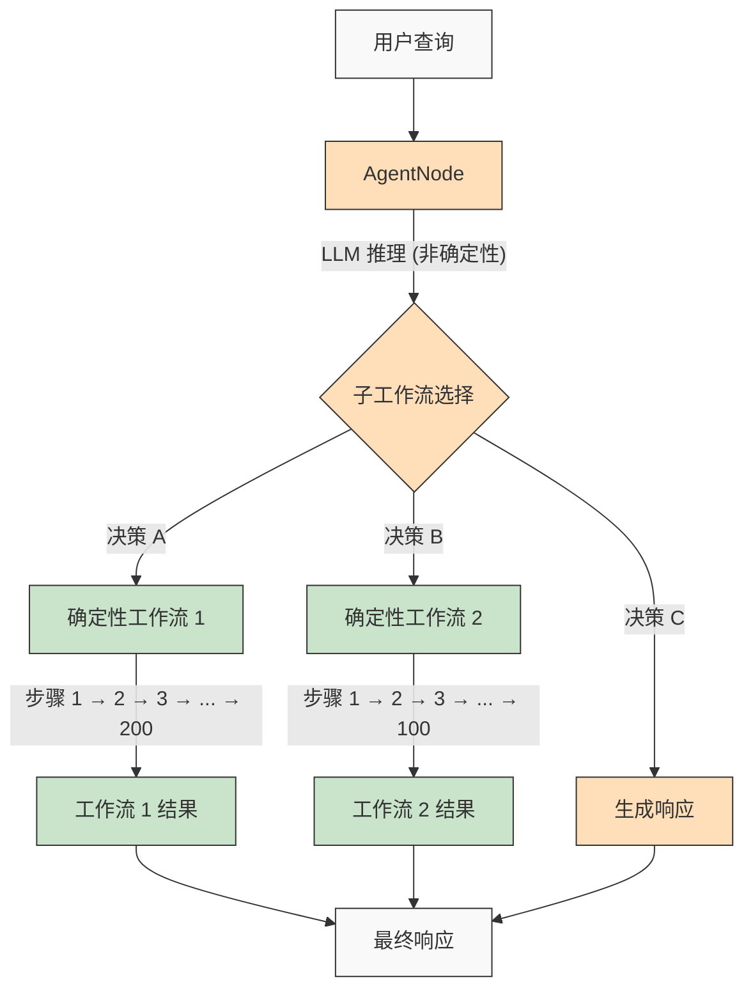

<p align="center">
  
</p>

## 🌐 README 翻译

[Français](/docs/i18n/french/README.md) • [日本語](/docs/i18n/japanese/README.md) • [한국어](/docs/i18n/korean/README.md) • [中文](/docs/i18n/chinese/README.md) • [Español](/docs/i18n/spanish/README.md) • [Italiano](/docs/i18n/italian/README.md) • [Nederlands](/docs/i18n/dutch/README.md) • [Deutsch](/docs/i18n/deutsch/README.md) • [Polski](/docs/i18n/polish/README.md) • [Türkçe](/docs/i18n/turkish/README.md) • [Українська](/docs/i18n/ukrainian/README.md) • [Ελληνικά](/docs/i18n/greek/README.md) • [Русский](/docs/i18n/russian/README.md) • [العربية](/docs/i18n/arabic/README.md)

# AgentDock: 用 AI Agent 构建无限可能

AgentDock 是一个用于构建复杂 AI Agent 的框架，这些 Agent 通过**可配置的确定性**来完成复杂任务。它由两个主要组件构成：

1.  **AgentDock Core**：一个开源的、后端优先的框架，用于构建和部署 AI Agent。它被设计为*框架无关*和*提供商无关*，让您完全控制 Agent 的实现。

2.  **开源客户端**：一个完整的 Next.js 应用程序，作为 AgentDock Core 框架的参考实现和消费者。您可以在 [https://hub.agentdock.ai](https://hub.agentdock.ai) 看到它的实际运行情况。

AgentDock 使用 TypeScript 构建，强调*简单性*、*可扩展性*和***可配置的确定性***，使其成为构建可靠且可预测的 AI 系统的理想选择，这些系统可以在最少的监督下运行。

## 🧠 设计原则

AgentDock 建立在以下核心原则之上：

-   **简单优先**：创建功能性 Agent 所需的最少代码
-   **基于节点的架构**：所有功能都实现为节点
-   **作为专用节点的工具**：工具扩展了节点系统以实现 Agent 功能
-   **可配置的确定性**：控制 Agent 行为的可预测性
-   **类型安全**：贯穿始终的全面 TypeScript 类型

### 可配置的确定性

***可配置的确定性***是 AgentDock 设计理念的基石，使您能够在创造性的 AI 能力和可预测的系统行为之间取得平衡：

-   由于 LLM 每次可能生成不同的响应，AgentNode 本质上是非确定性的
-   可以通过*定义的工具执行路径*使工作流更具确定性
-   开发人员可以通过配置系统的哪些部分使用 LLM 推理来**控制确定性的级别**
-   即使有 LLM 组件，通过结构化的工具交互，整个系统的行为仍然**可预测**
-   这种平衡的方法使您的 AI 应用程序兼具*创造性*和**可靠性**

#### 确定性工作流

AgentDock 完全支持您在典型工作流构建器中熟悉的确定性工作流。无论是否有 LLM 推理，您期望的所有可预测执行路径和可靠结果都可用：



#### 非确定性 Agent 行为

使用 AgentDock，当您需要更高的适应性时，也可以利用带有 LLM 的 AgentNode。创造性的输出可能会根据您的需求而变化，同时保持结构化的交互模式：



#### 具有确定性子工作流的非确定性 Agent

AgentDock 通过将非确定性 Agent 智能与确定性工作流执行相结合，为您提供了***两全其美***的方案：



这种方法使得复杂的多步骤工作流（可能涉及在工具内或作为连接的节点序列实现的数百个确定性步骤）能够由智能 Agent 决策调用。尽管由非确定性 Agent 推理触发，每个工作流仍能可预测地执行。

对于更高级的 AI Agent 工作流和多阶段处理流水线，我们正在构建 [AgentDock Pro](../../docs/agentdock-pro.md) - 一个用于创建、可视化和运行复杂 Agent 系统的强大平台。

#### 关于可配置确定性的简而言之

把它想象成开车。有时您需要 AI 的创造力（比如在城市街道中导航 - 非确定性），有时您需要可靠的、按部就班的流程（比如遵循高速公路标志 - 确定性）。AgentDock 让您能够构建同时兼顾*两方面优势*的系统，为任务的每个部分选择正确的方法。您既能获得 AI 的智能，又能在需要时获得可预测的结果。

## 🏗️ 核心架构

该框架围绕一个强大的、模块化的基于节点的系统构建，作为所有 Agent 功能的基础。该架构使用不同的节点类型作为构建块：

-   **`BaseNode`**：为所有节点建立核心接口和功能的基本类。
-   **`AgentNode`**：协调 LLM 交互、工具使用和 Agent 逻辑的专用核心节点。
-   **工具和自定义节点**：开发人员将 Agent 功能和自定义逻辑实现为扩展 `BaseNode` 的节点。

这些节点通过托管注册表进行交互，并且可以连接（利用核心架构的端口和潜在的消息总线）以实现复杂、可配置且可能具有确定性的 Agent 行为和工作流。

有关节点系统的组件和功能的详细说明，请参阅[节点系统文档](../../docs/nodes/README.md)。

## 🚀 开始使用

有关全面的指南，请参阅[开始使用指南](../../docs/getting-started.md)。

### 要求

*   Node.js ≥ 20.11.0 (LTS)
*   pnpm ≥ 9.15.0 (必需)
*   LLM 提供商（Anthropic、OpenAI 等）的 API 密钥

### 安装

1.  **克隆存储库**：

    ```bash
    git clone https://github.com/AgentDock/AgentDock.git
    cd AgentDock
    ```

2.  **安装 pnpm**：

    ```bash
    corepack enable
    corepack prepare pnpm@latest --activate
    ```

3.  **安装依赖项**：

    ```bash
    pnpm install
    ```

    进行干净的重新安装（当您需要从头开始重新构建时）：

    ```bash
    pnpm run clean-install
    ```

    此脚本会删除所有 node_modules、锁定文件，并正确重新安装依赖项。

4.  **配置环境**：

    根据提供的 `.env.example` 文件创建一个环境文件（`.env` 或 `.env.local`）：

    ```bash
    # 选项 1：创建 .env.local
    cp .env.example .env.local

    # 选项 2：创建 .env
    cp .env.example .env
    ```

    然后将您的 API 密钥添加到环境文件中。

5.  **启动开发服务器**：

    ```bash
    pnpm dev
    ```

### 高级功能

| 功能                 | 描述                                                                                    | 文档                                                                        |
| :------------------- | :-------------------------------------------------------------------------------------- | :-------------------------------------------------------------------------- |
| **会话管理**         | 对话的隔离、高性能状态管理                                                              | [会话文档](../../docs/architecture/sessions/README.md)                     |
| **编排框架**         | 根据上下文控制 Agent 行为和工具可用性                                                   | [编排文档](../../docs/architecture/orchestration/README.md)      |
| **存储抽象**         | 灵活的存储系统，为 KV、Vector 和 Secure 存储提供可插拔的提供商                          | [存储文档](../../docs/storage/README.md)                             |

存储系统目前正在通过键值存储（Memory、Redis、Vercel KV 提供商）和安全的客户端存储进行演进，而向量存储和其他后端正在开发中。

## 📕 文档

AgentDock 框架的文档可在 [hub.agentdock.ai/docs](https://hub.agentdock.ai/docs) 和此存储库的 `/docs/` 文件夹中找到。文档包括：

-   开始使用指南
-   API 参考
-   节点创建教程
-   集成示例

## 📂 存储库结构

此存储库包含：

1.  **AgentDock Core**：位于 `agentdock-core/` 中的核心框架
2.  **开源客户端**：使用 Next.js 构建的完整参考实现，作为 AgentDock Core 框架的消费者。
3.  **示例 Agent**：`agents/` 目录中即用型 Agent 配置

您可以在自己的应用程序中独立使用 AgentDock Core，或将此存储库用作构建自己的 Agent 驱动应用程序的起点。

## 📝 Agent 模板

AgentDock 包含几个预配置的 Agent 模板。在 `agents/` 目录中浏览它们，或阅读[Agent 模板文档](../../docs/agent-templates.md)了解配置详细信息。

## 🔧 示例实现

示例实现展示了专门的用例和高级功能：

| 实现                  | 描述                                                                           | 状态     |
| :-------------------- | :----------------------------------------------------------------------------- | :------- |
| **编排的 Agent**      | 使用编排根据上下文调整行为的示例 Agent                                         | 可用     |
| **认知推理器**        | 使用结构化推理和认知工具解决复杂问题                                           | 可用     |
| **Agent 规划器**      | 用于设计和实现其他 AI Agent 的专用 Agent                                       | 可用     |
| [**代码演练场**](../../docs/roadmap/code-playground.md) | 具有丰富可视化功能的沙盒化代码生成和执行                                       | 计划中   |
| [**通用 AI Agent**](../../docs/roadmap/generalist-agent.md)   | 可以使用浏览器并执行复杂任务的类似 Manus 的 Agent                              | 计划中   |

## 🔐 环境配置详细信息

AgentDock 开源客户端需要 LLM 提供商的 API 密钥才能运行。这些密钥在您根据提供的 `.env.example` 文件创建的环境文件（`.env` 或 `.env.local`）中配置。

### LLM 提供商 API 密钥

添加您的 LLM 提供商 API 密钥（至少需要一个）：

```bash
# LLM 提供商 API 密钥 - 至少需要一个
ANTHROPIC_API_KEY=sk-ant-xxxxxxx  # Anthropic API 密钥
OPENAI_API_KEY=sk-xxxxxxx         # OpenAI API 密钥
GEMINI_API_KEY=xxxxxxx            # Google Gemini API 密钥
DEEPSEEK_API_KEY=xxxxxxx          # DeepSeek API 密钥
GROQ_API_KEY=xxxxxxx              # Groq API 密钥
```

### API 密钥解析

AgentDock 开源客户端在解析要使用的 API 密钥时遵循优先级顺序：

1.  **每个 Agent 的自定义 API 密钥**（通过 UI 中的 Agent 设置进行设置）
2.  **全局设置 API 密钥**（通过 UI 中的设置页面进行设置）
3.  **环境变量**（来自 .env.local 或部署平台）

### 工具特定的 API 密钥

某些工具还需要自己的 API 密钥：

```bash
# 工具特定的 API 密钥
SERPER_API_KEY=                  # 搜索功能所需
FIRECRAWL_API_KEY=               # 更深入的网络搜索所需
```

有关环境配置的更多详细信息，请参阅 [`src/types/env.ts`](../../src/types/env.ts) 中的实现。

### 使用您自己的 API 密钥 (BYOK) 模型

AgentDock 遵循 BYOK (Bring Your Own Key / 自带密钥) 模型：

1.  在应用程序的设置页面中添加您的 API 密钥
2.  或者，通过请求头提供密钥以直接使用 API
3.  密钥使用内置的加密系统安全存储
4.  不会在我们的服务器上共享或存储任何 API 密钥

## 📦 包管理器

此项目*需要*使用 `pnpm` 进行一致的依赖项管理。不支持 `npm` 和 `yarn`。

## 💡 您可以构建什么

1.  **AI 驱动的应用程序**
    -   带有任何前端的自定义聊天机器人
    -   命令行 AI 助手
    -   自动化数据处理流水线
    -   后端服务集成

2.  **集成能力**
    -   任何 AI 提供商（OpenAI、Anthropic 等）
    -   任何前端框架
    -   任何后端服务
    -   自定义数据源和 API

3.  **自动化系统**
    -   自动化数据处理工作流
    -   文档分析流水线
    -   自动化报告系统
    -   任务自动化 Agent

## 主要特性

| 特性                      | 描述                                                                               |
| :------------------------ | :--------------------------------------------------------------------------------- |
| 🔌 **框架无关 (Node.js 后端)** | 核心库与 Node.js 后端堆栈集成。                                                    |
| 🧩 **模块化设计**         | 从简单的节点构建复杂的系统                                                         |
| 🛠️ **可扩展**             | 为任何功能创建自定义节点                                                           |
| 🔒 **安全**               | 用于 API 密钥和数据的内置安全功能                                                  |
| 🔑 **BYOK**               | 使用您*自己的 API 密钥*用于 LLM 提供商                                                       |
| 📦 **自包含**             | 核心框架依赖性极小                                                                           |
| ⚙️ **多步骤连续工具调用** | 支持*复杂的推理链*                                                                           |
| 📊 **结构化日志记录**     | 深入了解 Agent 执行情况                                                                      |
| 🛡️ **强大的错误处理**     | 可预测的行为和简化的调试                                                                     |
| 📝 **TypeScript 优先**    | 类型安全和增强的开发人员体验                                                       |
| 🌐 **开源客户端**         | 包含完整的 Next.js 参考实现                                                        |
| 🔄 **编排**              | 基于上下文的 Agent 行为*动态控制*                                                  |
| 💾 **会话管理**           | 并发对话的隔离状态                                                                 |
| 🎮 **可配置的确定性**     | 通过节点逻辑/工作流平衡 AI 创造力和可预测性。                                      |

## 🧰 组件

AgentDock 的模块化架构建立在以下关键组件之上：

*   **BaseNode**：系统中所有节点的基础
*   **AgentNode**：Agent 功能的主要抽象
*   **工具和自定义节点**：作为节点实现的可调用功能和自定义逻辑。
*   **节点注册表**：管理所有节点类型的注册和检索
*   **工具注册表**：管理 Agent 的工具可用性
*   **CoreLLM**：与 LLM 提供商交互的统一接口
*   **提供商注册表**：管理 LLM 提供商配置
*   **错误处理**：处理错误并确保可预测行为的系统
*   **日志记录**：用于监控和调试的结构化日志记录系统
*   **编排**：根据对话上下文控制工具可用性和行为
*   **会话**：管理并发对话之间的状态隔离

有关这些组件的详细技术文档，请参阅[架构概述](../../docs/architecture/README.md)。

## 🗺️ 路线图

以下是 AgentDock 的开发路线图。此处列出的大多数改进都与核心 AgentDock 框架（`agentdock-core`）有关，该框架目前在本地开发，并在达到稳定版本后将作为版本化的 NPM 包发布。一些路线图项目也可能涉及对开源客户端实现的增强。

| 特性                                                                     | 描述                                                                                    | 类别         |
| :----------------------------------------------------------------------- | :-------------------------------------------------------------------------------------- | :----------- |
| [**存储抽象层**](../../docs/roadmap/storage-abstraction.md)          | 具有可插拔提供商的灵活存储系统                                                          | **进行中**     |
| [**高级内存系统**](../../docs/roadmap/advanced-memory.md)            | 长期上下文管理                                                                        | **进行中**     |
| [**向量存储集成**](../../docs/roadmap/vector-storage.md)             | 用于文档和内存的基于嵌入的检索                                                          | **进行中**     |
| [**AI Agent 评估**](../../docs/roadmap/evaluation-framework.md)         | 全面的测试和评估框架                                                                    | **进行中**     |
| [**平台集成**](../../docs/roadmap/platform-integration.md)             | 支持 Telegram、WhatsApp 和其他消息传递平台                                              | **计划中**     |
| [**多 Agent 协作**](../../docs/roadmap/multi-agent-collaboration.md)   | 使 Agent 能够协同工作                                                                 | **计划中**     |
| [**模型上下文协议 (MCP) 集成**](../../docs/roadmap/mcp-integration.md) | 支持通过 MCP 发现和使用外部工具                                                       | **计划中**     |
| [**语音 AI Agent**](../../docs/roadmap/voice-agents.md)                   | 通过 AgentNode 使用语音接口和电话号码的 AI Agent                                      | **计划中**     |
| [**遥测与可追溯性**](../../docs/roadmap/telemetry.md)                | 高级日志记录和性能跟踪                                                                  | **计划中**     |
| [**Workflow Runtime & Node 类型**](../../docs/roadmap/workflow-nodes.md) | 核心 runtime、节点类型和复杂自动化编排逻辑 | **计划中** |
| [**AgentDock Pro**](../../docs/agentdock-pro.md)                         | 用于扩展 AI Agent 和工作流的全面企业云平台                                              | **云平台**       |
| [**自然语言 AI Agent 构建器**](../../docs/roadmap/nl-agent-builder.md)    | 可视化构建器 + 自然语言 Agent 和工作流构建                                              | **云**       |
| [**Agent 市场**](../../docs/roadmap/agent-marketplace.md)           | 可货币化的 Agent 模板                                                                 | **云**       |

## 👥 贡献

我们欢迎对 AgentDock 的贡献！请参阅 [CONTRIBUTING.md](../../CONTRIBUTING.md) 了解详细的贡献指南。

## 📜 许可证

AgentDock 根据 [MIT 许可证](../../LICENSE) 发布。

## ✨ 无限创造，从这里开始！

AgentDock 为您构建几乎任何可以想象的 AI 驱动应用程序或自动化提供了基础。我们鼓励您探索该框架，构建创新的 Agent，并回馈社区。让我们一起构建 AI 交互的未来！

---
[返回翻译索引](/docs/i18n/README.md) 