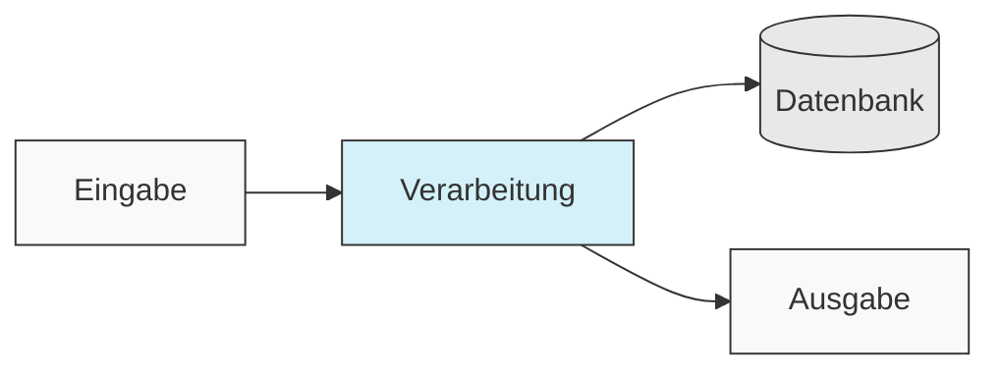
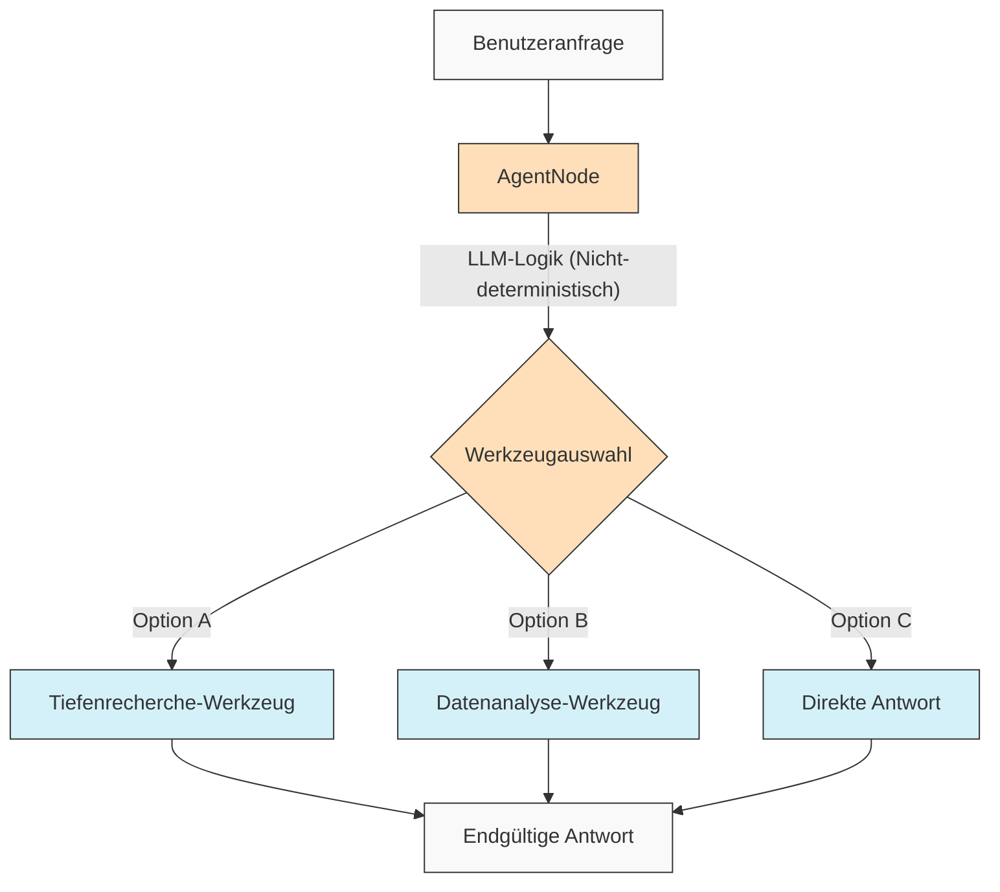
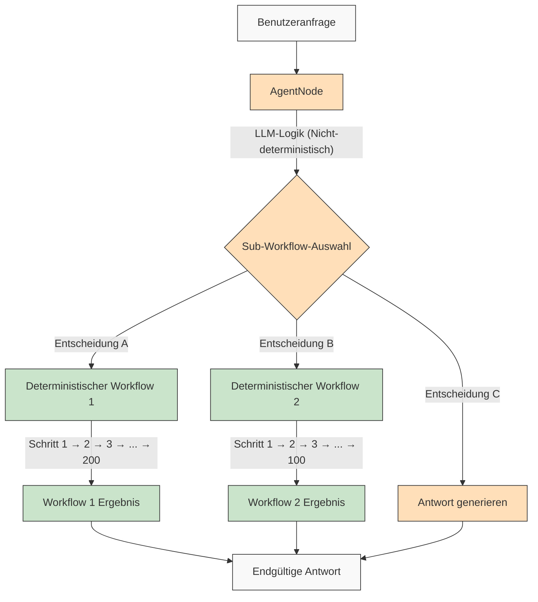

<p align="center">
  
</p>

## 🌐 README-Übersetzungen

[Français](/docs/i18n/french/README.md) • [日本語](/docs/i18n/japanese/README.md) • [한국어](/docs/i18n/korean/README.md) • [中文](/docs/i18n/chinese/README.md) • [Español](/docs/i18n/spanish/README.md) • [Italiano](/docs/i18n/italian/README.md) • [Nederlands](/docs/i18n/dutch/README.md) • [Deutsch](/docs/i18n/deutsch/README.md) • [Polski](/docs/i18n/polish/README.md) • [Türkçe](/docs/i18n/turkish/README.md) • [Українська](/docs/i18n/ukrainian/README.md) • [Ελληνικά](/docs/i18n/greek/README.md) • [Русский](/docs/i18n/russian/README.md) • [العربية](/docs/i18n/arabic/README.md)

# AgentDock: Erschaffe grenzenlose Möglichkeiten mit KI-Agenten

AgentDock ist ein Framework zur Erstellung hochentwickelter KI-Agenten, die komplexe Aufgaben mit **konfigurierbarer Determiniertheit** erledigen. Es besteht aus zwei Hauptkomponenten:

1.  **AgentDock Core**: Ein Open-Source, Backend-fokussiertes Framework zum Erstellen und Bereitstellen von KI-Agenten. Es ist *Framework-agnostisch* und *Anbieter-unabhängig* konzipiert, was Ihnen vollständige Kontrolle über die Implementierung Ihres Agenten gibt.

2.  **Open Source Client**: Eine vollständige Next.js-Anwendung, die als Referenzimplementierung und Nutzer des AgentDock Core Frameworks dient. Sie können sie unter [https://hub.agentdock.ai](https://hub.agentdock.ai) in Aktion sehen.

AgentDock wurde mit TypeScript entwickelt und legt Wert auf *Einfachheit*, *Erweiterbarkeit* und ***konfigurierbare Determiniertheit*** - ideal für die Erstellung zuverlässiger und vorhersagbarer KI-Systeme, die mit minimaler Aufsicht arbeiten können.

## 🧠 Design-Prinzipien

AgentDock basiert auf diesen Kernprinzipien:

-   **Einfachheit zuerst**: Minimaler Codeaufwand zur Erstellung funktionaler Agenten
-   **Knotenbasierte Architektur (Nodes)**: Alle Fähigkeiten werden als Knoten implementiert
-   **Werkzeuge als spezialisierte Knoten**: Werkzeuge erweitern das Knotensystem für Agentenfähigkeiten
-   **Konfigurierbare Determiniertheit**: Steuern Sie die Vorhersagbarkeit des Agentenverhaltens
-   **Typsicherheit (Type Safety)**: Umfassende TypeScript-Typisierung durchgehend

### Konfigurierbare Determiniertheit

***Konfigurierbare Determiniertheit*** ist ein Eckpfeiler der Design-Philosophie von AgentDock. Sie ermöglicht es, kreative KI-Fähigkeiten mit vorhersagbarem Systemverhalten in Einklang zu bringen:

-   `AgentNode`s sind inhärent nicht-deterministisch, da LLMs jedes Mal unterschiedliche Antworten generieren können
-   Workflows können durch *definierte Ausführungspfade für Werkzeuge* deterministischer gestaltet werden
-   Entwickler können den **Grad der Determiniertheit steuern**, indem sie konfigurieren, welche Teile des Systems LLM-Inferenz nutzen
-   Selbst mit LLM-Komponenten bleibt das allgemeine Systemverhalten durch strukturierte Werkzeuginteraktionen **vorhersagbar**
-   Dieser ausgewogene Ansatz ermöglicht sowohl *Kreativität* als auch **Zuverlässigkeit** in Ihren KI-Anwendungen

#### Deterministische Workflows

AgentDock unterstützt vollständig die deterministischen Workflows, die Sie von typischen Workflow-Buildern kennen. Alle erwarteten vorhersagbaren Ausführungspfade und zuverlässigen Ergebnisse sind verfügbar, mit oder ohne LLM-Inferenz:



#### Nicht-deterministisches Agentenverhalten

Mit AgentDock können Sie auch `AgentNode`s mit LLMs nutzen, wenn Sie mehr Anpassungsfähigkeit benötigen. Die kreativen Ergebnisse können je nach Bedarf variieren, während strukturierte Interaktionsmuster beibehalten werden:



#### Nicht-deterministische Agenten mit deterministischen Sub-Workflows

AgentDock bietet Ihnen das ***Beste aus beiden Welten***, indem es nicht-deterministische Agentenintelligenz mit deterministischer Workflow-Ausführung kombiniert:



Dieser Ansatz ermöglicht es, komplexe, mehrstufige Workflows (die potenziell Hunderte von deterministischen Schritten umfassen, die in Werkzeugen oder als verbundene Knotensequenzen implementiert sind) durch intelligente Agentenentscheidungen aufzurufen. Jeder Workflow wird vorhersagbar ausgeführt, obwohl er durch nicht-deterministische Agentenlogik ausgelöst wird.

Für fortgeschrittenere KI-Agenten-Workflows und mehrstufige Verarbeitungspipelines entwickeln wir [AgentDock Pro](../../docs/agentdock-pro.md) – eine leistungsstarke Plattform zur Erstellung, Visualisierung und Ausführung komplexer Agentensysteme.

#### Kurz gesagt: Konfigurierbare Determiniertheit

Stellen Sie es sich wie Autofahren vor. Manchmal benötigen Sie die Kreativität der KI (z. B. Navigation in der Stadt - nicht-deterministisch), und manchmal benötigen Sie zuverlässige, schrittweise Prozesse (z. B. das Befolgen von Autobahnschildern - deterministisch). AgentDock ermöglicht es Ihnen, Systeme zu bauen, die *beides* nutzen, indem Sie den richtigen Ansatz für jeden Teil einer Aufgabe wählen. Sie erhalten sowohl die Intelligenz der KI *als auch* vorhersagbare Ergebnisse, wo immer dies erforderlich ist.

## 🏗️ Kernarchitektur

Das Framework basiert auf einem leistungsstarken, modularen knotenbasierten System, das als Grundlage für die gesamte Agentenfunktionalität dient. Diese Architektur verwendet verschiedene Knotentypen als Bausteine:

-   **`BaseNode`**: Die grundlegende Klasse, die die Kernschnittstelle und Fähigkeiten für alle Knoten festlegt.
-   **`AgentNode`**: Ein spezialisierter Kernknoten, der LLM-Interaktionen, Werkzeugnutzung und Agentenlogik orchestriert.
-   **Werkzeuge & Benutzerdefinierte Knoten**: Entwickler implementieren Agentenfähigkeiten und benutzerdefinierte Logik als Knoten, die `BaseNode` erweitern.

Diese Knoten interagieren über verwaltete Registries und können verbunden werden (unter Nutzung der Ports der Kernarchitektur und einer potenziellen Nachrichtenbus), um komplexe, konfigurierbare und potenziell deterministische Agentenverhalten und Workflows zu ermöglichen.

Eine detaillierte Erklärung der Komponenten und Fähigkeiten des Knotensystems finden Sie in der [Dokumentation des Knotensystems](../../docs/nodes/README.md).

## 🚀 Erste Schritte

Eine umfassende Anleitung finden Sie im [Leitfaden für die ersten Schritte](../../docs/getting-started.md).

### Anforderungen

*   Node.js ≥ 20.11.0 (LTS)
*   pnpm ≥ 9.15.0 (Erforderlich)
*   API-Schlüssel für LLM-Anbieter (Anthropic, OpenAI, etc.)

### Installation

1.  **Repository klonen**:

    ```bash
    git clone https://github.com/AgentDock/AgentDock.git
    cd AgentDock
    ```

2.  **pnpm installieren**:

    ```bash
    corepack enable
    corepack prepare pnpm@latest --activate
    ```

3.  **Abhängigkeiten installieren**:

    ```bash
    pnpm install
    ```

    Für eine saubere Neuinstallation (wenn Sie von Grund auf neu bauen müssen):

    ```bash
    pnpm run clean-install
    ```

    Dieses Skript entfernt alle `node_modules`, Lock-Dateien und installiert die Abhängigkeiten korrekt neu.

4.  **Umgebung konfigurieren**:

    Erstellen Sie eine Umgebungsdatei (`.env` oder `.env.local`) basierend auf der bereitgestellten `.env.example`-Datei:

    ```bash
    # Option 1: .env.local erstellen
    cp .env.example .env.local

    # Option 2: .env erstellen
    cp .env.example .env
    ```

    Fügen Sie dann Ihre API-Schlüssel zur Umgebungsdatei hinzu.

5.  **Entwicklungsserver starten**:

    ```bash
    pnpm dev
    ```

### Erweiterte Funktionen

| Funktion                  | Beschreibung                                                                                   | Dokumentation                                                                    |
| :------------------------ | :--------------------------------------------------------------------------------------------- | :------------------------------------------------------------------------------- |
| **Sitzungsverwaltung**    | Isoliertes, performantes Zustandsmanagement für Konversationen                                 | [Sitzungsdokumentation](../../docs/architecture/sessions/README.md)              |
| **Orchestrierungsframework**| Steuerung des Agentenverhaltens und der Werkzeugverfügbarkeit basierend auf dem Kontext          | [Orchestrierungsdokumentation](../../docs/architecture/orchestration/README.md)  |
| **Speicherabstraktion**   | Flexibles Speichersystem mit austauschbaren Anbietern für KV-, Vektor- und sichere Speicherung | [Speicherdokumentation](../../docs/storage/README.md)                          |

Das Speichersystem wird derzeit weiterentwickelt mit Schlüssel-Wert-Speicher (Anbieter Memory, Redis, Vercel KV) und sicherem clientseitigem Speicher, während Vektorspeicher und zusätzliche Backends in Entwicklung sind.

## 📕 Dokumentation

Die Dokumentation für das AgentDock Framework ist verfügbar unter [hub.agentdock.ai/docs](https://hub.agentdock.ai/docs) und im Ordner `/docs/` dieses Repositories. Die Dokumentation umfasst:

-   Anleitungen für die ersten Schritte
-   API-Referenzen
-   Tutorials zur Knotenerstellung
-   Integrationsbeispiele

## 📂 Repository-Struktur

Dieses Repository enthält:

1.  **AgentDock Core**: Das Kernframework befindet sich in `agentdock-core/`
2.  **Open Source Client**: Eine vollständige Referenzimplementierung, die mit Next.js erstellt wurde und als Nutzer des AgentDock Core Frameworks dient.
3.  **Beispiel-Agenten**: Gebrauchsfertige Agentenkonfigurationen im Verzeichnis `agents/`

Sie können AgentDock Core unabhängig in Ihren eigenen Anwendungen verwenden oder dieses Repository als Ausgangspunkt für die Erstellung Ihrer eigenen agentenbasierten Anwendungen nutzen.

## 📝 Agenten-Vorlagen

AgentDock enthält mehrere vorkonfigurierte Agenten-Vorlagen. Erkunden Sie sie im Verzeichnis `agents/` oder lesen Sie die [Dokumentation der Agenten-Vorlagen](../../docs/agent-templates.md) für Konfigurationsdetails.

## 🔧 Beispielimplementierungen

Beispielimplementierungen zeigen spezialisierte Anwendungsfälle und erweiterte Funktionalität:

| Implementierung               | Beschreibung                                                                                 | Status       |
| :-------------------------- | :------------------------------------------------------------------------------------------- | :----------- |
| **Orchestrierter Agent**    | Beispielagent, der Orchestrierung zur Anpassung des Verhaltens basierend auf Kontext nutzt | Verfügbar    |
| **Kognitiver Reasoner**   | Bewältigt komplexe Probleme mithilfe strukturierter Logik & kognitiver Werkzeuge          | Verfügbar    |
| **Agenten-Planer**        | Spezialisierter Agent zum Entwerfen und Implementieren anderer KI-Agenten                  | Verfügbar    |
| [**Code Playground (Code-Spielwiese)**](../../docs/roadmap/code-playground.md) | Sandboxed Code-Generierung und -Ausführung mit reichhaltigen Visualisierungsfunktionen   | Geplant      |
| [**Generalistischer KI-Agent**](../../docs/roadmap/generalist-agent.md)| Manus-ähnlicher Agent, der Browser verwenden und komplexe Aufgaben ausführen kann         | Geplant      |

## 🔐 Details zur Umgebungskonfiguration

Der AgentDock Open Source Client benötigt API-Schlüssel für LLM-Anbieter, um zu funktionieren. Diese werden in einer Umgebungsdatei (`.env` oder `.env.local`) konfiguriert, die Sie basierend auf der bereitgestellten `.env.example`-Datei erstellen.

### API-Schlüssel von LLM-Anbietern

Fügen Sie Ihre API-Schlüssel von LLM-Anbietern hinzu (mindestens einer erforderlich):

```bash
# API-Schlüssel von LLM-Anbietern - mindestens einer erforderlich
ANTHROPIC_API_KEY=sk-ant-xxxxxxx  # Anthropic API-Schlüssel
OPENAI_API_KEY=sk-xxxxxxx         # OpenAI API-Schlüssel
GEMINI_API_KEY=xxxxxxx            # Google Gemini API-Schlüssel
DEEPSEEK_API_KEY=xxxxxxx          # DeepSeek API-Schlüssel
GROQ_API_KEY=xxxxxxx              # Groq API-Schlüssel
```

### Auflösung von API-Schlüsseln

Der AgentDock Open Source Client folgt einer Prioritätsreihenfolge bei der Auflösung, welcher API-Schlüssel verwendet werden soll:

1.  **Benutzerdefinierter API-Schlüssel pro Agent** (über Agenteneinstellungen in der Benutzeroberfläche festgelegt)
2.  **Globaler Einstellungs-API-Schlüssel** (über die Einstellungsseite in der Benutzeroberfläche festgelegt)
3.  **Umgebungsvariable** (aus `.env.local` oder Bereitstellungsplattform)

### Werkzeugspezifische API-Schlüssel

Einige Werkzeuge benötigen ebenfalls eigene API-Schlüssel:

```bash
# Werkzeugspezifische API-Schlüssel
SERPER_API_KEY=                  # Erforderlich für Suchfunktionalität
FIRECRAWL_API_KEY=               # Erforderlich für tiefere Web-Suche
```

Weitere Details zur Umgebungskonfiguration finden Sie in der Implementierung in [`src/types/env.ts`](../../src/types/env.ts).

### Verwenden Sie Ihren eigenen API-Schlüssel (BYOK - Bring Your Own Key)

AgentDock folgt einem BYOK (Bring Your Own Key - Verwenden Sie Ihren eigenen Schlüssel)-Modell:

1.  Fügen Sie Ihre API-Schlüssel auf der Einstellungsseite der Anwendung hinzu
2.  Alternativ können Sie Schlüssel über Anfrage-Header für die direkte API-Nutzung bereitstellen
3.  Schlüssel werden mithilfe des integrierten Verschlüsselungssystems sicher gespeichert
4.  Keine API-Schlüssel werden geteilt oder auf unseren Servern gespeichert

## 📦 Paketmanager

Dieses Projekt *erfordert* die Verwendung von `pnpm` für eine konsistente Abhängigkeitsverwaltung. `npm` und `yarn` werden nicht unterstützt.

## 💡 Was Sie bauen können

1.  **KI-gestützte Anwendungen**
    -   Benutzerdefinierte Chatbots mit beliebigem Frontend
    -   Kommandozeilen-KI-Assistenten
    -   Automatisierte Datenverarbeitungspipelines
    -   Integrationen von Backend-Diensten

2.  **Integrationsfähigkeiten**
    -   Beliebiger KI-Anbieter (OpenAI, Anthropic, etc.)
    -   Beliebiges Frontend-Framework
    -   Beliebiger Backend-Dienst
    -   Benutzerdefinierte Datenquellen und APIs

3.  **Automatisierungssysteme**
    -   Datenverarbeitungs-Workflows
    -   Dokumentenanalyse-Pipelines
    -   Automatisierte Berichtssysteme
    -   Agenten zur Aufgabenautomatisierung

## Hauptmerkmale

| Merkmal                              | Beschreibung                                                                                 |
| :----------------------------------- | :------------------------------------------------------------------------------------------- |
| 🔌 **Framework-unabhängig (Node.js Backend)** | Kernbibliothek integriert sich in Node.js-Backend-Stacks.                                    |
| 🧩 **Modulares Design**              | Erstellen Sie komplexe Systeme aus einfachen Knoten                                          |
| 🛠️ **Erweiterbar**                   | Erstellen Sie benutzerdefinierte Knoten für jede Funktionalität                            |
| 🔒 **Sicher**                        | Integrierte Sicherheitsfunktionen für API-Schlüssel und Daten                              |
| 🔑 **BYOK**                          | Verwenden Sie Ihre *eigenen API-Schlüssel* für LLM-Anbieter                               |
| 📦 **Eigenständig (Self-contained)** | Kernframework hat minimale Abhängigkeiten                                                    |
| ⚙️ **Mehrstufige Werkzeugaufrufe (Multi-Step Tool Calls)**| Unterstützung für *komplexe Logikketten*                                                |
| 📊 **Strukturierte Protokollierung** | Detaillierte Einblicke in die Agentenausführung                                             |
| 🛡️ **Robuste Fehlerbehandlung**      | Vorhersagbares Verhalten und vereinfachtes Debugging                                         |
| 📝 **TypeScript First**              | Typsicherheit und verbesserte Entwicklererfahrung                                            |
| 🌐 **Open Source Client**            | Vollständige Next.js-Referenzimplementierung enthalten                                    |
| 🔄 **Orchestrierung**                | *Dynamische Steuerung* des Agentenverhaltens basierend auf dem Kontext                      |
| 💾 **Sitzungsverwaltung**            | Isolierter Zustand für gleichzeitige Konversationen                                          |
| 🎮 **Konfigurierbare Determiniertheit**| Balancieren Sie KI-Kreativität & Vorhersagbarkeit durch Knotenlogik/Workflows.               |

## 🧰 Komponenten

Die modulare Architektur von AgentDock basiert auf diesen Schlüsselkomponenten:

*   **BaseNode**: Die Grundlage für alle Knoten im System
*   **AgentNode**: Die primäre Abstraktion für Agentenfunktionalität
*   **Werkzeuge & Benutzerdefinierte Knoten**: Aufrufbare Fähigkeiten und benutzerdefinierte Logik, implementiert als Knoten.
*   **Knoten-Registry**: Verwaltet die Registrierung und den Abruf aller Knotentypen
*   **Werkzeug-Registry**: Verwaltet die Verfügbarkeit von Werkzeugen für Agenten
*   **CoreLLM**: Einheitliche Schnittstelle zur Interaktion mit LLM-Anbietern
*   **Anbieter-Registry**: Verwaltet Konfigurationen von LLM-Anbietern
*   **Fehlerbehandlung**: System zur Behandlung von Fehlern und Sicherstellung vorhersagbaren Verhaltens
*   **Protokollierung (Logging)**: Strukturiertes Protokollierungssystem für Überwachung und Debugging
*   **Orchestrierung**: Steuert Werkzeugverfügbarkeit und Verhalten basierend auf dem Konversationskontext
*   **Sitzungen**: Verwaltet die Zustandsisolierung zwischen gleichzeitigen Konversationen

Eine detaillierte technische Dokumentation zu diesen Komponenten finden Sie im [Architekturüberblick](../../docs/architecture/README.md).

## 🗺️ Roadmap

Unten finden Sie unsere Entwicklungs-Roadmap für AgentDock. Die meisten hier aufgeführten Verbesserungen beziehen sich auf das Kernframework von AgentDock (`agentdock-core`), das derzeit lokal entwickelt wird und als versioniertes NPM-Paket veröffentlicht wird, sobald eine stabile Version erreicht ist. Einige Roadmap-Punkte können auch Verbesserungen an der Open-Source-Client-Implementierung beinhalten.

| Merkmal                                                                      | Beschreibung                                                                                            | Kategorie       |
| :--------------------------------------------------------------------------- | :------------------------------------------------------------------------------------------------------ | :-------------- |
| [**Speicherabstraktionsschicht**](../../docs/roadmap/storage-abstraction.md)   | Flexibles Speichersystem mit austauschbaren Anbietern                                                   | **In Arbeit**   |
| [**Erweiterte Speichersysteme**](../../docs/roadmap/advanced-memory.md)        | Langzeit-Kontextmanagement                                                                            | **In Arbeit**   |
| [**Integration von Vektorspeichern**](../../docs/roadmap/vector-storage.md)   | Embedding-basierter Abruf für Dokumente und Speicher                                                    | **In Arbeit**   |
| [**Evaluierung für KI-Agenten**](../../docs/roadmap/evaluation-framework.md)   | Umfassendes Test- und Evaluierungsframework                                                             | **In Arbeit**   |
| [**Plattformintegration**](../../docs/roadmap/platform-integration.md)       | Unterstützung für Telegram, WhatsApp und andere Messaging-Plattformen                                   | **Geplant**     |
| [**Multi-Agenten-Kollaboration**](../../docs/roadmap/multi-agent-collaboration.md)| Ermöglichen, dass Agenten zusammenarbeiten                                                              | **Geplant**     |
| [**Integration des Model Context Protocol (MCP)**](../../docs/roadmap/mcp-integration.md)| Unterstützung für die Erkennung und Nutzung externer Werkzeuge über MCP                               | **Geplant**     |
| [**Sprach-KI-Agenten**](../../docs/roadmap/voice-agents.md)                  | KI-Agenten, die Sprachschnittstellen und Telefonnummern über AgentNode verwenden                      | **Geplant**     |
| [**Telemetrie und Rückverfolgbarkeit**](../../docs/roadmap/telemetry.md)       | Erweitertes Logging und Leistungsüberwachung                                                     | **Geplant**     |
| [**Workflow Runtime & Node Typen**](../../docs/roadmap/workflow-nodes.md)        | Kern-Runtime, Knotentypen und Orchestrierungslogik für komplexe Automatisierungen                     | **Geplant**     |
| [**AgentDock Pro**](../../docs/agentdock-pro.md)                            | Umfassende Enterprise-Cloud-Plattform zur Skalierung von KI-Agenten & Workflows                       | **Cloud**       |
| [**KI-Agenten-Builder in natürlicher Sprache**](../../docs/roadmap/nl-agent-builder.md)| Visueller Builder + Erstellung von Agenten und Workflows in natürlicher Sprache                     | **Cloud**       |
| [**Agenten-Marktplatz**](../../docs/roadmap/agent-marketplace.md)              | Monetarisierbare Agentenvorlagen                                                                        | **Cloud**       |

## 👥 Mitwirken

Wir freuen uns über Beiträge zu AgentDock! Detaillierte Richtlinien zum Mitwirken finden Sie in [CONTRIBUTING.md](../../CONTRIBUTING.md).

## 📜 Lizenz

AgentDock wird unter der [MIT-Lizenz](../../LICENSE) veröffentlicht.

## ✨ Erschaffe grenzenlose Möglichkeiten!

AgentDock bietet die Grundlage, um nahezu jede KI-gestützte Anwendung oder Automatisierung zu erstellen, die Sie sich vorstellen können. Wir ermutigen Sie, das Framework zu erkunden, innovative Agenten zu bauen und zur Community beizutragen. Lassen Sie uns gemeinsam die Zukunft der KI-Interaktion gestalten!

---
[Zurück zum Übersetzungsindex](/docs/i18n/README.md)