# AgentDock: Onbegrensde mogelijkheden met AI-Agenten

[](https://github.com/agentdock/agentdock/stargazers)
[](https://opensource.org/licenses/MIT)
[](https://github.com/AgentDock/AgentDock/releases)
[](https://hub.agentdock.ai/docs)
[](https://discord.gg/fDYFFmwuRA)
[](https://agentdock.ai)
[](https://x.com/agentdock)

## 🌐 README-vertalingen

[Français](../french/README.md) • [日本語](../japanese/README.md) • [한국어](../korean/README.md) • [中文](../chinese/README.md) • [Español](../spanish/README.md) • [Italiano](../italian/README.md) • [Nederlands](./README.md) • [Polski](../polish/README.md) • [Türkçe](../turkish/README.md) • [Українська](../ukrainian/README.md) • [Ελληνικά](../greek/README.md) • [العربية](../arabic/README.md)

AgentDock is een framework voor het bouwen van geavanceerde AI-agenten die complexe taken uitvoeren met **configureerbaar determinisme**. Het bestaat uit twee hoofdcomponenten:

1.  **AgentDock Core**: Een open-source, backend-first framework voor het bouwen en implementeren van AI-agenten. Het is ontworpen om *framework-agnostisch* en *provider-agnostisch* te zijn, waardoor je volledige controle hebt over de implementatie van je agent.

2.  **Open Source Client**: Een volledige Next.js-applicatie die dient als referentie-implementatie en consument van het AgentDock Core-framework. Je kunt het in actie zien op [https://hub.agentdock.ai](https://hub.agentdock.ai)

Gebouwd met TypeScript, legt AgentDock de nadruk op *eenvoud*, *uitbreidbaarheid* en ***configureerbaar determinisme***, waardoor het ideaal is voor het bouwen van betrouwbare, voorspelbare AI-systemen die met minimale supervisie kunnen werken.

## 🧠 Ontwerpprincipes

AgentDock is gebouwd op deze kernprincipes:

-   **Eenvoud Eerst**: Minimale code vereist om functionele agenten te creëren
-   **Op nodes gebaseerde architectuur**: Alle capaciteiten worden geïmplementeerd als nodes
-   **Tools als Gespecialiseerde Nodes**: Tools breiden het nodesysteem uit voor agentcapaciteiten
-   **Configureerbaar Determinisme**: Beheer de voorspelbaarheid van agentgedrag
-   **Typeveiligheid**: Volledige TypeScript-types overal

### Configureerbaar Determinisme

***Configureerbaar determinisme*** is een hoeksteen van de ontwerpfilosofie van AgentDock, waardoor je de creatieve capaciteiten van AI kunt balanceren met voorspelbaar systeemgedrag:

-   `AgentNode`s zijn inherent niet-deterministisch aangezien LLM's elke keer verschillende reacties kunnen genereren
-   Workflows kunnen deterministischer worden gemaakt via *gedefinieerde tool-uitvoeringspaden*
-   Ontwikkelaars kunnen **het niveau van determinisme controleren** door te configureren welke delen van het systeem LLM-inferentie gebruiken
-   Zelfs met LLM-componenten blijft het algehele systeemgedrag **voorspelbaar** door gestructureerde tool-interacties
-   Met deze aanpak kunnen zowel *creativiteit* als **betrouwbaarheid** in je AI-applicaties worden bereikt

#### Deterministische Workflows

AgentDock ondersteunt volledig de deterministische workflows waarmee je vertrouwd bent vanuit typische workflow-bouwers. Alle voorspelbare uitvoeringspaden en betrouwbare resultaten die je verwacht zijn beschikbaar, met of zonder LLM-inferentie:


#### Niet-Deterministisch Agentgedrag

Met AgentDock kun je ook `AgentNode`s met LLM's gebruiken wanneer je meer aanpassingsvermogen nodig hebt. Creatieve outputs kunnen variëren op basis van je behoeften, terwijl gestructureerde interactiepatronen behouden blijven:


#### Niet-Deterministische Agenten met Deterministische Sub-Workflows

AgentDock biedt je het ***beste van twee werelden*** door niet-deterministische agentintelligentie te combineren met deterministische workflow-uitvoering:

```mermaid
flowchart TD
  Input[Gebruikersquery] --> Agent[AgentNode]
  Agent -->|"LLM Redenering (Niet-Deterministisch)"| FlowChoice{Sub-Workflowkeuze}
  FlowChoice -->|"Beslissing A"| Flow1[Deterministische Workflow 1]
  FlowChoice -->|"Beslissing B"| Flow2[Deterministische Workflow 2]
  FlowChoice -->|"Beslissing C"| DirectResponse[Genereer Antwoord]

  Flow1 --> |"Stap 1 → 2 → 3 → ... → 200"| Flow1Result[Workflow 1 Resultaat]
  Flow2 --> |"Stap 1 → 2 → 3 → ... → 100"| Flow2Result[Workflow 2 Resultaat]

  Flow1Result --> Response[Eindantwoord]
  Flow2Result --> Response
  DirectResponse --> Response

  style Input fill:#f9f9f9,stroke:#333,stroke-width:1px
  style Agent fill:#ffdfba,stroke:#333,stroke-width:1px
  style FlowChoice fill:#ffdfba,stroke:#333,stroke-width:1px
  style Flow1 fill:#c9e4ca,stroke:#333,stroke-width:1px
  style Flow2 fill:#c9e4ca,stroke:#333,stroke-width:1px
  style Flow1Result fill:#c9e4ca,stroke:#333,stroke-width:1px
  style Flow2Result fill:#c9e4ca,stroke:#333,stroke-width:1px
  style DirectResponse fill:#ffdfba,stroke:#333,stroke-width:1px
  style Response fill:#f9f9f9,stroke:#333,stroke-width:1px
```



Met deze aanpak kunnen complexe, meerstaps workflows (mogelijk met honderden deterministische stappen geïmplementeerd binnen tools of als sequenties van verbonden nodes) worden aangeroepen door intelligente agentbeslissingen. Elke workflow wordt voorspelbaar uitgevoerd ondanks dat deze wordt getriggerd door niet-deterministische agentredenering.

Voor meer geavanceerde AI-agent workflows en multi-stage verwerkingspipelines bouwen we aan [AgentDock Pro](../../docs/agentdock-pro.md) - een krachtig platform voor het bouwen, visualiseren en uitvoeren van complexe agentsystemen.

#### Kort samengevat (TL;DR): Configureerbaar Determinisme

Vergelijk het met autorijden. Soms heb je de creativiteit van AI nodig (zoals navigeren door stadsstraten - niet-deterministisch), en soms heb je betrouwbare, stapsgewijze processen nodig (zoals het volgen van snelwegborden - deterministisch). Met AgentDock kun je systemen bouwen die *beide* gebruiken, waarbij je de juiste aanpak kiest voor elk deel van een taak. Je krijgt de intelligentie van AI *en* voorspelbare resultaten waar nodig.

## 🏗️ Kernarchitectuur

Het framework is gebouwd rond een krachtig, modulair, op nodes gebaseerd systeem, dat dient als basis voor alle agentfunctionaliteit. Deze architectuur gebruikt verschillende node-typen als bouwstenen:

-   **`BaseNode`**: De fundamentele klasse die de kerninterface en mogelijkheden voor alle nodes vastlegt.
-   **`AgentNode`**: Een gespecialiseerde kern-node die LLM-interacties, toolgebruik en agentlogica orkestreert.
-   **Tools en Aangepaste Nodes**: Ontwikkelaars implementeren agentcapaciteiten en aangepaste logica als nodes die `BaseNode` uitbreiden.

Deze nodes interageren via beheerde registers en kunnen worden verbonden (gebruikmakend van kernarchitectuurpoorten en een potentiële message bus) om complexe, configureerbare en potentieel deterministische agentgedragingen en workflows mogelijk te maken.

Voor een gedetailleerde uitleg van de componenten en mogelijkheden van het nodesysteem, zie de [Node Systeem Documentatie](../../docs/nodes/README.md).

## 🚀 Aan de slag

Voor een uitgebreide gids, zie de [Getting Started Gids](../../docs/getting-started.md).

### Vereisten

*   Node.js ≥ 20.11.0 (LTS)
*   pnpm ≥ 9.15.0 (Vereist)
*   API-sleutels voor LLM-providers (Anthropic, OpenAI, etc.)

### Installatie

1.  **Kloon de Repository**:

    ```bash
    git clone https://github.com/AgentDock/AgentDock.git
    cd AgentDock
    ```

2.  **Installeer pnpm**:

    ```bash
    corepack enable
    corepack prepare pnpm@latest --activate
    ```

3.  **Installeer Afhankelijkheden**:

    ```bash
    pnpm install
    ```

    Voor een schone herinstallatie (wanneer je vanaf nul moet herbouwen):

    ```bash
    pnpm run clean-install
    ```

    Dit script verwijdert alle `node_modules`, lock-bestanden en herinstalleert de afhankelijkheden correct.

4.  **Configureer de Omgeving**:

    Maak een omgevingsbestand (`.env` of `.env.local`) aan op basis van het meegeleverde `.env.example`-bestand:

    ```bash
    # Optie 1: Maak .env.local aan
    cp .env.example .env.local

    # Optie 2: Maak .env aan
    cp .env.example .env
    ```

    Voeg vervolgens je API-sleutels toe aan het omgevingsbestand.

5.  **Start de Ontwikkelserver**:

    ```bash
    pnpm dev
    ```

### Geavanceerde Mogelijkheden

| Mogelijkheid             | Beschrijving                                                                                  | Documentatie                                                                     |
| :----------------------- | :-------------------------------------------------------------------------------------------- | :------------------------------------------------------------------------------- |
| **Sessiebeheer**         | Geïsoleerd, high-performance state management voor conversaties                             | [Sessiedocumentatie](../../docs/architecture/sessions/README.md)                 |
| **Orkestratieframework** | Controle over agentgedrag en toolbeschikbaarheid op basis van context                          | [Orkestratiedocumentatie](../../docs/architecture/orchestration/README.md)       |
| **Opslagabstractie**     | Flexibel opslagsysteem met pluggable providers voor KV, Vector en Secure Storage             | [Opslagdocumentatie](../../docs/storage/README.md)                               |

Het opslagsysteem evolueert momenteel met key-value opslag (Memory, Redis, Vercel KV providers) en client-side secure storage, terwijl vectoropslag en extra backends in ontwikkeling zijn.

## 📕 Documentatie

De documentatie voor het AgentDock-framework is beschikbaar op [hub.agentdock.ai/docs](https://hub.agentdock.ai/docs) en in de `/docs/` map van deze repository. De documentatie omvat:

-   Getting started-gidsen
-   API-referenties
-   Tutorials voor het bouwen van nodes
-   Integratievoorbeelden

## 📂 Repository Structuur

Deze repository bevat:

1.  **AgentDock Core**: Het kernframework, te vinden in `agentdock-core/`
2.  **Open Source Client**: Een volledige referentie-implementatie gebouwd met Next.js, die dient als consument van het AgentDock Core-framework.
3.  **Voorbeeldagenten**: Kant-en-klare agentconfiguraties in de `agents/` map

Je kunt AgentDock Core onafhankelijk gebruiken in je eigen applicaties, of deze repository gebruiken als startpunt voor het bouwen van je eigen agent-aangedreven applicaties.

## 📝 Agent Templates

AgentDock bevat verschillende vooraf geconfigureerde agent templates. Verken ze in de `agents/` map of lees de [Agent Template Documentatie](../../docs/agent-templates.md) voor configuratiedetails.

## 🔧 Voorbeeldimplementaties

Voorbeeldimplementaties tonen gespecialiseerde use cases en geavanceerde functionaliteit:

| Implementatie             | Beschrijving                                                                                 | Status       |
| :------------------------ | :------------------------------------------------------------------------------------------- | :----------- |
| **Georkestreerde Agent**  | Voorbeeldagent die orkestratie gebruikt om gedrag aan te passen op basis van context         | Beschikbaar  |
| **Cognitieve Redeneerder**| Pakt complexe problemen aan met gestructureerd redeneren en cognitieve tools                 | Beschikbaar  |
| **Agent Planner**         | Gespecialiseerde agent voor het ontwerpen en implementeren van andere AI-agenten              | Beschikbaar  |
| [**Code Playground**](../../docs/roadmap/code-playground.md)| In sandbox uitgevoerde codegeneratie en uitvoering met rijke visualisatiemogelijkheden             | Gepland      |
| [**Generalistische AI-Agent**](../../docs/roadmap/generalist-agent.md)| Manus-achtige agent die de browser kan gebruiken en complexe taken kan uitvoeren               | Gepland      |

## 🔐 Omgevingsconfiguratie Details

De AgentDock Open Source Client vereist API-sleutels voor LLM-providers om te functioneren. Deze worden geconfigureerd in een omgevingsbestand (`.env` of `.env.local`) dat je aanmaakt op basis van het meegeleverde `.env.example`-bestand.

### LLM Provider API-sleutels

Voeg je LLM-provider API-sleutels toe (minimaal één vereist):

```bash
# LLM Provider API Sleutels - minimaal één vereist
ANTHROPIC_API_KEY=sk-ant-xxxxxxx  # Anthropic API Sleutel
OPENAI_API_KEY=sk-xxxxxxx         # OpenAI API Sleutel
GEMINI_API_KEY=xxxxxxx            # Google Gemini API Sleutel
DEEPSEEK_API_KEY=xxxxxxx          # DeepSeek API Sleutel
GROQ_API_KEY=xxxxxxx              # Groq API Sleutel
```

### API-sleutel Resolutie

De AgentDock Open Source Client volgt een prioriteitsvolgorde bij het bepalen welke API-sleutel te gebruiken:

1.  **Aangepaste API-sleutel per agent** (ingesteld via agentinstellingen in de UI)
2.  **Globale instellingen API-sleutel** (ingesteld via de instellingenpagina in de UI)
3.  **Omgevingsvariabele** (van `.env.local` of implementatieplatform)

### Tool-Specifieke API-sleutels

Sommige tools vereisen ook hun eigen API-sleutels:

```bash
# Tool-Specifieke API Sleutels
SERPER_API_KEY=                  # Vereist voor zoekfunctionaliteit
FIRECRAWL_API_KEY=               # Vereist voor diepere web scraping
```

Voor meer details over omgevingsconfiguratie, zie de implementatie in [`src/types/env.ts`](../../src/types/env.ts).

### Je Eigen API-sleutels Gebruiken (BYOK)

AgentDock volgt een BYOK (Bring Your Own Key) model:

1.  Voeg je API-sleutels toe op de instellingenpagina van de applicatie
2.  Alternatief, lever sleutels via request headers voor direct API-gebruik
3.  Sleutels worden veilig opgeslagen met het ingebouwde encryptiesysteem
4.  Er worden geen API-sleutels gedeeld of opgeslagen op onze servers

## 📦 Pakketbeheerder

Dit project *vereist* het gebruik van `pnpm` voor consistent afhankelijkheidsbeheer. `npm` en `yarn` worden niet ondersteund.

## 💡 Wat Je Kunt Bouwen

1.  **AI-Aangedreven Applicaties**
    -   Aangepaste chatbots met elke frontend
    -   Command-line AI-assistenten
    -   Geautomatiseerde dataverwerkingspipelines
    -   Backend service-integraties

2.  **Integratiemogelijkheden**
    -   Elke AI-provider (OpenAI, Anthropic, etc.)
    -   Elk frontend framework
    -   Elke backend service
    -   Aangepaste databronnen en API's

3.  **Automatiseringssystemen**
    -   Dataverwerkingsworkflows
    -   Documentanalyse pipelines
    -   Geautomatiseerde rapportagesystemen
    -   Taakautomatiseringsagenten

## Kernfuncties

| Functie                       | Beschrijving                                                                                 |
| :---------------------------- | :------------------------------------------------------------------------------------------- |
| 🔌 **Framework-Agnostisch (Node.js Backend)**| De kernbibliotheek integreert met Node.js backend stacks.                                  |
| 🧩 **Modulair Ontwerp**       | Bouw complexe systemen van eenvoudige nodes                                                  |
| 🛠️ **Uitbreidbaar**           | Creëer aangepaste nodes voor elke functionaliteit                                            |
| 🔒 **Veilig**                 | Ingebouwde beveiligingsfuncties voor API-sleutels en data                                  |
| 🔑 **BYOK**                   | Gebruik je *eigen API-sleutels* voor LLM-providers                                                     |
| 📦 **Zelfstandig**            | Het kernframework kent slechts weinig afhankelijkheden                                               |
| ⚙️ **Multi-Step Tool Calls** | Ondersteuning voor *complexe redeneerketens*                                                         |
| 📊 **Gestructureerde Logging**| Gedetailleerde inzichten in agentuitvoering                                                        |
| 🛡️ **Robuuste Foutafhandeling**| Voorspelbaar gedrag en vereenvoudigde debugging                                            |
| 📝 **TypeScript Eerst**       | Typeveiligheid en verbeterde ontwikkelaarservaring                                          |
| 🌐 **Open Source Client**     | Bevat volledige Next.js referentie-implementatie                                             |
| 🔄 **Orkestratie**            | *Dynamische controle* over agentgedrag op basis van context                                |
| 💾 **Sessiebeheer**           | Geïsoleerde state voor gelijktijdige conversaties                                           |
| 🎮 **Configureerbaar Determinisme**| Balanceer AI-creativiteit en voorspelbaarheid via node/workflow-logica.                   |

## 🧰 Componenten

De modulaire architectuur van AgentDock is gebouwd op deze kerncomponenten:

*   **BaseNode**: De basis voor alle nodes in het systeem
*   **AgentNode**: De hoofdabstractie voor agentfunctionaliteit
*   **Tools en Aangepaste Nodes**: Aanroepbare capaciteiten en aangepaste logica geïmplementeerd als nodes.
*   **Node Registry**: Beheert de registratie en het ophalen van alle node-typen
*   **Tool Registry**: Beheert de beschikbaarheid van tools voor agenten
*   **CoreLLM**: Uniforme interface voor interactie met LLM-providers
*   **Provider Registry**: Beheert LLM-providerconfiguraties
*   **Foutafhandeling**: Systeem voor het afhandelen van fouten en het waarborgen van voorspelbaar gedrag
*   **Logging**: Gestructureerd loggingsysteem voor monitoring en debugging
*   **Orkestratie**: Controleert toolbeschikbaarheid en gedrag op basis van conversatiecontext
*   **Sessies**: Beheert state-isolatie tussen gelijktijdige conversaties

Voor gedetailleerde technische documentatie over deze componenten, zie het [Architectuuroverzicht](../../docs/architecture/README.md).

## 🗺️ Roadmap

Hieronder staat onze ontwikkelingsroadmap voor AgentDock. De meeste hier genoemde verbeteringen hebben betrekking op het AgentDock-kernframework (`agentdock-core`), dat momenteel lokaal wordt ontwikkeld en als een geversioneerd NPM-pakket zal worden gepubliceerd zodra een stabiele release is bereikt. Sommige roadmap-items kunnen ook verbeteringen aan de open-source client-implementatie met zich meebrengen.

| Functie                                                                   | Beschrijving                                                                                    | Categorie      |
| :------------------------------------------------------------------------ | :---------------------------------------------------------------------------------------------- | :------------- |
| [**Opslagabstractielaag**](../../docs/roadmap/storage-abstraction.md)      | Flexibel opslagsysteem met pluggable providers                                                | **In Uitvoering**|
| [**Geavanceerde Geheugensystemen**](../../docs/roadmap/advanced-memory.md)    | Lange-termijn contextbeheer                                                                   | **In Uitvoering**|
| [**Vector Opslag Integratie**](../../docs/roadmap/vector-storage.md)       | Embedding-gebaseerde retrieval voor documenten en geheugen                                    | **In Uitvoering**|
| [**Evaluatie voor AI-Agenten**](../../docs/roadmap/evaluation-framework.md) | Uitgebreid test- en evaluatieframework                                                        | **In Uitvoering**|
| [**Platform Integratie**](../../docs/roadmap/platform-integration.md)      | Ondersteuning voor Telegram, WhatsApp en andere berichtenplatforms                            | **Gepland**    |
| [**Multi-Agent Samenwerking**](../../docs/roadmap/multi-agent-collaboration.md)| Agenten laten samenwerken                                                                     | **Gepland**    |
| [**Model Context Protocol (MCP) Integratie**](../../docs/roadmap/mcp-integration.md)| Ondersteuning voor het ontdekken en gebruiken van externe tools via MCP                       | **Gepland**    |
| [**Voice AI Agenten**](../../docs/roadmap/voice-agents.md)                | AI-agenten die spraakinterfaces en telefoonnummers gebruiken via AgentNode                    | **Gepland**    |
| [**Telemetrie & Traceerbaarheid**](../../docs/roadmap/telemetry.md)       | Geavanceerde logging en prestatietracking                                                     | **Gepland**    |
| [**AgentDock Pro**](../../docs/agentdock-pro.md)                         | Volledig enterprise cloud-platform voor het schalen van AI-agenten en workflows             | **Cloud**      |
| [**Natuurlijke Taal AI Agent Bouwer**](../../docs/roadmap/nl-agent-builder.md)| Visuele bouwer + natuurlijke taal agent & workflow constructie                               | **Cloud**      |
| [**Agent Marktplaats**](../../docs/roadmap/agent-marketplace.md)          | Monetiseerbare agent templates                                                                | **Cloud**      |

## 👥 Bijdragen

We verwelkomen bijdragen aan AgentDock! Zie [CONTRIBUTING.md](../../CONTRIBUTING.md) voor gedetailleerde bijdragerichtlijnen.

## 📜 Licentie

AgentDock wordt uitgebracht onder de [MIT Licentie](../../LICENSE).

## ✨ Grenzeloze mogelijkheden!

AgentDock biedt de basis om vrijwel elke AI-aangedreven applicatie of automatisering te bouwen die je je kunt voorstellen. We moedigen je aan om het framework te verkennen, innovatieve agenten te bouwen en bij te dragen aan de community. Laten we samen de toekomst van AI-interactie bouwen!

---
[Terug naar Vertalingsindex](../README.md) 