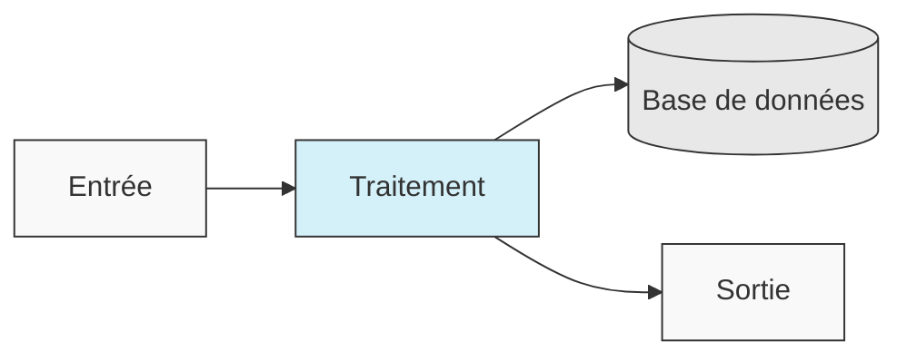
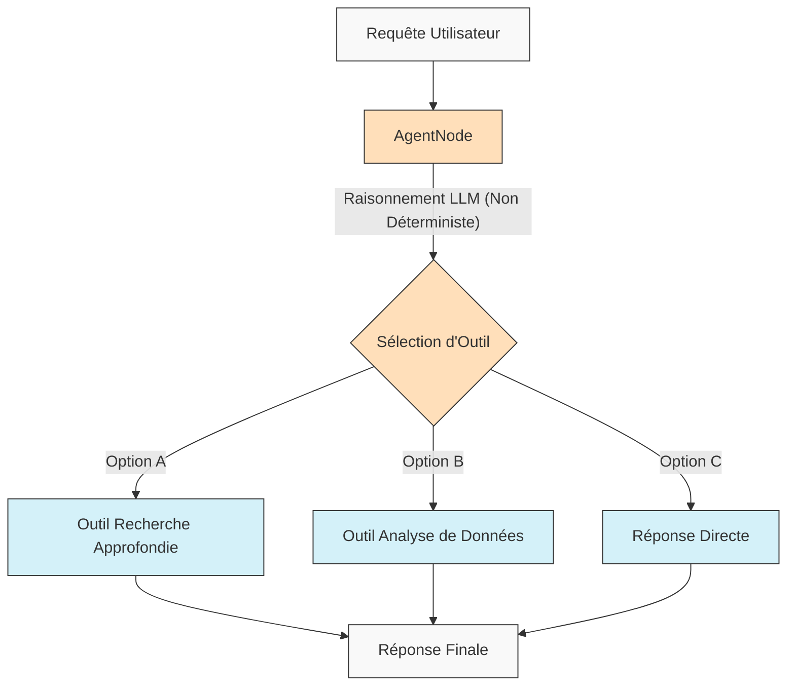
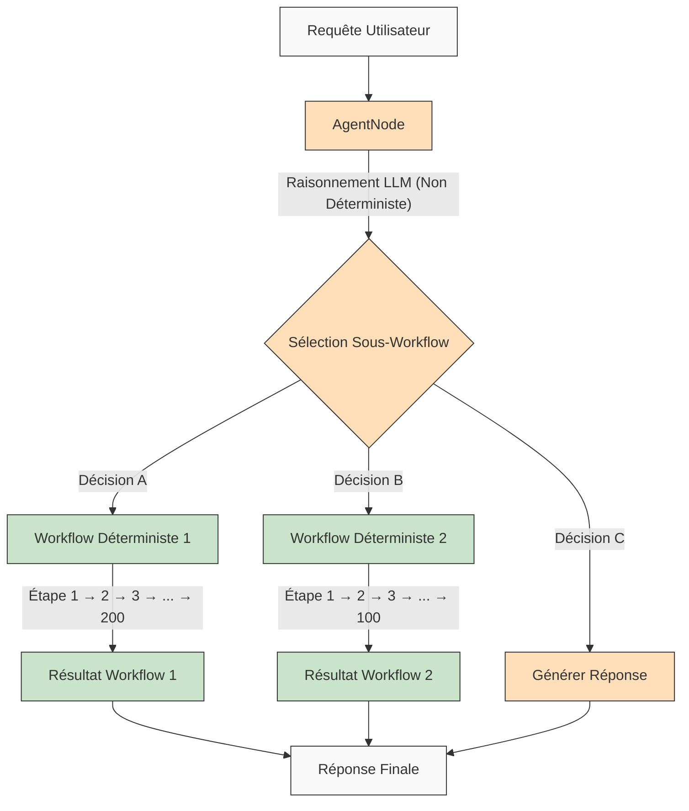

<p align="center">
  
</p>

## 🌐 Traductions du README

[Français](/docs/i18n/french/README.md) • [日本語](/docs/i18n/japanese/README.md) • [한국어](/docs/i18n/korean/README.md) • [中文](/docs/i18n/chinese/README.md) • [Español](/docs/i18n/spanish/README.md) • [Italiano](/docs/i18n/italian/README.md) • [Nederlands](/docs/i18n/dutch/README.md) • [Deutsch](/docs/i18n/deutsch/README.md) • [Polski](/docs/i18n/polish/README.md) • [Türkçe](/docs/i18n/turkish/README.md) • [Українська](/docs/i18n/ukrainian/README.md) • [Ελληνικά](/docs/i18n/greek/README.md) • [Русский](/docs/i18n/russian/README.md) • [العربية](/docs/i18n/arabic/README.md)

# AgentDock : Créez sans limites avec des Agents IA

AgentDock est un framework pour construire des agents IA sophistiqués qui réalisent des tâches complexes avec un **déterminisme configurable**. Il se compose de deux composants principaux :

1.  **AgentDock Core** : Un framework open-source, axé sur le backend, pour construire et déployer des agents IA. Il est conçu pour être *indépendant du framework* et *indépendant du fournisseur*, vous donnant un contrôle complet sur l'implémentation de votre agent.

2.  **Client Open Source** : Une application Next.js complète qui sert d'implémentation de référence et de consommateur du framework AgentDock Core. Vous pouvez le voir en action sur [https://hub.agentdock.ai](https://hub.agentdock.ai)

Construit avec TypeScript, AgentDock met l'accent sur la *simplicité*, l'*extensibilité* et le ***déterminisme configurable*** - ce qui le rend idéal pour construire des systèmes IA fiables et prévisibles pouvant fonctionner avec une supervision minimale.

## 🧠 Principes de Conception

AgentDock est construit sur ces principes fondamentaux :

-   **La Simplicité d'abord** : Code minimal requis pour créer des agents fonctionnels
-   **Architecture Basée sur les Nœuds** : Toutes les capacités sont implémentées en tant que nœuds
-   **Outils en tant que Nœuds Spécialisés** : Les outils étendent le système de nœuds pour les capacités de l'agent
-   **Déterminisme Configurable** : Contrôlez la prévisibilité du comportement de l'agent
-   **Sécurité des Types** : Types TypeScript complets partout

### Déterminisme Configurable

Le ***déterminisme configurable*** est une pierre angulaire de la philosophie de conception d'AgentDock, vous permettant d'équilibrer les capacités créatives de l'IA avec un comportement système prévisible :

-   Les AgentNodes sont intrinsèquement non déterministes car les LLMs peuvent générer des réponses différentes à chaque fois
-   Les workflows peuvent être rendus plus déterministes grâce à des *chemins d'exécution d'outils définis*
-   Les développeurs peuvent **contrôler le niveau de déterminisme** en configurant quelles parties du système utilisent l'inférence LLM
-   Même avec des composants LLM, le comportement global du système reste **prévisible** grâce à des interactions d'outils structurées
-   Cette approche équilibrée permet à la fois la *créativité* et la **fiabilité** dans vos applications IA

#### Workflows Déterministes

AgentDock prend entièrement en charge les workflows déterministes que vous connaissez des constructeurs de workflows classiques. Tous les chemins d'exécution prévisibles et les résultats fiables que vous attendez sont disponibles, avec ou sans inférence LLM :



#### Comportement d'Agent Non Déterministe

Avec AgentDock, vous pouvez également exploiter les AgentNodes avec des LLMs lorsque vous avez besoin de plus d'adaptabilité. Les sorties créatives peuvent varier en fonction de vos besoins, tout en maintenant des modèles d'interaction structurés :



#### Agents Non Déterministes avec Sous-Workflows Déterministes

AgentDock vous offre le ***meilleur des deux mondes*** en combinant l'intelligence d'agent non déterministe avec l'exécution de workflow déterministe :



Cette approche permet à des workflows complexes à plusieurs étapes (impliquant potentiellement des centaines d'étapes déterministes implémentées dans des outils ou en tant que séquences de nœuds connectés) d'être invoqués par des décisions d'agents intelligents. Chaque workflow s'exécute de manière prévisible malgré son déclenchement par un raisonnement d'agent non déterministe.

Pour des workflows d'agents IA plus avancés et des pipelines de traitement multi-étapes, nous construisons [AgentDock Pro](../../docs/agentdock-pro.md) - une plateforme puissante pour créer, visualiser et exécuter des systèmes d'agents complexes.

#### En résumé : le Déterminisme Configurable

Imaginez cela comme la conduite automobile. Parfois, vous avez besoin de la créativité de l'IA (comme naviguer dans les rues d'une ville - non déterministe), et parfois vous avez besoin de processus fiables, étape par étape (comme suivre les panneaux d'autoroute - déterministe). AgentDock vous permet de construire des systèmes qui utilisent *les deux*, en choisissant la bonne approche pour chaque partie d'une tâche. Vous profitez à la fois de l'intelligence de l'IA *et* de résultats prévisibles quand vous en avez besoin.

## 🏗️ Architecture de Base

Le framework est construit autour d'un système puissant et modulaire basé sur les nœuds, servant de fondation à toutes les fonctionnalités de l'agent. Cette architecture utilise des types de nœuds distincts comme blocs de construction :

-   **`BaseNode`** : La classe fondamentale établissant l'interface et les capacités de base pour tous les nœuds.
-   **`AgentNode`** : Un nœud central spécialisé orchestrant les interactions LLM, l'utilisation d'outils et la logique de l'agent.
-   **Outils & Nœuds Personnalisés** : Les développeurs implémentent les capacités de l'agent et la logique personnalisée en tant que nœuds étendant `BaseNode`.

Ces nœuds interagissent via des registres gérés et peuvent être connectés (en tirant parti des ports de l'architecture de base et d'un potentiel bus de messages) pour permettre des comportements et des workflows d'agents complexes, configurables et potentiellement déterministes.

Pour une explication détaillée des composants et des capacités du système de nœuds, veuillez consulter la [Documentation du Système de Nœuds](../../docs/nodes/README.md).

## 🚀 Pour Commencer

Pour un guide complet, consultez le [Guide de Démarrage](../../docs/getting-started.md).

### Prérequis

*   Node.js ≥ 20.11.0 (LTS)
*   pnpm ≥ 9.15.0 (Requis)
*   Clés API pour les fournisseurs LLM (Anthropic, OpenAI, etc.)

### Installation

1.  **Cloner le Dépôt** :

    ```bash
    git clone https://github.com/AgentDock/AgentDock.git
    cd AgentDock
    ```

2.  **Installer pnpm** :

    ```bash
    corepack enable
    corepack prepare pnpm@latest --activate
    ```

3.  **Installer les Dépendances** :

    ```bash
    pnpm install
    ```

    Pour une réinstallation propre (lorsque vous devez reconstruire à partir de zéro) :

    ```bash
    pnpm run clean-install
    ```

    Ce script supprime tous les node_modules, les fichiers de verrouillage et réinstalle correctement les dépendances.

4.  **Configurer l'Environnement** :

    Créez un fichier d'environnement (`.env` ou `.env.local`) basé sur `.env.example` :

    ```bash
    # Option 1: Créer .env.local
    cp .env.example .env.local

    # Option 2: Créer .env
    cp .env.example .env
    ```

    Ajoutez ensuite vos clés API au fichier d'environnement.

5.  **Démarrer le Serveur de Développement** :

    ```bash
    pnpm dev
    ```

### Capacités Avancées

| Capacité                | Description                                                                             | Documentation                                                                |
| :---------------------- | :-------------------------------------------------------------------------------------- | :--------------------------------------------------------------------------- |
| **Gestion de Session**  | Gestion d'état isolée et performante pour les conversations                             | [Documentation Session](../../docs/architecture/sessions/README.md)        |
| **Framework d'Orchestration** | Contrôle du comportement de l'agent et de la disponibilité des outils selon le contexte | [Documentation Orchestration](../../docs/architecture/orchestration/README.md) |
| **Abstraction de Stockage** | Système de stockage flexible avec fournisseurs enfichables pour KV, Vecteur et Sécurisé | [Documentation Stockage](../../docs/storage/README.md)                   |

Le système de stockage évolue actuellement avec le stockage clé-valeur (fournisseurs Memory, Redis, Vercel KV) et le stockage sécurisé côté client, tandis que le stockage vectoriel et des backends supplémentaires sont en développement.

## 📕 Documentation

La documentation du framework AgentDock est disponible sur [hub.agentdock.ai/docs](https://hub.agentdock.ai/docs) et dans le dossier `/docs/` de ce dépôt. La documentation comprend :

-   Guides de démarrage
-   Références API
-   Tutoriels de création de nœuds
-   Exemples d'intégration

## 📂 Structure du Dépôt

Ce dépôt contient :

1.  **AgentDock Core** : Le framework principal situé dans `agentdock-core/`
2.  **Client Open Source** : Une implémentation de référence complète construite avec Next.js, servant de consommateur du framework AgentDock Core.
3.  **Agents d'Exemple** : Configurations d'agents prêtes à l'emploi dans le répertoire `agents/`

Vous pouvez utiliser AgentDock Core indépendamment dans vos propres applications, ou utiliser ce dépôt comme point de départ pour construire vos propres applications alimentées par des agents.

## 📝 Modèles d'Agents

AgentDock inclut plusieurs modèles d'agents pré-configurés. Explorez-les dans le répertoire `agents/` ou lisez la [Documentation des Modèles d'Agents](../../docs/agent-templates.md) pour les détails de configuration.

## 🔧 Implémentations d'Exemple

Les implémentations d'exemple présentent des cas d'utilisation spécialisés et des fonctionnalités avancées :

| Implémentation         | Description                                                                  | Statut      |
| :--------------------- | :--------------------------------------------------------------------------- | :---------- |
| **Agent Orchestré**    | Agent d'exemple utilisant l'orchestration pour adapter le comportement au contexte | Disponible  |
| **Raisonnement Cognitif** | Aborde des problèmes complexes en utilisant un raisonnement structuré & outils cognitifs | Disponible  |
| **Planificateur d'Agent** | Agent spécialisé pour concevoir et implémenter d'autres agents IA            | Disponible  |
| [**Environnement de développement isolé (Code Playground)**](../../docs/roadmap/code-playground.md) | Génération et exécution de code en sandbox avec capacités de visualisation riches | Planifié    |
| [**Agent IA Généraliste**](../../docs/roadmap/generalist-agent.md) | Agent de type Manus pouvant utiliser un navigateur et exécuter des tâches complexes | Planifié    |

## 🔐 Détails de Configuration de l'Environnement

Le Client Open Source AgentDock nécessite des clés API pour les fournisseurs LLM pour fonctionner. Celles-ci sont configurées dans un fichier d'environnement (`.env` ou `.env.local`) que vous créez basé sur le fichier `.env.example` fourni.

### Clés API des Fournisseurs LLM

Ajoutez vos clés API de fournisseur LLM (au moins une est requise) :

```bash
# Clés API Fournisseur LLM - au moins une est requise
ANTHROPIC_API_KEY=sk-ant-xxxxxxx  # Clé API Anthropic
OPENAI_API_KEY=sk-xxxxxxx         # Clé API OpenAI
GEMINI_API_KEY=xxxxxxx            # Clé API Google Gemini
DEEPSEEK_API_KEY=xxxxxxx          # Clé API DeepSeek
GROQ_API_KEY=xxxxxxx              # Clé API Groq
```

### Résolution des Clés API

Le Client Open Source AgentDock suit un ordre de priorité lors de la résolution de la clé API à utiliser :

1.  **Clé API personnalisée par agent** (définie via les paramètres de l'agent dans l'interface utilisateur)
2.  **Clé API des paramètres globaux** (définie via la page des paramètres dans l'interface utilisateur)
3.  **Variable d'environnement** (depuis .env.local ou la plateforme de déploiement)

### Clés API Spécifiques aux Outils

Certains outils nécessitent également leurs propres clés API :

```bash
# Clés API Spécifiques aux Outils
SERPER_API_KEY=                  # Requis pour la fonctionnalité de recherche
FIRECRAWL_API_KEY=               # Requis pour une recherche web plus approfondie
```

Pour plus de détails sur la configuration de l'environnement, consultez l'implémentation dans [`src/types/env.ts`](../../src/types/env.ts).

### Utiliser Vos Propres Clés API (BYOK)

AgentDock suit un modèle BYOK (Bring Your Own Key, apportez votre propre clé):

1.  Ajoutez vos clés API dans la page des paramètres de l'application
2.  Alternativement, fournissez les clés via les en-têtes de requête pour une utilisation directe de l'API
3.  Les clés sont stockées de manière sécurisée en utilisant le système de chiffrement intégré
4.  Aucune clé API n'est partagée ou stockée sur nos serveurs

## 📦 Gestionnaire de Paquets

Ce projet *requiert* l'utilisation de `pnpm` pour une gestion cohérente des dépendances. `npm` et `yarn` ne sont pas pris en charge.

## 💡 Ce Que Vous Pouvez Construire

1.  **Applications Alimentées par l'IA**
    -   Chatbots personnalisés avec n'importe quel frontend
    -   Assistants IA en ligne de commande
    -   Pipelines de traitement de données automatisés
    -   Intégrations de services backend

2.  **Capacités d'Intégration**
    -   Tout fournisseur IA (OpenAI, Anthropic, etc.)
    -   Tout framework frontend
    -   Tout service backend
    -   Sources de données et API personnalisées

3.  **Systèmes d'Automatisation**
    -   Workflows de traitement de données
    -   Pipelines d'analyse de documents
    -   Systèmes de reporting automatisés
    -   Agents d'automatisation de tâches

## Fonctionnalités Clés

| Fonctionnalité                | Description                                                                   |
| :---------------------------- | :---------------------------------------------------------------------------- |
| 🔌 **Agnostique du Framework (Backend Node.js)** | La bibliothèque principale s'intègre aux stacks backend Node.js.                |
| 🧩 **Conception Modulaire**   | Construisez des systèmes complexes à partir de nœuds simples                    |
| 🛠️ **Extensible**             | Créez des nœuds personnalisés pour n'importe quelle fonctionnalité               |
| 🔒 **Sécurisé**               | Fonctionnalités de sécurité intégrées pour les clés API et les données          |
| 🔑 **BYOK**                   | Utilisez vos *propres clés API* pour les fournisseurs LLM                       |
| 📦 **Auto-suffisant**         | Le framework principal a des dépendances minimales                             |
| ⚙️ **Appels d'Outils Multi-Étapes** | Prise en charge des *chaînes de raisonnement complexes*                         |
| 📊 **Journalisation Structurée** | Informations détaillées sur l'exécution de l'agent                            |
| 🛡️ **Gestion Robuste des Erreurs**| Comportement prévisible et débogage simplifié                                 |
| 📝 **TypeScript d'Abord**     | Sécurité des types et expérience développeur améliorée                         |
| 🌐 **Client Open Source**     | Implémentation de référence Next.js complète incluse                         |
| 🔄 **Orchestration**          | *Contrôle dynamique* du comportement de l'agent basé sur le contexte          |
| 💾 **Gestion de Session**     | État isolé pour les conversations concurrentes                                |
| 🎮 **Déterminisme Configurable** | Équilibrez créativité IA & prévisibilité via logique de nœud/workflows.     |

## 🧰 Composants

L'architecture modulaire d'AgentDock est construite sur ces composants clés :

*   **BaseNode** : La fondation pour tous les nœuds du système
*   **AgentNode** : L'abstraction principale pour la fonctionnalité de l'agent
*   **Outils & Nœuds Personnalisés** : Capacités appelables et logique personnalisée implémentées en tant que nœuds.
*   **Registre de Nœuds** : Gère l'enregistrement et la récupération de tous les types de nœuds
*   **Registre d'Outils** : Gère la disponibilité des outils pour les agents
*   **CoreLLM** : Interface unifiée pour interagir avec les fournisseurs LLM
*   **Registre de Fournisseurs** : Gère les configurations des fournisseurs LLM
*   **Gestion des Erreurs** : Système pour gérer les erreurs et assurer un comportement prévisible
*   **Journalisation** : Système de journalisation structurée pour la surveillance et le débogage
*   **Orchestration** : Contrôle la disponibilité des outils et le comportement en fonction du contexte de la conversation
*   **Sessions** : Gère l'isolation de l'état entre les conversations concurrentes

Pour une documentation technique détaillée sur ces composants, consultez la [Vue d'Ensemble de l'Architecture](../../docs/architecture/README.md).

## 🗺️ Feuille de Route

Voici notre feuille de route de développement pour AgentDock. La plupart des améliorations listées ici concernent le framework AgentDock principal (`agentdock-core`), qui est actuellement développé localement et sera publié en tant que paquet NPM versionné une fois qu'il aura atteint une version stable. Certains éléments de la feuille de route peuvent également impliquer des améliorations de l'implémentation du client open-source.

| Fonctionnalité                                                     | Description                                                                       | Catégorie       |
| :----------------------------------------------------------------- | :-------------------------------------------------------------------------------- | :-------------- |
| [**Couche d'Abstraction de Stockage**](../../docs/roadmap/storage-abstraction.md) | Système de stockage flexible avec fournisseurs enfichables                         | **En cours**    |
| [**Systèmes de Mémoire Avancés**](../../docs/roadmap/advanced-memory.md)      | Gestion du contexte à long terme                                                  | **En cours**    |
| [**Intégration Stockage Vectoriel**](../../docs/roadmap/vector-storage.md)     | Récupération basée sur les embeddings pour les documents et la mémoire             | **En cours**    |
| [**Évaluation pour Agents IA**](../../docs/roadmap/evaluation-framework.md)   | Framework complet de test et d'évaluation                                       | **En cours**    |
| [**Intégration Plateforme**](../../docs/roadmap/platform-integration.md)       | Prise en charge de Telegram, WhatsApp et autres plateformes de messagerie       | **Planifié**    |
| [**Collaboration Multi-Agents**](../../docs/roadmap/multi-agent-collaboration.md) | Permettre aux agents de travailler ensemble                                       | **Planifié**    |
| [**Intégration Model Context Protocol (MCP)**](../../docs/roadmap/mcp-integration.md) | Prise en charge de la découverte et de l'utilisation d'outils externes via MCP      | **Planifié**    |
| [**Agents IA Vocaux**](../../docs/roadmap/voice-agents.md)                   | Agents IA utilisant des interfaces vocales et numéros de téléphone via AgentNode | **Planifié**    |
| [**Télémétrie et Traçabilité**](../../docs/roadmap/telemetry.md)             | Journalisation avancée et suivi des performances                                | **Planifié**    |
| [**Workflow Runtime & Node Types**](../../docs/roadmap/workflow-nodes.md)       | Runtime principal, types de nœuds et logique d'orchestration pour automatisations complexes | **Planifié**    |
| [**AgentDock Pro**](../../docs/agentdock-pro.md)                           | Plateforme cloud d'entreprise complète pour la mise à l'échelle des agents IA et des workflows | **Cloud**       |
| [**Constructeur d'Agent IA en Langage Naturel**](../../docs/roadmap/nl-agent-builder.md) | Constructeur visuel + construction d'agent et workflow en langage naturel        | **Cloud**       |
| [**Place de Marché d'Agents**](../../docs/roadmap/agent-marketplace.md)        | Modèles d'agents monétisables                                                     | **Cloud**       |

## 👥 Contribuer

Nous accueillons les contributions à AgentDock ! Veuillez consulter le [CONTRIBUTING.md](../../CONTRIBUTING.md) pour des directives de contribution détaillées.

## 📜 Licence

AgentDock est publié sous la [Licence MIT](../../LICENSE).

## ✨ Créez sans limites !

AgentDock fournit la base pour construire presque n'importe quelle application ou automatisation alimentée par l'IA que vous pouvez imaginer. Nous vous encourageons à explorer le framework, à construire des agents innovants et à contribuer à la communauté. Construisons ensemble l'avenir de l'interaction IA !

---
[Retour à l'index des traductions](/docs/i18n/README.md)