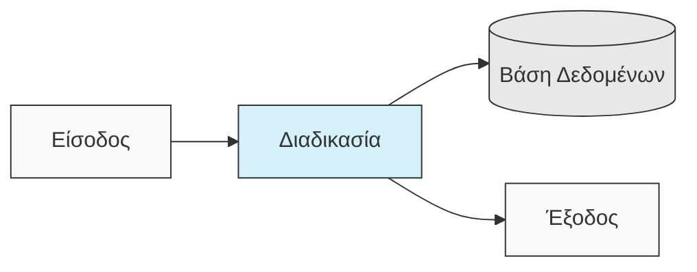
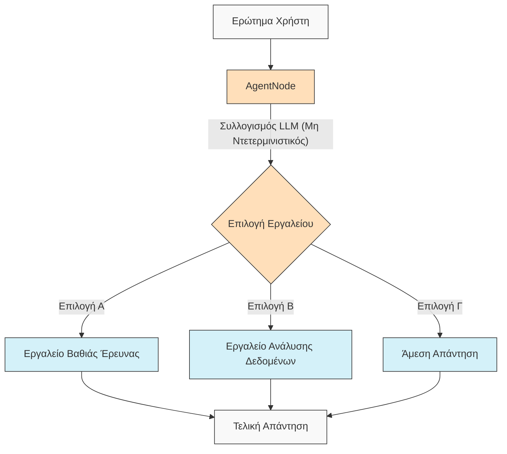
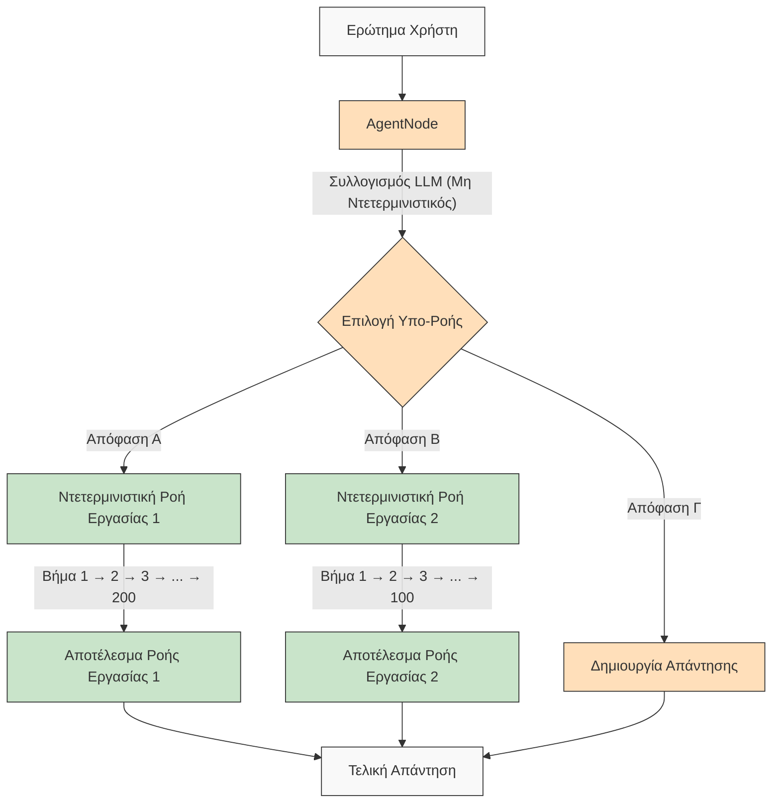

# AgentDock: Δημιουργήστε Απεριόριστες Δυνατότητες με Πράκτορες AI

[](https://github.com/agentdock/agentdock/stargazers)
[](https://opensource.org/licenses/MIT)
[](https://github.com/AgentDock/AgentDock/releases)
[](https://hub.agentdock.ai/docs)
[](https://discord.gg/fDYFFmwuRA)
[](https://agentdock.ai)
[](https://x.com/agentdock)

## 🌐 Μεταφράσεις README

[Français](../french/README.md) • [日本語](../japanese/README.md) • [한국어](../korean/README.md) • [中文](../chinese/README.md) • [Español](../spanish/README.md) • [Italiano](../italian/README.md) • [Nederlands](../dutch/README.md) • [Polski](../polish/README.md) • [Türkçe](../turkish/README.md) • [Українська](../ukrainian/README.md) • [Ελληνικά](./README.md) • [العربية](../arabic/README.md)

Το AgentDock είναι ένα framework για την κατασκευή εξελιγμένων πρακτόρων AI που εκτελούν πολύπλοκες εργασίες με **διαμορφώσιμο ντετερμινισμό**. Αποτελείται από δύο κύρια συστατικά:

1.  **AgentDock Core**: Ένα framework ανοιχτού κώδικα, επικεντρωμένο στο backend, για την κατασκευή και την ανάπτυξη πρακτόρων AI. Είναι σχεδιασμένο να είναι *ανεξάρτητο από το framework* και *ανεξάρτητο από τον πάροχο*, δίνοντάς σας πλήρη έλεγχο στην υλοποίηση του πράκτορά σας.

2.  **Open Source Client**: Μια πλήρης εφαρμογή Next.js που χρησιμεύει ως υλοποίηση αναφοράς και καταναλωτής του framework AgentDock Core. Μπορείτε να το δείτε σε δράση στο [https://hub.agentdock.ai](https://hub.agentdock.ai)

Κατασκευασμένο με TypeScript, το AgentDock δίνει έμφαση στην *απλότητα*, την *επεκτασιμότητα* και τον ***διαμορφώσιμο ντετερμινισμό***, καθιστώντας το ιδανικό για την κατασκευή αξιόπιστων, προβλέψιμων συστημάτων AI που μπορούν να λειτουργούν με ελάχιστη επίβλεψη.

## 🧠 Αρχές Σχεδιασμού

Το AgentDock βασίζεται σε αυτές τις θεμελιώδεις αρχές:

-   **Πρώτα η Απλότητα**: Ελάχιστος απαιτούμενος κώδικας για τη δημιουργία λειτουργικών πρακτόρων
-   **Αρχιτεκτονική Βασισμένη σε Κόμβους (Nodes)**: Όλες οι δυνατότητες υλοποιούνται ως κόμβοι
-   **Εργαλεία ως Εξειδικευμένοι Κόμβοι**: Τα εργαλεία επεκτείνουν το σύστημα κόμβων για τις δυνατότητες του πράκτορα
-   **Διαμορφώσιμος Ντετερμινισμός**: Έλεγχος της προβλεψιμότητας της συμπεριφοράς του πράκτορα
-   **Ασφάλεια Τύπων (Type Safety)**: Πλήρεις τύποι TypeScript παντού

### Διαμορφώσιμος Ντετερμινισμός

Ο ***διαμορφώσιμος ντετερμινισμός*** αποτελεί ακρογωνιαίο λίθο της φιλοσοφίας σχεδιασμού του AgentDock, επιτρέποντάς σας να ισορροπήσετε τις δημιουργικές δυνατότητες της AI με την προβλέψιμη συμπεριφορά του συστήματος:

-   Οι `AgentNode` είναι εγγενώς μη ντετερμινιστικοί καθώς τα LLM μπορούν να παράγουν διαφορετικές απαντήσεις κάθε φορά
-   Οι ροές εργασίας (Workflows) μπορούν να γίνουν πιο ντετερμινιστικές μέσω *καθορισμένων διαδρομών εκτέλεσης εργαλείων*
-   Οι προγραμματιστές μπορούν να **ελέγχουν το επίπεδο ντετερμινισμού** διαμορφώνοντας ποια μέρη του συστήματος χρησιμοποιούν την εξαγωγή συμπερασμάτων LLM
-   Ακόμη και με συστατικά LLM, η συνολική συμπεριφορά του συστήματος παραμένει **προβλέψιμη** μέσω δομημένων αλληλεπιδράσεων εργαλείων
-   Αυτή η ισορροπημένη προσέγγιση επιτρέπει τόσο τη *δημιουργικότητα* όσο και την **αξιοπιστία** στις εφαρμογές σας AI

#### Ντετερμινιστικές Ροές Εργασίας

Το AgentDock υποστηρίζει πλήρως τις ντετερμινιστικές ροές εργασίας με τις οποίες είστε εξοικειωμένοι από τους τυπικούς κατασκευαστές ροών εργασίας. Όλες οι προβλέψιμες διαδρομές εκτέλεσης και τα αξιόπιστα αποτελέσματα που περιμένετε είναι διαθέσιμα, με ή χωρίς εξαγωγή συμπερασμάτων LLM:



#### Μη Ντετερμινιστική Συμπεριφορά Πράκτορα

Με το AgentDock, μπορείτε επίσης να αξιοποιήσετε τους `AgentNode` με LLM όταν χρειάζεστε μεγαλύτερη προσαρμοστικότητα. Τα δημιουργικά αποτελέσματα μπορούν να ποικίλλουν ανάλογα με τις ανάγκες σας, διατηρώντας παράλληλα δομημένα πρότυπα αλληλεπίδρασης:



#### Μη Ντετερμινιστικοί Πράκτορες με Ντετερμινιστικές Υπο-Ροές Εργασίας

Το AgentDock σας προσφέρει τα ***καλύτερα και από τους δύο κόσμους*** συνδυάζοντας τη μη ντετερμινιστική ευφυΐα του πράκτορα με την ντετερμινιστική εκτέλεση ροής εργασίας:



Αυτή η προσέγγιση επιτρέπει την κλήση πολύπλοκων, πολλαπλών βημάτων ροών εργασίας (που ενδέχεται να περιλαμβάνουν εκατοντάδες ντετερμινιστικά βήματα υλοποιημένα εντός εργαλείων ή ως ακολουθίες συνδεδεμένων κόμβων) από έξυπνες αποφάσεις πρακτόρων. Κάθε ροή εργασίας εκτελείται προβλέψιμα παρά το γεγονός ότι ενεργοποιείται από μη ντετερμινιστικό συλλογισμό πράκτορα.

Για πιο προηγμένες ροές εργασίας πρακτόρων AI και πολυσταδιακούς αγωγούς επεξεργασίας, κατασκευάζουμε το [AgentDock Pro](../../docs/agentdock-pro.md) - μια ισχυρή πλατφόρμα για την κατασκευή, οπτικοποίηση και εκτέλεση πολύπλοκων συστημάτων πρακτόρων.

#### Εν συντομία: ο Διαμορφώσιμος Ντετερμινισμός

Σκεφτείτε το όπως την οδήγηση αυτοκινήτου. Μερικές φορές χρειάζεστε τη δημιουργικότητα της AI (όπως η πλοήγηση στους δρόμους της πόλης - μη ντετερμινιστική), και μερικές φορές χρειάζεστε αξιόπιστες, βήμα προς βήμα διαδικασίες (όπως η τήρηση των πινακίδων του αυτοκινητόδρομου - ντετερμινιστική). Το AgentDock σας επιτρέπει να κατασκευάζετε συστήματα που χρησιμοποιούν *και τα δύο*, επιλέγοντας τη σωστή προσέγγιση για κάθε μέρος μιας εργασίας. Συνδυάζετε την ευφυΐα της AI *και* προβλέψιμα αποτελέσματα εκεί που τα χρειάζεστε.

## 🏗️ Κεντρική Αρχιτεκτονική

Το framework είναι χτισμένο γύρω από ένα ισχυρό, αρθρωτό σύστημα βασισμένο σε κόμβους (Nodes), το οποίο χρησιμεύει ως θεμέλιο για όλη τη λειτουργικότητα του πράκτορα. Αυτή η αρχιτεκτονική χρησιμοποιεί διακριτούς τύπους κόμβων ως δομικά στοιχεία:

-   **`BaseNode`**: Η θεμελιώδης κλάση που καθορίζει την κεντρική διεπαφή και τις δυνατότητες για όλους τους κόμβους.
-   **`AgentNode`**: Ένας εξειδικευμένος κεντρικός κόμβος που ενορχηστρώνει τις αλληλεπιδράσεις LLM, τη χρήση εργαλείων και τη λογική του πράκτορα.
-   **Εργαλεία και Προσαρμοσμένοι Κόμβοι**: Οι προγραμματιστές υλοποιούν τις δυνατότητες του πράκτορα και την προσαρμοσμένη λογική ως κόμβους που επεκτείνουν το `BaseNode`.

Αυτοί οι κόμβοι αλληλεπιδρούν μέσω διαχειριζόμενων μητρών και μπορούν να συνδεθούν (αξιοποιώντας τις θύρες της κεντρικής αρχιτεκτονικής και ένα πιθανό δίαυλο μηνυμάτων) για να επιτρέψουν πολύπλοκες, διαμορφώσιμες και δυνητικά ντετερμινιστικές συμπεριφορές και ροές εργασίας πρακτόρων.

Για λεπτομερή επεξήγηση των συστατικών και των δυνατοτήτων του συστήματος κόμβων, ανατρέξτε στην [Τεκμηρίωση Συστήματος Κόμβων](../../docs/nodes/README.md).

## 🚀 Ξεκινώντας

Για έναν περιεκτικό οδηγό, ανατρέξτε στον [Οδηγό Εκκίνησης](../../docs/getting-started.md).

### Απαιτήσεις

*   Node.js ≥ 20.11.0 (LTS)
*   pnpm ≥ 9.15.0 (Απαιτείται)
*   Κλειδιά API για παρόχους LLM (Anthropic, OpenAI, κ.λπ.)

### Εγκατάσταση

1.  **Κλωνοποιήστε το Αποθετήριο**:

    ```bash
    git clone https://github.com/AgentDock/AgentDock.git
    cd AgentDock
    ```

2.  **Εγκαταστήστε το pnpm**:

    ```bash
    corepack enable
    corepack prepare pnpm@latest --activate
    ```

3.  **Εγκαταστήστε τις Εξαρτήσεις**:

    ```bash
    pnpm install
    ```

    Για καθαρή επανεγκατάσταση (όταν χρειάζεται να ξαναχτίσετε από την αρχή):

    ```bash
    pnpm run clean-install
    ```

    Αυτό το σενάριο αφαιρεί όλα τα `node_modules`, τα αρχεία κλειδώματος και επανεγκαθιστά σωστά τις εξαρτήσεις.

4.  **Διαμορφώστε το Περιβάλλον**:

    Δημιουργήστε ένα αρχείο περιβάλλοντος (`.env` ή `.env.local`) βασισμένο στο παρεχόμενο αρχείο `.env.example`:

    ```bash
    # Επιλογή 1: Δημιουργία .env.local
    cp .env.example .env.local

    # Επιλογή 2: Δημιουργία .env
    cp .env.example .env
    ```

    Στη συνέχεια, προσθέστε τα κλειδιά API σας στο αρχείο περιβάλλοντος.

5.  **Ξεκινήστε τον Διακομιστή Ανάπτυξης**:

    ```bash
    pnpm dev
    ```

### Προηγμένες Δυνατότητες

| Δυνατότητα                 | Περιγραφή                                                                                              | Τεκμηρίωση                                                                             |
| :------------------------- | :----------------------------------------------------------------------------------------------------- | :------------------------------------------------------------------------------------- |
| **Διαχείριση Συνεδριών**   | Απομονωμένη, υψηλής απόδοσης διαχείριση κατάστασης για συνομιλίες                                        | [Τεκμηρίωση Συνεδριών](../../docs/architecture/sessions/README.md)                   |
| **Framework Ενορχήστρωσης**| Έλεγχος συμπεριφοράς πράκτορα και διαθεσιμότητας εργαλείων βάσει πλαισίου                             | [Τεκμηρίωση Ενορχήστρωσης](../../docs/architecture/orchestration/README.md)          |
| **Αφαίρεση Αποθήκευσης**   | Ευέλικτο σύστημα αποθήκευσης με συνδεόμενους παρόχους για KV, Vector και Ασφαλή Αποθήκευση           | [Τεκμηρίωση Αποθήκευσης](../../docs/storage/README.md)                               |

Το σύστημα αποθήκευσης εξελίσσεται επί του παρόντος με αποθήκευση κλειδιού-τιμής (πάροχοι Memory, Redis, Vercel KV) και ασφαλή αποθήκευση από την πλευρά του πελάτη, ενώ η αποθήκευση διανυσμάτων και πρόσθετα backends βρίσκονται υπό ανάπτυξη.

## 📕 Τεκμηρίωση

Η τεκμηρίωση του framework AgentDock είναι διαθέσιμη στο [hub.agentdock.ai/docs](https://hub.agentdock.ai/docs) και στον φάκελο `/docs/` αυτού του αποθετηρίου. Η τεκμηρίωση περιλαμβάνει:

-   Οδηγούς εκκίνησης
-   Αναφορές API
-   Εκπαιδευτικά προγράμματα δημιουργίας κόμβων
-   Παραδείγματα ενσωμάτωσης

## 📂 Δομή Αποθετηρίου

Αυτό το αποθετήριο περιέχει:

1.  **AgentDock Core**: Το κεντρικό framework που βρίσκεται στο `agentdock-core/`
2.  **Open Source Client**: Μια πλήρης υλοποίηση αναφοράς χτισμένη με Next.js, που χρησιμεύει ως καταναλωτής του framework AgentDock Core.
3.  **Παραδείγματα Πρακτόρων**: Έτοιμες προς χρήση διαμορφώσεις πρακτόρων στον κατάλογο `agents/`

Μπορείτε να χρησιμοποιήσετε το AgentDock Core ανεξάρτητα στις δικές σας εφαρμογές ή να χρησιμοποιήσετε αυτό το αποθετήριο ως σημείο εκκίνησης για την κατασκευή των δικών σας εφαρμογών που βασίζονται σε πράκτορες.

## 📝 Πρότυπα Πρακτόρων

Το AgentDock περιλαμβάνει διάφορα προδιαμορφωμένα πρότυπα πρακτόρων. Εξερευνήστε τα στον κατάλογο `agents/` ή διαβάστε την [Τεκμηρίωση Προτύπων Πρακτόρων](../../docs/agent-templates.md) για λεπτομέρειες διαμόρφωσης.

## 🔧 Παραδείγματα Υλοποιήσεων

Οι παραδείγματα υλοποιήσεων παρουσιάζουν εξειδικευμένες περιπτώσεις χρήσης και προηγμένη λειτουργικότητα:

| Υλοποίηση                    | Περιγραφή                                                                                               | Κατάσταση      |
| :--------------------------- | :------------------------------------------------------------------------------------------------------- | :------------- |
| **Ενορχηστρωμένος Πράκτορας**| Παράδειγμα πράκτορα που χρησιμοποιεί ενορχήστρωση για την προσαρμογή της συμπεριφοράς βάσει πλαισίου    | Διαθέσιμο    |
| **Γνωστικός Συλλογιστής**    | Αντιμετωπίζει πολύπλοκα προβλήματα χρησιμοποιώντας δομημένο συλλογισμό και γνωστικά εργαλεία             | Διαθέσιμο    |
| **Σχεδιαστής Πρακτόρων**      | Εξειδικευμένος πράκτορας για τον σχεδιασμό και την υλοποίηση άλλων πρακτόρων AI                          | Διαθέσιμο    |
| [**Code Playground (Περιβάλλον Δοκιμών Κώδικα)**](../../docs/roadmap/code-playground.md) | Δημιουργία και εκτέλεση κώδικα σε sandbox με πλούσιες δυνατότητες οπτικοποίησης                      | Προγραμματισμένο |
| [**Γενικός Πράκτορας AI**](../../docs/roadmap/generalist-agent.md)| Πράκτορας τύπου Manus που μπορεί να χρησιμοποιήσει το πρόγραμμα περιήγησης και να εκτελέσει πολύπλοκες εργασίες | Προγραμματισμένο |

## 🔐 Λεπτομέρειες Διαμόρφωσης Περιβάλλοντος

Ο AgentDock Open Source Client απαιτεί κλειδιά API για τους παρόχους LLM για να λειτουργήσει. Αυτά διαμορφώνονται σε ένα αρχείο περιβάλλοντος (`.env` ή `.env.local`) που δημιουργείτε με βάση το παρεχόμενο αρχείο `.env.example`.

### Κλειδιά API Παρόχων LLM

Προσθέστε τα κλειδιά API του παρόχου LLM (απαιτείται τουλάχιστον ένα):

```bash
# Κλειδιά API Παρόχων LLM - απαιτείται τουλάχιστον ένα
ANTHROPIC_API_KEY=sk-ant-xxxxxxx  # Κλειδί API Anthropic
OPENAI_API_KEY=sk-xxxxxxx         # Κλειδί API OpenAI
GEMINI_API_KEY=xxxxxxx            # Κλειδί API Google Gemini
DEEPSEEK_API_KEY=xxxxxxx          # Κλειδί API DeepSeek
GROQ_API_KEY=xxxxxxx              # Κλειδί API Groq
```

### Επίλυση Κλειδιού API

Ο AgentDock Open Source Client ακολουθεί μια σειρά προτεραιότητας κατά την επίλυση του ποιου κλειδιού API θα χρησιμοποιηθεί:

1.  **Προσαρμοσμένο κλειδί API ανά πράκτορα** (ορίζεται μέσω των ρυθμίσεων πράκτορα στο UI)
2.  **Κλειδί API καθολικών ρυθμίσεων** (ορίζεται μέσω της σελίδας ρυθμίσεων στο UI)
3.  **Μεταβλητή περιβάλλοντος** (από το `.env.local` ή την πλατφόρμα ανάπτυξης)

### Κλειδιά API Ειδικά για Εργαλεία

Ορισμένα εργαλεία απαιτούν επίσης τα δικά τους κλειδιά API:

```bash
# Κλειδιά API Ειδικά για Εργαλεία
SERPER_API_KEY=                  # Απαιτείται για λειτουργικότητα αναζήτησης
FIRECRAWL_API_KEY=               # Απαιτείται για βαθύτερη περιήγηση στον ιστό
```

Για περισσότερες λεπτομέρειες σχετικά με τη διαμόρφωση περιβάλλοντος, ανατρέξτε στην υλοποίηση στο [`src/types/env.ts`](../../src/types/env.ts).

### Χρησιμοποιήστε τα Δικά σας Κλειδιά API (BYOK)

Το AgentDock ακολουθεί ένα μοντέλο BYOK (Bring Your Own Key - Χρησιμοποιήστε το Δικό σας Κλειδί):

1.  Προσθέστε τα κλειδιά API σας στη σελίδα ρυθμίσεων της εφαρμογής
2.  Εναλλακτικά, παρέχετε κλειδιά μέσω των κεφαλίδων αιτήματος για άμεση χρήση του API
3.  Τα κλειδιά αποθηκεύονται με ασφάλεια χρησιμοποιώντας το ενσωματωμένο σύστημα κρυπτογράφησης
4.  Κανένα κλειδί API δεν κοινοποιείται ή αποθηκεύεται στους διακομιστές μας

## 📦 Διαχειριστής Πακέτων

Αυτό το έργο *απαιτεί* τη χρήση του `pnpm` για συνεπή διαχείριση εξαρτήσεων. Τα `npm` και `yarn` δεν υποστηρίζονται.

## 💡 Τι Μπορείτε να Κατασκευάσετε

1.  **Εφαρμογές Βασισμένες στην AI**
    -   Προσαρμοσμένα chatbots με οποιοδήποτε frontend
    -   Βοηθοί AI γραμμής εντολών
    -   Αυτοματοποιημένοι αγωγοί επεξεργασίας δεδομένων
    -   Ενσωματώσεις υπηρεσιών backend

2.  **Δυνατότητες Ενσωμάτωσης**
    -   Οποιοσδήποτε πάροχος AI (OpenAI, Anthropic, κ.λπ.)
    -   Οποιοδήποτε framework frontend
    -   Οποιαδήποτε υπηρεσία backend
    -   Προσαρμοσμένες πηγές δεδομένων και API

3.  **Συστήματα Αυτοματισμού**
    -   Workflows επεξεργασίας δεδομένων
    -   Pipeline ανάλυσης εγγράφων
    -   Αυτοματοποιημένα συστήματα αναφορών
    -   Πράκτορες αυτοματισμού εργασιών

## Βασικά Χαρακτηριστικά

| Χαρακτηριστικό               | Περιγραφή                                                                                          |
| :--------------------------- | :------------------------------------------------------------------------------------------------- |
| 🔌 **Ανεξάρτητο από Framework (Node.js Backend)** | Η κεντρική βιβλιοθήκη ενσωματώνεται με στοίβες backend Node.js.                                |
| 🧩 **Αρθρωτός Σχεδιασμός**   | Κατασκευή πολύπλοκων συστημάτων από απλούς κόμβους                                                |
| 🛠️ **Επεκτάσιμο**            | Δημιουργία προσαρμοσμένων κόμβων για οποιαδήποτε λειτουργικότητα                              |
| 🔒 **Ασφαλές**               | Ενσωματωμένα χαρακτηριστικά ασφαλείας για κλειδιά API και δεδομένα                               |
| 🔑 **BYOK**                  | Χρησιμοποιήστε τα *δικά σας κλειδιά API* για παρόχους LLM                                        |
| 📦 **Αυτοτελές**              | Το κεντρικό framework έχει ελάχιστες εξαρτήσεις                                      |
| ⚙️ **Κλήσεις Εργαλείων Πολλαπλών Σταδίων (Multi-Step Tool Calls)** | Υποστήριξη για *πολύπλοκες αλυσίδες συλλογισμού*                                  |
| 📊 **Δομημένη Καταγραφή**    | Λεπτομερείς πληροφορίες για την εκτέλεση του πράκτορα                                |
| 🛡️ **Στιβαρός Χειρισμός Σφαλμάτων**| Προβλέψιμη συμπεριφορά και απλοποιημένος εντοπισμός σφαλμάτων                      |
| 📝 **Πρώτα το TypeScript**     | Ασφάλεια τύπων και βελτιωμένη εμπειρία προγραμματιστή                               |
| 🌐 **Open Source Client**     | Περιλαμβάνει πλήρη υλοποίηση αναφοράς Next.js                                      |
| 🔄 **Ενορχήστρωση**          | *Δυναμικός έλεγχος* της συμπεριφοράς του πράκτορα βάσει πλαισίου                                 |
| 💾 **Διαχείριση Συνεδριών**  | Απομονωμένη κατάσταση για ταυτόχρονες συνομιλίες                                                  |
| 🎮 **Διαμορφώσιμος Ντετερμινισμός**| Ισορροπήστε τη δημιουργικότητα της AI και την προβλεψιμότητα μέσω της λογικής κόμβου/ροής εργασίας.|

## 🧰 Συστατικά

Η αρθρωτή αρχιτεκτονική του AgentDock βασίζεται σε αυτά τα βασικά συστατικά:

*   **BaseNode**: Η βάση για όλους τους κόμβους στο σύστημα
*   **AgentNode**: Η κύρια αφαίρεση για τη λειτουργικότητα του πράκτορα
*   **Εργαλεία και Προσαρμοσμένοι Κόμβοι**: Κλητές δυνατότητες και προσαρμοσμένη λογική υλοποιημένες ως κόμβοι.
*   **Μητρώο Κόμβων**: Διαχειρίζεται την εγγραφή και ανάκτηση όλων των τύπων κόμβων
*   **Μητρώο Εργαλείων**: Διαχειρίζεται τη διαθεσιμότητα εργαλείων για τους πράκτορες
*   **CoreLLM**: Ενοποιημένη διεπαφή για αλληλεπίδραση με παρόχους LLM
*   **Μητρώο Παρόχων**: Διαχειρίζεται τις διαμορφώσεις παρόχων LLM
*   **Χειρισμός Σφαλμάτων**: Σύστημα για τον χειρισμό σφαλμάτων και τη διασφάλιση προβλέψιμης συμπεριφοράς
*   **Καταγραφή (Logging)**: Δομημένο σύστημα καταγραφής για παρακολούθηση και εντοπισμό σφαλμάτων
*   **Ενορχήστρωση**: Ελέγχει τη διαθεσιμότητα εργαλείων και τη συμπεριφορά βάσει του πλαισίου συνομιλίας
*   **Συνεδρίες**: Διαχειρίζεται την απομόνωση κατάστασης μεταξύ ταυτόχρονων συνομιλιών

Για λεπτομερή τεχνική τεκμηρίωση σχετικά με αυτά τα συστατικά, ανατρέξτε στην [Επισκόπηση Αρχιτεκτονικής](../../docs/architecture/README.md).

## 🗺️ Οδικός Χάρτης

Παρακάτω παρουσιάζεται ο οδικός χάρτης ανάπτυξης για το AgentDock. Οι περισσότερες από τις βελτιώσεις που αναφέρονται εδώ αφορούν το κεντρικό framework του AgentDock (`agentdock-core`), το οποίο αναπτύσσεται επί του παρόντος τοπικά και θα κυκλοφορήσει ως πακέτο NPM με έκδοση μόλις επιτευχθεί μια σταθερή έκδοση. Ορισμένα στοιχεία του οδικού χάρτη ενδέχεται επίσης να περιλαμβάνουν βελτιώσεις στην υλοποίηση του πελάτη ανοιχτού κώδικα.

| Χαρακτηριστικό                                                                  | Περιγραφή                                                                                              | Κατηγορία         |
| :--------------------------------------------------------------------------- | :----------------------------------------------------------------------------------------------------- | :---------------- |
| [**Επίπεδο Αφαίρεσης Αποθήκευσης**](../../docs/roadmap/storage-abstraction.md) | Ευέλικτο σύστημα αποθήκευσης με συνδεόμενους παρόχους                                                | **Υπό Εξέλιξη**   |
| [**Προηγμένα Συστήματα Μνήμης**](../../docs/roadmap/advanced-memory.md)         | Διαχείριση μακροπρόθεσμου πλαισίου                                                                   | **Υπό Εξέλιξη**   |
| [**Ενσωμάτωση Αποθήκευσης Διανυσμάτων**](../../docs/roadmap/vector-storage.md)   | Ανάκτηση βάσει ενσωματώσεων για έγγραφα και μνήμη                                                    | **Υπό Εξέλιξη**   |
| [**Αξιολόγηση για Πράκτορες AI**](../../docs/roadmap/evaluation-framework.md)   | Ολοκληρωμένο πλαίσιο δοκιμών και αξιολόγησης                                                          | **Υπό Εξέλιξη**   |
| [**Ενσωμάτωση Πλατφορμών**](../../docs/roadmap/platform-integration.md)       | Υποστήριξη για Telegram, WhatsApp και άλλες πλατφόρμες ανταλλαγής μηνυμάτων                          | **Προγραμματισμένο**|
| [**Συνεργασία Πολλαπλών Πρακτόρων**](../../docs/roadmap/multi-agent-collaboration.md)| Δυνατότητα συνεργασίας πρακτόρων                                                                     | **Προγραμματισμένο**|
| [**Ενσωμάτωση Πρωτοκόλλου Πλαισίου Μοντέλου (MCP)**](../../docs/roadmap/mcp-integration.md)| Υποστήριξη για την ανακάλυψη και χρήση εξωτερικών εργαλείων μέσω MCP                                  | **Προγραμματισμένο**|
| [**Φωνητικοί Πράκτορες AI**](../../docs/roadmap/voice-agents.md)               | Πράκτορες AI που χρησιμοποιούν φωνητικές διεπαφές και αριθμούς τηλεφώνου μέσω του AgentNode           | **Προγραμματισμένο**|
| [**Τηλεμετρία & Ιχνηλασιμότητα**](../../docs/roadmap/telemetry.md)           | Προηγμένη καταγραφή και παρακολούθηση απόδοσης                                                      | **Προγραμματισμένο**|
| [**AgentDock Pro**](../../docs/agentdock-pro.md)                            | Πλήρης εταιρική πλατφόρμα cloud για την κλιμάκωση πρακτόρων AI και ροών εργασίας                   | **Cloud**         |
| [**Κατασκευαστής Πρακτόρων AI Φυσικής Γλώσσας**](../../docs/roadmap/nl-agent-builder.md)| Οπτικός κατασκευαστής + κατασκευή πρακτόρων & ροών εργασίας φυσικής γλώσσας                      | **Cloud**         |
| [**Αγορά Πρακτόρων**](../../docs/roadmap/agent-marketplace.md)               | Πρότυπα πρακτόρων με δυνατότητα δημιουργίας εσόδων                                                   | **Cloud**         |

## 👥 Συνεισφορά

Καλωσορίζουμε τις συνεισφορές στο AgentDock! Ανατρέξτε στο [CONTRIBUTING.md](../../CONTRIBUTING.md) για λεπτομερείς οδηγίες συνεισφοράς.

## 📜 Άδεια

Το AgentDock κυκλοφορεί υπό την [Άδεια MIT](../../LICENSE).

## ✨ Δημιουργήστε Χωρίς Όρια!

Το AgentDock παρέχει τα θεμέλια για να κατασκευάσετε σχεδόν οποιαδήποτε εφαρμογή ή αυτοματισμό που βασίζεται σε AI μπορείτε να φανταστείτε. Σας ενθαρρύνουμε να εξερευνήσετε το framework, να κατασκευάσετε καινοτόμους πράκτορες και να συνεισφέρετε πίσω στην κοινότητα. Ας χτίσουμε μαζί το μέλλον της αλληλεπίδρασης AI!

---
[Επιστροφή στον Κατάλογο Μεταφράσεων](../README.md) 