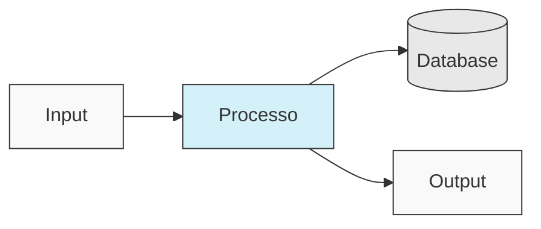
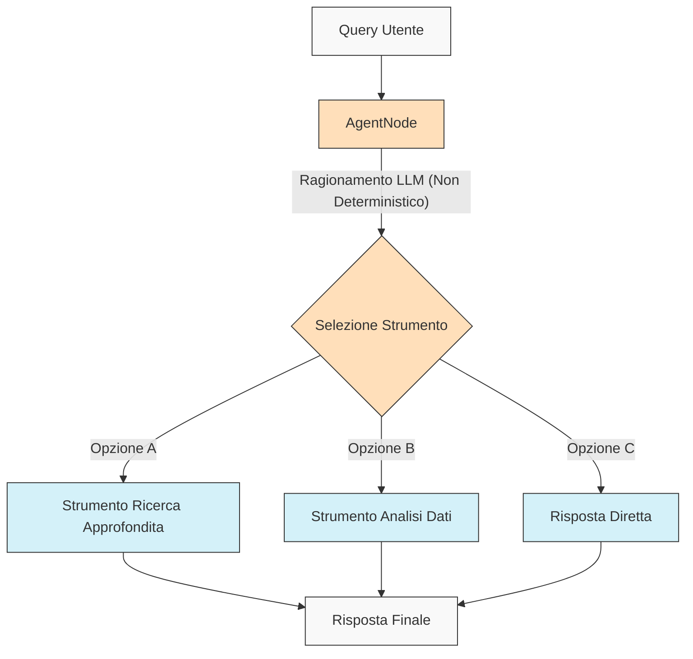
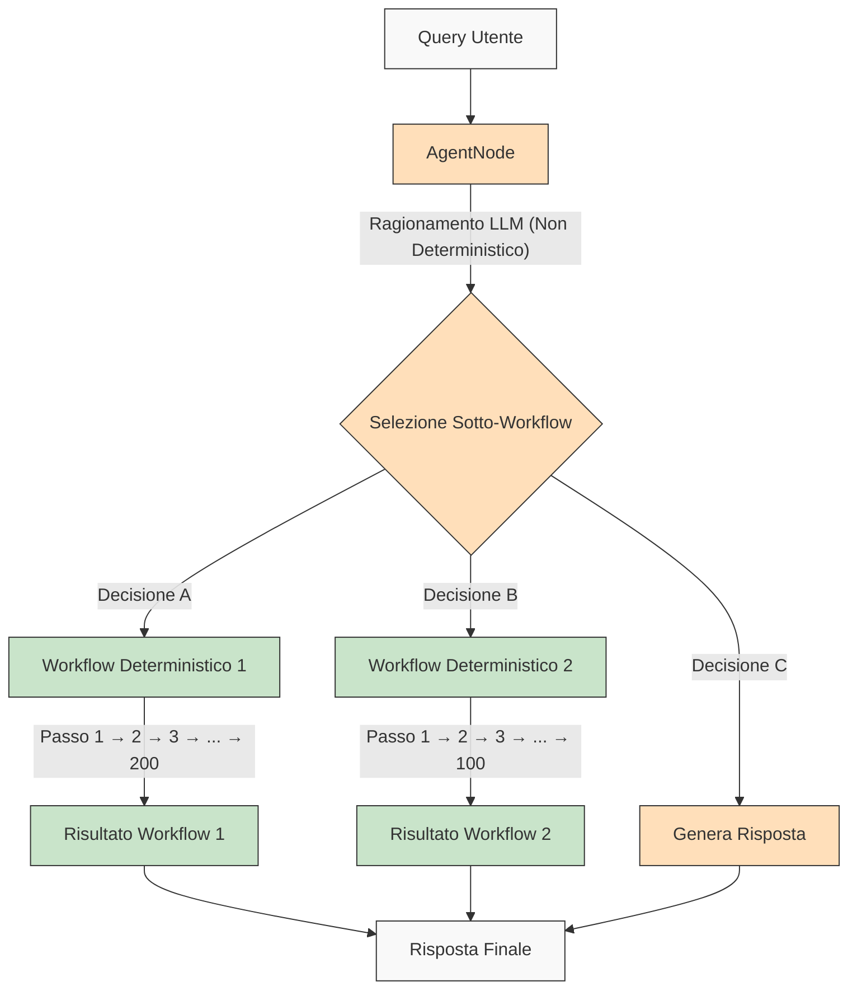

<p align="center">
  
</p>

## 🌐 Traduzioni README

[Français](/docs/i18n/french/README.md) • [日本語](/docs/i18n/japanese/README.md) • [한국어](/docs/i18n/korean/README.md) • [中文](/docs/i18n/chinese/README.md) • [Español](/docs/i18n/spanish/README.md) • [Italiano](/docs/i18n/italian/README.md) • [Nederlands](/docs/i18n/dutch/README.md) • [Deutsch](/docs/i18n/deutsch/README.md) • [Polski](/docs/i18n/polish/README.md) • [Türkçe](/docs/i18n/turkish/README.md) • [Українська](/docs/i18n/ukrainian/README.md) • [Ελληνικά](/docs/i18n/greek/README.md) • [Русский](/docs/i18n/russian/README.md) • [العربية](/docs/i18n/arabic/README.md)

# AgentDock: Crea Possibilità Infinite con Agenti AI

AgentDock è un framework per costruire sofisticati agenti AI che svolgono compiti complessi con **determinismo configurabile**. È composto da due componenti principali:

1.  **AgentDock Core**: Un framework open-source, backend-first per costruire e distribuire agenti AI. È progettato per essere *agnostico rispetto al framework* e *agnostico rispetto al provider*, dandoti il controllo completo sull'implementazione del tuo agente.

2.  **Client Open Source**: Un'applicazione Next.js completa che serve come implementazione di riferimento e consumatore del framework AgentDock Core. Puoi vederla in azione su [https://hub.agentdock.ai](https://hub.agentdock.ai)

Costruito con TypeScript, AgentDock enfatizza la *semplicità*, l'*estensibilità* e il ***determinismo configurabile***, rendendolo ideale per costruire sistemi AI affidabili e prevedibili che possono operare con una supervisione minima.

## 🧠 Principi di Progettazione

AgentDock è costruito su questi principi fondamentali:

-   **Semplicità Prima di Tutto**: Codice minimo richiesto per creare agenti funzionali
-   **Architettura Basata su Nodi**: Tutte le capacità sono implementate come nodi
-   **Strumenti come Nodi Specializzati**: Gli strumenti estendono il sistema di nodi per le capacità dell'agente
-   **Determinismo Configurabile**: Controlla la prevedibilità del comportamento dell'agente
-   **Sicurezza dei Tipi**: Tipi TypeScript completi ovunque

### Determinismo Configurabile

Il ***determinismo configurabile*** è una pietra miliare della filosofia di progettazione di AgentDock, permettendoti di bilanciare le capacità creative dell'AI con un comportamento di sistema prevedibile:

-   Gli AgentNode sono intrinsecamente non deterministici poiché gli LLM possono generare risposte diverse ogni volta
-   I workflow possono essere resi più deterministici attraverso *percorsi di esecuzione degli strumenti definiti*
-   Gli sviluppatori possono **controllare il livello di determinismo** configurando quali parti del sistema utilizzano l'inferenza LLM
-   Anche con componenti LLM, il comportamento complessivo del sistema rimane **prevedibile** attraverso interazioni strutturate degli strumenti
-   Questo approccio equilibrato consente sia la *creatività* che l'**affidabilità** nelle tue applicazioni AI

#### Workflow Deterministici

AgentDock supporta pienamente i workflow deterministici con cui hai familiarità dai tipici costruttori di workflow. Tutti i percorsi di esecuzione prevedibili e i risultati affidabili che ti aspetti sono disponibili, con o senza inferenza LLM:



#### Comportamento Agente Non Deterministico

Con AgentDock, puoi anche sfruttare gli AgentNode con LLM quando hai bisogno di maggiore adattabilità. Gli output creativi possono variare in base alle tue esigenze, mantenendo comunque pattern di interazione strutturati:



#### Agenti Non Deterministici con Sotto-Workflow Deterministici

AgentDock ti offre il ***meglio di entrambi i mondi*** combinando l'intelligenza dell'agente non deterministico con l'esecuzione deterministica del workflow:



Questo approccio consente a workflow complessi multi-step (potenzialmente coinvolgendo centinaia di passaggi deterministici implementati all'interno di strumenti o come sequenze di nodi collegati) di essere invocati da decisioni di agenti intelligenti. Ogni workflow si esegue in modo prevedibile nonostante sia attivato da un ragionamento di agente non deterministico.

Per workflow di agenti AI più avanzati e pipeline di elaborazione multi-stage, stiamo costruendo [AgentDock Pro](../../docs/agentdock-pro.md) - una potente piattaforma per creare, visualizzare ed eseguire sistemi di agenti complessi.

#### In breve: il Determinismo Configurabile

Pensalo come quando guidi. A volte hai bisogno della creatività dell'AI (come navigare nelle strade cittadine - non deterministico), e a volte hai bisogno di processi affidabili, passo dopo passo (come seguire i segnali autostradali - deterministico). AgentDock ti consente di costruire sistemi che usano *entrambi*, scegliendo l'approccio giusto per ogni parte di un compito. Ottieni sia l'intelligenza dell'AI *che* risultati prevedibili quando ti servono.

## 🏗️ Architettura Core

Il framework è costruito attorno a un sistema potente e modulare basato su nodi, che funge da base per tutte le funzionalità dell'agente. Questa architettura utilizza tipi di nodi distinti come blocchi costitutivi:

-   **`BaseNode`**: La classe fondamentale che stabilisce l'interfaccia principale e le capacità per tutti i nodi.
-   **`AgentNode`**: Un nodo core specializzato che orchestra le interazioni LLM, l'uso degli strumenti e la logica dell'agente.
-   **Strumenti e Nodi Personalizzati**: Gli sviluppatori implementano le capacità dell'agente e la logica personalizzata come nodi che estendono `BaseNode`.

Questi nodi interagiscono tramite registri gestiti e possono essere collegati (sfruttando le porte dell'architettura core e un potenziale bus di messaggi) per abilitare comportamenti e workflow di agenti complessi, configurabili e potenzialmente deterministici.

Per una spiegazione dettagliata dei componenti e delle capacità del sistema di nodi, consulta la [Documentazione del Sistema di Nodi](../../docs/nodes/README.md).

## 🚀 Iniziare

Per una guida completa, consulta la [Guida Introduttiva](../../docs/getting-started.md).

### Requisiti

*   Node.js ≥ 20.11.0 (LTS)
*   pnpm ≥ 9.15.0 (Richiesto)
*   Chiavi API per provider LLM (Anthropic, OpenAI, etc.)

### Installazione

1.  **Clona il Repository**:

    ```bash
    git clone https://github.com/AgentDock/AgentDock.git
    cd AgentDock
    ```

2.  **Installa pnpm**:

    ```bash
    corepack enable
    corepack prepare pnpm@latest --activate
    ```

3.  **Installa le Dipendenze**:

    ```bash
    pnpm install
    ```

    Per una reinstallazione pulita (quando devi ricostruire da zero):

    ```bash
    pnpm run clean-install
    ```

    Questo script rimuove tutti i node_modules, i file di lock e reinstalla correttamente le dipendenze.

4.  **Configura l'Ambiente**:

    Crea un file di ambiente (`.env` o `.env.local`) basato sul file `.env.example` fornito:

    ```bash
    # Opzione 1: Crea .env.local
    cp .env.example .env.local

    # Opzione 2: Crea .env
    cp .env.example .env
    ```

    Poi aggiungi le tue chiavi API al file di ambiente.

5.  **Avvia il Server di Sviluppo**:

    ```bash
    pnpm dev
    ```

### Capacità Avanzate

| Capacità                  | Descrizione                                                                                     | Documentazione                                                                      |
| :------------------------ | :---------------------------------------------------------------------------------------------- | :---------------------------------------------------------------------------------- |
| **Gestione Sessioni**     | Gestione dello stato isolata e performante per le conversazioni                           | [Documentazione Sessioni](../../docs/architecture/sessions/README.md)           |
| **Framework Orchestrazione** | Controllo del comportamento dell'agente e disponibilità degli strumenti basato sul contesto    | [Documentazione Orchestrazione](../../docs/architecture/orchestration/README.md)  |
| **Astrazione Storage**    | Sistema di storage flessibile con provider collegabili per KV, Vector e Secure Storage       | [Documentazione Storage](../../docs/storage/README.md)                    |

Il sistema di storage si sta attualmente evolvendo con storage chiave-valore (provider Memory, Redis, Vercel KV) e storage sicuro lato client, mentre lo storage vettoriale e backend aggiuntivi sono in fase di sviluppo.

## 📕 Documentazione

La documentazione del framework AgentDock è disponibile su [hub.agentdock.ai/docs](https://hub.agentdock.ai/docs) e nella cartella `/docs/` di questo repository. La documentazione include:

-   Guide introduttive
-   Riferimenti API
-   Tutorial sulla creazione di nodi
-   Esempi di integrazione

## 📂 Struttura Repository

Questo repository contiene:

1.  **AgentDock Core**: Il framework core situato in `agentdock-core/`
2.  **Client Open Source**: Un'implementazione di riferimento completa costruita con Next.js, che serve come consumatore del framework AgentDock Core.
3.  **Agenti Esempio**: Configurazioni di agenti pronte all'uso nella directory `agents/`

Puoi usare AgentDock Core indipendentemente nelle tue applicazioni, o usare questo repository come punto di partenza per costruire le tue applicazioni basate su agenti.

## 📝 Template Agenti

AgentDock include diversi template di agenti preconfigurati. Esplorali nella directory `agents/` o leggi la [Documentazione Template Agenti](../../docs/agent-templates.md) per i dettagli di configurazione.

## 🔧 Implementazioni Esempio

Le implementazioni esempio mostrano casi d'uso specializzati e funzionalità avanzate:

| Implementazione              | Descrizione                                                                                    | Stato       |
| :--------------------------- | :--------------------------------------------------------------------------------------------- | :---------- |
| **Agente Orchestrato**       | Agente esempio che utilizza l'orchestrazione per adattare il comportamento in base al contesto | Disponibile |
| **Ragionatore Cognitivo**    | Affronta problemi complessi usando ragionamento strutturato e strumenti cognitivi             | Disponibile |
| **Pianificatore Agenti**     | Agente specializzato per progettare e implementare altri agenti AI                            | Disponibile |
| [**Playground di Codice (Code Playground)**](../../docs/roadmap/code-playground.md) | Generazione ed esecuzione di codice sandboxed con ricche capacità di visualizzazione         | Pianificato |
| [**Agente AI Generalista**](../../docs/roadmap/generalist-agent.md) | Agente simile a Manus che può usare il browser ed eseguire compiti complessi               | Pianificato |

## 🔐 Dettagli Configurazione Ambiente

Il Client Open Source di AgentDock richiede chiavi API per i provider LLM per funzionare. Queste sono configurate in un file di ambiente (`.env` o `.env.local`) che crei basandoti sul file `.env.example` fornito.

### Chiavi API Provider LLM

Aggiungi le tue chiavi API del provider LLM (almeno una richiesta):

```bash
# Chiavi API Provider LLM - almeno una richiesta
ANTHROPIC_API_KEY=sk-ant-xxxxxxx  # Chiave API Anthropic
OPENAI_API_KEY=sk-xxxxxxx         # Chiave API OpenAI
GEMINI_API_KEY=xxxxxxx            # Chiave API Google Gemini
DEEPSEEK_API_KEY=xxxxxxx          # Chiave API DeepSeek
GROQ_API_KEY=xxxxxxx              # Chiave API Groq
```

### Risoluzione Chiave API

Il Client Open Source di AgentDock segue un ordine di priorità nel risolvere quale chiave API usare:

1.  **Chiave API personalizzata per agente** (impostata tramite le impostazioni dell'agente nell'UI)
2.  **Chiave API di impostazione globale** (impostata tramite la pagina delle impostazioni nell'UI)
3.  **Variabile d'ambiente** (da .env.local o piattaforma di deploy)

### Chiavi API Specifiche per Strumento

Alcuni strumenti richiedono anche le proprie chiavi API:

```bash
# Chiavi API Specifiche per Strumento
SERPER_API_KEY=                  # Richiesto per funzionalità di ricerca
FIRECRAWL_API_KEY=               # Richiesto per ricerca web più approfondita
```

Per maggiori dettagli sulla configurazione dell'ambiente, consulta l'implementazione in [`src/types/env.ts`](../../src/types/env.ts).

### Usa le Tue Chiavi API (BYOK)

AgentDock segue un modello BYOK (Bring Your Own Key - Usa la Tua Chiave):

1.  Aggiungi le tue chiavi API nella pagina delle impostazioni dell'applicazione
2.  Alternativamente, fornisci le chiavi tramite header di richiesta per l'uso diretto dell'API
3.  Le chiavi sono memorizzate in modo sicuro usando il sistema di crittografia integrato
4.  Nessuna chiave API viene condivisa o memorizzata sui nostri server

## 📦 Gestore dei Pacchetti

Questo progetto *richiede* l'uso di `pnpm` per una gestione coerente delle dipendenze. `npm` e `yarn` non sono supportati.

## 💡 Cosa Puoi Costruire

1.  **Applicazioni Basate su AI**
    -   Chatbot personalizzati con qualsiasi frontend
    -   Assistenti AI da riga di comando
    -   Pipeline di elaborazione dati automatizzate
    -   Integrazioni di servizi backend

2.  **Capacità di Integrazione**
    -   Qualsiasi provider AI (OpenAI, Anthropic, etc.)
    -   Qualsiasi framework frontend
    -   Qualsiasi servizio backend
    -   Sorgenti dati e API personalizzate

3.  **Sistemi di Automazione**
    -   Workflow di elaborazione dati
    -   Pipeline di analisi documenti
    -   Sistemi di reporting automatizzati
    -   Agenti di automazione compiti

## Caratteristiche Principali

| Caratteristica                 | Descrizione                                                                                    |
| :----------------------------- | :--------------------------------------------------------------------------------------------- |
| 🔌 **Agnostico al Framework (Backend Node.js)** | La libreria core si integra con stack backend Node.js.                                       |
| 🧩 **Design Modulare**         | Costruisci sistemi complessi da nodi semplici                                                  |
| 🛠️ **Estensibile**             | Crea nodi personalizzati per qualsiasi funzionalità                                           |
| 🔒 **Sicuro**                  | Funzionalità di sicurezza integrate per chiavi API e dati                                     |
| 🔑 **BYOK**                    | Usa le *tue chiavi API* per i provider LLM                                             |
| 📦 **Auto-sufficiente**         | Il framework core ha dipendenze minime                                                         |
| ⚙️ **Chiamate Strumento Multi-Fase (Multi-Step Tool Calls)** | Supporto per *catene di ragionamento complesse*                                            |
| 📊 **Logging Strutturato**     | Insight dettagliati sull'esecuzione dell'agente                                                |
| 🛡️ **Gestione Errori Robusta** | Comportamento prevedibile e debugging semplificato                                             |
| 📝 **TypeScript First**        | Sicurezza dei tipi ed esperienza sviluppatore migliorata                                       |
| 🌐 **Client Open Source**      | Include implementazione di riferimento completa Next.js                                        |
| 🔄 **Orchestrazione**          | *Controllo dinamico* del comportamento dell'agente basato sul contesto                        |
| 💾 **Gestione Sessioni**       | Stato isolato per conversazioni concorrenti                                                    |
| 🎮 **Determinismo Configurabile** | Bilancia creatività AI e prevedibilità tramite logica nodi/workflow.                           |

## 🧰 Componenti

L'architettura modulare di AgentDock è costruita su questi componenti chiave:

*   **BaseNode**: La base per tutti i nodi nel sistema
*   **AgentNode**: L'astrazione principale per la funzionalità dell'agente
*   **Strumenti e Nodi Personalizzati**: Capacità invocabili e logica personalizzata implementate come nodi.
*   **Registro Nodi**: Gestisce la registrazione e il recupero di tutti i tipi di nodo
*   **Registro Strumenti**: Gestisce la disponibilità degli strumenti per gli agenti
*   **CoreLLM**: Interfaccia unificata per interagire con i provider LLM
*   **Registro Provider**: Gestisce le configurazioni dei provider LLM
*   **Gestione Errori**: Sistema per gestire gli errori e garantire un comportamento prevedibile
*   **Logging**: Sistema di logging strutturato per monitoraggio e debugging
*   **Orchestrazione**: Controlla la disponibilità degli strumenti e il comportamento in base al contesto della conversazione
*   **Sessioni**: Gestisce l'isolamento dello stato tra conversazioni concorrenti

Per documentazione tecnica dettagliata su questi componenti, consulta la [Panoramica Architettura](../../docs/architecture/README.md).

## 🗺️ Roadmap

Di seguito la nostra roadmap di sviluppo per AgentDock. La maggior parte dei miglioramenti elencati qui riguarda il framework core di AgentDock (`agentdock-core`), attualmente sviluppato localmente e che sarà pubblicato come pacchetto NPM versionato una volta raggiunta una release stabile. Alcuni elementi della roadmap potrebbero anche comportare miglioramenti all'implementazione del client open-source.

| Caratteristica                                                                | Descrizione                                                                                     | Categoria      |
| :---------------------------------------------------------------------------- | :---------------------------------------------------------------------------------------------- | :------------- |
| [**Livello Astrazione Storage**](../../docs/roadmap/storage-abstraction.md)      | Sistema di storage flessibile con provider collegabili                                          | **In Corso**   |
| [**Sistemi Memoria Avanzati**](../../docs/roadmap/advanced-memory.md)            | Gestione del contesto a lungo termine                                                           | **In Corso**   |
| [**Integrazione Storage Vettoriale**](../../docs/roadmap/vector-storage.md)       | Recupero basato su embedding per documenti e memoria                                           | **In Corso**   |
| [**Valutazione Agenti AI**](../../docs/roadmap/evaluation-framework.md)         | Framework completo di testing e valutazione                                                   | **In Corso**   |
| [**Integrazione Piattaforme**](../../docs/roadmap/platform-integration.md)       | Supporto per Telegram, WhatsApp e altre piattaforme di messaggistica                           | **Pianificato**|
| [**Collaborazione Multi-Agente**](../../docs/roadmap/multi-agent-collaboration.md)| Consentire agli agenti di lavorare insieme                                                      | **Pianificato**|
| [**Integrazione Protocollo Contesto Modello (MCP)**](../../docs/roadmap/mcp-integration.md) | Supporto per scoprire e usare strumenti esterni tramite MCP                                    | **Pianificato**|
| [**Agenti AI Vocali**](../../docs/roadmap/voice-agents.md)                       | Agenti AI che usano interfacce vocali e numeri di telefono tramite AgentNode                  | **Pianificato**|
| [**Telemetria e Tracciabilità**](../../docs/roadmap/telemetry.md)               | Logging avanzato e tracciamento delle prestazioni                                                | **Pianificato**|
| [**AgentDock Pro**](../../docs/agentdock-pro.md)                             | Piattaforma cloud enterprise completa per scalare agenti e workflow AI                        | **Cloud**      |
| [**Costruttore Agenti AI in Linguaggio Naturale**](../../docs/roadmap/nl-agent-builder.md)| Costruttore visuale + costruzione di agenti e workflow in linguaggio naturale                  | **Cloud**      |
| [**Marketplace Agenti**](../../docs/roadmap/agent-marketplace.md)           | Template agenti monetizzabili                                                                 | **Cloud**      |

## 👥 Contribuire

Accogliamo contributi ad AgentDock! Consulta [CONTRIBUTING.md](../../CONTRIBUTING.md) per linee guida dettagliate sulla contribuzione.

## 📜 Licenza

AgentDock è rilasciato sotto la [Licenza MIT](../../LICENSE).

## ✨ Crea Possibilità Infinite!

AgentDock fornisce la base per costruire quasi qualsiasi applicazione o automazione basata sull'AI che puoi immaginare. Ti incoraggiamo a esplorare il framework, costruire agenti innovativi e contribuire alla comunità. Costruiamo insieme il futuro dell'interazione AI!

---
[Torna all'Indice delle Traduzioni](/docs/i18n/README.md)