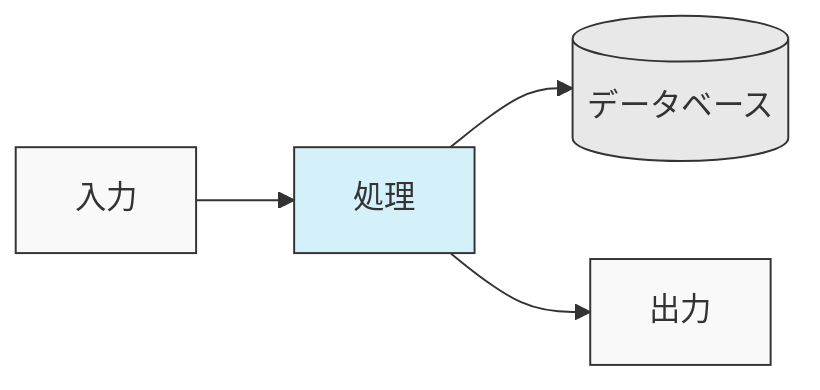
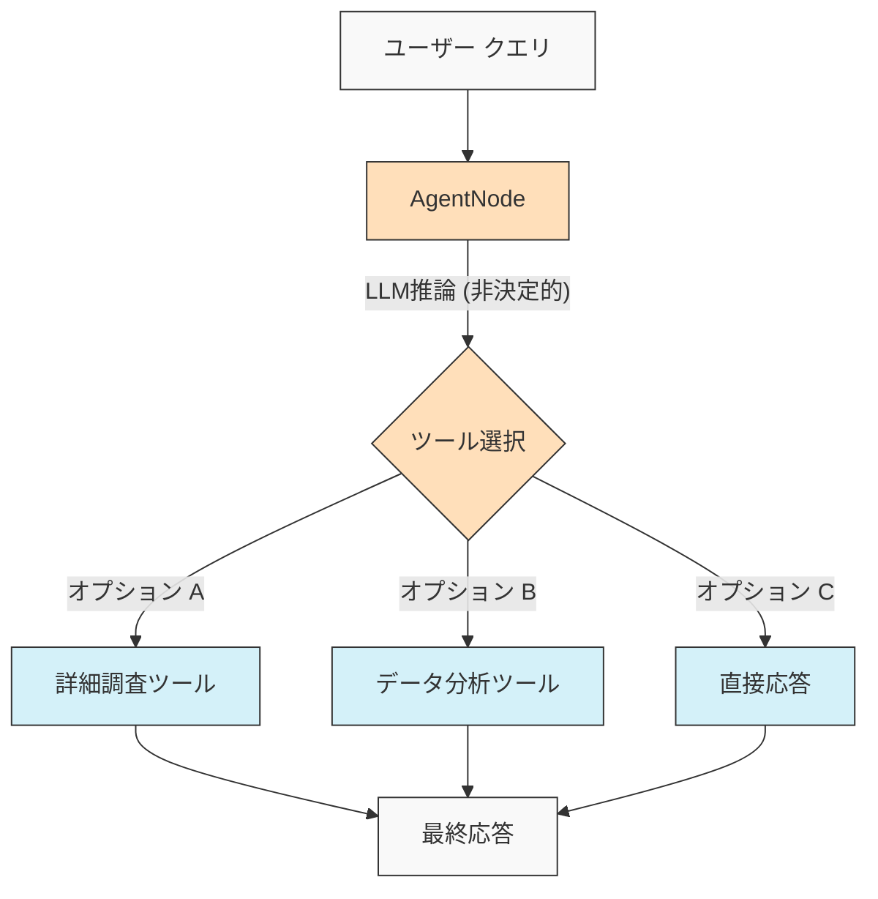
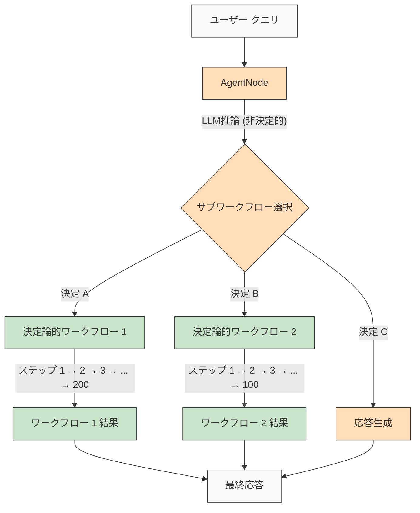

<p align="center">
  
</p>

## 🌐 README 翻訳

[Français](/docs/i18n/french/README.md) • [日本語](/docs/i18n/japanese/README.md) • [한국어](/docs/i18n/korean/README.md) • [中文](/docs/i18n/chinese/README.md) • [Español](/docs/i18n/spanish/README.md) • [Italiano](/docs/i18n/italian/README.md) • [Nederlands](/docs/i18n/dutch/README.md) • [Deutsch](/docs/i18n/deutsch/README.md) • [Polski](/docs/i18n/polish/README.md) • [Türkçe](/docs/i18n/turkish/README.md) • [Українська](/docs/i18n/ukrainian/README.md) • [Ελληνικά](/docs/i18n/greek/README.md) • [Русский](/docs/i18n/russian/README.md) • [العربية](/docs/i18n/arabic/README.md)

# AgentDock: AIエージェントで無限の可能性を創造

AgentDockは、**設定可能な決定論**を用いて複雑なタスクを実行する高度なAIエージェントを構築するためのフレームワークです。主に2つのコンポーネントで構成されています：

1.  **AgentDock Core**：AIエージェントを構築・展開するためのオープンソースのバックエンドファーストなフレームワーク。*フレームワーク非依存*かつ*プロバイダー非依存*に設計されており、エージェントの実装を完全に制御できます。

2.  **オープンソースクライアント**：AgentDock Coreフレームワークのリファレンス実装およびコンシューマーとして機能する完全なNext.jsアプリケーション。[https://hub.agentdock.ai](https://hub.agentdock.ai) で動作を確認できます。

TypeScriptで構築されたAgentDockは、*シンプルさ*、*拡張性*、そして***設定可能な決定論***を重視しており、最小限の監視で動作可能な信頼性と予測可能性の高いAIシステムを構築するのに理想的です。

## 🧠 設計原則

AgentDockは、以下のコア原則に基づいて構築されています：

-   **シンプルさ第一**：機能的なエージェントを作成するために必要な最小限のコード
-   **ノードベースアーキテクチャ**：すべての機能はノードとして実装
-   **特殊ノードとしてのツール**：ツールはエージェント機能のためにノードシステムを拡張
-   **設定可能な決定論**：エージェントの挙動の予測可能性を制御
-   **型安全性**：全体にわたる包括的なTypeScript型

### 設定可能な決定論

***設定可能な決定論***は、AgentDockの設計哲学の基盤であり、創造的なAI機能と予測可能なシステム挙動のバランスを取ることを可能にします：

-   AgentNodeは、LLMが毎回異なる応答を生成する可能性があるため、本質的に非決定的です
-   ワークフローは、*定義されたツール実行パス*を通じてより決定的にすることができます
-   開発者は、システムのどの部分がLLM推論を使用するかを設定することで、**決定論のレベルを制御**できます
-   LLMコンポーネントがあっても、構造化されたツールインタラクションにより、システム全体の挙動は**予測可能**なままです
-   このバランスの取れたアプローチにより、AIアプリケーションにおける*創造性*と**信頼性**の両方が可能になります

#### 決定論的ワークフロー

AgentDockは、典型的なワークフロービルダーでお馴染みの決定論的ワークフローを完全にサポートしています。期待されるすべての予測可能な実行パスと信頼性の高い結果は、LLM推論の有無にかかわらず利用可能です：



#### 非決定論的エージェント挙動

AgentDockでは、より適応性が必要な場合にLLMを備えたAgentNodeを活用することもできます。創造的な出力はニーズに応じて変化する可能性がありますが、構造化されたインタラクションパターンは維持されます：



#### 決定論的サブワークフローを持つ非決定論的エージェント

AgentDockは、非決定論的なエージェントインテリジェンスと決定論的なワークフロー実行を組み合わせることで、***両方の世界の最良の部分***を提供します：



このアプローチにより、複雑なマルチステップワークフロー（ツール内または接続されたノードシーケンスとして実装された数百の決定論的ステップを含む可能性がある）が、インテリジェントなエージェントの決定によって呼び出されることが可能になります。各ワークフローは、非決定論的なエージェントの推論によってトリガーされたにもかかわらず、予測どおりに実行されます。

より高度なAIエージェントワークフローとマルチステージ処理パイプラインのために、複雑なエージェントシステムを作成、視覚化、実行するための強力なプラットフォームである[AgentDock Pro](../../docs/agentdock-pro.md)を構築しています。

#### 設定可能な決定論：概要

自動車の運転になぞらえてみましょう。時にはAIの創造性が必要な場合（街中のナビゲーションなど - 非決定的）もあれば、信頼性の高いステップバイステップのプロセスが必要な場合（高速道路の標識に従うなど - 決定的）もあります。AgentDockを使用すると、タスクの各部分に適したアプローチを選択して、*両方*を使用するシステムを構築できます。AIの創造性と、必要なときの予測可能性を両立できます。

## 🏗️ コアアーキテクチャ

このフレームワークは、すべてのエージェント機能の基盤となる、強力でモジュール化されたノードベースシステムを中心に構築されています。このアーキテクチャは、構成要素として異なるノードタイプを使用します：

-   **`BaseNode`**：すべてのノードのコアインターフェースと機能を確立する基本クラス。
-   **`AgentNode`**：LLMインタラクション、ツール使用、エージェントロジックを調整する特殊なコアノード。
-   **ツール＆カスタムノード**：開発者は、`BaseNode`を拡張するノードとしてエージェント機能とカスタムロジックを実装します。

これらのノードは、管理されたレジストリを通じて相互作用し、複雑で設定可能、かつ潜在的に決定論的なエージェントの挙動とワークフローを可能にするために（コアアーキテクチャのポートと潜在的なメッセージバスを活用して）接続できます。

ノードシステムのコンポーネントと機能の詳細な説明については、[ノードシステムドキュメント](../../docs/nodes/README.md)を参照してください。

## 🚀 はじめに

包括的なガイドについては、[はじめにガイド](../../docs/getting-started.md)を参照してください。

### 要件

*   Node.js ≥ 20.11.0 (LTS)
*   pnpm ≥ 9.15.0 (必須)
*   LLMプロバイダー（Anthropic、OpenAIなど）のAPIキー

### インストール

1.  **リポジトリをクローン**：

    ```bash
    git clone https://github.com/AgentDock/AgentDock.git
    cd AgentDock
    ```

2.  **pnpmをインストール**：

    ```bash
    corepack enable
    corepack prepare pnpm@latest --activate
    ```

3.  **依存関係をインストール**：

    ```bash
    pnpm install
    ```

    クリーンな再インストール（最初から再構築する必要がある場合）：

    ```bash
    pnpm run clean-install
    ```

    このスクリプトは、すべてのnode_modules、ロックファイルを削除し、依存関係を正しく再インストールします。

4.  **環境を設定**：

    提供されている`.env.example`ファイルに基づいて環境ファイル（`.env`または`.env.local`）を作成します：

    ```bash
    # オプション1：.env.localを作成
    cp .env.example .env.local

    # オプション2：.envを作成
    cp .env.example .env
    ```

    次に、APIキーを環境ファイルに追加します。

5.  **開発サーバーを開始**：

    ```bash
    pnpm dev
    ```

### 高度な機能

| 機能                 | 説明                                                                              | ドキュメント                                                                       |
| :------------------- | :-------------------------------------------------------------------------------- | :--------------------------------------------------------------------------------- |
| **セッション管理**     | 会話のための分離された、パフォーマンスの高い状態管理                               | [セッションドキュメント](../../docs/architecture/sessions/README.md)               |
| **オーケストレーションフレームワーク** | コンテキストに基づいてエージェントの挙動とツールの可用性を制御                     | [オーケストレーションドキュメント](../../docs/architecture/orchestration/README.md) |
| **ストレージ抽象化**   | KV、Vector、Secureストレージ用のプラグ可能なプロバイダーを備えた柔軟なストレージシステム | [ストレージドキュメント](../../docs/storage/README.md)                           |

ストレージシステムは現在、キーバリューストレージ（Memory、Redis、Vercel KVプロバイダー）と安全なクライアントサイドストレージで進化しており、ベクトルストレージと追加のバックエンドは開発中です。

## 📕 ドキュメント

AgentDockフレームワークのドキュメントは、[hub.agentdock.ai/docs](https://hub.agentdock.ai/docs)およびこのリポジトリの`/docs/`フォルダで利用可能です。ドキュメントには以下が含まれます：

-   はじめにガイド
-   APIリファレンス
-   ノード作成チュートリアル
-   統合例

## 📂 リポジトリ構造

このリポジトリには以下が含まれます：

1.  **AgentDock Core**：`agentdock-core/`にあるコアフレームワーク
2.  **オープンソースクライアント**：AgentDock Coreフレームワークのコンシューマーとして機能する、Next.jsで構築された完全なリファレンス実装。
3.  **エージェント例**：`agents/`ディレクトリにあるすぐに使えるエージェント設定

AgentDock Coreを独自のアプリケーションで独立して使用することも、このリポジトリを独自のエージェント搭載アプリケーション構築の開始点として使用することもできます。

## 📝 エージェントテンプレート

AgentDockには、事前に設定されたいくつかのエージェントテンプレートが含まれています。`agents/`ディレクトリでそれらを確認するか、設定の詳細については[エージェントテンプレートドキュメント](../../docs/agent-templates.md)をお読みください。

## 🔧 実装例

実装例は、特殊なユースケースと高度な機能を示しています：

| 実装                  | 説明                                                                    | ステータス   |
| :-------------------- | :---------------------------------------------------------------------- | :----------- |
| **オーケストレーションされたエージェント** | コンテキストに基づいて挙動を適応させるためにオーケストレーションを使用するエージェント例 | 利用可能     |
| **認知的推論者**        | 構造化された推論と認知的ツールを使用して複雑な問題に取り組む             | 利用可能     |
| **エージェントプランナー**    | 他のAIエージェントを設計・実装するための特殊なエージェント                 | 利用可能     |
| [**コードプレイグラウンド（コード実験環境）**](../../docs/roadmap/code-playground.md) | 豊富な視覚化機能を備えたサンドボックス化されたコード生成と実行              | 計画中       |
| [**ジェネラリストAIエージェント**](../../docs/roadmap/generalist-agent.md) | ブラウザを使用し、複雑なタスクを実行できるManusのようなエージェント            | 計画中       |

## 🔐 環境設定の詳細

AgentDockオープンソースクライアントが機能するには、LLMプロバイダーのAPIキーが必要です。これらは、提供されている`.env.example`ファイルに基づいて作成する環境ファイル（`.env`または`.env.local`）で設定されます。

### LLMプロバイダーAPIキー

LLMプロバイダーのAPIキーを追加します（少なくとも1つ必要です）：

```bash
# LLMプロバイダーAPIキー - 少なくとも1つ必要
ANTHROPIC_API_KEY=sk-ant-xxxxxxx  # Anthropic APIキー
OPENAI_API_KEY=sk-xxxxxxx         # OpenAI APIキー
GEMINI_API_KEY=xxxxxxx            # Google Gemini APIキー
DEEPSEEK_API_KEY=xxxxxxx          # DeepSeek APIキー
GROQ_API_KEY=xxxxxxx              # Groq APIキー
```

### APIキーの解決

AgentDockオープンソースクライアントは、使用するAPIキーを解決する際に優先順位に従います：

1.  **エージェントごとのカスタムAPIキー**（UIのエージェント設定経由で設定）
2.  **グローバル設定APIキー**（UIの設定ページ経由で設定）
3.  **環境変数**（.env.localまたはデプロイメントプラットフォームから）

### ツール固有のAPIキー

一部のツールでは、独自のAPIキーも必要です：

```bash
# ツール固有のAPIキー
SERPER_API_KEY=                  # 検索機能に必要
FIRECRAWL_API_KEY=               # より詳細なウェブ検索に必要
```

環境設定の詳細については、[`src/types/env.ts`](../../src/types/env.ts)の実装を参照してください。

### 独自のAPIキーを使用する (BYOK)

AgentDockはBYOK (Bring Your Own Key：自分のAPIキーを使用) モデルに従います：

1.  アプリケーションの設定ページでAPIキーを追加します
2.  または、直接APIを使用するためにリクエストヘッダー経由でキーを提供します
3.  キーは組み込みの暗号化システムを使用して安全に保存されます
4.  APIキーは当社のサーバーで共有または保存されることはありません

## 📦 パッケージマネージャー

このプロジェクトでは、一貫した依存関係管理のために`pnpm`の使用が*必須*です。`npm`および`yarn`はサポートされていません。

## 💡 何を構築できるか

1.  **AI搭載アプリケーション**
    -   任意のフロントエンドを備えたカスタムチャットボット
    -   コマンドラインAIアシスタント
    -   自動化されたデータ処理パイプライン
    -   バックエンドサービス統合

2.  **統合機能**
    -   任意のAIプロバイダー（OpenAI、Anthropicなど）
    -   任意のフロントエンドフレームワーク
    -   任意のバックエンドサービス
    -   カスタムデータソースとAPI

3.  **自動化システム**
    -   データ処理ワークフロー
    -   ドキュメント分析パイプライン
    -   自動化されたレポートシステム
    -   タスク自動化エージェント

## 主な機能

| 機能                             | 説明                                                                              |
| :------------------------------- | :-------------------------------------------------------------------------------- |
| 🔌 **フレームワーク非依存 (Node.js Backend)** | コアライブラリはNode.jsバックエンドスタックと統合します。                         |
| 🧩 **モジュール設計**              | シンプルなノードから複雑なシステムを構築                                          |
| 🛠️ **拡張可能**                  | あらゆる機能に対応するカスタムノードを作成                                        |
| 🔒 **セキュア**                  | APIキーとデータのための組み込みセキュリティ機能                                   |
| 🔑 **BYOK**                    | LLMプロバイダーには*独自のAPIキーを使用*                                                 |
| 📦 **独立自己完結型**         | コアフレームワークは最小限の依存関係を持ちます                                            |
| ⚙️ **マルチステップツールコール（段階的ツール呼び出し）** | *複雑な推論チェーン*をサポート                                                           |
| 📊 **構造化ロギング**         | エージェント実行に関する詳細な洞察                                                       |
| 🛡️ **強固なエラー処理**       | 予測可能な挙動と簡素化されたデバッグ                                                      |
| 📝 **TypeScriptファースト**   | 型安全性と向上した開発者エクスペリエンス                                                 |
| 🌐 **オープンソースクライアント** | 完全なNext.jsリファレンス実装を含む                                                    |
| 🔄 **オーケストレーション**        | コンテキストに基づくエージェント挙動の*動的制御*                                |
| 💾 **セッション管理**            | 同時会話のための分離された状態                                                    |
| 🎮 **設定可能な決定論**          | ノードロジック/ワークフローを介してAIの創造性と予測可能性のバランスを取ります。 |

## 🧰 コンポーネント

AgentDockのモジュール式アーキテクチャは、以下の主要コンポーネントに基づいて構築されています：

*   **BaseNode**：システム内のすべてのノードの基盤
*   **AgentNode**：エージェント機能の主要な抽象化
*   **ツール＆カスタムノード**：ノードとして実装された呼び出し可能な機能とカスタムロジック。
*   **ノードレジストリ**：すべてのノードタイプの登録と取得を管理
*   **ツールレジストリ**：エージェントのツール可用性を管理
*   **CoreLLM**：LLMプロバイダーとの対話のための統一インターフェース
*   **プロバイダーレジストリ**：LLMプロバイダー設定を管理
*   **エラー処理**：エラーを処理し、予測可能な挙動を保証するためのシステム
*   **ロギング**：監視とデバッグのための構造化ロギングシステム
*   **オーケストレーション**：会話コンテキストに基づいてツールの可用性と挙動を制御
*   **セッション**：同時会話間の状態分離を管理

これらのコンポーネントに関する詳細な技術ドキュメントについては、[アーキテクチャ概要](../../docs/architecture/README.md)を参照してください。

## 🗺️ ロードマップ

以下はAgentDockの開発ロードマップです。ここに記載されている改善点のほとんどは、現在ローカルで開発されており、安定版に達した時点でバージョン管理されたNPMパッケージとして公開されるコアAgentDockフレームワーク（`agentdock-core`）に関連しています。一部のロードマップ項目には、オープンソースクライアント実装の機能強化も含まれる場合があります。

| 機能                                                                 | 説明                                                                                | カテゴリ         |
| :------------------------------------------------------------------- | :---------------------------------------------------------------------------------- | :--------------- |
| [**ストレージ抽象化レイヤー**](../../docs/roadmap/storage-abstraction.md) | プラグ可能なプロバイダーを備えた柔軟なストレージシステム                              | **進行中**       |
| [**高度なメモリシステム**](../../docs/roadmap/advanced-memory.md)           | 長期的なコンテキスト管理                                                            | **進行中**       |
| [**ベクトルストレージ統合**](../../docs/roadmap/vector-storage.md)          | ドキュメントとメモリのための埋め込みベースの検索                                    | **進行中**       |
| [**AIエージェントの評価**](../../docs/roadmap/evaluation-framework.md)        | 包括的なテストおよび評価フレームワーク                                            | **進行中**       |
| [**プラットフォーム統合**](../../docs/roadmap/platform-integration.md)          | Telegram、WhatsApp、その他のメッセージングプラットフォームのサポート                   | **計画中**       |
| [**マルチエージェントコラボレーション**](../../docs/roadmap/multi-agent-collaboration.md) | エージェントが連携して作業できるようにする                                         | **計画中**       |
| [**モデルコンテキストプロトコル（MCP）統合**](../../docs/roadmap/mcp-integration.md)  | MCPを介した外部ツールの検出と使用のサポート                                       | **計画中**       |
| [**音声AIエージェント**](../../docs/roadmap/voice-agents.md)                 | AgentNodeを介した音声インターフェースと電話番号を使用するAIエージェント              | **計画中**       |
| [**テレメトリとトレーサビリティ**](../../docs/roadmap/telemetry.md)           | 高度なロギングとパフォーマンス追跡 | **計画中** |
| [**Workflow Runtime & Node タイプ**](../../docs/roadmap/workflow-nodes.md) | コア runtime、ノードタイプ、および複雑な自動化のためのオーケストレーションロジック | **計画中** |
| [**AgentDock Pro**](../../docs/agentdock-pro.md)                               | AIエージェントとワークフローをスケーリングするための包括的なエンタープライズクラウドプラットフォーム | **クラウド**     |
| [**自然言語AIエージェントビルダー**](../../docs/roadmap/nl-agent-builder.md)     | ビジュアルビルダー＋自然言語エージェントとワークフロー構築                          | **クラウド**     |
| [**エージェントマーケットプレイス**](../../docs/roadmap/agent-marketplace.md)     | 収益化可能なエージェントテンプレート                                                | **クラウド**     |

## 👥 貢献

AgentDockへの貢献を歓迎します！詳細な貢献ガイドラインについては、[CONTRIBUTING.md](../../CONTRIBUTING.md)をご覧ください。

## 📜 ライセンス

AgentDockは[MITライセンス](../../LICENSE)の下でリリースされています。

## ✨ 無限の可能性を創造しよう！

AgentDockは、想像できるほとんどすべてのAI搭載アプリケーションや自動化を構築するための基盤を提供します。フレームワークを探求し、革新的なエージェントを構築し、コミュニティに貢献することをお勧めします。一緒にAIインタラクションの未来を築きましょう！

---
[翻訳インデックスに戻る](/docs/i18n/README.md)