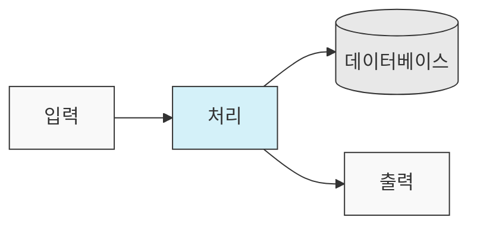
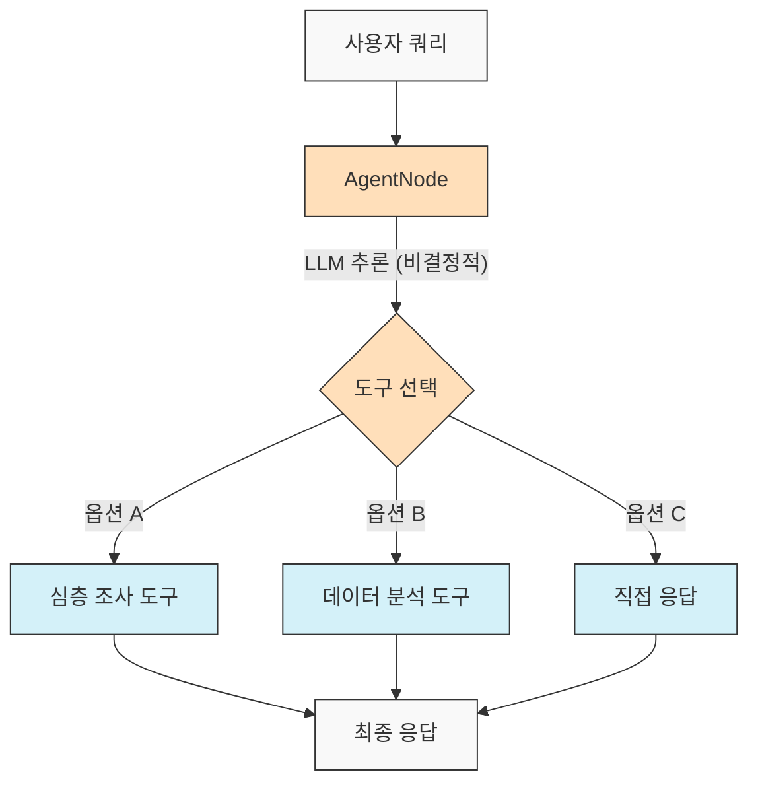
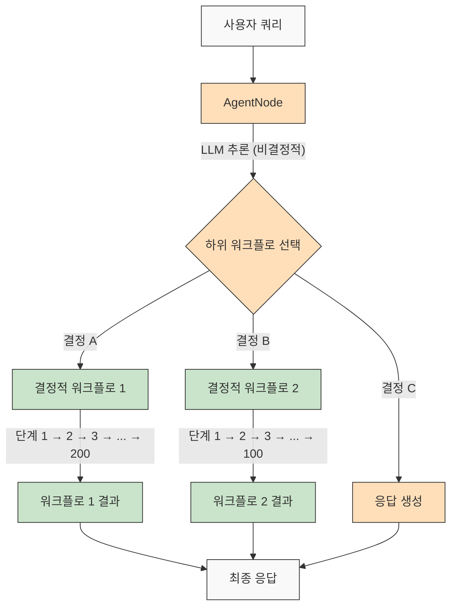

# AgentDock: AI 에이전트로 무한한 가능성을 창조하세요

[](https://github.com/agentdock/agentdock/stargazers)
[](https://opensource.org/licenses/MIT)
[](https://github.com/AgentDock/AgentDock/releases)
[](https://hub.agentdock.ai/docs)
[](https://discord.gg/fDYFFmwuRA)
[](https://agentdock.ai)
[](https://x.com/agentdock)

## 🌐 README 번역

[Français](../french/README.md) • [日本語](../japanese/README.md) • [한국어](./README.md) • [中文](../chinese/README.md) • [Español](../spanish/README.md) • [Italiano](../italian/README.md) • [Nederlands](../dutch/README.md) • [Polski](../polish/README.md) • [Türkçe](../turkish/README.md) • [Українська](../ukrainian/README.md) • [Ελληνικά](../greek/README.md)

AgentDock은 **구성 가능한 결정성(Configurable Determinism)**을 통해 복잡한 작업을 수행하는 정교한 AI 에이전트를 구축하기 위한 프레임워크입니다. 두 가지 주요 구성 요소로 구성되어 있습니다:

1.  **AgentDock Core**: AI 에이전트를 구축하고 배포하기 위한 오픈 소스, 백엔드 우선 프레임워크입니다. *프레임워크에 구애받지 않고* *공급업체에 독립적*으로 설계되어 에이전트 구현에 대한 완전한 제어권을 제공합니다.

2.  **오픈 소스 클라이언트**: AgentDock Core 프레임워크의 참조 구현 및 소비자로 사용되는 완전한 Next.js 애플리케이션입니다. [https://hub.agentdock.ai](https://hub.agentdock.ai)에서 작동하는 것을 볼 수 있습니다.

TypeScript로 구축된 AgentDock은 *단순성*, *확장성* 및 ***구성 가능한 결정성***을 강조하여 최소한의 감독으로 작동할 수 있는 신뢰할 수 있고 예측 가능한 AI 시스템을 구축하는 데 이상적입니다.

## 🧠 설계 원칙

AgentDock은 다음과 같은 핵심 원칙을 토대로 개발되었습니다:

-   **단순성 우선**: 기능적인 에이전트를 만드는 데 필요한 최소한의 코드
-   **노드 기반 아키텍처**: 모든 기능은 노드로 구현됩니다.
-   **특수 노드로서의 도구**: 도구는 에이전트 기능을 위해 노드 시스템을 확장합니다.
-   **구성 가능한 결정성**: 에이전트 동작의 예측 가능성 제어
-   **타입 안전성**: 전체적으로 포괄적인 TypeScript 타입

### 구성 가능한 결정성

***구성 가능한 결정성***은 AgentDock 설계 철학의 초석이며, 창의적인 AI 기능과 예측 가능한 시스템 동작 간의 균형을 맞출 수 있게 해줍니다:

-   AgentNode는 LLM이 매번 다른 응답을 생성할 수 있으므로 본질적으로 비결정적입니다.
-   워크플로는 *정의된 도구 실행 경로*를 통해 더 결정적으로 만들 수 있습니다.
-   개발자는 시스템의 어느 부분이 LLM 추론을 사용하는지 구성하여 **결정성 수준을 제어**할 수 있습니다.
-   LLM 구성 요소가 있더라도 전체 시스템 동작은 구조화된 도구 상호 작용을 통해 **예측 가능**하게 유지됩니다.
-   이 균형 잡힌 접근 방식은 AI 애플리케이션에서 *창의성*과 **신뢰성**을 모두 가능하게 합니다.

#### 결정적 워크플로

AgentDock은 일반적인 워크플로 빌더에서 익숙한 결정적 워크플로를 완벽하게 지원합니다. 기대하는 모든 예측 가능한 실행 경로와 신뢰할 수 있는 결과는 LLM 추론 유무에 관계없이 사용할 수 있습니다:



#### 비결정적 에이전트 동작

AgentDock을 사용하면 더 많은 적응성이 필요할 때 LLM과 함께 AgentNode를 활용할 수도 있습니다. 창의적인 출력은 필요에 따라 달라질 수 있지만 구조화된 상호 작용 패턴은 유지됩니다:



#### 결정적 하위 워크플로를 가진 비결정적 에이전트

AgentDock은 비결정적 에이전트 인텔리전스와 결정적 워크플로 실행을 결합하여 ***두 세계의 장점***을 모두 제공합니다:



이 접근 방식을 사용하면 복잡한 다단계 워크플로(도구 내에서 또는 연결된 노드 시퀀스로 구현된 수백 개의 결정적 단계를 포함할 수 있음)를 지능형 에이전트 결정에 의해 호출할 수 있습니다. 각 워크플로는 비결정적 에이전트 추론에 의해 트리거되었음에도 불구하고 예측 가능하게 실행됩니다.

더 고급 AI 에이전트 워크플로 및 다단계 처리 파이프라인을 위해 복잡한 에이전트 시스템을 생성, 시각화 및 실행하기 위한 강력한 플랫폼인 [AgentDock Pro](../../docs/agentdock-pro.md)를 구축하고 있습니다.

#### 구성 가능한 결정성: 요약

자동차 운전에 비유해 보겠습니다. 때로는 AI의 창의성이 필요하고(도시 거리 탐색과 같이 - 비결정적), 때로는 신뢰할 수 있는 단계별 프로세스가 필요합니다(고속도로 표지판 따르기와 같이 - 결정적). AgentDock을 사용하면 작업의 각 부분에 적합한 접근 방식을 선택하여 *두 가지*를 모두 사용하는 시스템을 구축할 수 있습니다. AI의 창의성과 필요할 때 예측 가능한 결과를 모두 확보할 수 있습니다.

## 🏗️ 핵심 아키텍처

프레임워크는 모든 에이전트 기능의 기반이 되는 강력하고 모듈화된 노드 기반 시스템을 중심으로 구축되었습니다. 이 아키텍처는 빌딩 블록으로 고유한 노드 유형을 사용합니다:

-   **`BaseNode`**: 모든 노드의 핵심 인터페이스와 기능을 설정하는 기본 클래스입니다.
-   **`AgentNode`**: LLM 상호 작용, 도구 사용 및 에이전트 로직을 조율하는 특수 핵심 노드입니다.
-   **도구 및 사용자 정의 노드**: 개발자는 `BaseNode`를 확장하는 노드로 에이전트 기능과 사용자 정의 로직을 구현합니다.

이러한 노드는 관리되는 레지스트리를 통해 상호 작용하며, 복잡하고 구성 가능하며 잠재적으로 결정적인 에이전트 동작 및 워크플로를 가능하게 하기 위해 (핵심 아키텍처의 포트 및 잠재적 메시지 버스를 활용하여) 연결될 수 있습니다.

노드 시스템의 구성 요소 및 기능에 대한 자세한 설명은 [노드 시스템 문서](../../docs/nodes/README.md)를 참조하십시오.

## 🚀 시작하기

포괄적인 가이드는 [시작하기 가이드](../../docs/getting-started.md)를 참조하십시오.

### 요구 사항

*   Node.js ≥ 20.11.0 (LTS)
*   pnpm ≥ 9.15.0 (필수)
*   LLM 공급업체(Anthropic, OpenAI 등)용 API 키

### 설치

1.  **리포지토리 복제**:

    ```bash
    git clone https://github.com/AgentDock/AgentDock.git
    cd AgentDock
    ```

2.  **pnpm 설치**:

    ```bash
    corepack enable
    corepack prepare pnpm@latest --activate
    ```

3.  **종속성 설치**:

    ```bash
    pnpm install
    ```

    클린 재설치(처음부터 다시 빌드해야 하는 경우):

    ```bash
    pnpm run clean-install
    ```

    이 스크립트는 모든 node_modules, 잠금 파일을 제거하고 종속성을 올바르게 다시 설치합니다.

4.  **환경 구성**:

    제공된 `.env.example` 파일을 기반으로 환경 파일(`.env` 또는 `.env.local`)을 만듭니다:

    ```bash
    # 옵션 1: .env.local 만들기
    cp .env.example .env.local

    # 옵션 2: .env 만들기
    cp .env.example .env
    ```

    그런 다음 API 키를 환경 파일에 추가합니다.

5.  **개발 서버 시작**:

    ```bash
    pnpm dev
    ```

### 고급 기능

| 기능                 | 설명                                                                               | 문서                                                                        |
| :------------------- | :--------------------------------------------------------------------------------- | :-------------------------------------------------------------------------- |
| **세션 관리**        | 대화를 위한 격리되고 성능 좋은 상태 관리                                           | [세션 문서](../../docs/architecture/sessions/README.md)                     |
| **오케스트레이션 프레임워크** | 컨텍스트에 따라 에이전트 동작 및 도구 가용성 제어                                    | [오케스트레이션 문서](../../docs/architecture/orchestration/README.md)      |
| **스토리지 추상화**  | KV, Vector 및 Secure 스토리지를 위한 플러그형 공급업체가 있는 유연한 스토리지 시스템 | [스토리지 문서](../../docs/storage/README.md)                             |

스토리지 시스템은 현재 키-값 스토리지(Memory, Redis, Vercel KV 공급업체) 및 보안 클라이언트 측 스토리지로 발전하고 있으며, 벡터 스토리지 및 추가 백엔드는 개발 중입니다.

## 📕 문서

AgentDock 프레임워크 문서는 [hub.agentdock.ai/docs](https://hub.agentdock.ai/docs) 및 이 리포지토리의 `/docs/` 폴더에서 사용할 수 있습니다. 문서에는 다음이 포함됩니다:

-   시작하기 가이드
-   API 참조
-   노드 생성 튜토리얼
-   통합 예제

## 📂 리포지토리 구조

이 리포지토리에는 다음이 포함됩니다:

1.  **AgentDock Core**: `agentdock-core/`에 있는 핵심 프레임워크
2.  **오픈 소스 클라이언트**: AgentDock Core 프레임워크의 소비자로 사용되는 Next.js로 구축된 완전한 참조 구현입니다.
3.  **예제 에이전트**: `agents/` 디렉토리에 있는 즉시 사용 가능한 에이전트 구성

AgentDock Core를 자체 애플리케이션에서 독립적으로 사용하거나 이 리포지토리를 자체 에이전트 기반 애플리케이션 구축의 시작점으로 사용할 수 있습니다.

## 📝 에이전트 템플릿

AgentDock에는 사전 구성된 여러 에이전트 템플릿이 포함되어 있습니다. `agents/` 디렉토리에서 탐색하거나 구성 세부 정보는 [에이전트 템플릿 문서](../../docs/agent-templates.md)를 읽어보십시오.

## 🔧 예제 구현

예제 구현은 특수 사용 사례 및 고급 기능을 보여줍니다:

| 구현                  | 설명                                                                     | 상태      |
| :-------------------- | :----------------------------------------------------------------------- | :-------- |
| **오케스트레이션된 에이전트** | 컨텍스트에 따라 동작을 조정하기 위해 오케스트레이션을 사용하는 예제 에이전트 | 사용 가능  |
| **인지적 추론자**       | 구조화된 추론 및 인지 도구를 사용하여 복잡한 문제 해결                 | 사용 가능  |
| **에이전트 플래너**     | 다른 AI 에이전트를 설계하고 구현하기 위한 특수 에이전트                  | 사용 가능  |
| [**코드 플레이그라운드(Code Playground)**](../../docs/roadmap/code-playground.md) | 풍부한 시각화 기능을 갖춘 샌드박스 코드 생성 및 실행                       | 계획됨    |
| [**일반 AI 에이전트**](../../docs/roadmap/generalist-agent.md)  | 브라우저를 사용하고 복잡한 작업을 실행할 수 있는 Manus와 유사한 에이전트       | 계획됨    |

## 🔐 환경 구성 세부 정보

AgentDock 오픈 소스 클라이언트는 작동하려면 LLM 공급업체용 API 키가 필요합니다. 이는 제공된 `.env.example` 파일을 기반으로 생성하는 환경 파일(`.env` 또는 `.env.local`)에서 구성됩니다.

### LLM 공급업체 API 키

LLM 공급업체 API 키를 추가합니다(최소 1개 필요):

```bash
# LLM 공급업체 API 키 - 최소 1개 필요
ANTHROPIC_API_KEY=sk-ant-xxxxxxx  # Anthropic API 키
OPENAI_API_KEY=sk-xxxxxxx         # OpenAI API 키
GEMINI_API_KEY=xxxxxxx            # Google Gemini API 키
DEEPSEEK_API_KEY=xxxxxxx          # DeepSeek API 키
GROQ_API_KEY=xxxxxxx              # Groq API 키
```

### API 키 확인

AgentDock 오픈 소스 클라이언트는 사용할 API 키를 확인할 때 우선 순위를 따릅니다:

1.  **에이전트별 사용자 정의 API 키**(UI의 에이전트 설정을 통해 설정)
2.  **전역 설정 API 키**(UI의 설정 페이지를 통해 설정)
3.  **환경 변수**(.env.local 또는 배포 플랫폼에서)

### 도구별 API 키

일부 도구에는 자체 API 키도 필요합니다:

```bash
# 도구별 API 키
SERPER_API_KEY=                  # 검색 기능에 필요
FIRECRAWL_API_KEY=               # 더 깊은 웹 검색에 필요
```

환경 구성에 대한 자세한 내용은 [`src/types/env.ts`](../../src/types/env.ts)의 구현을 참조하십시오.

### 자체 API 키 사용(BYOK)

AgentDock은 BYOK(Bring Your Own Key: 자체 API 키 사용) 모델을 따릅니다:

1.  애플리케이션의 설정 페이지에서 API 키를 추가합니다.
2.  또는 직접 API 사용을 위해 요청 헤더를 통해 키를 제공합니다.
3.  키는 내장된 암호화 시스템을 사용하여 안전하게 저장됩니다.
4.  API 키는 당사 서버에서 공유되거나 저장되지 않습니다.

## 📦 패키지 관리자

이 프로젝트는 일관된 종속성 관리를 위해 `pnpm` 사용이 *필수*입니다. `npm` 및 `yarn`은 지원되지 않습니다.

## 💡 무엇을 구축할 수 있나요?

1.  **AI 기반 애플리케이션**
    -   모든 프런트엔드를 갖춘 사용자 정의 챗봇
    -   명령줄 AI 어시스턴트
    -   자동화된 데이터 처리 파이프라인
    -   백엔드 서비스 통합

2.  **통합 기능**
    -   모든 AI 공급업체(OpenAI, Anthropic 등)
    -   모든 프런트엔드 프레임워크
    -   모든 백엔드 서비스
    -   사용자 정의 데이터 소스 및 API

3.  **자동화 시스템**
    -   데이터 처리 워크플로
    -   문서 분석 파이프라인
    -   자동화된 보고 시스템
    -   작업 자동화 에이전트

## 주요 기능

| 기능                      | 설명                                                                               |
| :------------------------ | :--------------------------------------------------------------------------------- |
| 🔌 **프레임워크 독립적 (Node.js 백엔드)** | 핵심 라이브러리는 Node.js 백엔드 스택과 통합됩니다.                                |
| 🧩 **모듈식 디자인**      | 간단한 노드에서 복잡한 시스템 구축                                                 |
| 🛠️ **확장 가능**          | 모든 기능에 대한 사용자 정의 노드 생성                                             |
| 🔒 **보안**              | API 키 및 데이터를 위한 내장 보안 기능                                             |
| 🔑 **BYOK**             | LLM 공급자에는 *자신의 API 키를 사용*                                                 |
| 📦 **독립형(Self-contained)**     | 핵심 프레임워크는 최소한의 종속성을 가집니다                                         |
| ⚙️ **다단계 도구 호출(Multi-Step Tool Calls)** | *복잡한 추론 체인* 지원                                                             |
| 📊 **구조화된 로깅**              | 에이전트 실행에 대한 상세한 통찰력                                                   |
| 🛡️ **강력한 오류 처리**           | 예측 가능한 동작 및 간소화된 디버깅                                                  |
| 📝 **TypeScript 우선**    | 타입 안전성 및 향상된 개발자 경험                                                  |
| 🌐 **오픈 소스 클라이언트** | 완전한 Next.js 참조 구현 포함                                                      |
| 🔄 **오케스트레이션**      | 컨텍스트 기반 에이전트 동작의 *동적 제어*                                          |
| 💾 **세션 관리**          | 동시 대화를 위한 격리된 상태                                                       |
| 🎮 **구성 가능한 결정성** | 노드 로직/워크플로를 통해 AI 창의성 및 예측 가능성 균형 조정.                      |

## 🧰 구성 요소

AgentDock의 모듈식 아키텍처는 다음과 같은 주요 구성 요소를 기반으로 구축되었습니다:

*   **BaseNode**: 시스템의 모든 노드 기반
*   **AgentNode**: 에이전트 기능의 기본 추상화
*   **도구 및 사용자 정의 노드**: 노드로 구현된 호출 가능한 기능 및 사용자 정의 로직입니다.
*   **노드 레지스트리**: 모든 노드 유형의 등록 및 검색 관리
*   **도구 레지스트리**: 에이전트에 대한 도구 가용성 관리
*   **CoreLLM**: LLM 공급업체와 상호 작용하기 위한 통합 인터페이스
*   **공급업체 레지스트리**: LLM 공급업체 구성 관리
*   **오류 처리**: 오류 처리 및 예측 가능한 동작 보장 시스템
*   **로깅**: 모니터링 및 디버깅을 위한 구조화된 로깅 시스템
*   **오케스트레이션**: 대화 컨텍스트에 따라 도구 가용성 및 동작 제어
*   **세션**: 동시 대화 간 상태 격리 관리

이러한 구성 요소에 대한 자세한 기술 문서는 [아키텍처 개요](../../docs/architecture/README.md)를 참조하십시오.

## 🗺️ 로드맵

다음은 AgentDock 개발 로드맵입니다. 여기에 나열된 대부분의 개선 사항은 현재 로컬에서 개발 중이며 안정적인 릴리스에 도달하면 버전 관리된 NPM 패키지로 게시될 핵심 AgentDock 프레임워크(`agentdock-core`)와 관련이 있습니다. 일부 로드맵 항목에는 오픈 소스 클라이언트 구현 개선 사항도 포함될 수 있습니다.

| 기능                                                                  | 설명                                                                                 | 카테고리        |
| :-------------------------------------------------------------------- | :----------------------------------------------------------------------------------- | :-------------- |
| [**스토리지 추상화 계층**](../../docs/roadmap/storage-abstraction.md)     | 플러그형 공급업체가 있는 유연한 스토리지 시스템                                      | **진행 중**     |
| [**고급 메모리 시스템**](../../docs/roadmap/advanced-memory.md)           | 장기 컨텍스트 관리                                                                   | **진행 중**     |
| [**벡터 스토리지 통합**](../../docs/roadmap/vector-storage.md)          | 문서 및 메모리를 위한 임베딩 기반 검색                                               | **진행 중**     |
| [**AI 에이전트 평가**](../../docs/roadmap/evaluation-framework.md)        | 포괄적인 테스트 및 평가 프레임워크                                                   | **진행 중**     |
| [**플랫폼 통합**](../../docs/roadmap/platform-integration.md)           | Telegram, WhatsApp 및 기타 메시징 플랫폼 지원                                        | **계획됨**      |
| [**다중 에이전트 협업**](../../docs/roadmap/multi-agent-collaboration.md) | 에이전트가 함께 작동하도록 지원                                                      | **계획됨**      |
| [**모델 컨텍스트 프로토콜 (MCP) 통합**](../../docs/roadmap/mcp-integration.md) | MCP를 통한 외부 도구 검색 및 사용 지원                                              | **계획됨**      |
| [**음성 AI 에이전트**](../../docs/roadmap/voice-agents.md)                  | AgentNode를 통한 음성 인터페이스 및 전화번호를 사용하는 AI 에이전트                 | **계획됨**      |
| [**텔레메트리 및 추적성**](../../docs/roadmap/telemetry.md)             | 고급 로깅 및 성능 추적                                                               | **계획됨**      |
| [**AgentDock Pro**](../../docs/agentdock-pro.md)                        | AI 에이전트 및 워크플로 확장을 위한 포괄적인 엔터프라이즈 클라우드 플랫폼            | **클라우드**    |
| [**자연어 AI 에이전트 빌더**](../../docs/roadmap/nl-agent-builder.md)     | 시각적 빌더 + 자연어 에이전트 및 워크플로 구축                                       | **클라우드**    |
| [**에이전트 마켓플레이스**](../../docs/roadmap/agent-marketplace.md)      | 수익화 가능한 에이전트 템플릿                                                        | **클라우드**    |

## 👥 기여

AgentDock에 대한 기여를 환영합니다! 자세한 기여 가이드라인은 [CONTRIBUTING.md](../../CONTRIBUTING.md)를 참조하십시오.

## 📜 라이선스

AgentDock은 [MIT 라이선스](../../LICENSE)에 따라 출시됩니다.

## ✨ 무한한 가능성을 창조하세요!

AgentDock은 상상할 수 있는 거의 모든 AI 기반 애플리케이션 또는 자동화를 구축할 수 있는 기반을 제공합니다. 프레임워크를 탐색하고 혁신적인 에이전트를 구축하며 커뮤니티에 기여해 보시기 바랍니다. AI 상호 작용의 미래를 함께 만들어 갑시다!

---
[번역 색인으로 돌아가기](../README.md) 