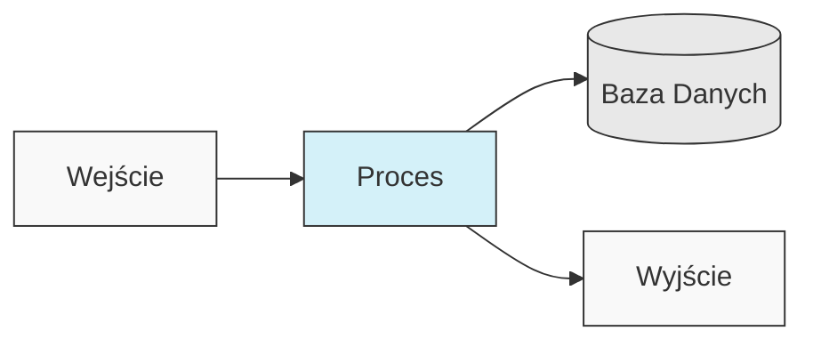
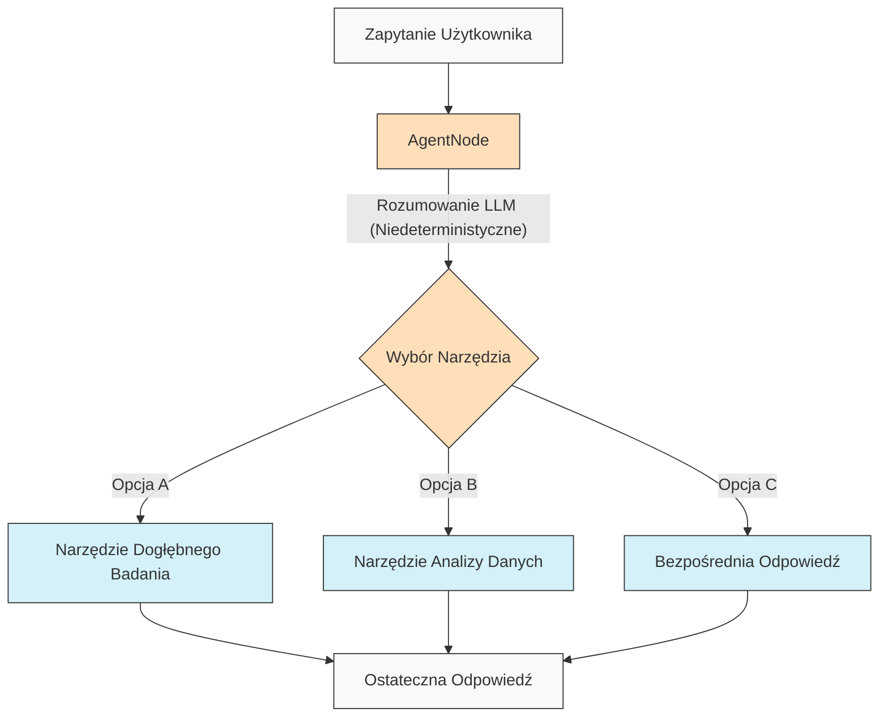
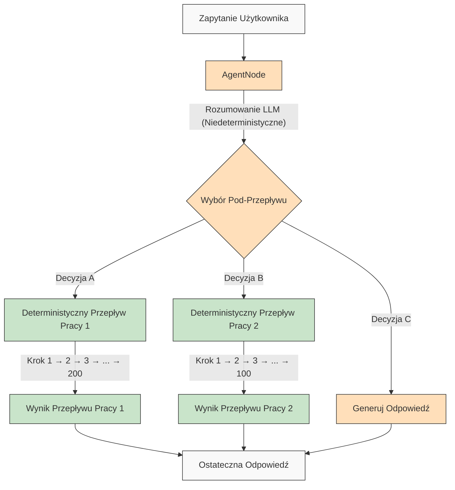

# AgentDock: Twórz Nieograniczone Możliwości z Agentami AI

[](https://github.com/agentdock/agentdock/stargazers)
[](https://opensource.org/licenses/MIT)
[](https://github.com/AgentDock/AgentDock/releases)
[](https://hub.agentdock.ai/docs)
[](https://discord.gg/fDYFFmwuRA)
[](https://agentdock.ai)
[](https://x.com/agentdock)

## 🌐 Tłumaczenia README

[Français](../french/README.md) • [日本語](../japanese/README.md) • [한국어](../korean/README.md) • [中文](../chinese/README.md) • [Español](../spanish/README.md) • [Italiano](../italian/README.md) • [Nederlands](../dutch/README.md) • [Polski](./README.md) • [Türkçe](../turkish/README.md) • [Українська](../ukrainian/README.md) • [Ελληνικά](../greek/README.md) • [العربية](../arabic/README.md)

AgentDock to framework do budowania zaawansowanych agentów AI, które wykonują złożone zadania z **konfigurowalnym determinizmem**. Składa się z dwóch głównych komponentów:

1.  **AgentDock Core**: Framework open-source, zorientowany na backend, do budowania i wdrażania agentów AI. Został zaprojektowany tak, aby był *niezależny od frameworka* i *niezależny od dostawcy*, dając Ci pełną kontrolę nad implementacją Twojego agenta.

2.  **Open Source Client**: Pełna aplikacja Next.js, która służy jako referencyjna implementacja i konsument frameworka AgentDock Core. Możesz zobaczyć ją w akcji na [https://hub.agentdock.ai](https://hub.agentdock.ai)

Zbudowany w TypeScript, AgentDock kładzie nacisk na *prostotę*, *rozszerzalność* i ***konfigurowalny determinizm***, co czyni go idealnym do budowania niezawodnych, przewidywalnych systemów AI, które mogą działać przy minimalnym nadzorze.

## 🧠 Zasady Projektowania

AgentDock opiera się na tych podstawowych zasadach:

-   **Prostota na Pierwszym Miejscu**: Minimalny kod wymagany do tworzenia funkcjonalnych agentów
-   **Architektura Oparta na Węzłach (Nodes)**: Wszystkie możliwości są implementowane jako węzły
-   **Narzędzia jako Wyspecjalizowane Węzły**: Narzędzia rozszerzają system węzłów o możliwości agenta
-   **Konfigurowalny Determinizm**: Kontrola przewidywalności zachowania agenta
-   **Bezpieczeństwo Typów (Type Safety)**: Pełne typy TypeScript w całym systemie

### Konfigurowalny Determinizm

***Konfigurowalny determinizm*** jest kamieniem węgielnym filozofii projektowania AgentDock, pozwalającym zrównoważyć kreatywne możliwości AI z przewidywalnym zachowaniem systemu:

-   `AgentNode` są z natury niedeterministyczne, ponieważ LLM mogą generować różne odpowiedzi za każdym razem
-   Przepływy pracy (Workflows) można uczynić bardziej deterministycznymi poprzez *zdefiniowane ścieżki wykonywania narzędzi*
-   Deweloperzy mogą **kontrolować poziom determinizmu**, konfigurując, które części systemu wykorzystują wnioskowanie LLM
-   Nawet z komponentami LLM, ogólne zachowanie systemu pozostaje **przewidywalne** dzięki ustrukturyzowanym interakcjom narzędzi
-   To zrównoważone podejście pozwala zarówno na *kreatywność*, jak i **niezawodność** w Twoich aplikacjach AI

#### Deterministyczne Przepływy Pracy

AgentDock w pełni obsługuje deterministyczne przepływy pracy, które znasz z typowych kreatorów przepływów pracy. Wszystkie przewidywalne ścieżki wykonania i niezawodne wyniki, których oczekujesz, są dostępne, z wnioskowaniem LLM lub bez:



#### Niedeterministyczne Zachowanie Agenta

Z AgentDock możesz również wykorzystać `AgentNode` z LLM, gdy potrzebujesz większej adaptacyjności. Kreatywne wyniki mogą się różnić w zależności od Twoich potrzeb, zachowując jednocześnie ustrukturyzowane wzorce interakcji:



#### Niedeterministyczni Agenci z Deterministycznymi Pod-Przepływami Pracy

AgentDock oferuje Ci ***najlepsze z obu światów***, łącząc niedeterministyczną inteligencję agenta z deterministycznym wykonywaniem przepływu pracy:



To podejście pozwala na wywoływanie złożonych, wieloetapowych przepływów pracy (potencjalnie obejmujących setki deterministycznych kroków zaimplementowanych w narzędziach lub jako sekwencje połączonych węzłów) przez inteligentne decyzje agentów. Każdy przepływ pracy jest wykonywany w sposób przewidywalny, mimo że jest wyzwalany przez niedeterministyczne rozumowanie agenta.

Dla bardziej zaawansowanych przepływów pracy agentów AI i wieloetapowych potoków przetwarzania, budujemy [AgentDock Pro](../../docs/agentdock-pro.md) - potężną platformę do budowania, wizualizacji i uruchamiania złożonych systemów agentów.

#### W skrócie: Konfigurowalny Determinizm

Wyobraź to sobie jak prowadzenie samochodu. Czasami potrzebujesz kreatywności AI (jak nawigacja po ulicach miasta - niedeterministyczna), a czasami potrzebujesz niezawodnych, krok po kroku procesów (jak podążanie za znakami na autostradzie - deterministyczne). AgentDock pozwala budować systemy, które wykorzystują *oba*, wybierając odpowiednie podejście dla każdej części zadania. Zyskujesz zarówno kreatywność AI, *jak i* przewidywalne wyniki tam, gdzie ich potrzebujesz.

## 🏗️ Architektura Rdzenia

Framework jest zbudowany wokół potężnego, modułowego systemu opartego na węzłach (Nodes), który służy jako podstawa dla całej funkcjonalności agenta. Ta architektura wykorzystuje odrębne typy węzłów jako bloki konstrukcyjne:

-   **`BaseNode`**: Podstawowa klasa, która ustanawia podstawowy interfejs i możliwości dla wszystkich węzłów.
-   **`AgentNode`**: Wyspecjalizowany węzeł rdzenia, który koordynuje interakcje LLM, użycie narzędzi i logikę agenta.
-   **Narzędzia i Węzły Niestandardowe**: Deweloperzy implementują możliwości agenta i logikę niestandardową jako węzły rozszerzające `BaseNode`.

Te węzły współdziałają za pośrednictwem zarządzanych rejestrów i mogą być połączone (wykorzystując porty architektury rdzenia i potencjalną magistralę komunikatów), aby umożliwić złożone, konfigurowalne i potencjalnie deterministyczne zachowania i przepływy pracy agentów.

Szczegółowe wyjaśnienie komponentów i możliwości systemu węzłów znajduje się w [Dokumentacji Systemu Węzłów](../../docs/nodes/README.md).

## 🚀 Pierwsze Kroki

Kompleksowy przewodnik znajduje się w [Przewodniku Wprowadzającym](../../docs/getting-started.md).

### Wymagania

*   Node.js ≥ 20.11.0 (LTS)
*   pnpm ≥ 9.15.0 (Wymagane)
*   Klucze API dla dostawców LLM (Anthropic, OpenAI, itp.)

### Instalacja

1.  **Sklonuj Repozytorium**:

    ```bash
    git clone https://github.com/AgentDock/AgentDock.git
    cd AgentDock
    ```

2.  **Zainstaluj pnpm**:

    ```bash
    corepack enable
    corepack prepare pnpm@latest --activate
    ```

3.  **Zainstaluj Zależności**:

    ```bash
    pnpm install
    ```

    Dla czystej ponownej instalacji (gdy musisz przebudować od zera):

    ```bash
    pnpm run clean-install
    ```

    Ten skrypt usuwa wszystkie `node_modules`, pliki blokady i poprawnie ponownie instaluje zależności.

4.  **Skonfiguruj Środowisko**:

    Utwórz plik środowiskowy (`.env` lub `.env.local`) na podstawie dostarczonego pliku `.env.example`:

    ```bash
    # Opcja 1: Utwórz .env.local
    cp .env.example .env.local

    # Opcja 2: Utwórz .env
    cp .env.example .env
    ```

    Następnie dodaj swoje klucze API do pliku środowiskowego.

5.  **Uruchom Serwer Deweloperski**:

    ```bash
    pnpm dev
    ```

### Zaawansowane Możliwości

| Możliwość                  | Opis                                                                                        | Dokumentacja                                                                         |
| :------------------------- | :------------------------------------------------------------------------------------------ | :----------------------------------------------------------------------------------- |
| **Zarządzanie Sesjami**    | Izolowane, wysokowydajne zarządzanie stanem dla konwersacji                                 | [Dokumentacja Sesji](../../docs/architecture/sessions/README.md)                   |
| **Framework Orkiestracji** | Kontrola zachowania agenta i dostępności narzędzi w oparciu o kontekst                         | [Dokumentacja Orkiestracji](../../docs/architecture/orchestration/README.md)         |
| **Abstrakcja Pamięci Masowej** | Elastyczny system pamięci masowej z podłączanymi dostawcami dla KV, Vector i Secure Storage     | [Dokumentacja Pamięci Masowej](../../docs/storage/README.md)                       |

System pamięci masowej obecnie ewoluuje wraz z pamięcią masową klucz-wartość (dostawcy Memory, Redis, Vercel KV) i bezpieczną pamięcią masową po stronie klienta, podczas gdy pamięć masowa wektorowa i dodatkowe backendy są w fazie rozwoju.

## 📕 Dokumentacja

Dokumentacja frameworka AgentDock jest dostępna na [hub.agentdock.ai/docs](https://hub.agentdock.ai/docs) oraz w folderze `/docs/` tego repozytorium. Dokumentacja zawiera:

-   Przewodniki wprowadzające
-   Referencje API
-   Samouczki tworzenia węzłów
-   Przykłady integracji

## 📂 Struktura Repozytorium

To repozytorium zawiera:

1.  **AgentDock Core**: Framework rdzenia znajdujący się w `agentdock-core/`
2.  **Open Source Client**: Pełna implementacja referencyjna zbudowana w Next.js, służąca jako konsument frameworka AgentDock Core.
3.  **Przykładowi Agenci**: Gotowe konfiguracje agentów w katalogu `agents/`

Możesz używać AgentDock Core niezależnie we własnych aplikacjach lub użyć tego repozytorium jako punktu wyjścia do budowania własnych aplikacji opartych na agentach.

## 📝 Szablony Agentów

AgentDock zawiera kilka prekonfigurowanych szablonów agentów. Przeglądaj je w katalogu `agents/` lub przeczytaj [Dokumentację Szablonów Agentów](../../docs/agent-templates.md), aby uzyskać szczegóły konfiguracji.

## 🔧 Przykładowe Implementacje

Przykładowe implementacje prezentują wyspecjalizowane przypadki użycia i zaawansowaną funkcjonalność:

| Implementacja                | Opis                                                                                         | Status       |
| :--------------------------- | :------------------------------------------------------------------------------------------- | :----------- |
| **Agent Orkiestrowany**      | Przykładowy agent wykorzystujący orkiestrację do adaptacji zachowania w oparciu o kontekst  | Dostępny     |
| **Rozumujący Kognitywny**    | Rozwiązuje złożone problemy za pomocą ustrukturyzowanego rozumowania i narzędzi kognitywnych | Dostępny     |
| **Planista Agentów**         | Wyspecjalizowany agent do projektowania i implementowania innych agentów AI                 | Dostępny     |
| [**Code Playground (Środowisko Testowe Kodu)**](../../docs/roadmap/code-playground.md) | Generowanie i wykonywanie kodu w piaskownicy z bogatymi możliwościami wizualizacji       | Planowany    |
| [**Agent AI Ogólnego Przeznaczenia**](../../docs/roadmap/generalist-agent.md)| Agent podobny do Manus, który może używać przeglądarki i wykonywać złożone zadania         | Planowany    |

## 🔐 Szczegóły Konfiguracji Środowiska

AgentDock Open Source Client wymaga kluczy API dla dostawców LLM do działania. Są one konfigurowane w pliku środowiskowym (`.env` lub `.env.local`), który tworzysz na podstawie dostarczonego pliku `.env.example`.

### Klucze API Dostawców LLM

Dodaj swoje klucze API dostawców LLM (wymagany co najmniej jeden):

```bash
# Klucze API Dostawców LLM - wymagany co najmniej jeden
ANTHROPIC_API_KEY=sk-ant-xxxxxxx  # Klucz API Anthropic
OPENAI_API_KEY=sk-xxxxxxx         # Klucz API OpenAI
GEMINI_API_KEY=xxxxxxx            # Klucz API Google Gemini
DEEPSEEK_API_KEY=xxxxxxx          # Klucz API DeepSeek
GROQ_API_KEY=xxxxxxx              # Klucz API Groq
```

### Rozstrzyganie Kluczy API

AgentDock Open Source Client stosuje kolejność priorytetów podczas rozstrzygania, którego klucza API użyć:

1.  **Niestandardowy klucz API dla agenta** (ustawiony za pomocą ustawień agenta w interfejsie użytkownika)
2.  **Globalny klucz API ustawień** (ustawiony za pomocą strony ustawień w interfejsie użytkownika)
3.  **Zmienna środowiskowa** (z `.env.local` lub platformy wdrożeniowej)

### Klucze API Specyficzne dla Narzędzi

Niektóre narzędzia wymagają również własnych kluczy API:

```bash
# Klucze API Specyficzne dla Narzędzi
SERPER_API_KEY=                  # Wymagany do funkcjonalności wyszukiwania
FIRECRAWL_API_KEY=               # Wymagany do głębszego przeszukiwania sieci
```

Więcej szczegółów na temat konfiguracji środowiska znajduje się w implementacji w [`src/types/env.ts`](../../src/types/env.ts).

### Użyj Własnego Klucza (BYOK)

AgentDock działa w modelu BYOK (Bring Your Own Key - Użyj Własnego Klucza):

1.  Dodaj swoje klucze API na stronie ustawień aplikacji
2.  Alternatywnie, podaj klucze za pomocą nagłówków żądań do bezpośredniego użycia API
3.  Klucze są bezpiecznie przechowywane za pomocą wbudowanego systemu szyfrowania
4.  Żadne klucze API nie są udostępniane ani przechowywane na naszych serwerach

## 📦 Menedżer Pakietów

Ten projekt *wymaga* użycia `pnpm` do spójnego zarządzania zależnościami. `npm` i `yarn` nie są obsługiwane.

## 💡 Co Możesz Zbudować

1.  **Aplikacje Oparte na AI**
    -   Niestandardowe chatboty z dowolnym frontendem
    -   Asystenci AI wiersza poleceń
    -   Zautomatyzowane potoki przetwarzania danych
    -   Integracje usług backendowych

2.  **Możliwości Integracji**
    -   Dowolny dostawca AI (OpenAI, Anthropic, itp.)
    -   Dowolny framework frontendowy
    -   Dowolna usługa backendowa
    -   Niestandardowe źródła danych i API

3.  **Systemy Automatyzacji**
    -   Przepływy pracy przetwarzania danych
    -   Potoki analizy dokumentów
    -   Zautomatyzowane systemy raportowania
    -   Agenci automatyzacji zadań

## Kluczowe Cechy

| Cecha                         | Opis                                                                                          |
| :---------------------------- | :-------------------------------------------------------------------------------------------- |
| 🔌 **Niezależny od Frameworka (Node.js Backend)** | Biblioteka rdzenia integruje się ze stosami backendowymi Node.js.                           |
| 🧩 **Projekt Modułowy**       | Buduj złożone systemy z prostych węzłów                                                      |
| 🛠️ **Rozszerzalny**           | Twórz niestandardowe węzły dla dowolnej funkcjonalności                                      |
| 🔒 **Bezpieczny**               | Wbudowane funkcje bezpieczeństwa dla kluczy API i danych                                     |
| 🔑 **BYOK**                     | *Użyj Własnego Klucza* dla dostawców LLM                                               |
| 📦 **Autonomiczny (Self-contained)**| Framework rdzenia ma minimalne zależności                                                     |
| ⚙️ **Wieloetapowe Wywołania Narzędzi (Multi-Step Tool Calls)**| Obsługa *złożonych łańcuchów rozumowania*                                             |
| 📊 **Logowanie Strukturalne**     | Szczegółowy wgląd w wykonywanie agenta                                                        |
| 🛡️ **Niezawodna Obsługa Błędów**  | Przewidywalne zachowanie i uproszczone debugowanie                                           |
| 📝 **TypeScript na Pierwszym Miejscu** | Bezpieczeństwo typów i ulepszone doświadczenie deweloperskie                                |
| 🌐 **Klient Open Source**         | Zawiera pełną implementację referencyjną Next.js                                              |
| 🔄 **Orkiestracja**           | *Dynamiczna kontrola* zachowania agenta w oparciu o kontekst                                |
| 💾 **Zarządzanie Sesjami**    | Izolowany stan dla współbieżnych konwersacji                                                 |
| 🎮 **Konfigurowalny Determinizm**| Zrównoważ kreatywność AI i przewidywalność za pomocą logiki węzłów/przepływów pracy.         |

## 🧰 Komponenty

Modułowa architektura AgentDock opiera się na tych kluczowych komponentach:

*   **BaseNode**: Podstawa dla wszystkich węzłów w systemie
*   **AgentNode**: Główna abstrakcja dla funkcjonalności agenta
*   **Narzędzia i Węzły Niestandardowe**: Wywoływalne możliwości i logika niestandardowa implementowane jako węzły.
*   **Rejestr Węzłów**: Zarządza rejestracją i pobieraniem wszystkich typów węzłów
*   **Rejestr Narzędzi**: Zarządza dostępnością narzędzi dla agentów
*   **CoreLLM**: Zunifikowany interfejs do interakcji z dostawcami LLM
*   **Rejestr Dostawców**: Zarządza konfiguracjami dostawców LLM
*   **Obsługa Błędów**: System do obsługi błędów i zapewniania przewidywalnego zachowania
*   **Logowanie (Logging)**: Strukturalny system logowania do monitorowania i debugowania
*   **Orkiestracja**: Kontroluje dostępność narzędzi i zachowanie w oparciu o kontekst konwersacji
*   **Sesje**: Zarządza izolacją stanu między współbieżnymi konwersacjami

Szczegółowa dokumentacja techniczna dotycząca tych komponentów znajduje się w [Przeglądzie Architektury](../../docs/architecture/README.md).

## 🗺️ Plan Rozwoju

Poniżej znajduje się nasz plan rozwoju dla AgentDock. Większość wymienionych tutaj ulepszeń dotyczy frameworka rdzenia AgentDock (`agentdock-core`), który jest obecnie rozwijany lokalnie i zostanie opublikowany jako wersjonowany pakiet NPM po osiągnięciu stabilnej wersji. Niektóre pozycje planu rozwoju mogą również obejmować ulepszenia implementacji klienta open-source.

| Cecha                                                                       | Opis                                                                                           | Kategoria      |
| :-------------------------------------------------------------------------- | :--------------------------------------------------------------------------------------------- | :------------- |
| [**Warstwa Abstrakcji Pamięci Masowej**](../../docs/roadmap/storage-abstraction.md) | Elastyczny system pamięci masowej z podłączanymi dostawcami                                    | **W Trakcie**  |
| [**Zaawansowane Systemy Pamięci**](../../docs/roadmap/advanced-memory.md)         | Zarządzanie kontekstem długoterminowym                                                         | **W Trakcie**  |
| [**Integracja Pamięci Masowej Wektorowej**](../../docs/roadmap/vector-storage.md)| Odzyskiwanie oparte na osadzaniu dla dokumentów i pamięci                                      | **W Trakcie**  |
| [**Ocena dla Agentów AI**](../../docs/roadmap/evaluation-framework.md)       | Kompleksowy framework testowania i oceny                                                       | **W Trakcie**  |
| [**Integracja Platform**](../../docs/roadmap/platform-integration.md)        | Wsparcie dla Telegrama, WhatsApp i innych platform komunikacyjnych                           | **Planowany**  |
| [**Współpraca Wielu Agentów**](../../docs/roadmap/multi-agent-collaboration.md)| Umożliwienie agentom współpracy                                                               | **Planowany**  |
| [**Integracja Protokołu Kontekstu Modelu (MCP)**](../../docs/roadmap/mcp-integration.md)| Wsparcie dla odkrywania i używania zewnętrznych narzędzi za pomocą MCP                         | **Planowany**  |
| [**Agenci AI Głosowi**](../../docs/roadmap/voice-agents.md)                  | Agenci AI używający interfejsów głosowych i numerów telefonów za pośrednictwem AgentNode      | **Planowany**  |
| [**Telemetria i Śledzenie**](../../docs/roadmap/telemetry.md)              | Zaawansowane logowanie i śledzenie wydajności                                                  | **Planowany**  |
| [**AgentDock Pro**](../../docs/agentdock-pro.md)                           | Pełna platforma chmurowa dla przedsiębiorstw do skalowania agentów i przepływów pracy AI       | **Chmura**     |
| [**Kreator Agentów AI w Języku Naturalnym**](../../docs/roadmap/nl-agent-builder.md)| Kreator wizualny + budowanie agentów i przepływów pracy w języku naturalnym                 | **Chmura**     |
| [**Rynek Agentów**](../../docs/roadmap/agent-marketplace.md)               | Szablony agentów do monetyzacji                                                              | **Chmura**     |

## 👥 Współtworzenie

Zapraszamy do współtworzenia AgentDock! Szczegółowe wytyczne dotyczące współtworzenia znajdują się w [CONTRIBUTING.md](../../CONTRIBUTING.md).

## 📜 Licencja

AgentDock jest wydany na licencji [MIT License](../../LICENSE).

## ✨ Twórz Nieograniczone Możliwości!

AgentDock stanowi fundament do budowania niemal każdej aplikacji opartej na AI lub automatyzacji, jaką możesz sobie wyobrazić. Zachęcamy do eksploracji frameworka, budowania innowacyjnych agentów i współtworzenia społeczności. Razem kształtujmy przyszłość interakcji z AI!

---
[Powrót do Indeksu Tłumaczeń](../README.md) 