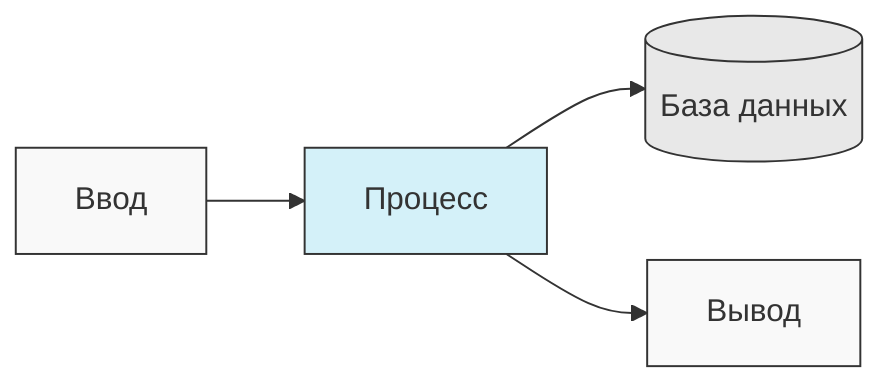

# AgentDock: Создавайте Безграничные Возможности с Помощью ИИ-Агентов

[](https://github.com/agentdock/agentdock/stargazers)
[](https://opensource.org/licenses/MIT)
[](https://github.com/AgentDock/AgentDock/releases)
[](https://hub.agentdock.ai/docs)
[](https://discord.gg/fDYFFmwuRA)
[](https://agentdock.ai)
[](https://x.com/agentdock)

## 🌐 Переводы README

[Français](../french/README.md) • [日本語](../japanese/README.md) • [한국어](../korean/README.md) • [中文](../chinese/README.md) • [Español](../spanish/README.md) • [Italiano](../italian/README.md) • [Nederlands](../dutch/README.md) • [Polski](../polish/README.md) • [Türkçe](../turkish/README.md) • [Українська](../ukrainian/README.md) • [Русский](./README.md) • [Ελληνικά](../greek/README.md) • [العربية](../arabic/README.md)

AgentDock — это фреймворк для создания продвинутых ИИ-агентов, выполняющих сложные задачи с **настраиваемым детерминизмом**. Он состоит из двух основных компонентов:

1.  **AgentDock Core**: Фреймворк с открытым исходным кодом, ориентированный на бэкенд, для создания и развертывания ИИ-агентов. Он спроектирован как *независимый от фреймворка* и *независимый от провайдера*, предоставляя вам полный контроль над реализацией вашего агента.

2.  **Open Source Client**: Полноценное приложение Next.js, служащее эталонной реализацией и потребителем фреймворка AgentDock Core. Вы можете увидеть его в действии на [https://hub.agentdock.ai](https://hub.agentdock.ai)

Созданный с использованием TypeScript, AgentDock делает упор на *простоту*, *расширяемость* и ***настраиваемый детерминизм***, что делает его идеальным для создания надежных, предсказуемых систем ИИ, способных работать с минимальным контролем.

## 🧠 Принципы Дизайна

AgentDock основан на следующих ключевых принципах:

-   **Простота Прежде Всего**: Минимальный код, необходимый для создания функциональных агентов
-   **Архитектура на Основе Узлов (Nodes)**: Все возможности реализованы как узлы
-   **Инструменты как Специализированные Узлы**: Инструменты расширяют систему узлов для возможностей агента
-   **Настраиваемый Детерминизм**: Контролируйте предсказуемость поведения агента
-   **Типобезопасность (Type Safety)**: Полная типизация TypeScript во всем фреймворке

### Настраиваемый Детерминизм

***Настраиваемый детерминизм*** является краеугольным камнем философии дизайна AgentDock, позволяя сбалансировать творческие возможности ИИ с предсказуемым поведением системы:

-   `AgentNode` по своей природе недетерминированы, так как LLM могут генерировать разные ответы каждый раз
-   Рабочие процессы (Workflows) можно сделать более детерминированными с помощью *определенных путей выполнения инструментов*
-   Разработчики могут **контролировать уровень детерминизма**, настраивая, какие части системы используют LLM-выводы
-   Даже с компонентами LLM общее поведение системы остается **предсказуемым** благодаря структурированным взаимодействиям инструментов
-   Этот сбалансированный подход обеспечивает как *творчество*, так и **надежность** в ваших ИИ-приложениях

#### Детерминированные Рабочие Процессы

AgentDock полностью поддерживает детерминированные рабочие процессы, знакомые вам по типичным конструкторам workflow. Все ожидаемые предсказуемые пути выполнения и надежные результаты доступны, с использованием LLM-выводов или без них:



#### Недетерминированное Поведение Агента

С AgentDock вы также можете использовать `AgentNode` с LLM, когда требуется большая адаптивность. Творческие результаты могут варьироваться в зависимости от ваших потребностей, сохраняя при этом структурированные шаблоны взаимодействия:

```mermaid
flowchart TD
  Input[Запрос пользователя] --> Agent[AgentNode]
  Agent -->|\"Рассуждение LLM (Недетерминированное)\"| ToolChoice{Выбор инструмента}
  ToolChoice -->|\"Вариант A\"| ToolA[Инструмент глубинного исследования]
  ToolChoice -->|\"Вариант B\"| ToolB[Инструмент анализа данных]
  ToolChoice -->|\"Вариант C\"| ToolC[Прямой ответ]
  ToolA --> Response[Конечный ответ]
  ToolB --> Response
  ToolC --> Response

  style Input fill:#f9f9f9,stroke:#333,stroke-width:1px
  style Agent fill:#ffdfba,stroke:#333,stroke-width:1px
  style ToolChoice fill:#ffdfba,stroke:#333,stroke-width:1px
  style ToolA fill:#d4f1f9,stroke:#333,stroke-width:1px
  style ToolB fill:#d4f1f9,stroke:#333,stroke-width:1px
  style ToolC fill:#d4f1f9,stroke:#333,stroke-width:1px
  style Response fill:#f9f9f9,stroke:#333,stroke-width:1px
```

#### Недетерминированные Агенты с Детерминированными Подпроцессами

AgentDock предлагает вам ***лучшее из обоих миров***, сочетая недетерминированный интеллект агента с детерминированным выполнением рабочих процессов:

```mermaid
flowchart TD
  Input[Запрос пользователя] --> Agent[AgentNode]
  Agent -->|\"Рассуждение LLM (Недетерминированное)\"| FlowChoice{Выбор подпроцесса}
  FlowChoice -->|\"Решение A\"| Flow1[Детерминированный рабочий процесс 1]
  FlowChoice -->|\"Решение B\"| Flow2[Детерминированный рабочий процесс 2]
  FlowChoice -->|\"Решение C\"| DirectResponse[Сгенерировать ответ]

  Flow1 --> |\"Шаг 1 → 2 → 3 → ... → 200\"| Flow1Result[Результат рабочего процесса 1]
  Flow2 --> |\"Шаг 1 → 2 → 3 → ... → 100\"| Flow2Result[Результат рабочего процесса 2]

  Flow1Result --> Response[Конечный ответ]
  Flow2Result --> Response
  DirectResponse --> Response

  style Input fill:#f9f9f9,stroke:#333,stroke-width:1px
  style Agent fill:#ffdfba,stroke:#333,stroke-width:1px
  style FlowChoice fill:#ffdfba,stroke:#333,stroke-width:1px
  style Flow1 fill:#c9e4ca,stroke:#333,stroke-width:1px
  style Flow2 fill:#c9e4ca,stroke:#333,stroke-width:1px
  style Flow1Result fill:#c9e4ca,stroke:#333,stroke-width:1px
  style Flow2Result fill:#c9e4ca,stroke:#333,stroke-width:1px
  style DirectResponse fill:#ffdfba,stroke:#333,stroke-width:1px
  style Response fill:#f9f9f9,stroke:#333,stroke-width:1px
```

Этот подход позволяет запускать сложные многошаговые рабочие процессы (потенциально включающие сотни детерминированных шагов, реализованных в инструментах или как последовательности связанных узлов) с помощью интеллектуальных решений агента. Каждый рабочий процесс выполняется предсказуемо, несмотря на то, что он запускается недетерминированным рассуждением агента.

Для более продвинутых рабочих процессов ИИ-агентов и многоэтапных конвейеров обработки мы создаем [AgentDock Pro](../../docs/agentdock-pro.md) - мощную платформу для создания, визуализации и запуска сложных систем агентов.

#### Вкратце: Настраиваемый Детерминизм

Представьте, что вы ведете машину. Иногда вам нужна креативность ИИ (например, навигация по городским улицам - недетерминированная), а иногда — надежные пошаговые процессы (например, следование знакам на шоссе - детерминированные). AgentDock позволяет создавать системы, использующие *оба* подхода, выбирая правильный для каждой части задачи. Вы получаете как интеллект ИИ, *так и* предсказуемые результаты там, где это необходимо.

## 🏗️ Ключевая Архитектура

Фреймворк построен вокруг мощной модульной системы на основе узлов (Nodes), служащей фундаментом для всей функциональности агента. Эта архитектура использует различные типы узлов как строительные блоки:

-   **`BaseNode`**: Фундаментальный класс, определяющий основной интерфейс и возможности для всех узлов.
-   **`AgentNode`**: Специализированный ключевой узел, координирующий взаимодействия с LLM, использование инструментов и логику агента.
-   **Инструменты и Пользовательские Узлы**: Разработчики реализуют возможности агента и пользовательскую логику как узлы, расширяющие `BaseNode`.

Эти узлы взаимодействуют через управляемые реестры и могут быть соединены (используя порты основной архитектуры и потенциальную шину сообщений) для обеспечения сложного, настраиваемого и потенциально детерминированного поведения и рабочих процессов агентов.

Подробное объяснение компонентов и возможностей системы узлов см. в [Документации Системы Узлов](../../docs/nodes/README.md).

## 🚀 Начало Работы

Полное руководство см. в [Руководстве по Началу Работы](../../docs/getting-started.md).

### Требования

*   Node.js ≥ 20.11.0 (LTS)
*   pnpm ≥ 9.15.0 (Обязательно)
*   API-ключи для провайдеров LLM (Anthropic, OpenAI и т.д.)

### Установка

1.  **Клонируйте Репозиторий**:

    ```bash
    git clone https://github.com/AgentDock/AgentDock.git
    cd AgentDock
    ```

2.  **Установите pnpm**:

    ```bash
    corepack enable
    corepack prepare pnpm@latest --activate
    ```

3.  **Установите Зависимости**:

    ```bash
    pnpm install
    ```

    Для чистой переустановки (когда нужно пересобрать с нуля):

    ```bash
    pnpm run clean-install
    ```

    Этот скрипт удаляет все `node_modules`, файлы блокировки и корректно переустанавливает зависимости.

4.  **Настройте Окружение**:

    Создайте файл окружения (`.env` или `.env.local`) на основе предоставленного `.env.example`:

    ```bash
    # Вариант 1: Создать .env.local
    cp .env.example .env.local

    # Вариант 2: Создать .env
    cp .env.example .env
    ```

    Затем добавьте ваши API-ключи в файл окружения.

5.  **Запустите Сервер Разработки**:

    ```bash
    pnpm dev
    ```

### Расширенные Возможности

| Возможность                | Описание                                                                                         | Документация                                                                       |
| :------------------------- | :----------------------------------------------------------------------------------------------- | :--------------------------------------------------------------------------------- |
| **Управление Сессиями**    | Изолированное, производительное управление состоянием для диалогов                               | [Документация Сессий](../../docs/architecture/sessions/README.md)                |
| **Фреймворк Оркестрации**  | Контроль поведения агента и доступности инструментов в зависимости от контекста                  | [Документация Оркестрации](../../docs/architecture/orchestration/README.md)      |
| **Абстракция Хранилища**   | Гибкая система хранения с подключаемыми провайдерами для KV, векторного и безопасного хранения   | [Документация Хранилища](../../docs/storage/README.md)                            |

Система хранения в настоящее время развивается: добавляется хранилище ключ-значение (провайдеры Memory, Redis, Vercel KV) и безопасное хранилище на стороне клиента, в то время как векторное хранилище и дополнительные бэкенды находятся в разработке.

## 📕 Документация

Документация по фреймворку AgentDock доступна на [hub.agentdock.ai/docs](https://hub.agentdock.ai/docs) и в папке `/docs/` этого репозитория. Документация включает:

-   Руководства по началу работы
-   Справочники API
-   Учебники по созданию узлов
-   Примеры интеграции

## 📂 Структура Репозитория

Этот репозиторий содержит:

1.  **AgentDock Core**: Основной фреймворк, расположенный в `agentdock-core/`
2.  **Open Source Client**: Полная эталонная реализация, созданная с помощью Next.js, служащая потребителем фреймворка AgentDock Core.
3.  **Примеры Агентов**: Готовые к использованию конфигурации агентов в каталоге `agents/`

Вы можете использовать AgentDock Core независимо в своих приложениях или использовать этот репозиторий как отправную точку для создания собственных приложений на основе агентов.

## 📝 Шаблоны Агентов

AgentDock включает несколько предварительно настроенных шаблонов агентов. Изучите их в каталоге `agents/` или прочитайте [Документацию Шаблонов Агентов](../../docs/agent-templates.md) для деталей конфигурации.

## 🔧 Примеры Реализаций

Примеры реализаций демонстрируют специализированные сценарии использования и расширенную функциональность:

| Реализация                   | Описание                                                                                       | Статус      |
| :--------------------------- | :--------------------------------------------------------------------------------------------- | :---------- |
| **Оркестрованный Агент**     | Пример агента, использующего оркестрацию для адаптации поведения в зависимости от контекста   | Доступно    |
| **Когнитивный Рассуждающий** | Решает сложные проблемы, используя структурированное рассуждение и когнитивные инструменты     | Доступно    |
| **Планировщик Агентов**      | Специализированный агент для проектирования и реализации других ИИ-агентов                    | Доступно    |
| [**Code Playground (Песочница для Кода)**](../../docs/roadmap/code-playground.md) | Генерация и выполнение кода в песочнице с богатыми возможностями визуализации               | Запланировано |
| [**Универсальный ИИ-Агент**](../../docs/roadmap/generalist-agent.md)| Агент типа Manus, способный использовать браузер и выполнять сложные задачи                      | Запланировано |

## 🔐 Детали Конфигурации Окружения

Для работы AgentDock Open Source Client требуются API-ключи для провайдеров LLM. Они настраиваются в файле окружения (`.env` или `.env.local`), который вы создаете на основе предоставленного `.env.example`.

### API-Ключи Провайдеров LLM

Добавьте ваши API-ключи провайдеров LLM (требуется как минимум один):

```bash
# API-Ключи Провайдеров LLM - требуется как минимум один
ANTHROPIC_API_KEY=sk-ant-xxxxxxx  # API-ключ Anthropic
OPENAI_API_KEY=sk-xxxxxxx         # API-ключ OpenAI
GEMINI_API_KEY=xxxxxxx            # API-ключ Google Gemini
DEEPSEEK_API_KEY=xxxxxxx          # API-ключ DeepSeek
GROQ_API_KEY=xxxxxxx              # API-ключ Groq
```

### Разрешение API-Ключей

AgentDock Open Source Client следует порядку приоритета при определении используемого API-ключа:

1.  **Пользовательский API-ключ для агента** (устанавливается через настройки агента в UI)
2.  **Глобальный API-ключ настроек** (устанавливается через страницу настроек в UI)
3.  **Переменная окружения** (из `.env.local` или платформы развертывания)

### API-Ключи, Специфичные для Инструментов

Некоторые инструменты также требуют собственных API-ключей:

```bash
# API-Ключи, Специфичные для Инструментов
SERPER_API_KEY=                  # Требуется для функциональности поиска
FIRECRAWL_API_KEY=               # Требуется для более глубокого веб-сканирования
```

Подробнее о конфигурации окружения см. в реализации [`src/types/env.ts`](../../src/types/env.ts).

### Используйте Свой Собственный Ключ (BYOK - Bring Your Own Key)

AgentDock работает по модели BYOK (Bring Your Own Key - Используйте Свой Собственный Ключ):

1.  Добавьте ваши API-ключи на странице настроек приложения
2.  Либо предоставьте ключи через заголовки запросов для прямого использования API
3.  Ключи надежно хранятся с использованием встроенной системы шифрования
4.  Никакие API-ключи не передаются и не хранятся на наших серверах

## 📦 Менеджер Пакетов

Этот проект *требует* использования `pnpm` для согласованного управления зависимостями. `npm` и `yarn` не поддерживаются.

## 💡 Что Вы Можете Создать

1.  **Приложения на Основе ИИ**
    -   Пользовательские чат-боты с любым фронтендом
    -   ИИ-ассистенты командной строки
    -   Автоматизированные конвейеры обработки данных
    -   Интеграции с бэкенд-сервисами

2.  **Возможности Интеграции**
    -   Любой провайдер ИИ (OpenAI, Anthropic и т.д.)
    -   Любой фронтенд-фреймворк
    -   Любой бэкенд-сервис
    -   Пользовательские источники данных и API

3.  **Системы Автоматизации**
    -   Рабочие процессы обработки данных
    -   Конвейеры анализа документов
    -   Автоматизированные системы отчетности
    -   Агенты автоматизации задач

## Ключевые Особенности

| Особенность                        | Описание                                                                                    |
| :--------------------------------- | :------------------------------------------------------------------------------------------ |
| 🔌 **Независимость от Фреймворка (Node.js Backend)** | Основная библиотека интегрируется со стеками бэкенда Node.js.                              |
| 🧩 **Модульный Дизайн**              | Создавайте сложные системы из простых узлов                                                 |
| 🛠️ **Расширяемость**                 | Создавайте пользовательские узлы для любой функциональности                                  |
| 🔒 **Безопасность**                  | Встроенные функции безопасности для API-ключей и данных                                      |
| 🔑 **BYOK**                          | Используйте *свои собственные API-ключи* для провайдеров LLM                             |
| 📦 **Самодостаточность (Self-contained)**| Основной фреймворк имеет минимальные зависимости                                           |
| ⚙️ **Многошаговые Вызовы Инструментов (Multi-Step Tool Calls)**| Поддержка *сложных цепочек рассуждений*                                                  |
| 📊 **Структурированное Логирование** | Подробная информация о выполнении агента                                                   |
| 🛡️ **Надежная Обработка Ошибок**      | Предсказуемое поведение и упрощенная отладка                                                |
| 📝 **TypeScript Прежде Всего**       | Типобезопасность и улучшенный опыт разработчика                                             |
| 🌐 **Open Source Клиент**            | Включает полную эталонную реализацию Next.js                                               |
| 🔄 **Оркестрация**                  | *Динамический контроль* поведения агента в зависимости от контекста                           |
| 💾 **Управление Сессиями**           | Изолированное состояние для параллельных диалогов                                            |
| 🎮 **Настраиваемый Детерминизм**   | Балансируйте креативность ИИ и предсказуемость с помощью логики узлов/рабочих процессов.     |

## 🧰 Компоненты

Модульная архитектура AgentDock основана на этих ключевых компонентах:

*   **BaseNode**: Основа для всех узлов в системе
*   **AgentNode**: Основная абстракция для функциональности агента
*   **Инструменты и Пользовательские Узлы**: Вызываемые возможности и пользовательская логика, реализованные как узлы.
*   **Реестр Узлов**: Управляет регистрацией и извлечением всех типов узлов
*   **Реестр Инструментов**: Управляет доступностью инструментов для агентов
*   **CoreLLM**: Унифицированный интерфейс для взаимодействия с провайдерами LLM
*   **Реестр Провайдеров**: Управляет конфигурациями провайдеров LLM
*   **Обработка Ошибок**: Система для обработки ошибок и обеспечения предсказуемого поведения
*   **Логирование (Logging)**: Структурированная система логирования для мониторинга и отладки
*   **Оркестрация**: Контролирует доступность инструментов и поведение в зависимости от контекста диалога
*   **Сессии**: Управляет изоляцией состояния между параллельными диалогами

Подробную техническую документацию по этим компонентам см. в [Обзоре Архитектуры](../../docs/architecture/README.md).

## 🗺️ Дорожная Карта

Ниже представлена наша дорожная карта разработки AgentDock. Большинство перечисленных здесь улучшений относятся к основному фреймворку AgentDock (`agentdock-core`), который в настоящее время разрабатывается локально и будет опубликован как версионированный пакет NPM после достижения стабильного релиза. Некоторые пункты дорожной карты могут также включать улучшения в реализации клиента с открытым исходным кодом.

| Особенность                                                                 | Описание                                                                                              | Категория          |
| :-------------------------------------------------------------------------- | :---------------------------------------------------------------------------------------------------- | :----------------- |
| [**Слой Абстракции Хранилища**](../../docs/roadmap/storage-abstraction.md)      | Гибкая система хранения с подключаемыми провайдерами                                                 | **В Разработке**   |
| [**Продвинутые Системы Памяти**](../../docs/roadmap/advanced-memory.md)          | Управление долгосрочным контекстом                                                                 | **В Разработке**   |
| [**Интеграция Векторного Хранилища**](../../docs/roadmap/vector-storage.md)     | Поиск на основе вложений для документов и памяти                                                    | **В Разработке**   |
| [**Оценка для ИИ-Агентов**](../../docs/roadmap/evaluation-framework.md)       | Комплексный фреймворк для тестирования и оценки                                                       | **В Разработке**   |
| [**Интеграция Платформ**](../../docs/roadmap/platform-integration.md)         | Поддержка Telegram, WhatsApp и других платформ обмена сообщениями                                   | **Запланировано**  |
| [**Сотрудничество Нескольких Агентов**](../../docs/roadmap/multi-agent-collaboration.md)| Возможность совместной работы агентов                                                              | **Запланировано**  |
| [**Интеграция Протокола Контекста Модели (MCP)**](../../docs/roadmap/mcp-integration.md)| Поддержка обнаружения и использования внешних инструментов через MCP                               | **Запланировано**  |
| [**Голосовые ИИ-Агенты**](../../docs/roadmap/voice-agents.md)                   | ИИ-агенты, использующие голосовые интерфейсы и телефонные номера через AgentNode                   | **Запланировано**  |
| [**Телеметрия и Трассировка**](../../docs/roadmap/telemetry.md)               | Расширенное логирование и отслеживание производительности                                            | **Запланировано**  |
| [**AgentDock Pro**](../../docs/agentdock-pro.md)                             | Полноценная корпоративная облачная платформа для масштабирования ИИ-агентов и рабочих процессов       | **Облако**         |
| [**Конструктор ИИ-Агентов на Естественном Языке**](../../docs/roadmap/nl-agent-builder.md)| Визуальный конструктор + создание агентов и рабочих процессов на естественном языке               | **Облако**         |
| [**Рынок Агентов**](../../docs/roadmap/agent-marketplace.md)                 | Монетизируемые шаблоны агентов                                                                     | **Облако**         |

## 👥 Вклад

Мы приветствуем вклад в AgentDock! Подробные инструкции см. в [CONTRIBUTING.md](../../CONTRIBUTING.md).

## 📜 Лицензия

AgentDock выпускается под [Лицензией MIT](../../LICENSE).

## ✨ Создавайте Безграничные Возможности!

AgentDock предоставляет основу для создания практически любого приложения или автоматизации на базе ИИ, которые вы можете себе представить. Мы призываем вас изучать фреймворк, создавать инновационных агентов и вносить вклад в сообщество. Давайте вместе формировать будущее взаимодействия с ИИ!

---
[Назад к Индексу Переводов](../README.md) 