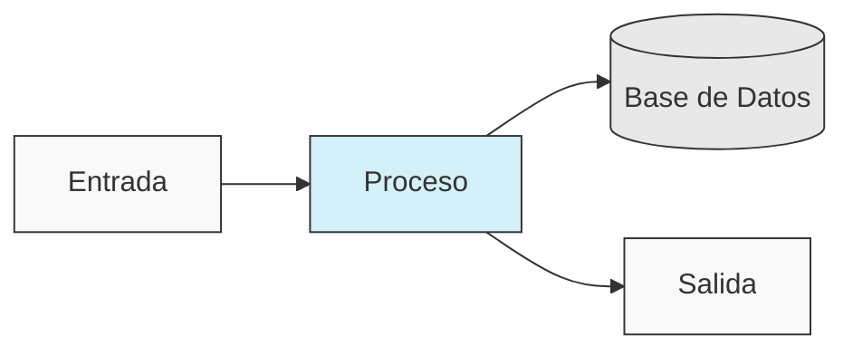
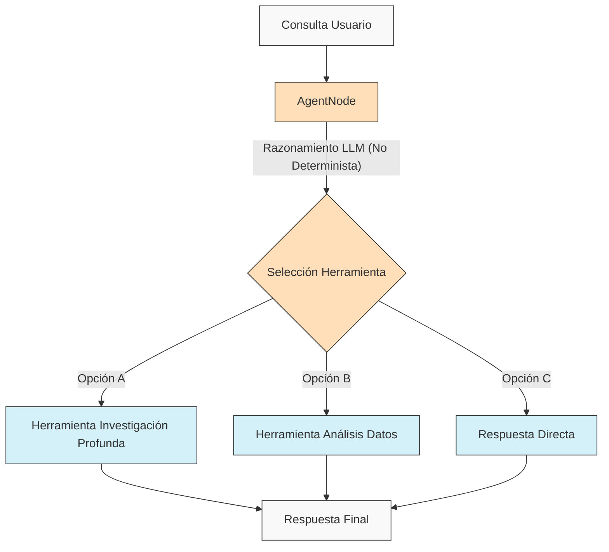
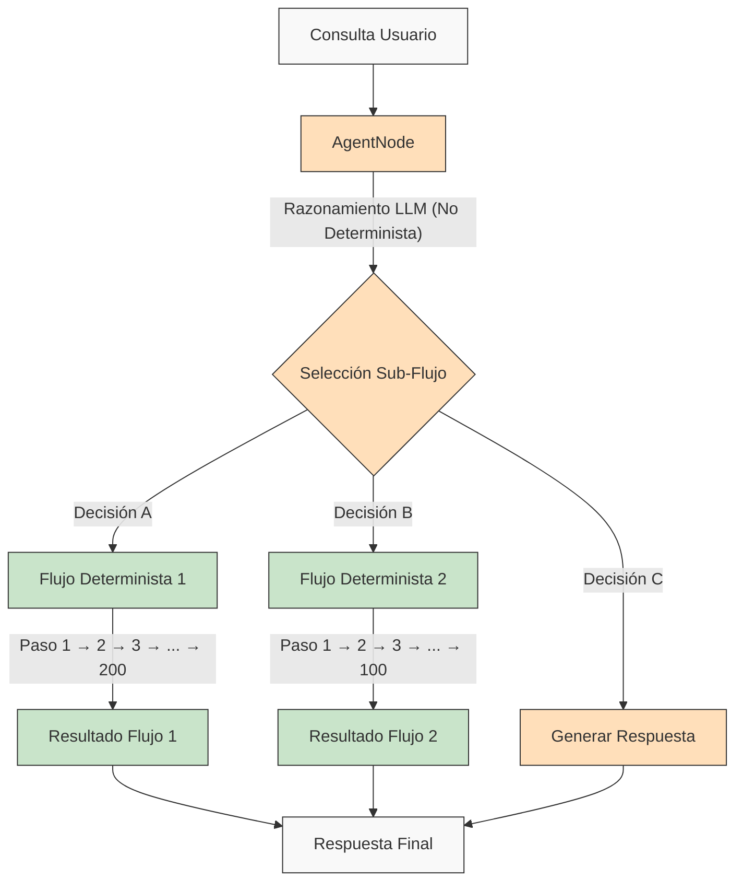

<p align="center">
  
</p>

## 🌐 Traducciones del README

[Français](/docs/i18n/french/README.md) • [日本語](/docs/i18n/japanese/README.md) • [한국어](/docs/i18n/korean/README.md) • [中文](/docs/i18n/chinese/README.md) • [Español](/docs/i18n/spanish/README.md) • [Italiano](/docs/i18n/italian/README.md) • [Nederlands](/docs/i18n/dutch/README.md) • [Deutsch](/docs/i18n/deutsch/README.md) • [Polski](/docs/i18n/polish/README.md) • [Türkçe](/docs/i18n/turkish/README.md) • [Українська](/docs/i18n/ukrainian/README.md) • [Ελληνικά](/docs/i18n/greek/README.md) • [Русский](/docs/i18n/russian/README.md) • [العربية](/docs/i18n/arabic/README.md)

# AgentDock: Crea Posibilidades Ilimitadas con Agentes de IA

AgentDock es un framework para construir agentes de IA sofisticados que realizan tareas complejas con **determinismo configurable**. Consta de dos componentes principales:

1.  **AgentDock Core**: Un framework open-source, enfocado en el backend, para construir y desplegar agentes de IA. Está diseñado para ser *agnóstico al framework* y *agnóstico al proveedor*, dándote control completo sobre la implementación de tu agente.

2.  **Cliente Open Source**: Una aplicación Next.js completa que sirve como implementación de referencia y consumidor del framework AgentDock Core. Puedes verlo en acción en [https://hub.agentdock.ai](https://hub.agentdock.ai)

Construido con TypeScript, AgentDock enfatiza la *simplicidad*, la *extensibilidad* y el ***determinismo configurable***, lo que lo hace ideal para construir sistemas de IA fiables y predecibles que pueden operar con mínima supervisión.

## 🧠 Principios de Diseño

AgentDock se basa en estos principios fundamentales:

-   **Primero la Simplicidad**: Código mínimo requerido para crear agentes funcionales
-   **Arquitectura Basada en Nodos**: Todas las capacidades se implementan como nodos
-   **Herramientas como Nodos Especializados**: Las herramientas extienden el sistema de nodos para las capacidades del agente
-   **Determinismo Configurable**: Controla la previsibilidad del comportamiento del agente
-   **Seguridad de Tipos**: Tipos TypeScript completos en todo el sistema

### Determinismo Configurable

El ***determinismo configurable*** es una piedra angular de la filosofía de diseño de AgentDock, permitiéndote equilibrar las capacidades creativas de la IA con un comportamiento predecible del sistema:

-   Los AgentNodes son inherentemente no deterministas ya que los LLMs pueden generar respuestas diferentes cada vez
-   Los flujos de trabajo (Workflows) pueden hacerse más deterministas a través de *rutas de ejecución de herramientas definidas*
-   Los desarrolladores pueden **controlar el nivel de determinismo** configurando qué partes del sistema utilizan la inferencia LLM
-   Incluso con componentes LLM, el comportamiento general del sistema sigue siendo **predecible** a través de interacciones de herramientas estructuradas
-   Este enfoque equilibrado permite tanto la *creatividad* como la **fiabilidad** en tus aplicaciones de IA

#### Flujos de Trabajo Deterministas

AgentDock soporta completamente los flujos de trabajo deterministas con los que estás familiarizado de los constructores de flujos de trabajo típicos. Todas las rutas de ejecución predecibles y los resultados fiables que esperas están disponibles, con o sin inferencia LLM:



#### Comportamiento de Agente No Determinista

Con AgentDock, también puedes aprovechar los AgentNodes con LLMs cuando necesites más adaptabilidad. Las salidas creativas pueden variar según tus necesidades, manteniendo patrones de interacción estructurados:



#### Agentes No Deterministas con Sub-Flujos Deterministas

AgentDock te ofrece lo ***mejor de ambos mundos*** combinando la inteligencia de agente no determinista con la ejecución de flujos de trabajo deterministas:



Este enfoque permite que flujos de trabajo complejos de múltiples pasos (que potencialmente involucran cientos de pasos deterministas implementados dentro de herramientas o como secuencias de nodos conectados) sean invocados por decisiones de agentes inteligentes. Cada flujo de trabajo se ejecuta de manera predecible a pesar de ser activado por un razonamiento de agente no determinista.

Para flujos de trabajo de agentes de IA más avanzados y pipelines de procesamiento de múltiples etapas, estamos construyendo [AgentDock Pro](../../docs/agentdock-pro.md), una plataforma potente para crear, visualizar y ejecutar sistemas de agentes complejos.

#### En resumen: Determinismo Configurable

Imagínalo como conducir un automóvil. A veces necesitas la creatividad de la IA (como navegar por las calles de la ciudad - no determinista), y a veces necesitas procesos fiables, paso a paso (como seguir las señales de la autopista - determinista). AgentDock te permite construir sistemas que usan *ambos*, eligiendo el enfoque adecuado para cada parte de una tarea. Consigues tanto la creatividad de la IA *como* resultados predecibles cuando los necesitas.

## 🏗️ Arquitectura Central

El framework se construye alrededor de un sistema potente y modular basado en nodos, que sirve como base para toda la funcionalidad del agente. Esta arquitectura utiliza tipos de nodos distintos como bloques de construcción:

-   **`BaseNode`**: La clase fundamental que establece la interfaz central y las capacidades para todos los nodos.
-   **`AgentNode`**: Un nodo central especializado que orquesta las interacciones LLM, el uso de herramientas y la lógica del agente.
-   **Herramientas y Nodos Personalizados**: Los desarrolladores implementan capacidades de agente y lógica personalizada como nodos que extienden `BaseNode`.

Estos nodos interactúan a través de registros gestionados y pueden conectarse (aprovechando los puertos de la arquitectura central y un posible bus de mensajes) para permitir comportamientos y flujos de trabajo de agentes complejos, configurables y potencialmente deterministas.

Para una explicación detallada de los componentes y capacidades del sistema de nodos, consulta la [Documentación del Sistema de Nodos](../../docs/nodes/README.md).

## 🚀 Empezando

Para una guía completa, consulta la [Guía de Inicio](../../docs/getting-started.md).

### Requisitos

*   Node.js ≥ 20.11.0 (LTS)
*   pnpm ≥ 9.15.0 (Requerido)
*   Claves API para proveedores LLM (Anthropic, OpenAI, etc.)

### Instalación

1.  **Clonar el Repositorio**:

    ```bash
    git clone https://github.com/AgentDock/AgentDock.git
    cd AgentDock
    ```

2.  **Instalar pnpm**:

    ```bash
    corepack enable
    corepack prepare pnpm@latest --activate
    ```

3.  **Instalar Dependencias**:

    ```bash
    pnpm install
    ```

    Para una reinstalación limpia (cuando necesites reconstruir desde cero):

    ```bash
    pnpm run clean-install
    ```

    Este script elimina todos los node_modules, archivos de bloqueo y reinstala correctamente las dependencias.

4.  **Configurar el Entorno**:

    Crea un archivo de entorno (`.env` o `.env.local`) basado en el archivo `.env.example` proporcionado:

    ```bash
    # Opción 1: Crear .env.local
    cp .env.example .env.local

    # Opción 2: Crear .env
    cp .env.example .env
    ```

    Luego agrega tus claves API al archivo de entorno.

5.  **Iniciar el Servidor de Desarrollo**:

    ```bash
    pnpm dev
    ```

### Capacidades Avanzadas

| Capacidad                 | Descripción                                                                                     | Documentación                                                                       |
| :------------------------ | :---------------------------------------------------------------------------------------------- | :---------------------------------------------------------------------------------- |
| **Gestión de Sesiones**   | Gestión de estado aislada y de alto rendimiento para conversaciones                          | [Documentación de Sesiones](../../docs/architecture/sessions/README.md)           |
| **Framework de Orquestación** | Control del comportamiento del agente y disponibilidad de herramientas basado en el contexto    | [Documentación de Orquestación](../../docs/architecture/orchestration/README.md)  |
| **Abstracción de Almacenamiento** | Sistema de almacenamiento flexible con proveedores conectables para KV, Vector y Secure Storage | [Documentación de Almacenamiento](../../docs/storage/README.md)                    |

El sistema de almacenamiento está evolucionando actualmente con almacenamiento clave-valor (proveedores Memory, Redis, Vercel KV) y almacenamiento seguro del lado del cliente, mientras que el almacenamiento vectorial y backends adicionales están en desarrollo.

## 📕 Documentación

La documentación del framework AgentDock está disponible en [hub.agentdock.ai/docs](https://hub.agentdock.ai/docs) y en la carpeta `/docs/` de este repositorio. La documentación incluye:

-   Guías de inicio
-   Referencias de API
-   Tutoriales de creación de nodos
-   Ejemplos de integración

## 📂 Estructura del Repositorio

Este repositorio contiene:

1.  **AgentDock Core**: El framework central ubicado en `agentdock-core/`
2.  **Cliente Open Source**: Una implementación de referencia completa construida con Next.js, que sirve como consumidor del framework AgentDock Core.
3.  **Agentes de Ejemplo**: Configuraciones de agentes listas para usar en el directorio `agents/`

Puedes usar AgentDock Core de forma independiente en tus propias aplicaciones, o usar este repositorio como punto de partida para construir tus propias aplicaciones impulsadas por agentes.

## 📝 Plantillas de Agentes

AgentDock incluye varias plantillas de agentes preconfiguradas. Explóralas en el directorio `agents/` o lee la [Documentación de Plantillas de Agentes](../../docs/agent-templates.md) para detalles de configuración.

## 🔧 Implementaciones de Ejemplo

Las implementaciones de ejemplo muestran casos de uso especializados y funcionalidad avanzada:

| Implementación             | Descripción                                                                          | Estado      |
| :------------------------- | :----------------------------------------------------------------------------------- | :---------- |
| **Agente Orquestado**      | Agente de ejemplo que usa orquestación para adaptar el comportamiento según el contexto | Disponible  |
| **Razonador Cognitivo**    | Aborda problemas complejos usando razonamiento estructurado y herramientas cognitivas   | Disponible  |
| **Planificador de Agentes** | Agente especializado para diseñar e implementar otros agentes de IA                   | Disponible  |
| [**Playground de Código (Code Playground)**](../../docs/roadmap/code-playground.md) | Generación y ejecución de código en sandbox con ricas capacidades de visualización | Planificado |
| [**Agente de IA Generalista**](../../docs/roadmap/generalist-agent.md) | Agente similar a Manus que puede usar el navegador y ejecutar tareas complejas      | Planificado |

## 🔐 Detalles de Configuración del Entorno

El Cliente Open Source de AgentDock requiere claves API para los proveedores LLM para funcionar. Estas se configuran en un archivo de entorno (`.env` o `.env.local`) que creas basándote en el archivo `.env.example` proporcionado.

### Claves API de Proveedores LLM

Agrega tus claves API de proveedor LLM (se requiere al menos una):

```bash
# Claves API Proveedor LLM - se requiere al menos una
ANTHROPIC_API_KEY=sk-ant-xxxxxxx  # Clave API Anthropic
OPENAI_API_KEY=sk-xxxxxxx         # Clave API OpenAI
GEMINI_API_KEY=xxxxxxx            # Clave API Google Gemini
DEEPSEEK_API_KEY=xxxxxxx          # Clave API DeepSeek
GROQ_API_KEY=xxxxxxx              # Clave API Groq
```

### Resolución de Claves API

El Cliente Open Source de AgentDock sigue un orden de prioridad al resolver qué clave API usar:

1.  **Clave API personalizada por agente** (establecida a través de la configuración del agente en la UI)
2.  **Clave API de configuración global** (establecida a través de la página de configuración en la UI)
3.  **Variable de entorno** (desde .env.local o plataforma de despliegue)

### Claves API Específicas de Herramientas

Algunas herramientas también requieren sus propias claves API:

```bash
# Claves API Específicas de Herramientas
SERPER_API_KEY=                  # Requerido para funcionalidad de búsqueda
FIRECRAWL_API_KEY=               # Requerido para búsqueda web más profunda
```

Para más detalles sobre la configuración del entorno, consulta la implementación en [`src/types/env.ts`](../../src/types/env.ts).

### Usa Tu Propia Clave (BYOK - Bring Your Own Key)

AgentDock opera bajo un modelo BYOK (Bring Your Own Key - Usa Tu Propia Clave):

1.  Agrega tus claves API en la página de configuración de la aplicación
2.  Alternativamente, proporciona claves a través de encabezados de solicitud para uso directo de la API
3.  Las claves se almacenan de forma segura utilizando el sistema de cifrado incorporado
4.  No se comparten ni almacenan claves API en nuestros servidores

## 📦 Gestor de Paquetes

Este proyecto *requiere* el uso de `pnpm` para una gestión de dependencias consistente. `npm` y `yarn` no son compatibles.

## 💡 Qué Puedes Construir

1.  **Aplicaciones Impulsadas por IA**
    -   Chatbots personalizados con cualquier frontend
    -   Asistentes de IA de línea de comandos
    -   Pipelines de procesamiento de datos automatizados
    -   Integraciones de servicios backend

2.  **Capacidades de Integración**
    -   Cualquier proveedor de IA (OpenAI, Anthropic, etc.)
    -   Cualquier framework frontend
    -   Cualquier servicio backend
    -   Fuentes de datos y APIs personalizadas

3.  **Sistemas de Automatización**
    -   Flujos de trabajo de procesamiento de datos
    -   Pipelines de análisis de documentos
    -   Sistemas de informes automatizados
    -   Agentes de automatización de tareas

## Características Clave

| Característica                  | Descripción                                                                               |
| :------------------------------ | :---------------------------------------------------------------------------------------- |
| 🔌 **Agnóstico al Framework (Backend Node.js)** | La biblioteca central se integra con stacks backend Node.js.                               |
| 🧩 **Diseño Modular**           | Construye sistemas complejos a partir de nodos simples                                    |
| 🛠️ **Extensible**               | Construye nodos personalizados para cualquier funcionalidad                              |
| 🔒 **Seguro**                   | Características de seguridad integradas para claves API y datos                       |
| 🔑 **BYOK**                     | Usa tus *propias claves API* para proveedores LLM                                      |
| 📦 **Autónomo (Self-contained)**| El framework central tiene dependencias mínimas                                         |
| ⚙️ **Llamadas a Herramientas Multi-Paso (Multi-Step Tool Calls)**| Soporte para *cadenas de razonamiento complejas*                                |
| 📊 **Registro Estructurado**   | Información detallada sobre la ejecución del agente                                    |
| 🛡️ **Gestión Robusta de Errores** | Comportamiento predecible y depuración simplificada                                  |
| 📝 **TypeScript Primero**       | Seguridad de tipos y experiencia de desarrollador mejorada                           |
| 🌐 **Cliente Open Source**      | Incluye una implementación de referencia completa de Next.js                           |
| 🔄 **Orquestación**             | *Control dinámico* del comportamiento del agente basado en el contexto                   |
| 💾 **Gestión de Sesiones**      | Estado aislado para conversaciones concurrentes                                            |
| 🎮 **Determinismo Configurable**| Equilibra la creatividad de la IA y la previsibilidad mediante lógica de nodos/flujos de trabajo. |

## 🧰 Componentes

La arquitectura modular de AgentDock se basa en estos componentes clave:

*   **BaseNode**: La base para todos los nodos del sistema
*   **AgentNode**: La abstracción principal para la funcionalidad del agente
*   **Herramientas y Nodos Personalizados**: Capacidades invocables y lógica personalizada implementadas como nodos.
*   **Registro de Nodos**: Gestiona el registro y la recuperación de todos los tipos de nodos
*   **Registro de Herramientas**: Gestiona la disponibilidad de herramientas para los agentes
*   **CoreLLM**: Interfaz unificada para interactuar con proveedores LLM
*   **Registro de Proveedores**: Gestiona las configuraciones de los proveedores LLM
*   **Manejo de Errores**: Sistema para manejar errores y asegurar un comportamiento predecible
*   **Registro (Logging)**: Sistema de registro estructurado para monitoreo y depuración
*   **Orquestación**: Controla la disponibilidad de herramientas y el comportamiento según el contexto de la conversación
*   **Sesiones**: Gestiona el aislamiento del estado entre conversaciones concurrentes

Para documentación técnica detallada sobre estos componentes, consulta la [Visión General de la Arquitectura](../../docs/architecture/README.md).

## 🗺️ Hoja de Ruta

A continuación se muestra nuestra hoja de ruta de desarrollo para AgentDock. La mayoría de las mejoras enumeradas aquí se relacionan con el framework central de AgentDock (`agentdock-core`), que actualmente se desarrolla localmente y se publicará como un paquete NPM versionado al alcanzar una versión estable. Algunos elementos de la hoja de ruta también pueden implicar mejoras en la implementación del cliente open-source.

| Característica                                                               | Descripción                                                                                     | Categoría       |
| :--------------------------------------------------------------------------- | :---------------------------------------------------------------------------------------------- | :-------------- |
| [**Capa de Abstracción de Almacenamiento**](../../docs/roadmap/storage-abstraction.md) | Sistema de almacenamiento flexible con proveedores conectables                                  | **En Progreso** |
| [**Sistemas Avanzados de Memoria**](../../docs/roadmap/advanced-memory.md)           | Gestión de contexto a largo plazo                                                             | **En Progreso** |
| [**Integración de Almacenamiento Vectorial**](../../docs/roadmap/vector-storage.md)      | Recuperación basada en embeddings para documentos y memoria                                     | **En Progreso** |
| [**Evaluación para Agentes de IA**](../../docs/roadmap/evaluation-framework.md)        | Framework completo de pruebas y evaluación                                                    | **En Progreso** |
| [**Integración de Plataformas**](../../docs/roadmap/platform-integration.md)          | Soporte para Telegram, WhatsApp y otras plataformas de mensajería                             | **Planificado** |
| [**Colaboración Multi-Agente**](../../docs/roadmap/multi-agent-collaboration.md)   | Permitir que los agentes trabajen juntos                                                      | **Planificado** |
| [**Integración del Protocolo de Contexto del Modelo (MCP)**](../../docs/roadmap/mcp-integration.md) | Soporte para descubrir y usar herramientas externas a través de MCP                          | **Planificado** |
| [**Agentes de IA por Voz**](../../docs/roadmap/voice-agents.md)                   | Agentes de IA que usan interfaces de voz y números de teléfono a través de AgentNode         | **Planificado** |
| [**Telemetría y Trazabilidad**](../../docs/roadmap/telemetry.md) | Registro avanzado y seguimiento del rendimiento | **Planificado** |
| [**Workflow Runtime & Node Tipos**](../../docs/roadmap/workflow-nodes.md) | Runtime central, tipos de nodos y lógica de orquestación para automatizaciones complejas | **Planificado** |
| [**AgentDock Pro**](../../docs/agentdock-pro.md) | Plataforma cloud empresarial completa para escalar agentes IA y flujos de trabajo | **Cloud** |

## 👥 Contribuyendo

¡Agradecemos las contribuciones a AgentDock! Consulta [CONTRIBUTING.md](../../CONTRIBUTING.md) para obtener pautas detalladas de contribución.

## 📜 Licencia

AgentDock se publica bajo la [Licencia MIT](../../LICENSE).

## ✨ ¡Crea Posibilidades Ilimitadas!

AgentDock proporciona la base para construir casi cualquier aplicación o automatización impulsada por IA que puedas imaginar. Te animamos a explorar el framework, construir agentes innovadores y contribuir a la comunidad. ¡Construyamos juntos el futuro de la interacción con la IA!

---
[Volver al Índice de Traducciones](/docs/i18n/README.md)