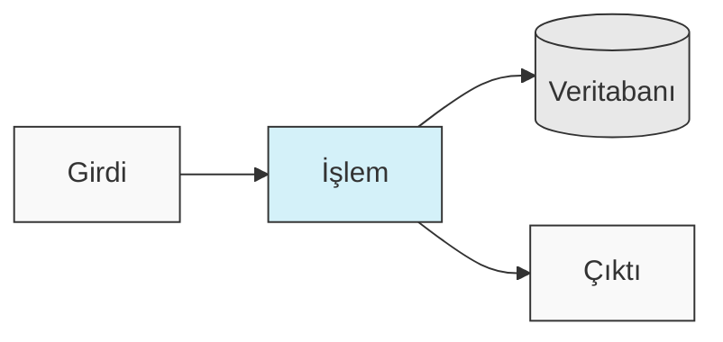
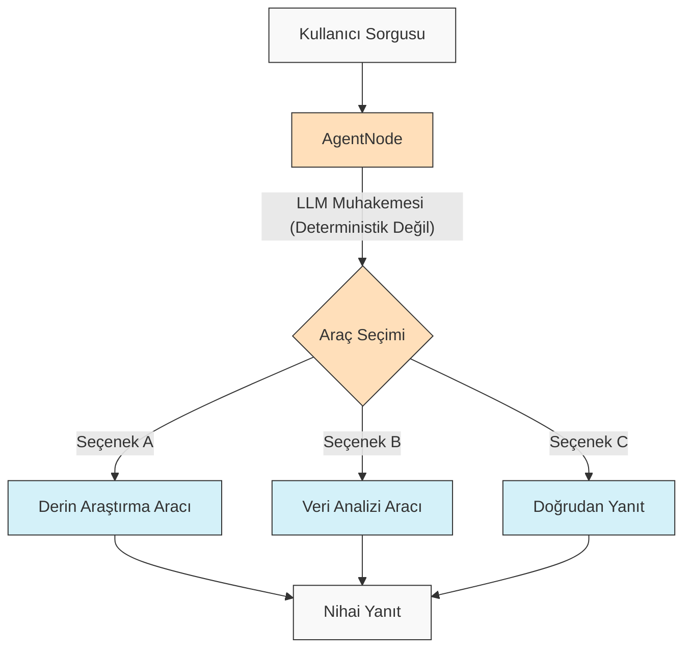
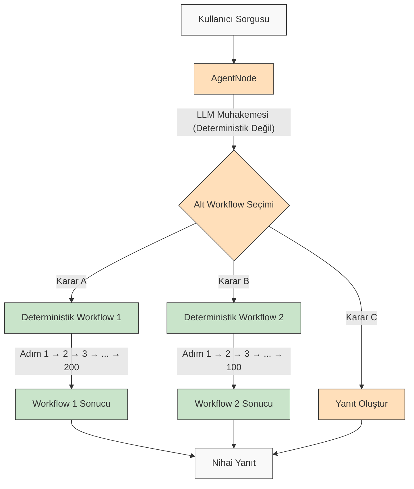

<p align="center">
  
</p>

## 🌐 README Çevirileri

[Français](/docs/i18n/french/README.md) • [日本語](/docs/i18n/japanese/README.md) • [한국어](/docs/i18n/korean/README.md) • [中文](/docs/i18n/chinese/README.md) • [Español](/docs/i18n/spanish/README.md) • [Italiano](/docs/i18n/italian/README.md) • [Nederlands](/docs/i18n/dutch/README.md) • [Deutsch](/docs/i18n/deutsch/README.md) • [Polski](/docs/i18n/polish/README.md) • [Türkçe](/docs/i18n/turkish/README.md) • [Українська](/docs/i18n/ukrainian/README.md) • [Ελληνικά](/docs/i18n/greek/README.md) • [Русский](/docs/i18n/russian/README.md) • [العربية](/docs/i18n/arabic/README.md)

# AgentDock: Yapay Zeka Ajanları ile Sınırsız Olasılıklar Yaratın

AgentDock, **yapılandırılabilir determinizm** ile karmaşık görevleri yerine getiren sofistike yapay zeka ajanları oluşturmak için bir framework'tür. İki ana bileşenden oluşur:

1.  **AgentDock Core**: Yapay zeka ajanları oluşturmak ve dağıtmak için açık kaynaklı, backend öncelikli bir framework. *Framework'ten bağımsız* ve *sağlayıcıdan bağımsız* olacak şekilde tasarlanmıştır, bu da size ajanın implementasyonu üzerinde tam kontrol sağlar.

2.  **Açık Kaynak İstemci**: AgentDock Core framework'ünün bir referans implementasyonu ve tüketicisi olarak hizmet veren eksiksiz bir Next.js uygulaması. [https://hub.agentdock.ai](https://hub.agentdock.ai) adresinde çalışırken görebilirsiniz.

TypeScript ile oluşturulan AgentDock, *basitlik*, *genişletilebilirlik* ve ***yapılandırılabilir determinizmi*** vurgular - bu da onu minimum denetimle çalışabilen güvenilir ve öngörülebilir yapay zeka sistemleri oluşturmak için ideal hale getirir.

## 🧠 Tasarım Prensipleri

AgentDock şu temel prensipler üzerine kurulmuştur:

-   **Önce Basitlik**: Fonksiyonel ajanlar oluşturmak için gereken minimum kod
-   **Node Tabanlı Mimari**: Tüm yetenekler node'lar olarak uygulanır
-   **Özel Node'lar Olarak Araçlar**: Araçlar, ajan yetenekleri için node sistemini genişletir
-   **Yapılandırılabilir Determinizm**: Ajan davranışının öngörülebilirliğini kontrol edin
-   **Tip Güvenliği**: Baştan sona kapsamlı TypeScript tipleri

### Yapılandırılabilir Determinizm

***Yapılandırılabilir determinizm***, AgentDock'un tasarım felsefesinin temel taşıdır ve yaratıcı yapay zeka yeteneklerini öngörülebilir sistem davranışıyla dengelemenizi sağlar:

-   AgentNode'lar doğası gereği deterministik değildir, çünkü LLM'ler her seferinde farklı yanıtlar üretebilir
-   Workflow'lar, *tanımlanmış araç yürütme yolları* aracılığıyla daha deterministik hale getirilebilir
-   Geliştiriciler, sistemin hangi bölümlerinin LLM çıkarımı kullandığını yapılandırarak **determinizm seviyesini kontrol edebilirler**
-   LLM bileşenleriyle bile, genel sistem davranışı yapılandırılmış araç etkileşimleri sayesinde **öngörülebilir** kalır
-   Bu dengeli yaklaşım, yapay zeka uygulamalarınızda hem *yaratıcılığı* hem de **güvenilirliği** mümkün kılar

#### Deterministik Workflow'lar

AgentDock, tipik workflow oluşturucularından aşina olduğunuz deterministik workflow'ları tam olarak destekler. Beklediğiniz tüm öngörülebilir yürütme yolları ve güvenilir sonuçlar, LLM çıkarımı olsun veya olmasın mevcuttur:



#### Deterministik Olmayan Ajan Davranışı

AgentDock ile, daha fazla uyarlanabilirliğe ihtiyaç duyduğunuzda LLM'lerle AgentNode'lardan da yararlanabilirsiniz. Yaratıcı çıktılar ihtiyaçlarınıza göre değişebilirken, yapılandırılmış etkileşim kalıplarını korur:



#### Deterministik Alt Workflow'lara Sahip Deterministik Olmayan Ajanlar

AgentDock, deterministik olmayan ajan zekasını deterministik workflow yürütmesiyle birleştirerek size ***her iki dünyanın en iyisini*** sunar:



Bu yaklaşım, karmaşık çok adımlı workflow'ların (potansiyel olarak araçlar içinde veya bağlı node dizileri olarak uygulanan yüzlerce deterministik adımı içerebilir) akıllı ajan kararlarıyla çağrılmasını sağlar. Her workflow, deterministik olmayan ajan muhakemesi tarafından tetiklenmesine rağmen öngörülebilir bir şekilde yürütülür.

Daha gelişmiş yapay zeka ajan workflow'ları ve çok aşamalı işleme pipeline'ları için, karmaşık ajan sistemleri oluşturmak, görselleştirmek ve çalıştırmak için güçlü bir platform olan [AgentDock Pro](../../docs/agentdock-pro.md)'yu geliştiriyoruz.

#### Özetle: Yapılandırılabilir Determinizm

Bunu otomobil kullanmaya benzetebilirsiniz. Bazen yapay zekanın yaratıcılığına ihtiyacınız vardır (şehir sokaklarında gezinmek gibi - deterministik olmayan), bazen de güvenilir, adım adım süreçlere ihtiyacınız vardır (otoban tabelalarını takip etmek gibi - deterministik). AgentDock, bir görevin her bölümü için doğru yaklaşımı seçerek *her ikisini* de kullanan sistemler oluşturmanıza olanak tanır. Hem yapay zekanın yaratıcılığından *hem de* ihtiyaç duyduğunuzda öngörülebilir sonuçlardan yararlanırsınız.

## 🏗️ Çekirdek Mimari

Framework, tüm ajan işlevselliğinin temelini oluşturan güçlü, modüler bir node tabanlı sistem etrafında inşa edilmiştir. Bu mimari, yapı taşları olarak farklı node tiplerini kullanır:

-   **`BaseNode`**: Tüm node'lar için temel arayüzü ve yetenekleri oluşturan temel sınıf.
-   **`AgentNode`**: LLM etkileşimlerini, araç kullanımını ve ajan mantığını yöneten özel bir çekirdek node.
-   **Araçlar ve Özel Node'lar**: Geliştiriciler, ajan yeteneklerini ve özel mantığı `BaseNode`'u genişleten node'lar olarak uygular.

Bu node'lar, yönetilen kayıt defterleri aracılığıyla etkileşime girer ve karmaşık, yapılandırılabilir ve potansiyel olarak deterministik ajan davranışlarını ve workflow'larını etkinleştirmek için (çekirdek mimarinin portlarından ve potansiyel mesajlaşma sisteminden yararlanarak) bağlanabilir.

Node sisteminin bileşenleri ve yetenekleri hakkında ayrıntılı bir açıklama için lütfen [Node Sistemi Dokümantasyonu](../../docs/nodes/README.md)'na bakın.

## 🚀 Başlarken

Kapsamlı bir kılavuz için [Başlangıç Kılavuzu](../../docs/getting-started.md)'na bakın.

### Gereksinimler

*   Node.js ≥ 20.11.0 (LTS)
*   pnpm ≥ 9.15.0 (Gerekli)
*   LLM sağlayıcıları için API anahtarları (Anthropic, OpenAI, vb.)

### Kurulum

1.  **Depoyu Klonlayın**:

    ```bash
    git clone https://github.com/AgentDock/AgentDock.git
    cd AgentDock
    ```

2.  **pnpm'i Kurun**:

    ```bash
    corepack enable
    corepack prepare pnpm@latest --activate
    ```

3.  **Bağımlılıkları Kurun**:

    ```bash
    pnpm install
    ```

    Temiz bir yeniden kurulum için (sıfırdan yeniden oluşturmanız gerektiğinde):

    ```bash
    pnpm run clean-install
    ```

    Bu betik tüm node_modules'ı, kilit dosyalarını kaldırır ve bağımlılıkları doğru şekilde yeniden yükler.

4.  **Ortamı Yapılandırın**:

    Sağlanan `.env.example` dosyasına dayanarak bir ortam dosyası (`.env` veya `.env.local`) oluşturun:

    ```bash
    # Seçenek 1: .env.local oluşturun
    cp .env.example .env.local

    # Seçenek 2: .env oluşturun
    cp .env.example .env
    ```

    Ardından API anahtarlarınızı ortam dosyasına ekleyin.

5.  **Geliştirme Sunucusunu Başlatın**:

    ```bash
    pnpm dev
    ```

### Gelişmiş Yetenekler

| Yetenek                   | Açıklama                                                                                | Dokümantasyon                                                                      |
| :------------------------ | :-------------------------------------------------------------------------------------- | :--------------------------------------------------------------------------------- |
| **Oturum Yönetimi**       | Konuşmalar için izole edilmiş, performanslı durum yönetimi                              | [Oturum Dokümantasyonu](../../docs/architecture/sessions/README.md)              |
| **Orkestrasyon Framework'ü** | Bağlama göre ajan davranışını ve araç kullanılabilirliğini kontrol etme                 | [Orkestrasyon Dokümantasyonu](../../docs/architecture/orchestration/README.md) |
| **Depolama Soyutlaması**  | KV, Vektör ve Güvenli depolama için takılabilir sağlayıcılara sahip esnek depolama sistemi | [Depolama Dokümantasyonu](../../docs/storage/README.md)                         |

Depolama sistemi şu anda anahtar-değer depolama (Memory, Redis, Vercel KV sağlayıcıları) ve güvenli istemci tarafı depolama ile gelişmektedir, vektör depolama ve ek backend'ler ise geliştirme aşamasındadır.

## 📕 Dokümantasyon

AgentDock framework'ünün dokümantasyonu [hub.agentdock.ai/docs](https://hub.agentdock.ai/docs) adresinde ve bu deponun `/docs/` klasöründe mevcuttur. Dokümantasyon şunları içerir:

-   Başlangıç kılavuzları
-   API referansları
-   Node oluşturma eğitimleri
-   Entegrasyon örnekleri

## 📂 Depo Yapısı

Bu depo şunları içerir:

1.  **AgentDock Core**: `agentdock-core/` içinde bulunan çekirdek framework
2.  **Açık Kaynak İstemci**: AgentDock Core framework'ünün bir tüketicisi olarak hizmet veren, Next.js ile oluşturulmuş eksiksiz bir referans implementasyonu.
3.  **Örnek Ajanlar**: `agents/` dizininde kullanıma hazır ajan yapılandırmaları

AgentDock Core'u kendi uygulamalarınızda bağımsız olarak kullanabilir veya bu depoyu kendi ajan destekli uygulamalarınızı oluşturmak için bir başlangıç noktası olarak kullanabilirsiniz.

## 📝 Ajan Şablonları

AgentDock, önceden yapılandırılmış birkaç ajan şablonu içerir. Bunları `agents/` dizininde keşfedin veya yapılandırma ayrıntıları için [Ajan Şablonları Dokümantasyonu](../../docs/agent-templates.md)'nu okuyun.

## 🔧 Örnek Implementasyonlar

Örnek implementasyonlar, özel kullanım durumlarını ve gelişmiş işlevselliği sergiler:

| Implementasyon             | Açıklama                                                                     | Durum       |
| :------------------------- | :--------------------------------------------------------------------------- | :---------- |
| **Orkestre Edilmiş Ajan** | Bağlama göre davranışı uyarlamak için orkestrasyon kullanan örnek ajan      | Mevcut      |
| **Bilişsel Muhakemeci**    | Yapılandırılmış muhakeme ve bilişsel araçlar kullanarak karmaşık sorunları ele alır | Mevcut      |
| **Ajan Planlayıcı**       | Diğer yapay zeka ajanlarını tasarlamak ve uygulamak için özel ajan        | Mevcut      |
| [**Kod Oyun Alanı (Code Playground)**](../../docs/roadmap/code-playground.md) | Zengin görselleştirme yetenekleriyle korumalı kod oluşturma ve yürütme     | Planlandı   |
| [**Genelci Yapay Zeka Ajanı**](../../docs/roadmap/generalist-agent.md) | Tarayıcı kullanabilen ve karmaşık görevleri yürütebilen Manus benzeri ajan | Planlandı   |

## 🔐 Ortam Yapılandırma Detayları

AgentDock Açık Kaynak İstemcisi, çalışması için LLM sağlayıcıları için API anahtarları gerektirir. Bunlar, sağlanan `.env.example` dosyasına dayanarak oluşturduğunuz bir ortam dosyasında (`.env` veya `.env.local`) yapılandırılır.

### LLM Sağlayıcı API Anahtarları

LLM sağlayıcı API anahtarlarınızı ekleyin (en az biri gereklidir):

```bash
# LLM Sağlayıcı API Anahtarları - en az biri gereklidir
ANTHROPIC_API_KEY=sk-ant-xxxxxxx  # Anthropic API anahtarı
OPENAI_API_KEY=sk-xxxxxxx         # OpenAI API anahtarı
GEMINI_API_KEY=xxxxxxx            # Google Gemini API anahtarı
DEEPSEEK_API_KEY=xxxxxxx          # DeepSeek API anahtarı
GROQ_API_KEY=xxxxxxx              # Groq API anahtarı
```

### API Anahtarı Çözümlemesi

AgentDock Açık Kaynak İstemcisi, hangi API anahtarının kullanılacağını çözerken bir öncelik sırası izler:

1.  **Ajan başına özel API anahtarı** (UI'daki ajan ayarları aracılığıyla ayarlanır)
2.  **Genel ayarlar API anahtarı** (UI'daki ayarlar sayfası aracılığıyla ayarlanır)
3.  **Ortam değişkeni** (.env.local veya dağıtım platformundan)

### Araca Özel API Anahtarları

Bazı araçlar ayrıca kendi API anahtarlarını gerektirir:

```bash
# Araca Özel API Anahtarları
SERPER_API_KEY=                  # Arama işlevselliği için gerekli
FIRECRAWL_API_KEY=               # Daha derin web araması için gerekli
```

Ortam yapılandırması hakkında daha fazla ayrıntı için [`src/types/env.ts`](../../src/types/env.ts) içindeki implementasyona bakın.

### Kendi API Anahtarınızı Kullanın (BYOK - Bring Your Own Key)

AgentDock bir BYOK (Bring Your Own Key - Kendi API Anahtarınızı Kullanın) modeliyle çalışır:

1.  API anahtarlarınızı uygulama ayarları sayfasında ekleyin
2.  Alternatif olarak, doğrudan API kullanımı için istek başlıkları aracılığıyla anahtarları sağlayın
3.  Anahtarlar, yerleşik şifreleme sistemi kullanılarak güvenli bir şekilde saklanır
4.  Sunucularımızda hiçbir API anahtarı paylaşılmaz veya saklanmaz

## 📦 Paket Yöneticisi

Bu proje, tutarlı bağımlılık yönetimi için `pnpm` kullanımını *gerektirir*. `npm` ve `yarn` desteklenmez.

## 💡 Ne İnşa Edebilirsiniz

1.  **Yapay Zeka Destekli Uygulamalar**
    -   Herhangi bir frontend ile özel chatbotlar
    -   Komut satırı yapay zeka asistanları
    -   Otomatik veri işleme pipeline'ları
    -   Backend hizmet entegrasyonları

2.  **Entegrasyon Yetenekleri**
    -   Herhangi bir yapay zeka sağlayıcısı (OpenAI, Anthropic, vb.)
    -   Herhangi bir frontend framework'ü
    -   Herhangi bir backend hizmeti
    -   Özel veri kaynakları ve API'ler

3.  **Otomasyon Sistemleri**
    -   Veri işleme workflow'ları
    -   Belge analizi pipeline'ları
    -   Otomatik raporlama sistemleri
    -   Görev otomasyon ajanları

## Ana Özellikler

| Özellik                        | Açıklama                                                                        |
| :----------------------------- | :------------------------------------------------------------------------------ |
| 🔌 **Framework'ten Bağımsız (Node.js Backend)** | Çekirdek kütüphane Node.js backend yığınlarıyla entegre olur.                     |
| 🧩 **Modüler Tasarım**         | Basit node'lardan karmaşık sistemler oluşturun                                     |
| 🛠️ **Genişletilebilir**        | Herhangi bir işlevsellik için özel node'lar oluşturun                             |
| 🔒 **Güvenli**                | API anahtarları ve veriler için yerleşik güvenlik özellikleri                     |
| 🔑 **BYOK**                     | LLM sağlayıcıları için *Kendi API Anahtarınızı Kullanın*                       |
| 📦 **Bağımsız Çalışabilir (Self-contained)**| Çekirdek framework minimum bağımlılıklara sahiptir                                |
| ⚙️ **Çok Adımlı Araç Çağrıları (Multi-Step Tool Calls)**| *Karmaşık muhakeme zincirleri* için destek                                       |
| 📊 **Yapılandırılmış Kayıt**    | Ajan yürütmesine ilişkin ayrıntılı bilgiler                                        |
| 🛡️ **Güçlü Hata Yönetimi**       | Öngörülebilir davranış ve basitleştirilmiş hata ayıklama                           |
| 📝 **Önce TypeScript**          | Tip güvenliği ve geliştirilmiş geliştirici deneyimi                                |
| 🌐 **Açık Kaynak İstemci**      | Eksiksiz bir Next.js referans implementasyonu içerir                              |
| 🔄 **Orkestrasyon**             | Bağlama göre ajan davranışının *dinamik kontrolü*                                |
| 💾 **Oturum Yönetimi**          | Eşzamanlı konuşmalar için izole edilmiş durum                                     |
| 🎮 **Yapılandırılabilir Determinizm** | Yapay zeka yaratıcılığını ve öngörülebilirliği node mantığı/workflow'ları aracılığıyla dengeleyin. |

## 🧰 Bileşenler

AgentDock'un modüler mimarisi şu ana bileşenler üzerine kurulmuştur:

*   **BaseNode**: Sistemdeki tüm node'lar için temel
*   **AgentNode**: Ajan işlevselliği için birincil soyutlama
*   **Araçlar ve Özel Node'lar**: Node'lar olarak uygulanan çağrılabilir yetenekler ve özel mantık.
*   **Node Kayıt Defteri**: Tüm node tiplerinin kaydedilmesini ve alınmasını yönetir
*   **Araç Kayıt Defteri**: Ajanlar için araç kullanılabilirliğini yönetir
*   **CoreLLM**: LLM sağlayıcılarıyla etkileşim için birleşik arayüz
*   **Sağlayıcı Kayıt Defteri**: LLM sağlayıcı yapılandırmalarını yönetir
*   **Hata Yönetimi**: Hataları yönetmek ve öngörülebilir davranış sağlamak için sistem
*   **Günlükleme**: İzleme ve hata ayıklama için yapılandırılmış günlükleme sistemi
*   **Orkestrasyon**: Konuşma bağlamına göre araç kullanılabilirliğini ve davranışını kontrol eder
*   **Oturumlar**: Eşzamanlı konuşmalar arasında durum izolasyonunu yönetir

Bu bileşenler hakkında ayrıntılı teknik dokümantasyon için [Mimariye Genel Bakış](../../docs/architecture/README.md)'a bakın.

## 🗺️ Yol Haritası

Aşağıda AgentDock için geliştirme yol haritamız bulunmaktadır. Burada listelenen iyileştirmelerin çoğu, şu anda yerel olarak geliştirilen ve kararlı bir sürüme ulaştığında sürümlenmiş bir NPM paketi olarak yayınlanacak olan çekirdek AgentDock framework'ü (`agentdock-core`) ile ilgilidir. Bazı yol haritası öğeleri, açık kaynak istemci implementasyonunda geliştirmeler de içerebilir.

| Özellik                                                              | Açıklama                                                                            | Kategori        |
| :------------------------------------------------------------------- | :---------------------------------------------------------------------------------- | :-------------- |
| [**Depolama Soyutlama Katmanı**](../../docs/roadmap/storage-abstraction.md) | Takılabilir sağlayıcılara sahip esnek depolama sistemi                              | **Devam Ediyor** |
| [**Gelişmiş Bellek Sistemleri**](../../docs/roadmap/advanced-memory.md)       | Uzun vadeli bağlam yönetimi                                                       | **Devam Ediyor** |
| [**Vektör Depolama Entegrasyonu**](../../docs/roadmap/vector-storage.md)      | Belgeler ve bellek için embedding tabanlı erişim                                    | **Devam Ediyor** |
| [**Yapay Zeka Ajanları için Değerlendirme**](../../docs/roadmap/evaluation-framework.md) | Kapsamlı test ve değerlendirme framework'ü                                        | **Devam Ediyor** |
| [**Platform Entegrasyonu**](../../docs/roadmap/platform-integration.md)        | Telegram, WhatsApp ve diğer mesajlaşma platformları için destek                   | **Planlandı**   |
| [**Çoklu Ajan İşbirliği**](../../docs/roadmap/multi-agent-collaboration.md)  | Ajanların birlikte çalışmasını sağlama                                          | **Planlandı**   |
| [**Model Bağlam Protokolü (MCP) Entegrasyonu**](../../docs/roadmap/mcp-integration.md) | MCP aracılığıyla harici araçları keşfetme ve kullanma desteği                      | **Planlandı**   |
| [**Sesli Yapay Zeka Ajanları**](../../docs/roadmap/voice-agents.md)                    | AgentNode aracılığıyla sesli arayüzler ve telefon numaraları kullanan yapay zeka ajanları | **Planlandı**   |
| [**Telemetri ve İzlenebilirlik**](../../docs/roadmap/telemetry.md)              | Gelişmiş günlükleme ve performans takibi                                          | **Planlandı**   |
| [**AgentDock Pro**](../../docs/agentdock-pro.md)                            | Yapay zeka ajanlarını ve workflow'larını ölçeklendirmek için kapsamlı kurumsal bulut platformu | **Bulut**       |
| [**Doğal Dil Yapay Zeka Ajan Oluşturucu**](../../docs/roadmap/nl-agent-builder.md)  | Görsel oluşturucu + doğal dil ajan ve workflow oluşturma                         | **Bulut**       |
| [**Ajan Pazar Yeri**](../../docs/roadmap/agent-marketplace.md)         | Paraya çevrilebilir ajan şablonları                                              | **Bulut**       |

## 👥 Katkıda Bulunma

AgentDock'a katkıda bulunmanızı bekliyoruz! Ayrıntılı katkıda bulunma yönergeleri için lütfen [CONTRIBUTING.md](../../CONTRIBUTING.md)'ye bakın.

## 📜 Lisans

AgentDock, [MIT Lisansı](../../LICENSE) altında yayınlanmıştır.

## ✨ Sınırsız Olasılıklar Yaratın!

AgentDock, hayal edebileceğiniz hemen hemen her yapay zeka destekli uygulama veya otomasyonu oluşturmak için temel sağlar. Framework'ü keşfetmeye, yenilikçi ajanlar oluşturmaya ve topluluğa katkıda bulunmaya teşvik ediyoruz. Yapay zeka etkileşiminin geleceğini birlikte şekillendirelim!

---
[Çeviri dizinine geri dön](/docs/i18n/README.md)