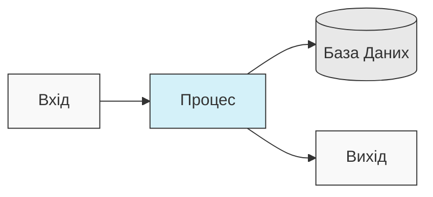
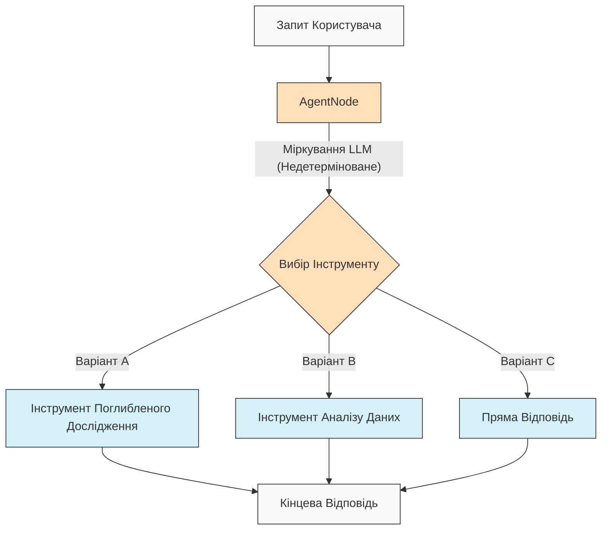
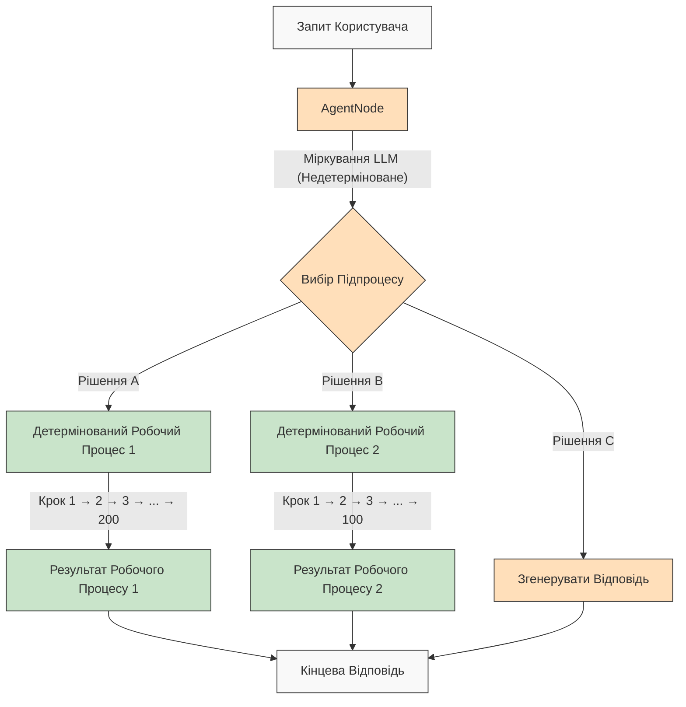

# AgentDock: Створюйте Безмежні Можливості з Агентами ШІ

[](https://github.com/agentdock/agentdock/stargazers)
[](https://opensource.org/licenses/MIT)
[](https://github.com/AgentDock/AgentDock/releases)
[](https://hub.agentdock.ai/docs)
[](https://discord.gg/fDYFFmwuRA)
[](https://agentdock.ai)
[](https://x.com/agentdock)

## 🌐 Переклади README

[Français](../french/README.md) • [日本語](../japanese/README.md) • [한국어](../korean/README.md) • [中文](../chinese/README.md) • [Español](../spanish/README.md) • [Italiano](../italian/README.md) • [Nederlands](../dutch/README.md) • [Polski](../polish/README.md) • [Türkçe](../turkish/README.md) • [Українська](./README.md) • [Ελληνικά](../greek/README.md) • [العربية](../arabic/README.md)

AgentDock — це фреймворк для створення складних агентів ШІ, які виконують складні завдання з **конфігурованою детермінованістю**. Він складається з двох основних компонентів:

1.  **AgentDock Core**: Фреймворк з відкритим кодом, орієнтований на бекенд, для створення та розгортання агентів ШІ. Він розроблений як *незалежний від фреймворку* та *незалежний від постачальника*, що дає вам повний контроль над реалізацією вашого агента.

2.  **Open Source Client**: Повнофункціональний додаток Next.js, який служить еталонною реалізацією та споживачем фреймворку AgentDock Core. Ви можете побачити його в дії на [https://hub.agentdock.ai](https://hub.agentdock.ai)

Створений за допомогою TypeScript, AgentDock наголошує на *простоті*, *розширюваності* та ***конфігурованій детермінованості***, що робить його ідеальним для створення надійних, передбачуваних систем ШІ, які можуть працювати з мінімальним наглядом.

## 🧠 Принципи Дизайну

AgentDock побудований на цих основних принципах:

-   **Простота Перш за Все**: Мінімальний код, необхідний для створення функціональних агентів
-   **Архітектура на Основі Вузлів (Nodes)**: Усі можливості реалізовані як вузли
-   **Інструменти як Спеціалізовані Вузли**: Інструменти розширюють систему вузлів для можливостей агента
-   **Конфігурована Детермінованість**: Контролюйте передбачуваність поведінки агента
-   **Типова Безпека (Type Safety)**: Повні типи TypeScript у всьому

### Конфігурована Детермінованість

***Конфігурована детермінованість*** є наріжним каменем філософії дизайну AgentDock, дозволяючи вам збалансувати творчі можливості ШІ з передбачуваною поведінкою системи:

-   `AgentNode` за своєю природою є недетермінованими, оскільки LLM можуть генерувати різні відповіді кожного разу
-   Робочі процеси (Workflows) можна зробити більш детермінованими за допомогою *визначених шляхів виконання інструментів*
-   Розробники можуть **контролювати рівень детермінованості**, налаштовуючи, які частини системи використовують висновки LLM
-   Навіть з компонентами LLM загальна поведінка системи залишається **передбачуваною** завдяки структурованим взаємодіям інструментів
-   Цей збалансований підхід дозволяє досягти як *творчості*, так і **надійності** у ваших додатках ШІ

#### Детерміновані Робочі Процеси

AgentDock повністю підтримує детерміновані робочі процеси, з якими ви знайомі з типових конструкторів робочих процесів. Усі передбачувані шляхи виконання та надійні результати, яких ви очікуєте, доступні, з висновками LLM або без них:



#### Недетермінована Поведінка Агента

З AgentDock ви також можете використовувати `AgentNode` з LLM, коли вам потрібна більша адаптивність. Творчі результати можуть змінюватися залежно від ваших потреб, зберігаючи при цьому структуровані шаблони взаємодії:



#### Недетерміновані Агенти з Детермінованими Підпроцесами

AgentDock пропонує вам ***найкраще з обох світів***, поєднуючи недетермінований інтелект агента з детермінованим виконанням робочого процесу:



Цей підхід дозволяє викликати складні, багатоетапні робочі процеси (потенційно залучаючи сотні детермінованих кроків, реалізованих в інструментах або як послідовності пов'язаних вузлів) за допомогою інтелектуальних рішень агента. Кожен робочий процес виконується передбачувано, незважаючи на те, що його запускає недетерміноване міркування агента.

Для більш просунутих робочих процесів агентів ШІ та багатоетапних конвеєрів обробки ми створюємо [AgentDock Pro](../../docs/agentdock-pro.md) - потужну платформу для створення, візуалізації та виконання складних систем агентів.

#### Стисло: Конфігурована Детермінованість

Уявіть це як керування автомобілем. Іноді вам потрібна творчість ШІ (наприклад, навігація вулицями міста - недетермінована), а іноді вам потрібні надійні, покрокові процеси (наприклад, дотримання знаків на автомагістралі - детерміновані). AgentDock дозволяє створювати системи, які використовують *обидва* підходи, вибираючи правильний для кожної частини завдання. Ви отримуєте як творчість ШІ, *так і* передбачувані результати там, де вони потрібні.

## 🏗️ Основна Архітектура

Фреймворк побудований навколо потужної, модульної системи на основі вузлів (Nodes), яка служить основою для всієї функціональності агента. Ця архітектура використовує різні типи вузлів як будівельні блоки:

-   **`BaseNode`**: Фундаментальний клас, який встановлює основний інтерфейс та можливості для всіх вузлів.
-   **`AgentNode`**: Спеціалізований основний вузол, який керує взаємодіями LLM, використанням інструментів та логікою агента.
-   **Інструменти та Спеціальні Вузли**: Розробники реалізують можливості агента та спеціальну логіку як вузли, що розширюють `BaseNode`.

Ці вузли взаємодіють через керовані реєстри та можуть бути з'єднані (використовуючи порти основної архітектури та потенційну шину повідомлень) для забезпечення складної, конфігурованої та потенційно детермінованої поведінки та робочих процесів агентів.

Детальний опис компонентів та можливостей системи вузлів дивіться в [Документації Системи Вузлів](../../docs/nodes/README.md).

## 🚀 Початок Роботи

Для вичерпного керівництва дивіться [Керівництво по Початку Роботи](../../docs/getting-started.md).

### Вимоги

*   Node.js ≥ 20.11.0 (LTS)
*   pnpm ≥ 9.15.0 (Обов'язково)
*   Ключі API для постачальників LLM (Anthropic, OpenAI, тощо)

### Встановлення

1.  **Клонуйте Репозиторій**:

    ```bash
    git clone https://github.com/AgentDock/AgentDock.git
    cd AgentDock
    ```

2.  **Встановіть pnpm**:

    ```bash
    corepack enable
    corepack prepare pnpm@latest --activate
    ```

3.  **Встановіть Залежності**:

    ```bash
    pnpm install
    ```

    Для чистої перевстановки (коли вам потрібно перебудувати з нуля):

    ```bash
    pnpm run clean-install
    ```

    Цей скрипт видаляє всі `node_modules`, файли блокування та коректно перевстановлює залежності.

4.  **Налаштуйте Середовище**:

    Створіть файл середовища (`.env` або `.env.local`) на основі наданого файлу `.env.example`:

    ```bash
    # Варіант 1: Створити .env.local
    cp .env.example .env.local

    # Варіант 2: Створити .env
    cp .env.example .env
    ```

    Потім додайте свої ключі API до файлу середовища.

5.  **Запустіть Сервер Розробки**:

    ```bash
    pnpm dev
    ```

### Розширені Можливості

| Можливість                 | Опис                                                                                          | Документація                                                                          |
| :------------------------- | :-------------------------------------------------------------------------------------------- | :------------------------------------------------------------------------------------ |
| **Управління Сесіями**     | Ізольоване, високопродуктивне управління станом для розмов                                   | [Документація Сесій](../../docs/architecture/sessions/README.md)                    |
| **Фреймворк Оркестрації**  | Контроль поведінки агента та доступності інструментів на основі контексту                      | [Документація Оркестрації](../../docs/architecture/orchestration/README.md)           |
| **Абстракція Сховища**     | Гнучка система зберігання з підключаємими постачальниками для KV, Vector та Secure Storage    | [Документація Сховища](../../docs/storage/README.md)                                |

Система сховища наразі розвивається з ключовим сховищем (постачальники Memory, Redis, Vercel KV) та безпечним сховищем на стороні клієнта, тоді як векторне сховище та додаткові бекенди перебувають у розробці.

## 📕 Документація

Документація фреймворку AgentDock доступна на [hub.agentdock.ai/docs](https://hub.agentdock.ai/docs) та в папці `/docs/` цього репозиторію. Документація включає:

-   Керівництва по початку роботи
-   Довідники API
-   Навчальні посібники зі створення вузлів
-   Приклади інтеграції

## 📂 Структура Репозиторію

Цей репозиторій містить:

1.  **AgentDock Core**: Основний фреймворк, розташований у `agentdock-core/`
2.  **Open Source Client**: Повна еталонна реалізація, створена за допомогою Next.js, яка служить споживачем фреймворку AgentDock Core.
3.  **Приклади Агентів**: Готові конфігурації агентів у каталозі `agents/`

Ви можете використовувати AgentDock Core незалежно у власних додатках або використовувати цей репозиторій як відправну точку для створення власних додатків на основі агентів.

## 📝 Шаблони Агентів

AgentDock включає кілька попередньо налаштованих шаблонів агентів. Дослідіть їх у каталозі `agents/` або прочитайте [Документацію Шаблонів Агентів](../../docs/agent-templates.md) для деталей конфігурації.

## 🔧 Приклади Реалізацій

Приклади реалізацій демонструють спеціалізовані випадки використання та розширену функціональність:

| Реалізація                   | Опис                                                                                             | Статус       |
| :--------------------------- | :----------------------------------------------------------------------------------------------- | :----------- |
| **Оркестрований Агент**      | Приклад агента, який використовує оркестрацію для адаптації поведінки на основі контексту         | Доступно     |
| **Когнітивний Розмірковувач**| Розв'язує складні проблеми за допомогою структурованого міркування та когнітивних інструментів     | Доступно     |
| **Планувальник Агентів**     | Спеціалізований агент для проектування та реалізації інших агентів ШІ                            | Доступно     |
| [**Code Playground (Середовище Розробки Коду)**](../../docs/roadmap/code-playground.md) | Генерація та виконання коду в пісочниці з багатими можливостями візуалізації                   | Заплановано  |
| [**Агент ШІ Загального Призначення**](../../docs/roadmap/generalist-agent.md)| Агент, подібний до Manus, який може використовувати браузер та виконувати складні завдання        | Заплановано  |

## 🔐 Деталі Конфігурації Середовища

AgentDock Open Source Client потребує ключів API для постачальників LLM для функціонування. Вони налаштовуються у файлі середовища (`.env` або `.env.local`), який ви створюєте на основі наданого файлу `.env.example`.

### Ключі API Постачальників LLM

Додайте ключі API постачальників LLM (потрібен принаймні один):

```bash
# Ключі API Постачальників LLM - потрібен принаймні один
ANTHROPIC_API_KEY=sk-ant-xxxxxxx  # Ключ API Anthropic
OPENAI_API_KEY=sk-xxxxxxx         # Ключ API OpenAI
GEMINI_API_KEY=xxxxxxx            # Ключ API Google Gemini
DEEPSEEK_API_KEY=xxxxxxx          # Ключ API DeepSeek
GROQ_API_KEY=xxxxxxx              # Ключ API Groq
```

### Визначення Ключа API

AgentDock Open Source Client дотримується порядку пріоритету при визначенні, який ключ API використовувати:

1.  **Спеціальний ключ API для агента** (встановлюється через налаштування агента в інтерфейсі користувача)
2.  **Глобальний ключ API налаштувань** (встановлюється через сторінку налаштувань в інтерфейсі користувача)
3.  **Змінна середовища** (з `.env.local` або платформи розгортання)

### Ключі API, Специфічні для Інструментів

Деякі інструменти також потребують власних ключів API:

```bash
# Ключі API, Специфічні для Інструментів
SERPER_API_KEY=                  # Необхідно для функціональності пошуку
FIRECRAWL_API_KEY=               # Необхідно для глибшого веб-сканування
```

Для отримання додаткової інформації про конфігурацію середовища дивіться реалізацію в [`src/types/env.ts`](../../src/types/env.ts).

### Використовуйте Власний Ключ (BYOK - Bring Your Own Key)

AgentDock працює за моделлю BYOK (Bring Your Own Key - Використовуйте Власний Ключ):

1.  Додайте свої ключі API на сторінці налаштувань програми
2.  Або надайте ключі через заголовки запитів для прямого використання API
3.  Ключі надійно зберігаються за допомогою вбудованої системи шифрування
4.  Жодні ключі API не передаються та не зберігаються на наших серверах

## 📦 Менеджер Пакетів

Цей проект *вимагає* використання `pnpm` для послідовного управління залежностями. `npm` та `yarn` не підтримуються.

## 💡 Що Ви Можете Створити

1.  **Додатки на Основі ШІ**
    -   Спеціальні чат-боти з будь-яким фронтендом
    -   Асистенти ШІ командного рядка
    -   Автоматизовані конвеєри обробки даних
    -   Інтеграції бекенд-сервісів

2.  **Можливості Інтеграції**
    -   Будь-який постачальник ШІ (OpenAI, Anthropic, тощо)
    -   Будь-який фронтенд-фреймворк
    -   Будь-який бекенд-сервіс
    -   Спеціальні джерела даних та API

3.  **Системи Автоматизації**
    -   Робочі процеси обробки даних
    -   Конвеєри аналізу документів
    -   Автоматизовані системи звітності
    -   Агенти автоматизації завдань

## Ключові Особливості

| Особливість                  | Опис                                                                                               |
| :--------------------------- | :------------------------------------------------------------------------------------------------- |
| 🔌 **Незалежність від Фреймворку (Node.js Backend)** | Основна бібліотека інтегрується зі стеками бекенду Node.js.                                      |
| 🧩 **Модульний Дизайн**      | Створюйте складні системи з простих вузлів                                                         |
| 🛠️ **Розширюваність**        | Створюйте спеціальні вузли для будь-якої функціональності                                          |
| 🔒 **Безпека**               | Вбудовані функції безпеки для ключів API та даних                                                  |
| 🔑 **BYOK**                  | Використовуйте *власні ключі API* для постачальників LLM                                            |
| 📦 **Самодостатність (Self-contained)** | Основний фреймворк має мінімальні залежності                                                      |
| ⚙️ **Багатоетапні Виклики Інструментів (Multi-Step Tool Calls)** | Підтримка *складних ланцюжків міркувань*                                                     |
| 📊 **Структуроване Логування**| Детальна інформація про виконання агента                                                             |
| 🛡️ **Стійка Обробка Помилок**     | Передбачувана поведінка та спрощене налагодження                                                   |
| 📝 **TypeScript Перш за Все**| Типова безпека та покращений досвід розробника                                                   |
| 🌐 **Open Source Клієнт**    | Включає повну еталонну реалізацію Next.js                                                        |
| 🔄 **Оркестрація**           | *Динамічний контроль* поведінки агента на основі контексту                                       |
| 💾 **Управління Сесіями**    | Ізольований стан для паралельних розмов                                                            |
| 🎮 **Конфігурована Детермінованість**| Збалансуйте творчість ШІ та передбачуваність за допомогою логіки вузлів/робочих процесів.          |

## 🧰 Компоненти

Модульна архітектура AgentDock побудована на цих ключових компонентах:

*   **BaseNode**: Основа для всіх вузлів у системі
*   **AgentNode**: Основна абстракція для функціональності агента
*   **Інструменти та Спеціальні Вузли**: Викликані можливості та спеціальна логіка, реалізовані як вузли.
*   **Реєстр Вузлів**: Керує реєстрацією та отриманням усіх типів вузлів
*   **Реєстр Інструментів**: Керує доступністю інструментів для агентів
*   **CoreLLM**: Уніфікований інтерфейс для взаємодії з постачальниками LLM
*   **Реєстр Постачальників**: Керує конфігураціями постачальників LLM
*   **Обробка Помилок**: Система для обробки помилок та забезпечення передбачуваної поведінки
*   **Логування (Logging)**: Структурована система логування для моніторингу та налагодження
*   **Оркестрація**: Контролює доступність інструментів та поведінку на основі контексту розмови
*   **Сесії**: Керує ізоляцією стану між паралельними розмовами

Для отримання детальної технічної документації щодо цих компонентів дивіться [Огляд Архітектури](../../docs/architecture/README.md).

## 🗺️ Дорожня Карта

Нижче наведена наша дорожня карта розробки AgentDock. Більшість перелічених тут удосконалень стосуються основного фреймворку AgentDock (`agentdock-core`), який наразі розробляється локально та буде опублікований як версіонований пакет NPM після досягнення стабільного релізу. Деякі елементи дорожньої карти можуть також передбачати вдосконалення реалізації клієнта з відкритим кодом.

| Особливість                                                                  | Опис                                                                                              | Категорія         |
| :--------------------------------------------------------------------------- | :------------------------------------------------------------------------------------------------ | :---------------- |
| [**Шар Абстракції Сховища**](../../docs/roadmap/storage-abstraction.md)        | Гнучка система зберігання з підключаємими постачальниками                                       | **В Розробці**    |
| [**Розширені Системи Пам'яті**](../../docs/roadmap/advanced-memory.md)          | Управління довгостроковим контекстом                                                            | **В Розробці**    |
| [**Інтеграція Векторного Сховища**](../../docs/roadmap/vector-storage.md)      | Пошук на основі вбудовування для документів та пам'яті                                           | **В Розробці**    |
| [**Оцінка для Агентів ШІ**](../../docs/roadmap/evaluation-framework.md)        | Комплексний фреймворк тестування та оцінки                                                      | **В Розробці**    |
| [**Інтеграція Платформ**](../../docs/roadmap/platform-integration.md)        | Підтримка Telegram, WhatsApp та інших платформ обміну повідомленнями                            | **Заплановано**   |
| [**Співпраця Багатьох Агентів**](../../docs/roadmap/multi-agent-collaboration.md)| Дозволити агентам працювати разом                                                               | **Заплановано**   |
| [**Інтеграція Протоколу Контексту Моделі (MCP)**](../../docs/roadmap/mcp-integration.md)| Підтримка виявлення та використання зовнішніх інструментів через MCP                             | **Заплановано**   |
| [**Голосові Агенти ШІ**](../../docs/roadmap/voice-agents.md)                  | Агенти ШІ, які використовують голосові інтерфейси та телефонні номери через AgentNode            | **Заплановано**   |
| [**Телеметрія та Відстежуваність**](../../docs/roadmap/telemetry.md)            | Розширене логування та відстеження продуктивності                                               | **Заплановано**   |
| [**AgentDock Pro**](../../docs/agentdock-pro.md)                            | Повноцінна корпоративна хмарна платформа для масштабування агентів ШІ та робочих процесів         | **Хмара**         |
| [**Конструктор Агентів ШІ Природною Мовою**](../../docs/roadmap/nl-agent-builder.md)| Візуальний конструктор + створення агентів та робочих процесів природною мовою                   | **Хмара**         |
| [**Ринок Агентів**](../../docs/roadmap/agent-marketplace.md)                | Монетизовані шаблони агентів                                                                    | **Хмара**         |

## 👥 Внесок

Ми вітаємо внески в AgentDock! Дивіться [CONTRIBUTING.md](../../CONTRIBUTING.md) для отримання детальних інструкцій щодо внесення внеску.

## 📜 Ліцензія

AgentDock випускається під [Ліцензією MIT](../../LICENSE).

## ✨ Створюйте Безмежні Можливості!

AgentDock надає основу для створення практично будь-якого додатка або автоматизації на базі ШІ, які ви можете собі уявити. Ми заохочуємо вас досліджувати фреймворк, створювати інноваційних агентів та робити внесок у спільноту. Давайте разом формувати майбутнє взаємодії з ШІ!

---
[Повернутися до Індексу Перекладів](../README.md) 