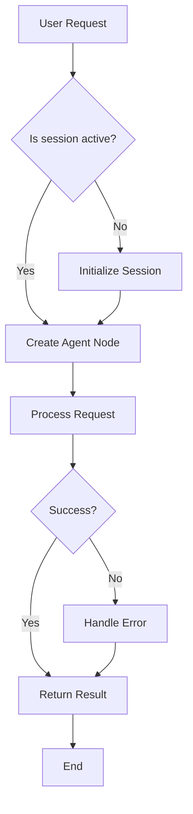
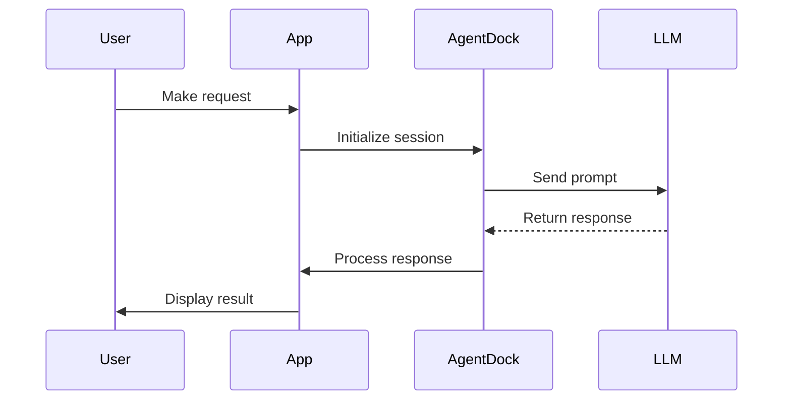
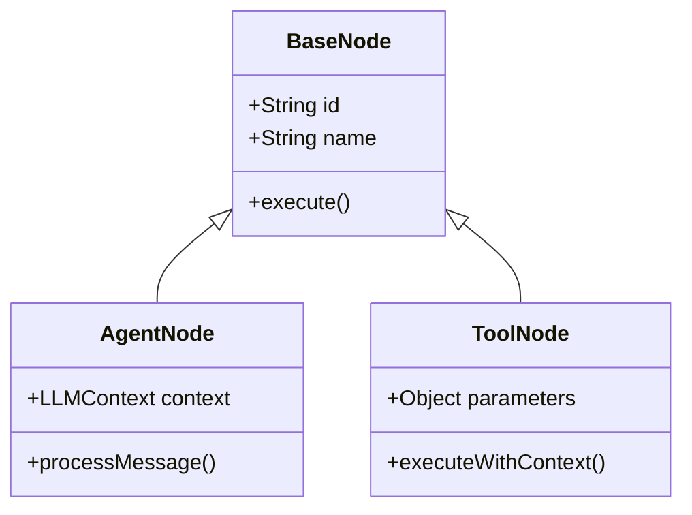
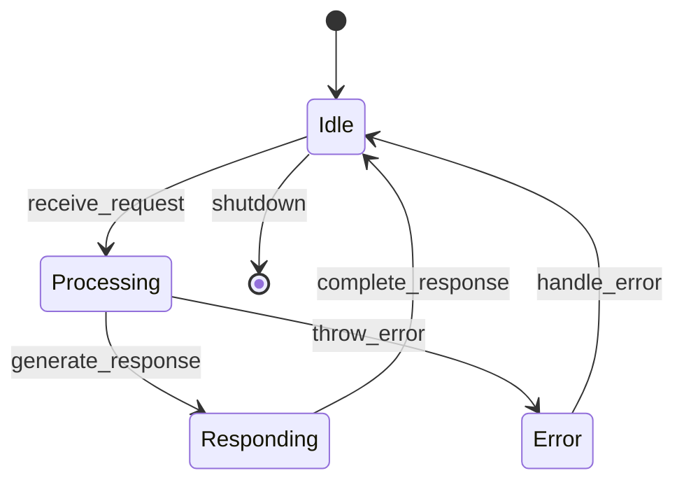
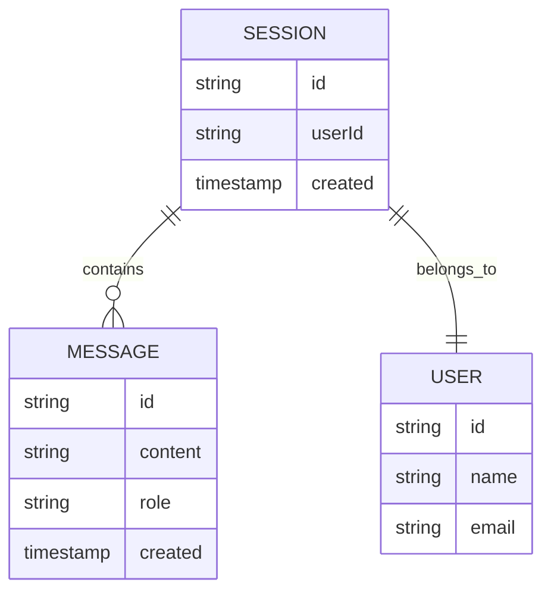
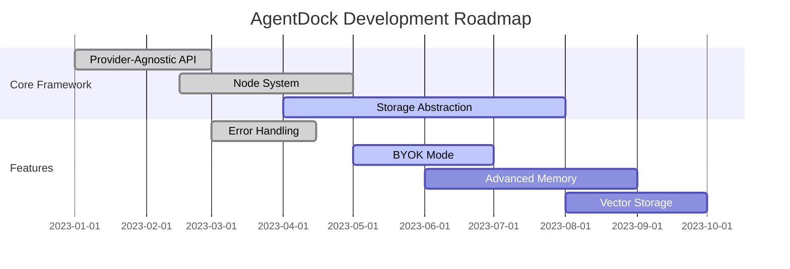
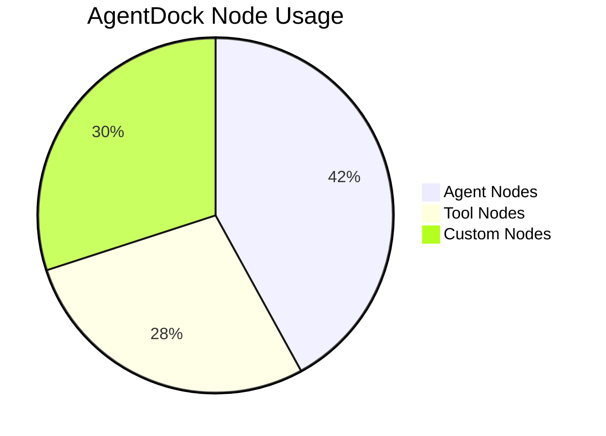
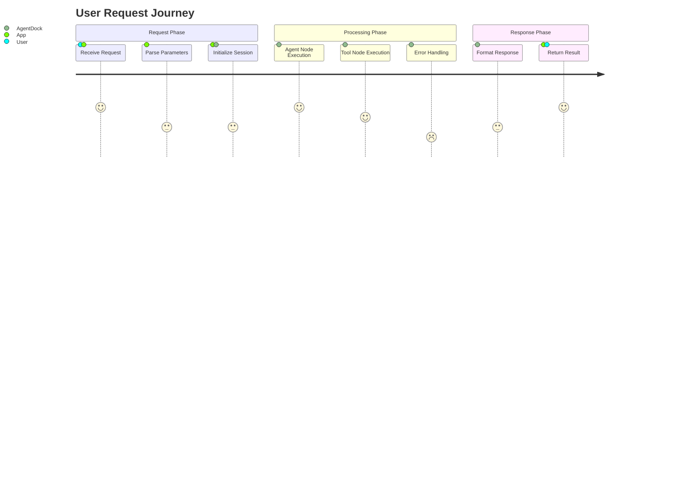
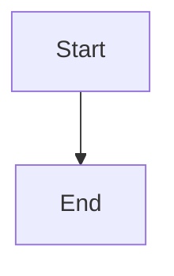

# Diagram Examples in the Open Source Client

This page demonstrates how to create and render various types of diagrams using Mermaid in the AgentDock Open Source Client. These diagram examples can be used for visualizing different aspects of your application architecture, workflows, and components when building with AgentDock.

## AgentDock Architecture Flow Chart



## Request Sequence Diagram



## AgentDock Core Class Diagram



## AgentDock State Diagram



## AgentDock Data Model ER Diagram



## AgentDock Development Roadmap



## Node Distribution Chart



## User Journey Diagram



## Adding Diagrams to Your Application

These diagrams demonstrate the visualization capabilities available in the AgentDock Open Source Client, helping to visualize concepts when building your own applications. To add a Mermaid diagram to any Markdown content in your application, use the following syntax:

```


For more information on Mermaid syntax, visit the [official Mermaid documentation](https://mermaid.js.org/syntax/flowchart.html). 

## Open Source Client Rendering

The AgentDock Open Source Client includes built-in support for Mermaid diagrams, automatically rendering them in both light and dark modes. You can use these diagram examples as templates for creating your own visualizations of components and workflows in your AgentDock-based applications. 