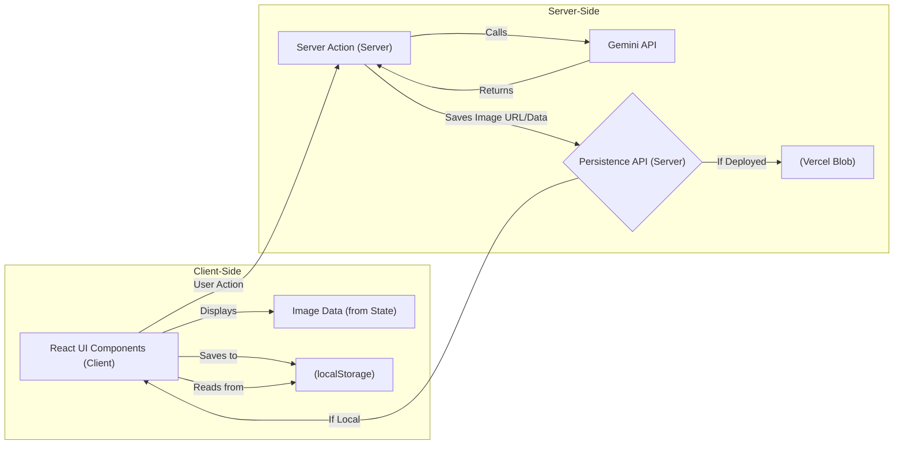

# Image Generation

The AgentDock Open Source Client includes a dedicated image generation feature that demonstrates how to integrate advanced AI capabilities into applications built with AgentDock Core.

## Overview

The image generation page provides a full-featured interface for creating and editing images using Gemini's multimodal capabilities. It showcases how the Open Source Client extends beyond basic chat functionality to implement richer AI experiences.

## Key Features

- **Text-to-Image Generation**: Create images from text prompts
- **Image Editing**: Upload and modify existing images
- **Image Gallery**: View and manage previously generated images
- **Responsive Design**: Works on mobile and desktop devices
- **Integration with Chat**: Images can be sent from chat for editing

## Implementation Details

The image generation functionality is implemented as a standalone page in the Open Source Client, showcasing:

1. **Client-Server Architecture**: 
   - Client-side UI components for image upload, prompt input, and result display
   - Server-side actions for image generation using Gemini

2. **Stateful UI**:
   - Local state management for image data and generation process
   - Progress indicators and error handling

3. **API Integration**:
   - Direct integration with Gemini's multimodal capabilities
   - Image persistence API leveraging:
       - **Vercel Blob:** For storing image URLs when deployed to Vercel.
       - **Browser `localStorage`:** For storing image data (e.g., base64 or URLs) when running locally, providing temporary persistence during development.

4. **UI Components**:
   - `ImageUpload`: Handles image file selection and preview
   - `ImagePromptInput`: Provides an interface for entering generation prompts
   - `ImageResultDisplay`: Shows generation results with download/share options
   - `ImageGallerySkeleton`: Loading state for the image gallery

## Technical Architecture

The image generation feature demonstrates these key patterns:

**Key Flow:**
1. UI components trigger server actions for generation.
2. Server actions call the Gemini API.
3. Server actions use a persistence API route (`/api/images/store/add`) to save the resulting image URL (from Vercel Blob if deployed) or potentially pass data back to the client.
4. Client-side code receives the image URL/data and stores it in `localStorage` for local persistence during development, updating the UI state.

## Usage Example

1. Navigate to the Image Generation page
2. Enter a text prompt describing the desired image
3. Optionally upload an existing image to modify
4. Click "Generate" to create the image
5. View, download, or continue editing the generated image
6. Access previously generated images from the gallery

## Integration with AgentDock Core

This feature demonstrates how the Open Source Client extends the capabilities of AgentDock Core by:

1. Leveraging the provider-agnostic API design to integrate with Gemini
2. Implementing specialized UI components for multimodal interactions
3. Managing state and persistence for complex AI workflows
4. Providing a complete reference implementation of an advanced AI feature

## Future Enhancements

Potential future enhancements for the image generation feature include:

- Support for additional image generation models
- Enhanced image editing capabilities
- Integration with other parts of the application
- Advanced prompt techniques like negative prompting
- Collections and organization for generated images 