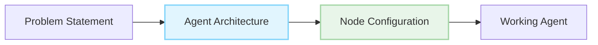

# Request For Agents (RFA)

> Build powerful AI agents with AgentDock's node-based architecture

## What are Requests For Agents?

Requests For Agents (RFAs) are specifications for AI agents that solve real-world problems using the AgentDock framework. Each RFA provides a clear problem statement, implementation guidance using AgentDock's node system, and resources to help you build an effective agent.

## Browse RFAs

- [RFA-001: Code Reviewer Agent](/docs/rfa/agents/2025/April/001-code-reviewer)

## Why Build These Agents?

- **Solve Real Problems**: Each agent addresses actual user needs
- **Showcase Your Skills**: Implemented agents are featured in our showcase
- **Join Our Community**: Connect with other builders
- **Get Rewarded**: Selected implementations may receive special recognition
- **Build Your Portfolio**: Create valuable systems with real-world impact

## For Non-Developers

Not a developer? You can still create these agents without code using **AgentDock Pro** - our visual agent builder lets you implement any RFA through an intuitive drag-and-drop interface and natural language instructions.

[Learn more about AgentDock Pro →](/docs/agentdock-pro)
