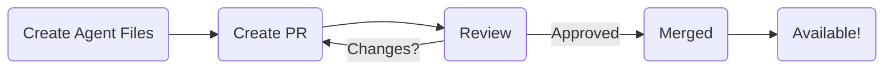

# Contributing Community Agents

AgentDock welcomes community contributions for new and interesting agents! This guide explains how to add your agent to the public `/agents` directory so it can be potentially featured in the Open Source Client and shared with others.

## Contribution Goal

The `/agents` directory serves as a public repository of pre-configured agent templates. Contributing your agent here allows others to easily discover and use it with the Open Source Client or as inspiration for their own projects.

## Contribution Flow

## Steps to Contribute

1.  **Create Your Agent Locally:**
    *   Follow the steps outlined in the [Getting Started Guide](../getting-started.md#creating-your-first-agent) to create your agent.
    *   This involves creating a new directory under `/agents/<your-agent-name>/`.
    *   Inside this directory, you **must** include:
        *   `template.json`: The core configuration file defining your agent's LLM, prompt, tools, orchestration, etc. See [Agent Templates](../agent-templates.md) for details.
        *   `README.md`: A clear description of your agent.

2.  **Write a Great `README.md`:**
    *   Clearly explain what your agent does and its intended purpose.
    *   Provide example prompts or use cases.
    *   List any required tools (especially custom ones).
    *   Specify any necessary environment variables or API keys the user needs to provide (e.g., `SERPER_API_KEY` for search tools).
    *   Keep it concise and well-formatted.

3.  **Add Custom Tools (If Necessary):**
    *   If your agent requires functionality not provided by existing tools, you may need to implement custom tools.
    *   Custom tools are implemented as nodes within the `agentdock-core` framework, typically residing in `agentdock-core/src/nodes` (relative to the core package, often just `/src/nodes` if developing within the main repo).
    *   Refer to the [Node System Overview](../nodes/README.md) and [Custom Tool Development](../nodes/custom-tool-development.md) guides for implementation details.
    *   Ensure any custom tools included in your contribution are well-tested and follow project coding standards.

4.  **Submit a Pull Request (PR):**
    *   Fork the main AgentDock repository on GitHub.
    *   Create a new branch for your agent contribution.
    *   Add your agent directory (`/agents/<your-agent-name>/`) and any custom node code (`/src/nodes/...` if applicable) to your branch.
    *   Commit your changes with clear commit messages.
    *   Push your branch to your fork.
    *   Open a Pull Request against the main AgentDock repository.
    *   In the PR description, briefly explain your agent and why it's a valuable addition.

## Acceptance Guidelines

To increase the likelihood of your agent contribution being accepted:

-   **Clear Purpose:** The agent should have a well-defined and useful function.
-   **Quality README:** The `README.md` must be clear, comprehensive, and accurate.
-   **Well-Configured Template:** The `template.json` should be correctly formatted and define a sensible agent configuration.
-   **Functionality:** The agent should work as described (assuming the user provides necessary API keys).
-   **Uniqueness/Value:** The agent should offer something distinct or demonstrate an interesting use case or configuration pattern. Simple variations of existing agents might be less likely to be accepted unless they showcase a specific technique.
-   **Code Quality (for Custom Tools):** If custom tools/nodes are included, they must adhere to the project's coding standards, be reasonably tested, and be relevant to the agent's function.
-   **Clean PR:** The Pull Request should be focused, with clear commit history and a good description.

We appreciate your contributions to the AgentDock community!