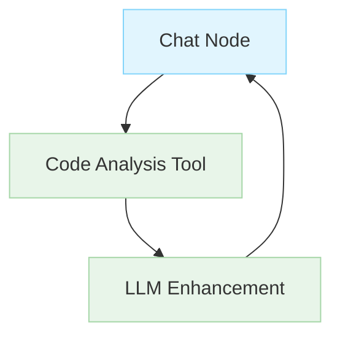

# RFA-001: Code Reviewer Agent

## The Problem
Code quality is difficult to maintain consistently. Engineers waste time on repetitive checks that could be automated.

## The Agent Solution
An agent that reviews code against best practices, identifies bugs, and suggests improvements with explanations.

## Architecture



## Implementation Guide

### Nodes Required
- **ChatNode**: For user interaction
- **ToolNode**: For code analysis
- **LLMNode**: For enhancing the code review with explanations

### Node Configuration

```typescript
// Chat node for user interaction
const chatNode = new ChatNode({
  system: "You are a helpful code review assistant. You analyze code for issues and suggest improvements with explanations.",
  temperature: 0.3
});

// Tool node for code analysis
const codeAnalysisNode = new ToolNode({
  function: async (code: string) => {
    // Implement code analysis logic here
    // Return analysis results
  },
  name: "analyzeCode"
});

// LLM node for enhancing the analysis
const enhancementNode = new LLMNode({
  template: "Based on the code analysis: {{analysis}}, provide helpful improvement suggestions:"
});
```

### Connections

```typescript
// Define connections between nodes
const connections = [
  { from: chatNode, to: codeAnalysisNode },
  { from: codeAnalysisNode, to: enhancementNode },
  { from: enhancementNode, to: chatNode }
];
```

## Example Conversation
**User**: Can you review this function?
```javascript
function getUser(id) {
  const result = db.query(`SELECT * FROM users WHERE id = ${id}`);
  return result;
}
```

**Agent**: I've identified a SQL injection vulnerability in your code. 
The parameter `id` is directly inserted into the query string without sanitization.

Here's a safer implementation:
```javascript
function getUser(id) {
  const result = db.query(`SELECT * FROM users WHERE id = ?`, [id]);
  return result;
}
```

This prevents attackers from injecting malicious SQL through the id parameter.

## Resources
- [OWASP SQL Injection Guide](https://owasp.org/...)
- [AgentDock Tool Node Documentation](https://docs.agentdock.ai/...)
- [Code Analysis Best Practices](https://...) 