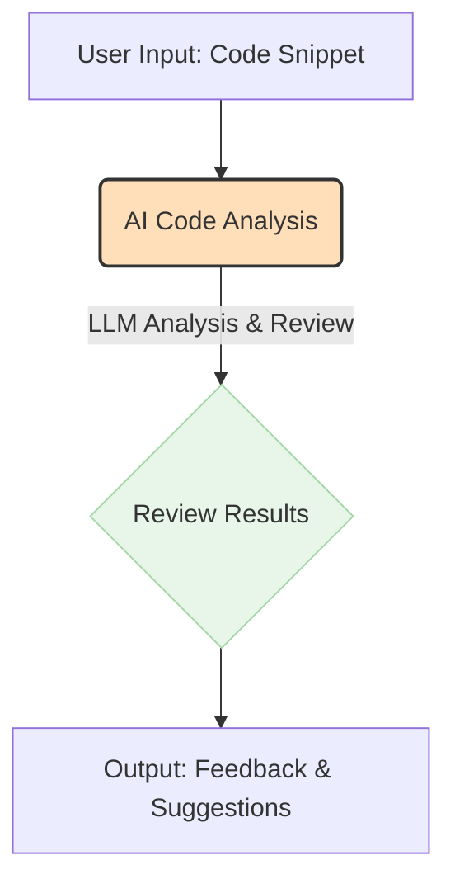

# RFA-001: AI Code Reviewer Agent

## 1. The Problem

Manual code reviews are essential for maintaining code quality, but they are often time-consuming, inconsistent, and prone to human error. Reviewers can miss subtle bugs or security vulnerabilities, and feedback styles can vary widely. Developers spend significant time waiting for reviews or performing repetitive checks, slowing down the development cycle.

## 2. The Agent Solution

An AI Code Reviewer agent built with AgentDock that automates the code review process. This agent will:

-   **Analyze Code:** Accept code snippets or links to code files/PRs (future enhancement).
-   **Identify Issues:** Detect common bugs, logic errors, performance bottlenecks, and potential security vulnerabilities (like SQL injection, XSS).
-   **Check Style & Best Practices:** Verify code against configurable style guides (e.g., PEP 8 for Python, standard JavaScript practices) and language-specific best practices.
-   **Suggest Improvements:** Offer concrete, actionable suggestions for refactoring, improving clarity, and enhancing performance.
-   **Explain Findings:** Clearly articulate the reasoning behind its suggestions, citing principles or potential consequences.
-   **Be Constructive:** Deliver feedback in a helpful, objective, and non-confrontational manner.

## 3. Proposed Architecture

A clean and powerful implementation uses AgentDock to connect user input directly to a highly capable AI model for analysis.



The core logic resides within the configured AI's ability to understand and critique code based on the provided personality and instructions.

## 4. Implementation Guide

### Recommended Nodes

-   **LLM Node (e.g., `llm.openai`, `llm.anthropic`, `llm.gemini`, `llm.groq`):** The heart of the agent. Choose a provider node corresponding to the AI service you want to use.
    -   **Model Selection:** Crucially, select a **state-of-the-art large language model** known for exceptional performance on coding and code analysis tasks. Model capabilities evolve rapidly, so prioritize using the most advanced models available to you at the time of implementation.

### Example `template.json` Structure

```json
{
  "version": "1.0",
  "agentId": "code-reviewer",
  "name": "AI Code Reviewer",
  "description": "Analyzes code for bugs, style issues, security vulnerabilities, and suggests improvements.",
  "tags": ["technical", "development", "code-quality", "productivity"],
  "personality": [
    "You are an expert AI Code Reviewer. Your goal is to help developers write high-quality, secure, and maintainable code.",
    "Analyze the provided code snippet thoroughly.",
    "Identify potential bugs, style guide violations (mention the specific guide if possible, e.g., PEP 8), security risks, and areas for improvement (performance, readability).",
    "Provide clear, concise, and constructive feedback.",
    "For each issue found, explain *why* it's an issue and suggest a specific code improvement or alternative.",
    "If no major issues are found, confirm that and perhaps offer minor suggestions for best practices.",
    "Maintain a helpful, objective, and encouraging tone. Avoid overly critical language.",
    "Structure your review clearly, perhaps using bullet points or numbered lists for different issues.",
    "If the language isn't specified, try to infer it or ask the user."
  ],
  "nodes": [
    "llm.openai" // Or your chosen provider node, e.g., "llm.anthropic"
  ],
  "nodeConfigurations": {
    "llm.openai": { // Adjust key based on chosen provider node
      "model": "YOUR_CHOSEN_STATE_OF_THE_ART_CODING_MODEL", // Specify the best model available to you
      "temperature": 0.3, // Lower temperature for more deterministic analysis
      "maxTokens": 4096 // Allow ample space for code and review
    }
  },
  "chatSettings": {
    "historyPolicy": "lastN",
    "historyLength": 10, // Keep context of recent code/review interactions
    "initialMessages": [
      "Hello! I'm the AI Code Reviewer. Please paste the code snippet you'd like me to review. If possible, mention the programming language."
    ],
    "chatPrompts": [
      "Review this Python function for issues.",
      "Can you check this JavaScript code for security vulnerabilities?",
      "Analyze this code snippet and suggest improvements.",
      "Does this code follow standard best practices?"
    ]
  }
}
```

### Key Considerations

-   **Prompt Engineering:** The `personality` prompt is critical. It needs to guide the LLM to perform a comprehensive review and deliver feedback effectively.
-   **Model Choice:** Success heavily depends on using a frontier model with strong coding capabilities.
-   **Temperature:** Use a lower temperature (e.g., 0.2-0.5) for more factual and less creative code analysis.

## 5. Example Conversation

**User:** Review this Python code please:
```python
def process_data(data_list):
    results = []
    for i in range(len(data_list)):
        item = data_list[i]
        if item['value'] > 10:
            results.append(item['name'] + " processed")
    return results

data = [{'name': 'A', 'value': 5}, {'name': 'B', 'value': 15}, {'name': 'C', 'value': 20}]
print(process_data(data))
```

**Agent:** Okay, I've reviewed the Python code snippet. Here's my analysis:

1.  **Iterating by Index:** The code iterates using `range(len(data_list))`. While functional, iterating directly over the list elements is generally considered more Pythonic and readable.
    *   *Suggestion:* Use `for item in data_list:` instead.

2.  **String Concatenation:** The line `results.append(item['name'] + " processed")` uses basic string concatenation. For more complex formatting or better readability, f-strings are preferred in modern Python (3.6+).
    *   *Suggestion:* Use `results.append(f"{item['name']} processed")`

3.  **Readability:** The code is quite clear, but the direct iteration suggested above would slightly improve it. No major bugs or security issues were detected in this snippet.

Here's the revised code incorporating the suggestions:
```python
def process_data(data_list):
    results = []
    for item in data_list: # More Pythonic iteration
        if item['value'] > 10:
            results.append(f"{item['name']} processed") # Using f-string
    return results

data = [{'name': 'A', 'value': 5}, {'name': 'B', 'value': 15}, {'name': 'C', 'value': 20}]
print(process_data(data))
```
This revised version is slightly cleaner and follows common Python idioms more closely.

## 6. Resources & Contributing

-   [AgentDock Core Documentation](/docs/)
-   [Agent Templates Guide](/docs/agent-templates)
-   [Contributing Agents Guide](/docs/rfa/add-agent)

We encourage the community to build this agent! A robust AI Code Reviewer would be a valuable asset for any developer using AgentDock. Submit your implementation for a chance to be featured. 