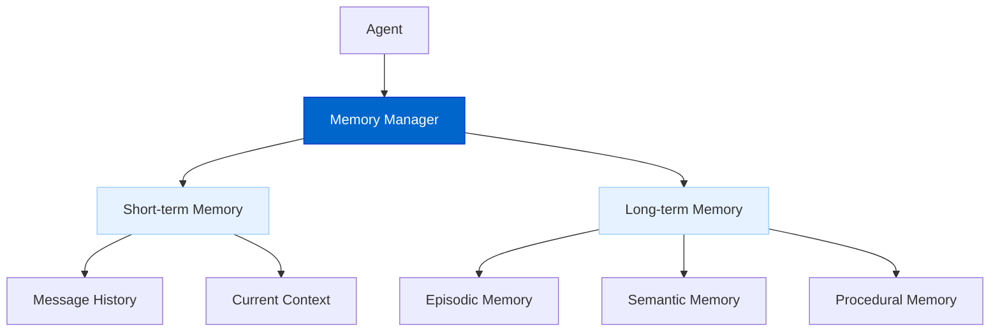
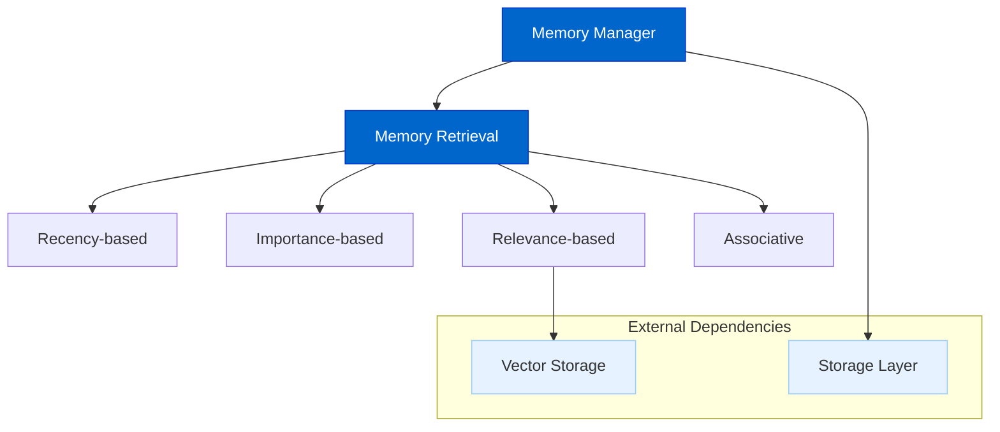

# Advanced Memory Systems

AgentDock's Advanced Memory Systems will provide long-term context management capabilities for AI agents, enabling them to maintain relevant information across conversations and sessions.

## Current Status

**Status: In Progress**

We are developing a comprehensive memory management system that will enhance agent capabilities through improved context retention and retrieval.

## Feature Overview

The Advanced Memory Systems will include:

- **Short-term Memory**: Conversation history and immediate context
- **Long-term Memory**: Persistent storage of important information
- **Episodic Memory**: Records of past interactions and decisions
- **Semantic Memory**: Understanding of concepts and relationships
- **Procedural Memory**: Storage of workflows and procedures
- **Memory Retrieval**: Context-aware access to relevant memories
- **Memory Prioritization**: Focus on the most important information

## Architecture Diagrams

### Memory Types Hierarchy



### Memory Retrieval System



## Implementation Details

The memory system is built on these key components:

```typescript
// Core memory interface
interface MemoryManager {
  // Add a new memory item
  add(item: MemoryItem): Promise<string>;
  
  // Retrieve memories based on query
  retrieve(query: MemoryQuery): Promise<MemoryItem[]>;
  
  // Update existing memory
  update(id: string, updates: Partial<MemoryItem>): Promise<void>;
  
  // Forget/delete a memory
  forget(id: string): Promise<void>;
  
  // Get importance rating for a memory
  getImportance(item: MemoryItem): number;
}

// Memory item structure
interface MemoryItem {
  id?: string;
  content: string;
  type: MemoryType;
  metadata: Record<string, any>;
  timestamp: number;
  importance: number;
  associations: string[];
  embedding?: number[]; // For vector-based retrieval
}

// Memory types
enum MemoryType {
  FACT = 'fact',
  CONVERSATION = 'conversation',
  PROCEDURE = 'procedure',
  ENTITY = 'entity',
  RELATIONSHIP = 'relationship'
}
```

## Current Implementation Status

Currently, we have implemented:

- **Basic Message History**: Core functionality for tracking conversation history
- **Memory Interface Design**: The foundation interface for memory operations
- **Short-term Memory Management**: Functionality for handling immediate context

## Memory Retrieval Approaches

The system will support multiple retrieval methods:

1. **Recency-based**: Prioritize most recent memories
2. **Importance-based**: Prioritize memories with high importance scores
3. **Relevance-based**: Vector similarity search for context-relevant memories
4. **Associative**: Follow relationship links between memories
5. **Hybrid**: Combine multiple approaches for optimal retrieval

## Dependency on Storage Layer

The Advanced Memory Systems build directly on the Storage Abstraction Layer:

- **Persistent Storage**: Uses the storage layer for saving memories across sessions
- **Provider Flexibility**: Leverages different storage backends based on deployment needs
- **Scalability**: Utilizes distributed storage for handling large memory volumes
- **Security**: Employs secure storage for sensitive memory content

## Integration with Vector Storage

The Advanced Memory System leverages the Vector Storage system for:

- **Semantic Search**: Find memories based on meaning rather than keywords
- **Contextual Relevance**: Retrieve memories relevant to the current context
- **Concept Clustering**: Group related memories and concepts
- **Cross-reference**: Link related information across different memory types

## Use Cases

Advanced Memory Systems will enable several key capabilities:

1. **Personalization**: Remember user preferences and adapt accordingly
2. **Relational Context**: Understand relationships between entities
3. **Procedural Knowledge**: Execute multi-step procedures correctly
4. **Learning from History**: Apply past experiences to new situations
5. **Context Maintenance**: Maintain consistent context over long conversations
6. **Knowledge Persistence**: Retain important information between sessions

## Agent Integration

The memory system will integrate with AgentDock agents through:

- **Memory Nodes**: Specialized nodes for memory operations
- **Automatic Importance Rating**: Determining what to remember
- **Context Window Management**: Intelligent selection of memories to include
- **Memory Prompting**: Crafting effective prompts based on memory
- **Memory-Aware Tools**: Tools that can store and retrieve state

## Future Enhancements

After the initial implementation, we plan to develop:

- **Memory Summarization**: Compress memories to conserve token usage
- **Memory Forgetting**: Intelligent removal of less important memories
- **Memory Consolidation**: Combine related memories to improve coherence
- **Memory Conflict Resolution**: Handle contradictory information
- **User Memory Control**: Allow users to manage what agents remember

## Timeline

| Phase | Status | Description |
|-------|--------|-------------|
| Research & Design | Complete | Memory architecture and interface design |
| Basic Message History | Complete | Simple conversation history tracking |
| Memory Manager Interface | Complete | Core memory management interface |
| Short-term Memory | Complete | Implementation of immediate context handling |
| Storage Integration | In Progress | Integration with Storage Abstraction Layer |
| Vector-based Retrieval | In Progress | Semantic search capabilities |
| Memory Management API | Planned | Public API for memory operations |
| Advanced Features | Planned | Summarization, consolidation, and forgetting |

## Connection to Other Roadmap Items

The Advanced Memory Systems have strong connections to:

- **Storage Abstraction Layer**: Provides the persistent storage foundation
- **Vector Storage**: Enables semantic search and contextual retrieval
- **Multi-Agent Collaboration**: Allows agents to share context and knowledge
- **Evaluation Framework**: Helps measure memory effectiveness and accuracy

## Documentation

Comprehensive documentation will be provided on:

- Configuring memory capabilities for agents
- Implementing custom memory providers
- Tuning memory retrieval parameters
- Best practices for effective memory usage
- Performance and scaling considerations 